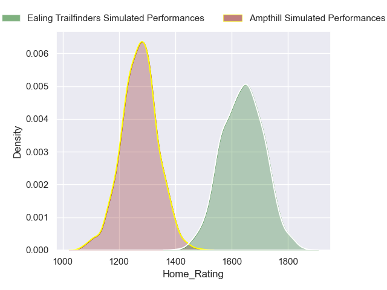
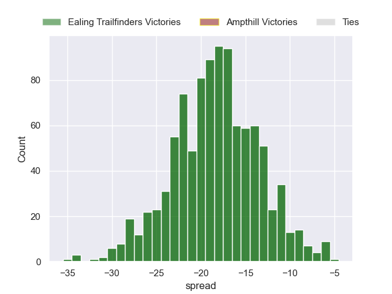

---  
title: "RFU Championship 2023 Status"  
date: 2024-03-26 6:00:00 -0500  
categories: model review projection  
layout: article  
aside:  
    toc: true  
---
# Current Team Rankings

# Standings

## Current Standings

| Club                |   Played |   Wins |   Point Differential |   Losing Bonus Points |   Try Bonus Points |   Competition Points |
|:--------------------|---------:|-------:|---------------------:|----------------------:|-------------------:|---------------------:|
| Ealing Trailfinders |       14 |     12 |                  292 |                     2 |                nan |                   60 |
| Coventry            |       16 |     11 |                  184 |                     2 |                nan |                   55 |
| Cornish Pirates     |       14 |     10 |                  112 |                     1 |                nan |                   49 |
| Bedford             |       15 |      9 |                   92 |                     4 |                nan |                   47 |
| Doncaster           |       15 |      9 |                   22 |                     1 |                nan |                   46 |
| Hartpury College    |       17 |      9 |                    7 |                     2 |                nan |                   44 |
| Nottingham          |       15 |      7 |                  -67 |                     2 |                nan |                   38 |
| Ampthill            |       13 |      5 |                  -54 |                     2 |                nan |                   29 |
| Caldy               |       14 |      4 |                 -160 |                     1 |                nan |                   24 |
| Cambridge           |       15 |      2 |                 -298 |                     4 |                nan |                   17 |
| London Scottish     |       14 |      1 |                 -130 |                     6 |                nan |                   16 |

## Projected Remaining Table

| Club                |   Matches Remaining |   Wins |   Point Differential |   Losing Bonus Points |   Try Bonus Points |   Competition Points |
|:--------------------|--------------------:|-------:|---------------------:|----------------------:|-------------------:|---------------------:|
| Ealing Trailfinders |                   7 |    6.7 |            103.449   |                   0.2 |                5.3 |                 32.5 |
| Cornish Pirates     |                   7 |    5.1 |             42.769   |                   1.3 |                3.6 |                 25.3 |
| Coventry            |                   6 |    4.9 |             63.616   |                   0.9 |                3.5 |                 24.1 |
| Jersey              |                   6 |    4.8 |             75.0633  |                   0.8 |                3.9 |                 23.9 |
| Bedford             |                   6 |    3.6 |              1.62393 |                   0.6 |                2.5 |                 17.5 |
| Hartpury College    |                   6 |    3.4 |             -3.37641 |                   1.4 |                2   |                 17.1 |
| Doncaster           |                   6 |    2.1 |            -23.7577  |                   1.5 |                2.6 |                 12.5 |
| Nottingham          |                   6 |    2   |            -28.7051  |                   1.7 |                2   |                 11.8 |
| Ampthill            |                   7 |    1.6 |            -59.1946  |                   2.1 |                2.2 |                 10.7 |
| Caldy               |                   6 |    1.6 |            -40.5327  |                   1.3 |                2.3 |                  9.9 |
| Cambridge           |                   7 |    1.2 |            -82.4134  |                   1.4 |                1.7 |                  7.8 |
| London Scottish     |                   6 |    0.9 |            -48.5413  |                   2   |                1.4 |                  7.2 |

## Projected Total Table

| Club                |   Total Matches |   Wins |   Point Differential |   Losing Bonus Points |   Try Bonus Points |   Competition Points |
|:--------------------|----------------:|-------:|---------------------:|----------------------:|-------------------:|---------------------:|
| Ealing Trailfinders |              21 |   18.7 |            395.449   |                   2.2 |                5.3 |                 92.5 |
| Coventry            |              22 |   15.9 |            247.616   |                   2.9 |                3.5 |                 79.1 |
| Cornish Pirates     |              21 |   15.1 |            154.769   |                   2.3 |                3.6 |                 74.3 |
| Bedford             |              21 |   12.6 |             93.6239  |                   4.6 |                2.5 |                 64.5 |
| Hartpury College    |              23 |   12.4 |              3.62359 |                   3.4 |                2   |                 61.1 |
| Doncaster           |              21 |   11.1 |             -1.75771 |                   2.5 |                2.6 |                 58.5 |
| Nottingham          |              21 |    9   |            -95.7051  |                   3.7 |                2   |                 49.8 |
| Ampthill            |              20 |    6.6 |           -113.195   |                   4.1 |                2.2 |                 39.7 |
| Caldy               |              20 |    5.6 |           -200.533   |                   2.3 |                2.3 |                 33.9 |
| Cambridge           |              22 |    3.2 |           -380.413   |                   5.4 |                1.7 |                 24.8 |
| Jersey              |               6 |    4.8 |             75.0633  |                   0.8 |                3.9 |                 23.9 |
| London Scottish     |              20 |    1.9 |           -178.541   |                   8   |                1.4 |                 23.2 |

# Completed Match Review

| Model | Percent Correct Predictions | Spread Error |
| ------ | ------ | ------ |
| Club Level | 67.1% | 12.3 |
| Player Level: Lineup | 65.2% | 13.7 |
| Player Level: Minutes | 66.7% | 13.6 |

# Future Predictions

## Week 18

### Ampthill V Ealing Trailfinders on 2024/03/30

Average Margin: Ealing Trailfinders by 18.3

Average Scoreline: 45-27

## Week 19

### Jersey V Doncaster on 2024/04/06

Average Margin: Jersey by 17.4

Average Scoreline: 43-25

### Nottingham V Bedford on 2024/04/06

Average Margin: Bedford by 2.7

Average Scoreline: 43-40

### London Scottish V Hartpury College on 2024/04/06

Average Margin: Hartpury College by 4.4

Average Scoreline: 33-29

### Coventry V Cambridge on 2024/04/06

Average Margin: Coventry by 23.5

Average Scoreline: 41-18

### Cornish Pirates V Ealing Trailfinders on 2024/04/06

Average Margin: Ealing Trailfinders by 7.0

Average Scoreline: 33-26

### Caldy V Ampthill on 2024/04/06

Average Margin: Caldy by 1.8

Average Scoreline: 28-26

## Week 20

### Bedford V Ampthill on 2024/04/13

Average Margin: Bedford by 11.6

Average Scoreline: 35-24

### Doncaster V Caldy on 2024/04/13

Average Margin: Doncaster by 11.0

Average Scoreline: 39-28

### Ealing Trailfinders V Jersey on 2024/04/13

Average Margin: Ealing Trailfinders by 5.1

Average Scoreline: 28-23

### Nottingham V Coventry on 2024/04/13

Average Margin: Coventry by 9.4

Average Scoreline: 40-31

### Cambridge V London Scottish on 2024/04/13

Average Margin: Cambridge by 1.7

Average Scoreline: 29-27

### Hartpury College V Cornish Pirates on 2024/04/13

Average Margin: Cornish Pirates by 3.0

Average Scoreline: 34-31

## Week 21

### Ampthill V Doncaster on 2024/04/20

Average Margin: Doncaster by 2.7

Average Scoreline: 37-34

### Jersey V Hartpury College on 2024/04/20

Average Margin: Jersey by 18.6

Average Scoreline: 31-12

### Caldy V Ealing Trailfinders on 2024/04/20

Average Margin: Ealing Trailfinders by 20.0

Average Scoreline: 38-18

### Cambridge V Cornish Pirates on 2024/04/20

Average Margin: Cornish Pirates by 12.8

Average Scoreline: 40-27

### London Scottish V Nottingham on 2024/04/20

Average Margin: Nottingham by 2.2

Average Scoreline: 32-30

### Coventry V Bedford on 2024/04/20

Average Margin: Coventry by 10.1

Average Scoreline: 35-25

### Cornish Pirates V Cambridge on 2024/04/21

Average Margin: Cornish Pirates by 18.8

Average Scoreline: 43-24

## Week 22

### Cambridge V Jersey on 2024/05/04

Average Margin: Jersey by 21.3

Average Scoreline: 34-13

### Hartpury College V Caldy on 2024/05/04

Average Margin: Hartpury College by 10.0

Average Scoreline: 33-23

### Nottingham V Cornish Pirates on 2024/05/04

Average Margin: Cornish Pirates by 5.2

Average Scoreline: 37-32

### Bedford V Doncaster on 2024/05/04

Average Margin: Bedford by 5.8

Average Scoreline: 30-24

### Ealing Trailfinders V Ampthill on 2024/05/04

Average Margin: Ealing Trailfinders by 24.8

Average Scoreline: 48-23

### Coventry V London Scottish on 2024/05/04

Average Margin: Coventry by 21.4

Average Scoreline: 31-10

## Week 23

### Caldy V Cambridge on 2024/05/11

Average Margin: Caldy by 6.2

Average Scoreline: 34-28

### Jersey V Nottingham on 2024/05/11

Average Margin: Jersey by 21.2

Average Scoreline: 45-24

### Doncaster V Ealing Trailfinders on 2024/05/11

Average Margin: Ealing Trailfinders by 12.0

Average Scoreline: 37-25

### London Scottish V Bedford on 2024/05/11

Average Margin: Bedford by 8.0

Average Scoreline: 38-30

### Cornish Pirates V Coventry on 2024/05/11

Average Margin: Coventry by 0.9

Average Scoreline: 34-33

### Ampthill V Hartpury College on 2024/05/11

Average Margin: Hartpury College by 1.5

Average Scoreline: 31-30

## Week 24

### London Scottish V Cornish Pirates on 2024/05/25

Average Margin: Cornish Pirates by 10.9

Average Scoreline: 38-27

### Nottingham V Caldy on 2024/05/25

Average Margin: Nottingham by 7.5

Average Scoreline: 37-29

### Hartpury College V Doncaster on 2024/05/25

Average Margin: Hartpury College by 2.3

Average Scoreline: 28-26

### Ealing Trailfinders V Bedford on 2024/05/25

Average Margin: Ealing Trailfinders by 16.3

Average Scoreline: 36-19

### Cambridge V Ampthill on 2024/05/25

Average Margin: Ampthill by 1.4

Average Scoreline: 33-31

### Coventry V Jersey on 2024/05/25

Average Margin: Jersey by 1.7

Average Scoreline: 27-25

