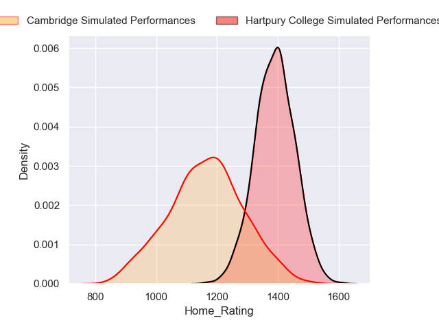
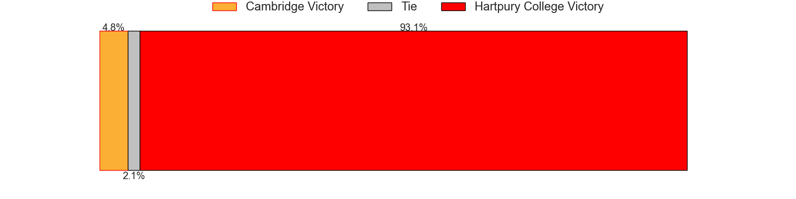
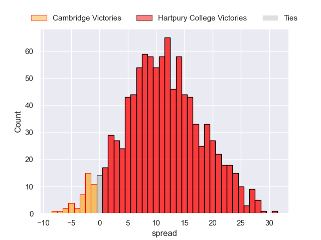

---  
title: "RFU Championship 2023 Status"  
date: 2024-02-27 6:00:00 -0500  
categories: model review projection  
layout: article  
aside:  
    toc: true  
---
# Current Team Rankings

# Standings

## Current Standings

| Club                |   Played |   Wins |   Point Differential |   Losing Bonus Points |   Try Bonus Points |   Competition Points |
|:--------------------|---------:|-------:|---------------------:|----------------------:|-------------------:|---------------------:|
| Ealing Trailfinders |       11 |     10 |                  251 |                     1 |                nan |                   50 |
| Doncaster           |       12 |      8 |                   23 |                     1 |                  6 |                   39 |
| Coventry            |       12 |      7 |                  107 |                     2 |                nan |                   38 |
| Cornish Pirates     |       11 |      8 |                   75 |                     1 |                  5 |                   38 |
| Bedford             |       13 |      7 |                   69 |                     4 |                nan |                   38 |
| Hartpury College    |       13 |      7 |                    8 |                     2 |                nan |                   35 |
| Nottingham          |       11 |      5 |                  -46 |                     1 |                  7 |                   28 |
| Ampthill            |       11 |      4 |                  -58 |                     2 |                nan |                   25 |
| Caldy               |       12 |      4 |                 -129 |                     1 |                nan |                   24 |
| Cambridge           |       12 |      2 |                 -227 |                     3 |                nan |                   16 |
| London Scottish     |       10 |      1 |                  -73 |                     5 |                nan |                   14 |

## Projected Remaining Table

| Club                |   Matches Remaining |   Wins |   Point Differential |   Losing Bonus Points |   Try Bonus Points |   Competition Points |
|:--------------------|--------------------:|-------:|---------------------:|----------------------:|-------------------:|---------------------:|
| Ealing Trailfinders |                   9 |    8.7 |             148.176  |                   0.3 |                6.8 |                 42   |
| Jersey              |                   9 |    7.9 |             122.032  |                   0.7 |                6.5 |                 38.7 |
| Cornish Pirates     |                  10 |    7.5 |              54.9792 |                   1.8 |                4.4 |                 36.2 |
| Coventry            |                   9 |    6   |              42.6819 |                   2   |                5.1 |                 31.2 |
| Bedford             |                   9 |    5.4 |              11.4408 |                   1.4 |                4.2 |                 27.2 |
| Hartpury College    |                   9 |    5.4 |              10.6505 |                   2.3 |                3.4 |                 27.2 |
| Doncaster           |                   9 |    3.7 |             -23.6303 |                   2.6 |                3.2 |                 20.5 |
| Nottingham          |                   9 |    3.3 |             -44.8452 |                   2.7 |                3.2 |                 19   |
| Cambridge           |                  10 |    2.5 |             -74.322  |                   2.4 |                3.2 |                 15.4 |
| Ampthill            |                   9 |    2   |             -75.8214 |                   2.4 |                3.2 |                 13.7 |
| Caldy               |                   9 |    1.6 |             -87.3708 |                   1.8 |                3   |                 11.2 |
| London Scottish     |                   9 |    1.1 |             -83.9711 |                   3.2 |                2.4 |                 10   |

## Projected Total Table

| Club                |   Total Matches |   Wins |   Point Differential |   Losing Bonus Points |   Try Bonus Points |   Competition Points |
|:--------------------|----------------:|-------:|---------------------:|----------------------:|-------------------:|---------------------:|
| Ealing Trailfinders |              20 |   18.7 |           399.176    |                   1.3 |                6.8 |                 92   |
| Cornish Pirates     |              21 |   15.5 |           129.979    |                   2.8 |                9.4 |                 74.2 |
| Coventry            |              21 |   13   |           149.682    |                   4   |                5.1 |                 69.2 |
| Bedford             |              22 |   12.4 |            80.4408   |                   5.4 |                4.2 |                 65.2 |
| Hartpury College    |              22 |   12.4 |            18.6505   |                   4.3 |                3.4 |                 62.2 |
| Doncaster           |              21 |   11.7 |            -0.630271 |                   3.6 |                9.2 |                 59.5 |
| Nottingham          |              20 |    8.3 |           -90.8452   |                   3.7 |               10.2 |                 47   |
| Jersey              |               9 |    7.9 |           122.032    |                   0.7 |                6.5 |                 38.7 |
| Ampthill            |              20 |    6   |          -133.821    |                   4.4 |                3.2 |                 38.7 |
| Caldy               |              21 |    5.6 |          -216.371    |                   2.8 |                3   |                 35.2 |
| Cambridge           |              22 |    4.5 |          -301.322    |                   5.4 |                3.2 |                 31.4 |
| London Scottish     |              19 |    2.1 |          -156.971    |                   8.2 |                2.4 |                 24   |

# Completed Match Review

| Model | Percent Correct Predictions | Spread Error |
| ------ | ------ | ------ |
| Club Level | 63.5% | 12.7 |
| Player Level: Lineup | 62.7% | 14.0 |
| Player Level: Minutes | 64.4% | 13.9 |

# Future Predictions

## Week 14

### Hartpury College V Cambridge on 2024/03/01

Average Margin: Hartpury College by 11.0

Average Scoreline: 32-21

### Caldy V Cornish Pirates on 2024/03/02

Average Margin: Cornish Pirates by 8.1

Average Scoreline: 32-24

### Ampthill V London Scottish on 2024/03/02

Average Margin: Ampthill by 5.2

Average Scoreline: 28-23

### Doncaster V Coventry on 2024/03/02

Average Margin: Coventry by 3.0

Average Scoreline: 25-22

### Bedford V Jersey on 2024/03/02

Average Margin: Jersey by 8.6

Average Scoreline: 30-21

### Ealing Trailfinders V Nottingham on 2024/03/02

Average Margin: Ealing Trailfinders by 22.7

Average Scoreline: 43-20

## Week 15

### Cambridge V Bedford on 2024/03/09

Average Margin: Bedford by 6.7

Average Scoreline: 31-24

### Cornish Pirates V Ampthill on 2024/03/09

Average Margin: Cornish Pirates by 14.1

Average Scoreline: 29-15

### Jersey V Caldy on 2024/03/09

Average Margin: Jersey by 24.6

Average Scoreline: 37-13

### Nottingham V Hartpury College on 2024/03/09

Average Margin: Nottingham by 0.2

Average Scoreline: 24-24

### Coventry V Ealing Trailfinders on 2024/03/09

Average Margin: Ealing Trailfinders by 6.8

Average Scoreline: 33-27

### London Scottish V Doncaster on 2024/03/09

Average Margin: Doncaster by 5.0

Average Scoreline: 30-25

## Week 16

### Bedford V Caldy on 2024/03/23

Average Margin: Bedford by 12.6

Average Scoreline: 34-21

### Ealing Trailfinders V London Scottish on 2024/03/23

Average Margin: Ealing Trailfinders by 28.0

Average Scoreline: 44-16

### Hartpury College V Coventry on 2024/03/23

Average Margin: Coventry by 3.2

Average Scoreline: 25-22

### Doncaster V Cornish Pirates on 2024/03/23

Average Margin: Cornish Pirates by 0.9

Average Scoreline: 25-24

### Ampthill V Jersey on 2024/03/23

Average Margin: Jersey by 17.3

Average Scoreline: 36-19

### Cambridge V Nottingham on 2024/03/23

Average Margin: Nottingham by 1.1

Average Scoreline: 32-31

## Week 17

### London Scottish V Hartpury College on 2024/04/06

Average Margin: Hartpury College by 5.1

Average Scoreline: 29-24

### Nottingham V Bedford on 2024/04/06

Average Margin: Bedford by 1.8

Average Scoreline: 25-23

### Jersey V Doncaster on 2024/04/06

Average Margin: Jersey by 17.5

Average Scoreline: 33-16

### Cornish Pirates V Ealing Trailfinders on 2024/04/06

Average Margin: Ealing Trailfinders by 8.3

Average Scoreline: 37-28

### Coventry V Cambridge on 2024/04/06

Average Margin: Coventry by 17.3

Average Scoreline: 36-18

### Caldy V Ampthill on 2024/04/06

Average Margin: Caldy by 3.0

Average Scoreline: 34-31

## Week 18

### Bedford V Ampthill on 2024/04/13

Average Margin: Bedford by 11.9

Average Scoreline: 36-24

### Hartpury College V Cornish Pirates on 2024/04/13

Average Margin: Cornish Pirates by 1.1

Average Scoreline: 25-23

### Doncaster V Caldy on 2024/04/13

Average Margin: Doncaster by 10.7

Average Scoreline: 34-23

### Nottingham V Coventry on 2024/04/13

Average Margin: Coventry by 6.4

Average Scoreline: 28-21

### Cambridge V London Scottish on 2024/04/13

Average Margin: Cambridge by 4.1

Average Scoreline: 32-28

### Ealing Trailfinders V Jersey on 2024/04/13

Average Margin: Ealing Trailfinders by 5.6

Average Scoreline: 29-24

## Week 19

### Ampthill V Doncaster on 2024/04/20

Average Margin: Doncaster by 3.2

Average Scoreline: 32-29

### Coventry V Bedford on 2024/04/20

Average Margin: Coventry by 7.5

Average Scoreline: 28-20

### Cambridge V Cornish Pirates on 2024/04/20

Average Margin: Cornish Pirates by 8.6

Average Scoreline: 29-20

### London Scottish V Nottingham on 2024/04/20

Average Margin: Nottingham by 2.0

Average Scoreline: 29-27

### Jersey V Hartpury College on 2024/04/20

Average Margin: Jersey by 17.2

Average Scoreline: 32-15

### Caldy V Ealing Trailfinders on 2024/04/20

Average Margin: Ealing Trailfinders by 20.2

Average Scoreline: 35-15

### Cornish Pirates V Cambridge on 2024/04/21

Average Margin: Cornish Pirates by 15.1

Average Scoreline: 31-16

## Week 20

### Hartpury College V Caldy on 2024/05/04

Average Margin: Hartpury College by 10.2

Average Scoreline: 32-22

### Nottingham V Cornish Pirates on 2024/05/04

Average Margin: Cornish Pirates by 4.1

Average Scoreline: 28-24

### Bedford V Doncaster on 2024/05/04

Average Margin: Bedford by 5.2

Average Scoreline: 30-25

### Ealing Trailfinders V Ampthill on 2024/05/04

Average Margin: Ealing Trailfinders by 26.4

Average Scoreline: 49-23

### Coventry V London Scottish on 2024/05/04

Average Margin: Coventry by 18.2

Average Scoreline: 31-13

### Cambridge V Jersey on 2024/05/04

Average Margin: Jersey by 17.8

Average Scoreline: 35-17

## Week 21

### Doncaster V Ealing Trailfinders on 2024/05/11

Average Margin: Ealing Trailfinders by 12.8

Average Scoreline: 36-23

### Ampthill V Hartpury College on 2024/05/11

Average Margin: Hartpury College by 2.9

Average Scoreline: 29-26

### Caldy V Cambridge on 2024/05/11

Average Margin: Caldy by 3.2

Average Scoreline: 30-27

### Cornish Pirates V Coventry on 2024/05/11

Average Margin: Cornish Pirates by 1.8

Average Scoreline: 30-28

### London Scottish V Bedford on 2024/05/11

Average Margin: Bedford by 6.8

Average Scoreline: 29-22

### Jersey V Nottingham on 2024/05/11

Average Margin: Jersey by 20.2

Average Scoreline: 36-16

## Week 22

### London Scottish V Cornish Pirates on 2024/05/25

Average Margin: Cornish Pirates by 9.5

Average Scoreline: 36-26

### Cambridge V Ampthill on 2024/05/25

Average Margin: Cambridge by 2.3

Average Scoreline: 34-31

### Coventry V Jersey on 2024/05/25

Average Margin: Jersey by 4.4

Average Scoreline: 28-24

### Nottingham V Caldy on 2024/05/25

Average Margin: Nottingham by 7.1

Average Scoreline: 27-20

### Hartpury College V Doncaster on 2024/05/25

Average Margin: Hartpury College by 3.1

Average Scoreline: 33-30

### Ealing Trailfinders V Bedford on 2024/05/25

Average Margin: Ealing Trailfinders by 17.4

Average Scoreline: 39-22

