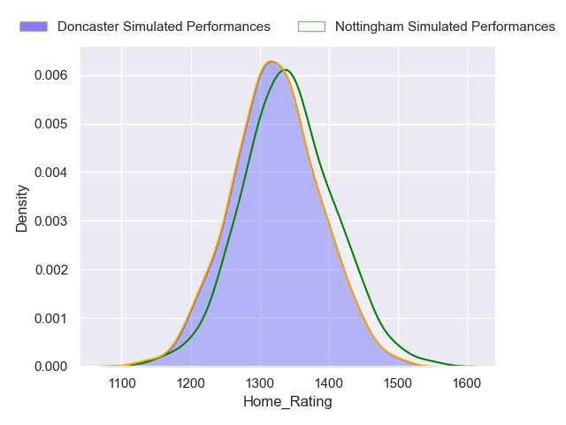
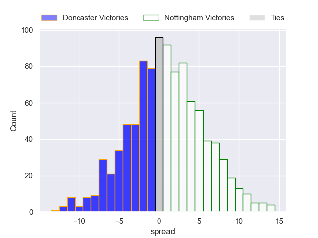

---  
title: "RFU Championship 2023 Status"  
date: 2024-02-20 6:00:00 -0500  
categories: model review projection  
layout: article  
aside:  
    toc: true  
---
# Current Team Rankings

# Standings

## Current Standings

| Club                |   Played |   Wins |   Point Differential |   Losing Bonus Points |   Try Bonus Points |   Competition Points |
|:--------------------|---------:|-------:|---------------------:|----------------------:|-------------------:|---------------------:|
| Ealing Trailfinders |       11 |     10 |                  229 |                     1 |                 10 |                   51 |
| Bedford             |       12 |      8 |                   85 |                     2 |                  6 |                   40 |
| Cornish Pirates     |       12 |      8 |                   47 |                     1 |                  5 |                   38 |
| Doncaster           |       11 |      7 |                   17 |                     1 |                  6 |                   35 |
| Coventry            |       11 |      6 |                   79 |                     2 |                  8 |                   34 |
| Hartpury College    |       11 |      5 |                   -4 |                     2 |                  5 |                   27 |
| Nottingham          |       10 |      5 |                  -40 |                     0 |                  7 |                   27 |
| Ampthill            |       10 |      4 |                  -30 |                     2 |                  7 |                   25 |
| Caldy               |       12 |      4 |                 -133 |                     2 |                  5 |                   23 |
| Cambridge           |       11 |      2 |                 -177 |                     3 |                  5 |                   16 |
| London Scottish     |        9 |      1 |                  -73 |                     5 |                  3 |                   12 |

## Projected Remaining Table

| Club                |   Matches Remaining |   Wins |   Point Differential |   Losing Bonus Points |   Try Bonus Points |   Competition Points |
|:--------------------|--------------------:|-------:|---------------------:|----------------------:|-------------------:|---------------------:|
| Ealing Trailfinders |                  10 |    9.7 |            159.705   |                   0.3 |                6.8 |                 45.8 |
| Jersey              |                  10 |    8.8 |            128.615   |                   0.8 |                7.3 |                 43.2 |
| Cornish Pirates     |                  11 |    7.6 |             45.7412  |                   2.3 |                5   |                 37.6 |
| Coventry            |                  10 |    7   |             56.0914  |                   2.1 |                6.1 |                 36.3 |
| Bedford             |                  10 |    5.9 |             14.774   |                   1.9 |                4.1 |                 29.7 |
| Hartpury College    |                  10 |    5.5 |              1.68067 |                   2.9 |                4.2 |                 29   |
| Nottingham          |                  10 |    4.1 |            -39.1222  |                   3   |                3.9 |                 23.3 |
| Doncaster           |                  10 |    3.9 |            -27.054   |                   3.3 |                4.1 |                 22.9 |
| Cambridge           |                  11 |    2.7 |            -83.2658  |                   2.6 |                3.4 |                 16.8 |
| London Scottish     |                  10 |    1.9 |            -76.8548  |                   3.5 |                2.9 |                 14.1 |
| Ampthill            |                  10 |    2.2 |            -88.0297  |                   2.4 |                2.9 |                 13.9 |
| Caldy               |                  10 |    1.8 |            -92.2806  |                   2.3 |                2.8 |                 12.3 |

## Projected Total Table

| Club                |   Total Matches |   Wins |   Point Differential |   Losing Bonus Points |   Try Bonus Points |   Competition Points |
|:--------------------|----------------:|-------:|---------------------:|----------------------:|-------------------:|---------------------:|
| Ealing Trailfinders |              21 |   19.7 |            388.705   |                   1.3 |               16.8 |                 96.8 |
| Cornish Pirates     |              23 |   15.6 |             92.7412  |                   3.3 |               10   |                 75.6 |
| Coventry            |              21 |   13   |            135.091   |                   4.1 |               14.1 |                 70.3 |
| Bedford             |              22 |   13.9 |             99.774   |                   3.9 |               10.1 |                 69.7 |
| Doncaster           |              21 |   10.9 |            -10.054   |                   4.3 |               10.1 |                 57.9 |
| Hartpury College    |              21 |   10.5 |             -2.31933 |                   4.9 |                9.2 |                 56   |
| Nottingham          |              20 |    9.1 |            -79.1222  |                   3   |               10.9 |                 50.3 |
| Jersey              |              10 |    8.8 |            128.615   |                   0.8 |                7.3 |                 43.2 |
| Ampthill            |              20 |    6.2 |           -118.03    |                   4.4 |                9.9 |                 38.9 |
| Caldy               |              22 |    5.8 |           -225.281   |                   4.3 |                7.8 |                 35.3 |
| Cambridge           |              22 |    4.7 |           -260.266   |                   5.6 |                8.4 |                 32.8 |
| London Scottish     |              19 |    2.9 |           -149.855   |                   8.5 |                5.9 |                 26.1 |

# Completed Match Review

| Model | Percent Correct Predictions | Spread Error |
| ------ | ------ | ------ |
| Club Level | 65.5% | 12.8 |
| Player Level: Lineup | 62.1% | 14.2 |
| Player Level: Minutes | 63.8% | 14.1 |

# Future Predictions

## Week 13

### Nottingham V Doncaster on 2024/02/23

Average Margin: Nottingham by 1.0

Average Scoreline: 36-35

### Cornish Pirates V Jersey on 2024/02/23

Average Margin: Jersey by 6.4

Average Scoreline: 26-20

### London Scottish V Caldy on 2024/02/24

Average Margin: London Scottish by 2.7

Average Scoreline: 29-26

### Coventry V Ampthill on 2024/02/24

Average Margin: Coventry by 15.7

Average Scoreline: 33-17

### Hartpury College V Bedford on 2024/02/24

Average Margin: Bedford by 0.2

Average Scoreline: 29-28

### Cambridge V Ealing Trailfinders on 2024/02/24

Average Margin: Ealing Trailfinders by 19.1

Average Scoreline: 37-18

## Week 14

### Caldy V Cornish Pirates on 2024/03/02

Average Margin: Cornish Pirates by 8.2

Average Scoreline: 26-18

### Doncaster V Coventry on 2024/03/02

Average Margin: Coventry by 3.0

Average Scoreline: 27-24

### Ealing Trailfinders V Nottingham on 2024/03/02

Average Margin: Ealing Trailfinders by 21.8

Average Scoreline: 47-26

### Ampthill V London Scottish on 2024/03/02

Average Margin: Ampthill by 5.2

Average Scoreline: 34-29

### Bedford V Jersey on 2024/03/02

Average Margin: Jersey by 8.3

Average Scoreline: 28-20

### Hartpury College V Cambridge on 2024/03/02

Average Margin: Hartpury College by 8.9

Average Scoreline: 33-24

## Week 15

### Nottingham V Hartpury College on 2024/03/09

Average Margin: Nottingham by 1.6

Average Scoreline: 34-33

### Cornish Pirates V Ampthill on 2024/03/09

Average Margin: Cornish Pirates by 13.8

Average Scoreline: 35-21

### Jersey V Caldy on 2024/03/09

Average Margin: Jersey by 25.0

Average Scoreline: 46-21

### Coventry V Ealing Trailfinders on 2024/03/09

Average Margin: Ealing Trailfinders by 6.2

Average Scoreline: 28-22

### Cambridge V Bedford on 2024/03/09

Average Margin: Bedford by 5.6

Average Scoreline: 34-29

### London Scottish V Doncaster on 2024/03/09

Average Margin: Doncaster by 4.2

Average Scoreline: 33-29

## Week 16

### Cambridge V Nottingham on 2024/03/23

Average Margin: Nottingham by 1.0

Average Scoreline: 32-31

### Hartpury College V Coventry on 2024/03/23

Average Margin: Coventry by 3.7

Average Scoreline: 30-27

### Ealing Trailfinders V London Scottish on 2024/03/23

Average Margin: Ealing Trailfinders by 26.8

Average Scoreline: 38-11

### Doncaster V Cornish Pirates on 2024/03/23

Average Margin: Cornish Pirates by 1.2

Average Scoreline: 30-29

### Ampthill V Jersey on 2024/03/23

Average Margin: Jersey by 16.9

Average Scoreline: 28-11

### Bedford V Caldy on 2024/03/23

Average Margin: Bedford by 13.2

Average Scoreline: 31-18

## Week 17

### Jersey V Doncaster on 2024/04/06

Average Margin: Jersey by 17.6

Average Scoreline: 35-17

### Caldy V Ampthill on 2024/04/06

Average Margin: Caldy by 2.1

Average Scoreline: 35-33

### London Scottish V Hartpury College on 2024/04/06

Average Margin: Hartpury College by 3.6

Average Scoreline: 34-30

### Coventry V Cambridge on 2024/04/06

Average Margin: Coventry by 16.2

Average Scoreline: 37-21

### Cornish Pirates V Ealing Trailfinders on 2024/04/06

Average Margin: Ealing Trailfinders by 7.7

Average Scoreline: 27-20

### Nottingham V Bedford on 2024/04/06

Average Margin: Bedford by 1.8

Average Scoreline: 33-32

## Week 18

### Cambridge V London Scottish on 2024/04/13

Average Margin: Cambridge by 5.0

Average Scoreline: 30-25

### Doncaster V Caldy on 2024/04/13

Average Margin: Doncaster by 10.4

Average Scoreline: 29-19

### Nottingham V Coventry on 2024/04/13

Average Margin: Coventry by 5.6

Average Scoreline: 29-23

### Bedford V Ampthill on 2024/04/13

Average Margin: Bedford by 12.2

Average Scoreline: 36-24

### Ealing Trailfinders V Jersey on 2024/04/13

Average Margin: Ealing Trailfinders by 5.1

Average Scoreline: 27-22

### Hartpury College V Cornish Pirates on 2024/04/13

Average Margin: Cornish Pirates by 1.7

Average Scoreline: 32-30

## Week 19

### Coventry V Bedford on 2024/04/20

Average Margin: Coventry by 6.8

Average Scoreline: 31-25

### London Scottish V Nottingham on 2024/04/20

Average Margin: Nottingham by 1.9

Average Scoreline: 31-29

### Ampthill V Doncaster on 2024/04/20

Average Margin: Doncaster by 2.6

Average Scoreline: 37-35

### Caldy V Ealing Trailfinders on 2024/04/20

Average Margin: Ealing Trailfinders by 19.6

Average Scoreline: 34-14

### Jersey V Hartpury College on 2024/04/20

Average Margin: Jersey by 18.2

Average Scoreline: 32-14

### Cambridge V Cornish Pirates on 2024/04/20

Average Margin: Cornish Pirates by 7.2

Average Scoreline: 33-25

### Cornish Pirates V Cambridge on 2024/04/21

Average Margin: Cornish Pirates by 14.0

Average Scoreline: 37-23

## Week 20

### Cambridge V Jersey on 2024/05/04

Average Margin: Jersey by 16.7

Average Scoreline: 28-11

### Nottingham V Cornish Pirates on 2024/05/04

Average Margin: Cornish Pirates by 3.6

Average Scoreline: 30-27

### Coventry V London Scottish on 2024/05/04

Average Margin: Coventry by 17.4

Average Scoreline: 32-15

### Bedford V Doncaster on 2024/05/04

Average Margin: Bedford by 6.2

Average Scoreline: 33-27

### Hartpury College V Caldy on 2024/05/04

Average Margin: Hartpury College by 9.8

Average Scoreline: 31-21

### Ealing Trailfinders V Ampthill on 2024/05/04

Average Margin: Ealing Trailfinders by 24.8

Average Scoreline: 40-16

## Week 21

### Cornish Pirates V Coventry on 2024/05/11

Average Margin: Cornish Pirates by 1.5

Average Scoreline: 35-33

### Ampthill V Hartpury College on 2024/05/11

Average Margin: Hartpury College by 1.9

Average Scoreline: 30-28

### Caldy V Cambridge on 2024/05/11

Average Margin: Caldy by 2.6

Average Scoreline: 30-28

### Jersey V Nottingham on 2024/05/11

Average Margin: Jersey by 19.9

Average Scoreline: 40-20

### Doncaster V Ealing Trailfinders on 2024/05/11

Average Margin: Ealing Trailfinders by 12.5

Average Scoreline: 31-19

### London Scottish V Bedford on 2024/05/11

Average Margin: Bedford by 6.9

Average Scoreline: 30-23

## Week 22

### Cambridge V Ampthill on 2024/05/25

Average Margin: Cambridge by 3.1

Average Scoreline: 39-36

### Nottingham V Caldy on 2024/05/25

Average Margin: Nottingham by 8.0

Average Scoreline: 27-19

### London Scottish V Cornish Pirates on 2024/05/25

Average Margin: Cornish Pirates by 8.5

Average Scoreline: 31-23

### Hartpury College V Doncaster on 2024/05/25

Average Margin: Hartpury College by 2.8

Average Scoreline: 38-35

### Coventry V Jersey on 2024/05/25

Average Margin: Jersey by 4.7

Average Scoreline: 27-22

### Ealing Trailfinders V Bedford on 2024/05/25

Average Margin: Ealing Trailfinders by 16.1

Average Scoreline: 39-23

