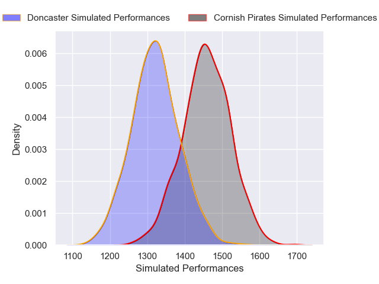
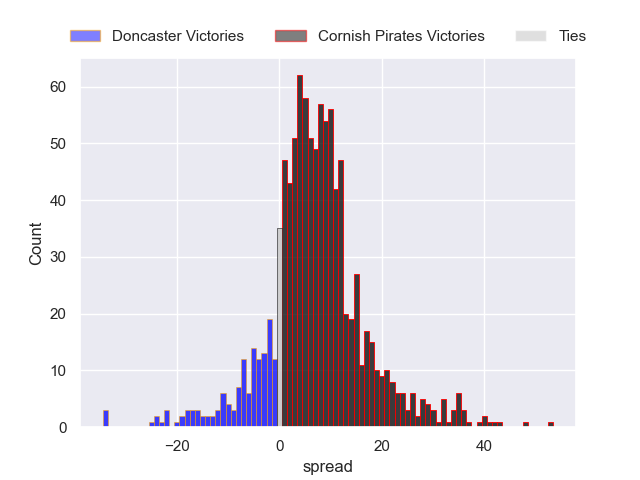

---  
title: "RFU Championship 2024 Status"  
date: 2024-12-16 6:00:00 -0500  
categories: model review projection  
layout: article  
aside:  
    toc: true  
---
# Current Team Rankings

# Standings

## Current Standings

| Club                |   Played |   Wins |   Point Differential |   Losing Bonus Points |   Try Bonus Points |   Competition Points |
|:--------------------|---------:|-------:|---------------------:|----------------------:|-------------------:|---------------------:|
| Ealing Trailfinders |        8 |      7 |                  276 |                     1 |                  7 |                   36 |
| Coventry            |        8 |      7 |                   72 |                     0 |                  5 |                   33 |
| Bedford             |        8 |      6 |                   12 |                     0 |                nan |                   28 |
| Nottingham          |        8 |      5 |                   83 |                     2 |                  4 |                   26 |
| Hartpury College    |        7 |      4 |                   27 |                     2 |                  5 |                   23 |
| Cornish Pirates     |        8 |      4 |                   32 |                     3 |                  3 |                   22 |
| Doncaster           |        8 |      4 |                   23 |                     1 |                  3 |                   20 |
| Chinnor             |        8 |      3 |                   15 |                     3 |                  3 |                   18 |
| Ampthill            |        7 |      3 |                 -119 |                     1 |                  3 |                   16 |
| London Scottish     |        8 |      2 |                  -76 |                     3 |                nan |                   14 |
| Cambridge           |        8 |      2 |                 -227 |                     0 |                  2 |                   10 |
| Caldy               |        8 |      0 |                 -118 |                     2 |                  1 |                    3 |

## Projected Remaining Table

| Club                |   Matches Remaining |   Wins |   Point Differential |   Losing Bonus Points |   Try Bonus Points |   Competition Points |
|:--------------------|--------------------:|-------:|---------------------:|----------------------:|-------------------:|---------------------:|
| Ealing Trailfinders |                  14 |   12.5 |             229.599  |                   0.8 |                9   |                 59.7 |
| Coventry            |                  14 |   10.7 |             141.183  |                   1.7 |                8.1 |                 52.7 |
| Bedford             |                  14 |    9.3 |              69.012  |                   2.4 |                9   |                 48.5 |
| Cornish Pirates     |                  14 |    8.6 |              53.7571 |                   2.5 |                8.2 |                 45.1 |
| Hartpury College    |                  14 |    9   |              53.7613 |                   2.9 |                6.2 |                 44.9 |
| Nottingham          |                  14 |    6.2 |             -21.4843 |                   3   |                6.6 |                 34.5 |
| Doncaster           |                  14 |    6.3 |             -19.038  |                   3.7 |                5.2 |                 33.9 |
| Chinnor             |                  14 |    6.2 |             -28.4043 |                   3   |                4.2 |                 32.1 |
| Ampthill            |                  14 |    5.8 |             -41.7953 |                   3.1 |                5.3 |                 31.5 |
| London Scottish     |                  14 |    5.3 |             -57.2083 |                   3.1 |                5.4 |                 29.6 |
| Cambridge           |                  14 |    2.2 |            -189.244  |                   2.3 |                3   |                 14.1 |
| Caldy               |                  14 |    2   |            -190.138  |                   2.8 |                2.8 |                 13.6 |

## Projected Total Table

| Club                |   Total Matches |   Wins |   Point Differential |   Losing Bonus Points |   Try Bonus Points |   Competition Points |
|:--------------------|----------------:|-------:|---------------------:|----------------------:|-------------------:|---------------------:|
| Ealing Trailfinders |              22 |   19.5 |            505.599   |                   1.8 |               16   |                 95.7 |
| Coventry            |              22 |   17.7 |            213.183   |                   1.7 |               13.1 |                 85.7 |
| Bedford             |              22 |   15.3 |             81.012   |                   2.4 |                9   |                 76.5 |
| Hartpury College    |              21 |   13   |             80.7613  |                   4.9 |               11.2 |                 67.9 |
| Cornish Pirates     |              22 |   12.6 |             85.7571  |                   5.5 |               11.2 |                 67.1 |
| Nottingham          |              22 |   11.2 |             61.5157  |                   5   |               10.6 |                 60.5 |
| Doncaster           |              22 |   10.3 |              3.96202 |                   4.7 |                8.2 |                 53.9 |
| Chinnor             |              22 |    9.2 |            -13.4043  |                   6   |                7.2 |                 50.1 |
| Ampthill            |              21 |    8.8 |           -160.795   |                   4.1 |                8.3 |                 47.5 |
| London Scottish     |              22 |    7.3 |           -133.208   |                   6.1 |                5.4 |                 43.6 |
| Cambridge           |              22 |    4.2 |           -416.244   |                   2.3 |                5   |                 24.1 |
| Caldy               |              22 |    2   |           -308.138   |                   4.8 |                3.8 |                 16.6 |

# Completed Match Review

| Model | Percent Correct Predictions | Spread Error |
| ------ | ------ | ------ |
| Club Level | 70.2% | 14.5 |
| Player Level: Lineup | 72.3% | 15.3 |
| Player Level: Minutes | 73.9% | 15.2 |

# Future Predictions

## Week 9

### Hartpury College V Nottingham on 2024/12/21

Average Margin: Hartpury College by 8.3

Average Scoreline: 30-21

### Caldy V London Scottish on 2024/12/21

Average Margin: London Scottish by 4.4

Average Scoreline: 28-23

### Cambridge V Ampthill on 2024/12/21

Average Margin: Ampthill by 7.5

Average Scoreline: 27-20

### Coventry V Ealing Trailfinders on 2024/12/21

Average Margin: Ealing Trailfinders by 2.6

Average Scoreline: 25-22

### Chinnor V Bedford on 2024/12/21

Average Margin: Bedford by 1.8

Average Scoreline: 12-10

### Cornish Pirates V Doncaster on 2024/12/22

Average Margin: Cornish Pirates by 7.3

Average Scoreline: 26-18

## Week 10

### London Scottish V Chinnor on 2024/12/28

Average Margin: London Scottish by 0.2

Average Scoreline: 18-18

### Bedford V Cambridge on 2024/12/28

Average Margin: Bedford by 20.2

Average Scoreline: 36-16

### Doncaster V Hartpury College on 2024/12/28

Average Margin: Doncaster by 0.7

Average Scoreline: 21-20

### Nottingham V Coventry on 2024/12/28

Average Margin: Coventry by 8.3

Average Scoreline: 29-21

### Ealing Trailfinders V Caldy on 2024/12/28

Average Margin: Ealing Trailfinders by 31.5

Average Scoreline: 42-11

### Ampthill V Cornish Pirates on 2024/12/28

Average Margin: Cornish Pirates by 3.3

Average Scoreline: 34-31

## Week 11

### Coventry V Doncaster on 2025/01/18

Average Margin: Coventry by 13.9

Average Scoreline: 31-17

### Hartpury College V Cornish Pirates on 2025/01/18

Average Margin: Hartpury College by 3.1

Average Scoreline: 28-24

### Bedford V Ampthill on 2025/01/18

Average Margin: Bedford by 10.4

Average Scoreline: 30-20

### Caldy V Nottingham on 2025/01/18

Average Margin: Nottingham by 9.6

Average Scoreline: 34-25

### Cambridge V London Scottish on 2025/01/18

Average Margin: London Scottish by 5.0

Average Scoreline: 23-18

### Chinnor V Ealing Trailfinders on 2025/01/18

Average Margin: Ealing Trailfinders by 13.7

Average Scoreline: 22-9

## Week 12

### Nottingham V Doncaster on 2025/01/25

Average Margin: Nottingham by 2.9

Average Scoreline: 25-22

### London Scottish V Hartpury College on 2025/01/25

Average Margin: Hartpury College by 5.7

Average Scoreline: 35-29

### Ealing Trailfinders V Cornish Pirates on 2025/01/25

Average Margin: Ealing Trailfinders by 15.8

Average Scoreline: 34-18

### Bedford V Coventry on 2025/01/25

Average Margin: Coventry by 3.5

Average Scoreline: 27-24

### Cambridge V Caldy on 2025/01/25

Average Margin: Cambridge by 3.9

Average Scoreline: 21-17

### Chinnor V Ampthill on 2025/01/25

Average Margin: Chinnor by 5.5

Average Scoreline: 25-19

## Week 13

### Caldy V Chinnor on 2025/03/22

Average Margin: Chinnor by 8.0

Average Scoreline: 28-20

### Ampthill V Nottingham on 2025/03/22

Average Margin: Ampthill by 1.6

Average Scoreline: 33-31

### Coventry V Cambridge on 2025/03/22

Average Margin: Coventry by 26.9

Average Scoreline: 38-11

### Hartpury College V Bedford on 2025/03/22

Average Margin: Hartpury College by 3.6

Average Scoreline: 29-25

### Doncaster V Ealing Trailfinders on 2025/03/22

Average Margin: Ealing Trailfinders by 12.7

Average Scoreline: 33-20

### Cornish Pirates V London Scottish on 2025/03/22

Average Margin: Cornish Pirates by 12.9

Average Scoreline: 30-17

## Week 14

### Chinnor V Coventry on 2025/03/29

Average Margin: Coventry by 8.6

Average Scoreline: 32-23

### London Scottish V Doncaster on 2025/03/29

Average Margin: Doncaster by 2.6

Average Scoreline: 30-28

### Cambridge V Hartpury College on 2025/03/29

Average Margin: Hartpury College by 12.8

Average Scoreline: 37-24

### Bedford V Cornish Pirates on 2025/03/29

Average Margin: Bedford by 3.6

Average Scoreline: 32-28

### Caldy V Ampthill on 2025/03/29

Average Margin: Ampthill by 5.7

Average Scoreline: 34-29

### Ealing Trailfinders V Nottingham on 2025/03/29

Average Margin: Ealing Trailfinders by 20.4

Average Scoreline: 36-15

## Week 15

### Ampthill V Ealing Trailfinders on 2025/04/05

Average Margin: Ealing Trailfinders by 15.5

Average Scoreline: 44-29

### Hartpury College V Chinnor on 2025/04/05

Average Margin: Hartpury College by 8.5

Average Scoreline: 25-17

### Cornish Pirates V Cambridge on 2025/04/05

Average Margin: Cornish Pirates by 19.2

Average Scoreline: 34-15

### Nottingham V London Scottish on 2025/04/05

Average Margin: Nottingham by 8.5

Average Scoreline: 27-19

### Doncaster V Bedford on 2025/04/05

Average Margin: Doncaster by 0.6

Average Scoreline: 23-22

### Coventry V Caldy on 2025/04/05

Average Margin: Coventry by 25.5

Average Scoreline: 39-13

## Week 16

### Caldy V Hartpury College on 2025/04/12

Average Margin: Hartpury College by 11.6

Average Scoreline: 40-28

### Chinnor V Cornish Pirates on 2025/04/12

Average Margin: Cornish Pirates by 1.5

Average Scoreline: 25-23

### Bedford V Nottingham on 2025/04/12

Average Margin: Bedford by 8.3

Average Scoreline: 30-22

### London Scottish V Ealing Trailfinders on 2025/04/12

Average Margin: Ealing Trailfinders by 16.5

Average Scoreline: 43-27

### Coventry V Ampthill on 2025/04/12

Average Margin: Coventry by 16.6

Average Scoreline: 34-17

### Cambridge V Doncaster on 2025/04/12

Average Margin: Doncaster by 10.8

Average Scoreline: 31-20

## Week 17

### Hartpury College V Coventry on 2025/04/19

Average Margin: Coventry by 2.8

Average Scoreline: 25-22

### Ampthill V London Scottish on 2025/04/19

Average Margin: Ampthill by 6.0

Average Scoreline: 26-20

### Cornish Pirates V Caldy on 2025/04/19

Average Margin: Cornish Pirates by 19.3

Average Scoreline: 33-14

### Ealing Trailfinders V Bedford on 2025/04/19

Average Margin: Ealing Trailfinders by 15.5

Average Scoreline: 31-16

### Doncaster V Chinnor on 2025/04/19

Average Margin: Doncaster by 6.1

Average Scoreline: 24-18

### Nottingham V Cambridge on 2025/04/19

Average Margin: Nottingham by 15.6

Average Scoreline: 28-13

## Week 18

### Cambridge V Ealing Trailfinders on 2025/05/03

Average Margin: Ealing Trailfinders by 23.7

Average Scoreline: 43-19

### Chinnor V Nottingham on 2025/05/03

Average Margin: Chinnor by 3.2

Average Scoreline: 29-26

### Bedford V London Scottish on 2025/05/03

Average Margin: Bedford by 11.9

Average Scoreline: 29-17

### Coventry V Cornish Pirates on 2025/05/03

Average Margin: Coventry by 10.0

Average Scoreline: 33-23

### Hartpury College V Ampthill on 2025/05/03

Average Margin: Hartpury College by 10.0

Average Scoreline: 31-21

### Caldy V Doncaster on 2025/05/03

Average Margin: Doncaster by 9.5

Average Scoreline: 33-24

## Week 19

### Doncaster V Coventry on 2025/05/10

Average Margin: Coventry by 6.0

Average Scoreline: 30-24

### Ampthill V Bedford on 2025/05/10

Average Margin: Bedford by 3.5

Average Scoreline: 34-31

### Cornish Pirates V Hartpury College on 2025/05/10

Average Margin: Cornish Pirates by 4.3

Average Scoreline: 26-22

### Nottingham V Caldy on 2025/05/10

Average Margin: Nottingham by 14.3

Average Scoreline: 28-14

### Ealing Trailfinders V Chinnor on 2025/05/10

Average Margin: Ealing Trailfinders by 19.8

Average Scoreline: 34-14

### London Scottish V Cambridge on 2025/05/10

Average Margin: London Scottish by 11.0

Average Scoreline: 26-15

## Week 20

### Caldy V Ealing Trailfinders on 2025/05/17

Average Margin: Ealing Trailfinders by 23.3

Average Scoreline: 45-22

### Cambridge V Bedford on 2025/05/17

Average Margin: Bedford by 12.5

Average Scoreline: 32-19

### Hartpury College V Doncaster on 2025/05/17

Average Margin: Hartpury College by 7.3

Average Scoreline: 27-20

### Coventry V Nottingham on 2025/05/17

Average Margin: Coventry by 13.8

Average Scoreline: 34-20

### Chinnor V London Scottish on 2025/05/17

Average Margin: Chinnor by 7.9

Average Scoreline: 27-19

### Cornish Pirates V Ampthill on 2025/05/17

Average Margin: Cornish Pirates by 10.4

Average Scoreline: 30-20

## Week 21

### Bedford V Chinnor on 2025/05/24

Average Margin: Bedford by 7.8

Average Scoreline: 29-21

### Doncaster V Cornish Pirates on 2025/05/24

Average Margin: Doncaster by 0.5

Average Scoreline: 23-23

### London Scottish V Caldy on 2025/05/24

Average Margin: London Scottish by 11.4

Average Scoreline: 32-21

### Ealing Trailfinders V Coventry on 2025/05/24

Average Margin: Ealing Trailfinders by 9.4

Average Scoreline: 32-23

### Nottingham V Hartpury College on 2025/05/24

Average Margin: Nottingham by 0.3

Average Scoreline: 27-27

### Ampthill V Cambridge on 2025/05/24

Average Margin: Ampthill by 12.8

Average Scoreline: 28-15

## Week 22

### Coventry V London Scottish on 2025/05/31

Average Margin: Coventry by 17.3

Average Scoreline: 33-16

### Chinnor V Cambridge on 2025/05/31

Average Margin: Chinnor by 15.1

Average Scoreline: 28-13

### Cornish Pirates V Nottingham on 2025/05/31

Average Margin: Cornish Pirates by 8.6

Average Scoreline: 27-18

### Hartpury College V Ealing Trailfinders on 2025/05/31

Average Margin: Ealing Trailfinders by 9.0

Average Scoreline: 35-26

### Caldy V Bedford on 2025/05/31

Average Margin: Bedford by 12.3

Average Scoreline: 39-26

### Ampthill V Doncaster on 2025/05/31

Average Margin: Doncaster by 0.2

Average Scoreline: 27-27

