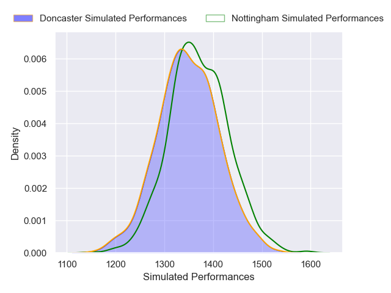
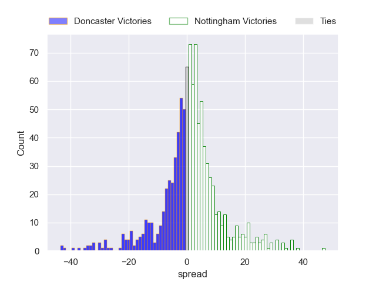
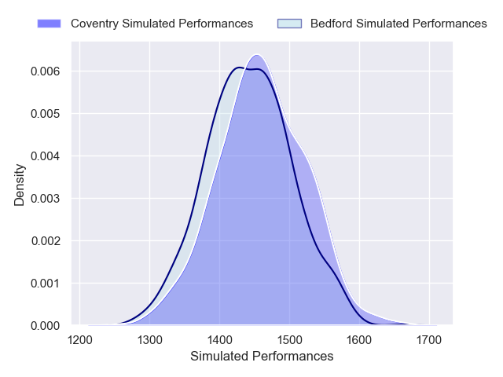
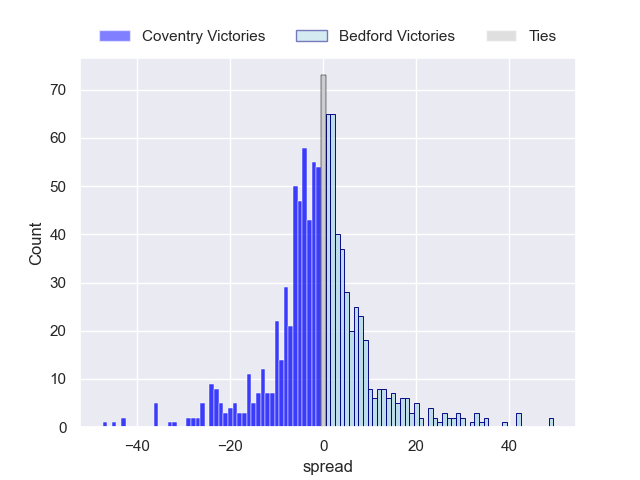

---  
title: "RFU Championship 2024 Status"  
date: 2025-01-24 6:00:00 -0500  
categories: model review projection  
layout: article  
aside:  
    toc: true  
---
# Current Team Rankings

# Standings

## Current Standings

| Club                |   Played |   Wins |   Point Differential |   Losing Bonus Points |   Try Bonus Points |   Competition Points |
|:--------------------|---------:|-------:|---------------------:|----------------------:|-------------------:|---------------------:|
| Ealing Trailfinders |       11 |     10 |                  335 |                     1 |                 10 |                   51 |
| Bedford             |       11 |      8 |                   63 |                     0 |                  6 |                   38 |
| Coventry            |       11 |      8 |                   48 |                     0 |                  6 |                   38 |
| Nottingham          |       11 |      6 |                   79 |                     3 |                  5 |                   32 |
| Hartpury College    |       10 |      6 |                   49 |                     2 |                  6 |                   32 |
| Cornish Pirates     |       11 |      6 |                   29 |                     3 |                  4 |                   31 |
| Doncaster           |       11 |      5 |                   33 |                     3 |                  4 |                   27 |
| London Scottish     |       11 |      4 |                  -53 |                     3 |                  4 |                   23 |
| Chinnor             |       11 |      4 |                   -3 |                     3 |                  3 |                   22 |
| Ampthill            |       10 |      3 |                 -162 |                     2 |                  3 |                   17 |
| Cambridge           |       11 |      3 |                 -286 |                     0 |                  3 |                   15 |
| Caldy               |       11 |      2 |                 -132 |                     2 |                  3 |                   13 |

## Projected Remaining Table

| Club                |   Matches Remaining |   Wins |   Point Differential |   Losing Bonus Points |   Try Bonus Points |   Competition Points |
|:--------------------|--------------------:|-------:|---------------------:|----------------------:|-------------------:|---------------------:|
| Ealing Trailfinders |                  11 |   10.1 |             193.183  |                   0.4 |                7.9 |                 48.9 |
| Coventry            |                  11 |    7.9 |              88.84   |                   1.5 |                6.9 |                 40.1 |
| Bedford             |                  11 |    7   |              36.8577 |                   2   |                5.8 |                 35.7 |
| Hartpury College    |                  11 |    7.2 |              46.9838 |                   2.1 |                4.8 |                 35.6 |
| Cornish Pirates     |                  11 |    6.7 |              44.8878 |                   1.9 |                5.4 |                 34.2 |
| Doncaster           |                  11 |    6.2 |              16.0054 |                   2.6 |                4.5 |                 31.8 |
| Nottingham          |                  11 |    5.2 |             -11.9242 |                   2.3 |                5.3 |                 28.2 |
| Chinnor             |                  11 |    5.2 |             -12.6769 |                   2.3 |                3.8 |                 27   |
| Ampthill            |                  11 |    3.8 |             -55.6999 |                   2.6 |                3.6 |                 21.3 |
| London Scottish     |                  11 |    3.5 |             -55.5584 |                   2.6 |                3.4 |                 20   |
| Caldy               |                  11 |    1.9 |            -124.088  |                   2.4 |                2.3 |                 12.3 |
| Cambridge           |                  11 |    1.4 |            -166.81   |                   1.5 |                2.3 |                  9.3 |

## Projected Total Table

| Club                |   Total Matches |   Wins |   Point Differential |   Losing Bonus Points |   Try Bonus Points |   Competition Points |
|:--------------------|----------------:|-------:|---------------------:|----------------------:|-------------------:|---------------------:|
| Ealing Trailfinders |              22 |   20.1 |             528.183  |                   1.4 |               17.9 |                 99.9 |
| Coventry            |              22 |   15.9 |             136.84   |                   1.5 |               12.9 |                 78.1 |
| Bedford             |              22 |   15   |              99.8577 |                   2   |               11.8 |                 73.7 |
| Hartpury College    |              21 |   13.2 |              95.9838 |                   4.1 |               10.8 |                 67.6 |
| Cornish Pirates     |              22 |   12.7 |              73.8878 |                   4.9 |                9.4 |                 65.2 |
| Nottingham          |              22 |   11.2 |              67.0758 |                   5.3 |               10.3 |                 60.2 |
| Doncaster           |              22 |   11.2 |              49.0054 |                   5.6 |                8.5 |                 58.8 |
| Chinnor             |              22 |    9.2 |             -15.6769 |                   5.3 |                6.8 |                 49   |
| London Scottish     |              22 |    7.5 |            -108.558  |                   5.6 |                7.4 |                 43   |
| Ampthill            |              21 |    6.8 |            -217.7    |                   4.6 |                6.6 |                 38.3 |
| Caldy               |              22 |    3.9 |            -256.088  |                   4.4 |                5.3 |                 25.3 |
| Cambridge           |              22 |    4.4 |            -452.81   |                   1.5 |                5.3 |                 24.3 |

# Completed Match Review

| Model | Percent Correct Predictions | Spread Error |
| ------ | ------ | ------ |
| Club Level | 69.2% | 13.9 |
| Player Level: Lineup | 63.6% | 14.1 |
| Player Level: Minutes | 70.5% | 14.2 |

# Future Predictions

## Week 12

### Nottingham V Doncaster on 2025/01/24

Average Margin: Nottingham by 1.3

Average Scoreline: 26-25

### Bedford V Coventry on 2025/01/24

Average Margin: Coventry by 0.8

Average Scoreline: 29-29

### Ealing Trailfinders V Cornish Pirates on 2025/01/25

Average Margin: Ealing Trailfinders by 16.7

Average Scoreline: 36-19

### Chinnor V Ampthill on 2025/01/25

Average Margin: Chinnor by 8.4

Average Scoreline: 33-25

### Cambridge V Caldy on 2025/01/25

Average Margin: Cambridge by 0.2

Average Scoreline: 32-32

### London Scottish V Hartpury College on 2025/01/25

Average Margin: Hartpury College by 4.6

Average Scoreline: 38-34

## Week 13

### Caldy V Chinnor on 2025/03/22

Average Margin: Chinnor by 5.9

Average Scoreline: 32-27

### Ampthill V Nottingham on 2025/03/22

Average Margin: Nottingham by 0.8

Average Scoreline: 31-30

### Hartpury College V Bedford on 2025/03/22

Average Margin: Hartpury College by 3.8

Average Scoreline: 30-26

### Coventry V Cambridge on 2025/03/22

Average Margin: Coventry by 24.1

Average Scoreline: 40-16

### Doncaster V Ealing Trailfinders on 2025/03/22

Average Margin: Ealing Trailfinders by 13.1

Average Scoreline: 32-19

### Cornish Pirates V London Scottish on 2025/03/22

Average Margin: Cornish Pirates by 11.9

Average Scoreline: 34-22

## Week 14

### Bedford V Cornish Pirates on 2025/03/29

Average Margin: Bedford by 3.7

Average Scoreline: 32-29

### London Scottish V Doncaster on 2025/03/29

Average Margin: Doncaster by 2.6

Average Scoreline: 32-29

### Cambridge V Hartpury College on 2025/03/29

Average Margin: Hartpury College by 14.4

Average Scoreline: 41-26

### Caldy V Ampthill on 2025/03/29

Average Margin: Ampthill by 2.5

Average Scoreline: 31-28

### Chinnor V Coventry on 2025/03/29

Average Margin: Coventry by 5.3

Average Scoreline: 32-27

### Ealing Trailfinders V Nottingham on 2025/03/29

Average Margin: Ealing Trailfinders by 20.8

Average Scoreline: 41-20

## Week 15

### Nottingham V London Scottish on 2025/04/05

Average Margin: Nottingham by 7.8

Average Scoreline: 32-24

### Coventry V Caldy on 2025/04/05

Average Margin: Coventry by 20.8

Average Scoreline: 41-20

### Cornish Pirates V Cambridge on 2025/04/05

Average Margin: Cornish Pirates by 20.4

Average Scoreline: 41-20

### Ampthill V Ealing Trailfinders on 2025/04/05

Average Margin: Ealing Trailfinders by 17.6

Average Scoreline: 33-16

### Doncaster V Bedford on 2025/04/05

Average Margin: Doncaster by 2.2

Average Scoreline: 32-30

### Hartpury College V Chinnor on 2025/04/05

Average Margin: Hartpury College by 8.7

Average Scoreline: 28-19

## Week 16

### Bedford V Nottingham on 2025/04/12

Average Margin: Bedford by 7.9

Average Scoreline: 38-31

### Cambridge V Doncaster on 2025/04/12

Average Margin: Doncaster by 12.3

Average Scoreline: 40-28

### Coventry V Ampthill on 2025/04/12

Average Margin: Coventry by 15.4

Average Scoreline: 38-22

### London Scottish V Ealing Trailfinders on 2025/04/12

Average Margin: Ealing Trailfinders by 15.6

Average Scoreline: 31-16

### Caldy V Hartpury College on 2025/04/12

Average Margin: Hartpury College by 11.4

Average Scoreline: 37-25

### Chinnor V Cornish Pirates on 2025/04/12

Average Margin: Cornish Pirates by 1.5

Average Scoreline: 33-31

## Week 17

### Nottingham V Cambridge on 2025/04/19

Average Margin: Nottingham by 17.1

Average Scoreline: 45-28

### Cornish Pirates V Caldy on 2025/04/19

Average Margin: Cornish Pirates by 17.5

Average Scoreline: 35-18

### Ealing Trailfinders V Bedford on 2025/04/19

Average Margin: Ealing Trailfinders by 17.1

Average Scoreline: 39-21

### Doncaster V Chinnor on 2025/04/19

Average Margin: Doncaster by 6.7

Average Scoreline: 27-21

### Hartpury College V Coventry on 2025/04/19

Average Margin: Hartpury College by 0.1

Average Scoreline: 28-28

### Ampthill V London Scottish on 2025/04/19

Average Margin: Ampthill by 3.3

Average Scoreline: 38-35

## Week 18

### Bedford V London Scottish on 2025/05/03

Average Margin: Bedford by 11.3

Average Scoreline: 37-26

### Cambridge V Ealing Trailfinders on 2025/05/03

Average Margin: Ealing Trailfinders by 25.0

Average Scoreline: 42-17

### Caldy V Doncaster on 2025/05/03

Average Margin: Doncaster by 9.1

Average Scoreline: 36-27

### Chinnor V Nottingham on 2025/05/03

Average Margin: Chinnor by 3.1

Average Scoreline: 36-33

### Hartpury College V Ampthill on 2025/05/03

Average Margin: Hartpury College by 12.2

Average Scoreline: 38-26

### Coventry V Cornish Pirates on 2025/05/03

Average Margin: Coventry by 7.5

Average Scoreline: 36-29

## Week 19

### Nottingham V Caldy on 2025/05/10

Average Margin: Nottingham by 13.0

Average Scoreline: 36-23

### Ealing Trailfinders V Chinnor on 2025/05/10

Average Margin: Ealing Trailfinders by 20.8

Average Scoreline: 34-13

### Doncaster V Coventry on 2025/05/10

Average Margin: Coventry by 1.9

Average Scoreline: 31-30

### Ampthill V Bedford on 2025/05/10

Average Margin: Bedford by 4.9

Average Scoreline: 37-32

### London Scottish V Cambridge on 2025/05/10

Average Margin: London Scottish by 12.4

Average Scoreline: 37-24

### Cornish Pirates V Hartpury College on 2025/05/10

Average Margin: Cornish Pirates by 3.7

Average Scoreline: 33-29

## Week 20

### Coventry V Nottingham on 2025/05/17

Average Margin: Coventry by 11.9

Average Scoreline: 40-28

### Cambridge V Bedford on 2025/05/17

Average Margin: Bedford by 13.6

Average Scoreline: 42-29

### Hartpury College V Doncaster on 2025/05/17

Average Margin: Hartpury College by 5.6

Average Scoreline: 37-31

### Chinnor V London Scottish on 2025/05/17

Average Margin: Chinnor by 7.0

Average Scoreline: 32-25

### Caldy V Ealing Trailfinders on 2025/05/17

Average Margin: Ealing Trailfinders by 23.0

Average Scoreline: 40-17

### Cornish Pirates V Ampthill on 2025/05/17

Average Margin: Cornish Pirates by 12.1

Average Scoreline: 37-25

## Week 21

### Doncaster V Cornish Pirates on 2025/05/24

Average Margin: Doncaster by 2.1

Average Scoreline: 33-31

### Bedford V Chinnor on 2025/05/24

Average Margin: Bedford by 9.0

Average Scoreline: 30-21

### London Scottish V Caldy on 2025/05/24

Average Margin: London Scottish by 10.5

Average Scoreline: 38-28

### Nottingham V Hartpury College on 2025/05/24

Average Margin: Hartpury College by 0.3

Average Scoreline: 32-32

### Ampthill V Cambridge on 2025/05/24

Average Margin: Ampthill by 12.9

Average Scoreline: 35-23

### Ealing Trailfinders V Coventry on 2025/05/24

Average Margin: Ealing Trailfinders by 13.2

Average Scoreline: 40-26

## Week 22

### Hartpury College V Ealing Trailfinders on 2025/05/31

Average Margin: Ealing Trailfinders by 10.3

Average Scoreline: 32-22

### Coventry V London Scottish on 2025/05/31

Average Margin: Coventry by 14.5

Average Scoreline: 36-21

### Chinnor V Cambridge on 2025/05/31

Average Margin: Chinnor by 14.8

Average Scoreline: 37-23

### Caldy V Bedford on 2025/05/31

Average Margin: Bedford by 10.3

Average Scoreline: 37-26

### Cornish Pirates V Nottingham on 2025/05/31

Average Margin: Cornish Pirates by 7.8

Average Scoreline: 35-28

### Ampthill V Doncaster on 2025/05/31

Average Margin: Doncaster by 2.9

Average Scoreline: 38-35

