---  
title: "RFU Championship 2024 Status"  
date: 2024-09-20 6:00:00 -0500  
categories: model review projection  
layout: article  
aside:  
    toc: true  
---
# Current Team Rankings

# Standings

## Projected Total Table

| Club                |   Total Matches |   Wins |   Point Differential |   Losing Bonus Points |   Try Bonus Points |   Competition Points |
|:--------------------|----------------:|-------:|---------------------:|----------------------:|-------------------:|---------------------:|
| Ealing Trailfinders |              22 |   21.2 |             338.123  |                   0.7 |               15.7 |                101.1 |
| Coventry            |              22 |   19   |             223.286  |                   2.1 |               14.6 |                 92.6 |
| Cornish Pirates     |              22 |   17.2 |             163.866  |                   3.1 |               11.6 |                 83.6 |
| Bedford             |              22 |   13   |              45.8894 |                   5   |               11.6 |                 68.6 |
| Chinnor             |              22 |   12.7 |              41.2997 |                   5.3 |                9.1 |                 65.1 |
| Hartpury College    |              22 |   12.1 |              25.2999 |                   5.3 |                8.1 |                 61.8 |
| Doncaster           |              22 |   11.4 |              10.1867 |                   5.6 |                7.4 |                 58.8 |
| Ampthill            |              22 |    9   |             -48.8035 |                   5.9 |                8.7 |                 50.7 |
| Nottingham          |              22 |    6.4 |            -118.668  |                   5.9 |                8.5 |                 40   |
| London Scottish     |              22 |    5.6 |            -140.4    |                   5.8 |                6.2 |                 34.5 |
| Caldy               |              22 |    2.8 |            -232.281  |                   5   |                4.8 |                 21.1 |
| Cambridge           |              22 |    1.5 |            -307.797  |                   3.7 |                4.6 |                 14.4 |

# Future Predictions

## Week 1

### London Scottish V Coventry on 2024/09/20

Average Margin: Coventry by 12.1

Average Scoreline: 37-25

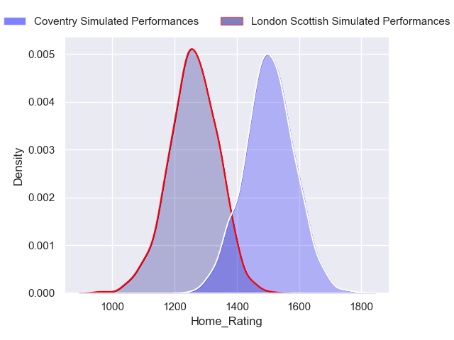

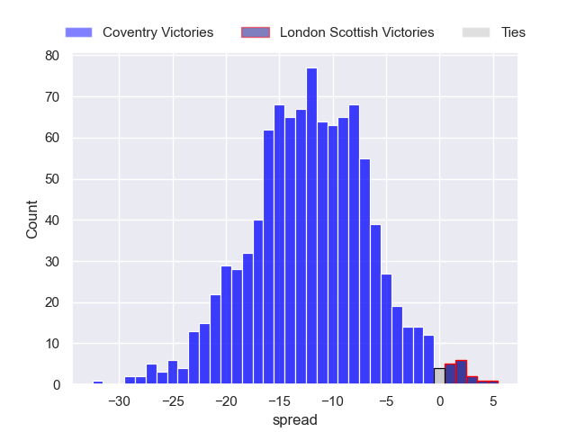

### Nottingham V Cornish Pirates on 2024/09/20

Average Margin: Cornish Pirates by 8.6

Average Scoreline: 34-26

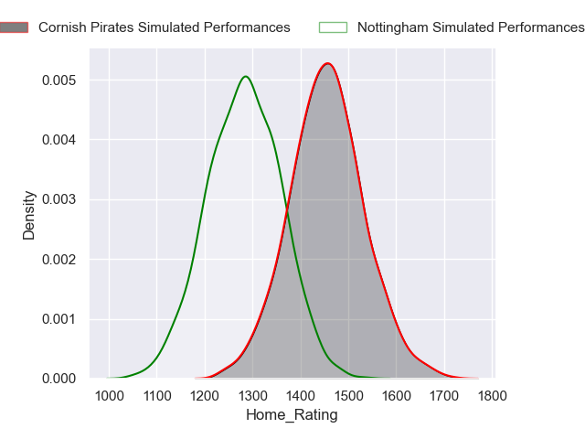

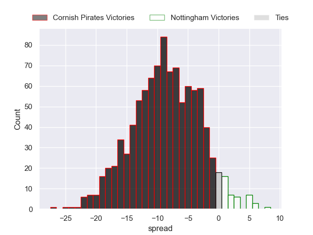

### Ealing Trailfinders V Hartpury College on 2024/09/21

Average Margin: Ealing Trailfinders by 16.8

Average Scoreline: 36-20

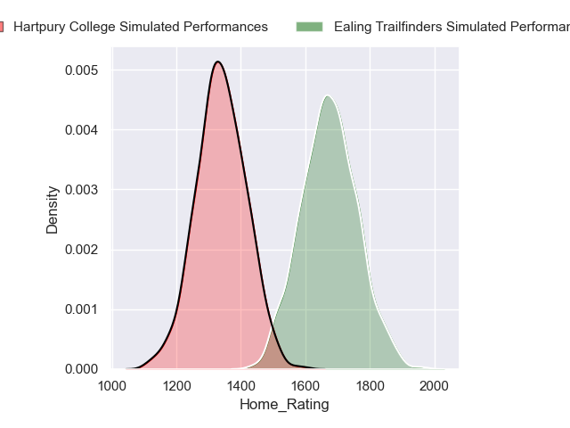
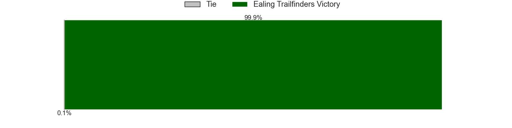
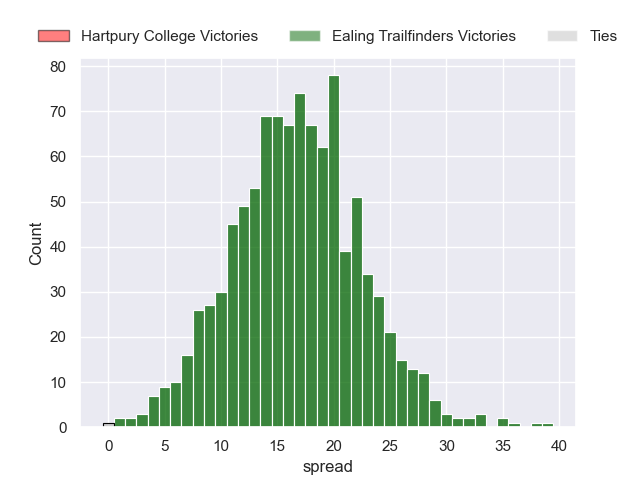

### Cambridge V Chinnor on 2024/09/21

Average Margin: Chinnor by 11.8

Average Scoreline: 35-23

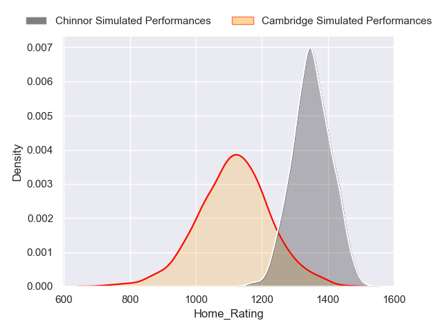

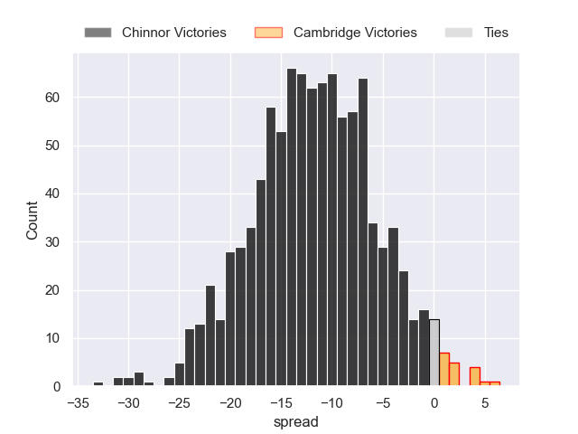

### Doncaster V Ampthill on 2024/09/21

Average Margin: Doncaster by 5.9

Average Scoreline: 28-22

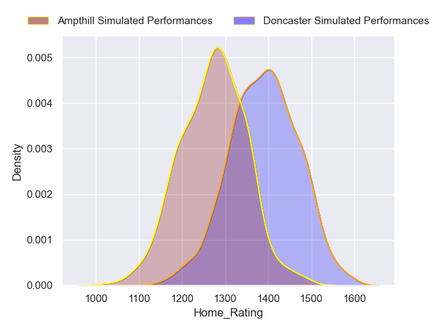

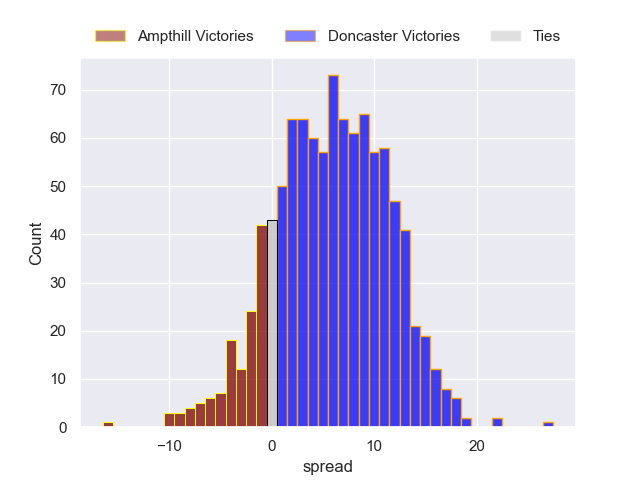

### Bedford V Caldy on 2024/09/21

Average Margin: Bedford by 15.2

Average Scoreline: 35-20

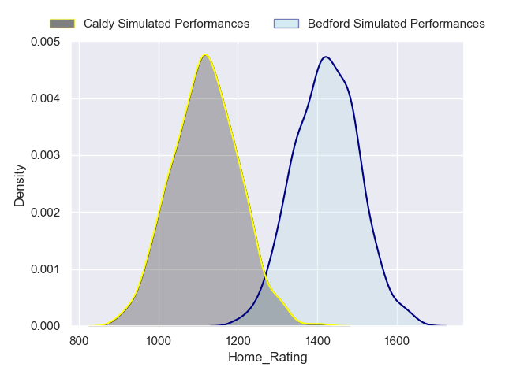

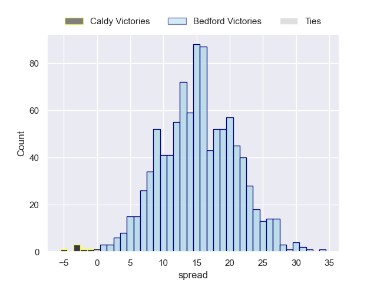

## Week 2

### Cornish Pirates V Ealing Trailfinders on 2024/09/27

Average Margin: Ealing Trailfinders by 4.0

Average Scoreline: 36-32

### Coventry V Bedford on 2024/09/28

Average Margin: Coventry by 10.9

Average Scoreline: 36-25

### Ampthill V Chinnor on 2024/09/28

Average Margin: Chinnor by 0.5

Average Scoreline: 30-29

### Caldy V Cambridge on 2024/09/28

Average Margin: Caldy by 7.1

Average Scoreline: 34-27

### Hartpury College V London Scottish on 2024/09/28

Average Margin: Hartpury College by 10.3

Average Scoreline: 35-25

### Doncaster V Nottingham on 2024/09/28

Average Margin: Doncaster by 9.1

Average Scoreline: 32-23

## Week 3

### London Scottish V Cornish Pirates on 2024/10/04

Average Margin: Cornish Pirates by 9.4

Average Scoreline: 38-29

### Nottingham V Ampthill on 2024/10/04

Average Margin: Nottingham by 0.5

Average Scoreline: 30-30

### Ealing Trailfinders V Doncaster on 2024/10/05

Average Margin: Ealing Trailfinders by 17.3

Average Scoreline: 37-20

### Cambridge V Coventry on 2024/10/05

Average Margin: Coventry by 19.1

Average Scoreline: 41-22

### Bedford V Hartpury College on 2024/10/05

Average Margin: Bedford by 4.2

Average Scoreline: 28-24

### Chinnor V Caldy on 2024/10/05

Average Margin: Chinnor by 15.1

Average Scoreline: 41-26

## Week 4

### Hartpury College V Cambridge on 2024/10/11

Average Margin: Hartpury College by 17.6

Average Scoreline: 44-26

### Nottingham V Ealing Trailfinders on 2024/10/11

Average Margin: Ealing Trailfinders by 15.9

Average Scoreline: 48-32

### Ampthill V Caldy on 2024/10/12

Average Margin: Ampthill by 11.0

Average Scoreline: 31-20

### Doncaster V London Scottish on 2024/10/12

Average Margin: Doncaster by 9.8

Average Scoreline: 32-23

### Cornish Pirates V Bedford on 2024/10/12

Average Margin: Cornish Pirates by 8.4

Average Scoreline: 32-23

### Coventry V Chinnor on 2024/10/12

Average Margin: Coventry by 11.2

Average Scoreline: 41-29

## Week 5

### London Scottish V Nottingham on 2024/10/18

Average Margin: London Scottish by 2.6

Average Scoreline: 29-26

### Ealing Trailfinders V Ampthill on 2024/10/19

Average Margin: Ealing Trailfinders by 19.5

Average Scoreline: 40-20

### Caldy V Coventry on 2024/10/19

Average Margin: Coventry by 15.9

Average Scoreline: 40-24

### Bedford V Doncaster on 2024/10/19

Average Margin: Bedford by 5.0

Average Scoreline: 26-21

### Chinnor V Hartpury College on 2024/10/19

Average Margin: Chinnor by 4.1

Average Scoreline: 36-32

### Cambridge V Cornish Pirates on 2024/10/19

Average Margin: Cornish Pirates by 16.7

Average Scoreline: 38-21

## Week 6

### Cornish Pirates V Chinnor on 2024/11/30

Average Margin: Cornish Pirates by 8.4

Average Scoreline: 32-23

### Ampthill V Coventry on 2024/11/30

Average Margin: Coventry by 8.0

Average Scoreline: 41-33

### Doncaster V Cambridge on 2024/11/30

Average Margin: Doncaster by 16.6

Average Scoreline: 38-22

### Ealing Trailfinders V London Scottish on 2024/11/30

Average Margin: Ealing Trailfinders by 23.5

Average Scoreline: 38-14

### Nottingham V Bedford on 2024/11/30

Average Margin: Bedford by 3.6

Average Scoreline: 46-42

### Hartpury College V Caldy on 2024/11/30

Average Margin: Hartpury College by 14.3

Average Scoreline: 35-21

## Week 7

### Caldy V Cornish Pirates on 2024/12/07

Average Margin: Cornish Pirates by 13.0

Average Scoreline: 41-28

### London Scottish V Ampthill on 2024/12/07

Average Margin: Ampthill by 0.3

Average Scoreline: 29-29

### Chinnor V Doncaster on 2024/12/07

Average Margin: Chinnor by 4.6

Average Scoreline: 34-30

### Coventry V Hartpury College on 2024/12/07

Average Margin: Coventry by 11.7

Average Scoreline: 36-24

### Bedford V Ealing Trailfinders on 2024/12/07

Average Margin: Ealing Trailfinders by 8.9

Average Scoreline: 31-23

### Cambridge V Nottingham on 2024/12/07

Average Margin: Nottingham by 4.9

Average Scoreline: 44-40

## Week 8

### Ealing Trailfinders V Cambridge on 2024/12/14

Average Margin: Ealing Trailfinders by 30.3

Average Scoreline: 49-18

### Doncaster V Caldy on 2024/12/14

Average Margin: Doncaster by 13.4

Average Scoreline: 33-20

### Cornish Pirates V Coventry on 2024/12/14

Average Margin: Cornish Pirates by 0.8

Average Scoreline: 32-31

### Ampthill V Hartpury College on 2024/12/14

Average Margin: Ampthill by 0.3

Average Scoreline: 35-34

### London Scottish V Bedford on 2024/12/14

Average Margin: Bedford by 4.3

Average Scoreline: 38-33

### Nottingham V Chinnor on 2024/12/14

Average Margin: Chinnor by 3.3

Average Scoreline: 42-39

## Week 9

### Cornish Pirates V Doncaster on 2024/12/21

Average Margin: Cornish Pirates by 10.0

Average Scoreline: 33-23

### Caldy V London Scottish on 2024/12/21

Average Margin: London Scottish by 0.4

Average Scoreline: 37-37

### Cambridge V Ampthill on 2024/12/21

Average Margin: Ampthill by 7.1

Average Scoreline: 48-40

### Hartpury College V Nottingham on 2024/12/21

Average Margin: Hartpury College by 9.3

Average Scoreline: 36-27

### Coventry V Ealing Trailfinders on 2024/12/21

Average Margin: Ealing Trailfinders by 1.4

Average Scoreline: 36-34

### Chinnor V Bedford on 2024/12/21

Average Margin: Chinnor by 3.0

Average Scoreline: 39-36

## Week 10

### Nottingham V Coventry on 2024/12/28

Average Margin: Coventry by 10.9

Average Scoreline: 42-31

### London Scottish V Chinnor on 2024/12/28

Average Margin: Chinnor by 4.2

Average Scoreline: 42-38

### Ampthill V Cornish Pirates on 2024/12/28

Average Margin: Cornish Pirates by 5.5

Average Scoreline: 36-31

### Ealing Trailfinders V Caldy on 2024/12/28

Average Margin: Ealing Trailfinders by 27.2

Average Scoreline: 46-19

### Bedford V Cambridge on 2024/12/28

Average Margin: Bedford by 18.2

Average Scoreline: 38-20

### Doncaster V Hartpury College on 2024/12/28

Average Margin: Doncaster by 2.6

Average Scoreline: 32-29

## Week 11

### Bedford V Ampthill on 2025/01/18

Average Margin: Bedford by 7.1

Average Scoreline: 30-23

### Caldy V Nottingham on 2025/01/18

Average Margin: Nottingham by 1.6

Average Scoreline: 38-36

### Cambridge V London Scottish on 2025/01/18

Average Margin: London Scottish by 4.0

Average Scoreline: 39-35

### Hartpury College V Cornish Pirates on 2025/01/18

Average Margin: Cornish Pirates by 2.5

Average Scoreline: 32-29

### Coventry V Doncaster on 2025/01/18

Average Margin: Coventry by 12.2

Average Scoreline: 39-27

### Chinnor V Ealing Trailfinders on 2025/01/18

Average Margin: Ealing Trailfinders by 9.0

Average Scoreline: 40-31

## Week 12

### Bedford V Coventry on 2025/01/25

Average Margin: Coventry by 3.9

Average Scoreline: 37-33

### Ealing Trailfinders V Cornish Pirates on 2025/01/25

Average Margin: Ealing Trailfinders by 10.7

Average Scoreline: 30-19

### Nottingham V Doncaster on 2025/01/25

Average Margin: Doncaster by 2.0

Average Scoreline: 37-35

### Chinnor V Ampthill on 2025/01/25

Average Margin: Chinnor by 7.0

Average Scoreline: 36-29

### Cambridge V Caldy on 2025/01/25

Average Margin: Cambridge by 0.5

Average Scoreline: 27-26

### London Scottish V Hartpury College on 2025/01/25

Average Margin: Hartpury College by 3.6

Average Scoreline: 38-34

## Week 13

### Doncaster V Ealing Trailfinders on 2025/03/22

Average Margin: Ealing Trailfinders by 10.2

Average Scoreline: 36-26

### Caldy V Chinnor on 2025/03/22

Average Margin: Chinnor by 8.1

Average Scoreline: 44-36

### Ampthill V Nottingham on 2025/03/22

Average Margin: Ampthill by 6.6

Average Scoreline: 35-29

### Cornish Pirates V London Scottish on 2025/03/22

Average Margin: Cornish Pirates by 16.1

Average Scoreline: 34-18

### Coventry V Cambridge on 2025/03/22

Average Margin: Coventry by 25.4

Average Scoreline: 41-16

### Hartpury College V Bedford on 2025/03/22

Average Margin: Hartpury College by 2.5

Average Scoreline: 33-30

## Week 14

### Bedford V Cornish Pirates on 2025/03/29

Average Margin: Cornish Pirates by 1.4

Average Scoreline: 29-28

### London Scottish V Doncaster on 2025/03/29

Average Margin: Doncaster by 3.0

Average Scoreline: 37-34

### Cambridge V Hartpury College on 2025/03/29

Average Margin: Hartpury College by 10.6

Average Scoreline: 49-39

### Chinnor V Coventry on 2025/03/29

Average Margin: Coventry by 4.4

Average Scoreline: 40-36

### Ealing Trailfinders V Nottingham on 2025/03/29

Average Margin: Ealing Trailfinders by 22.2

Average Scoreline: 49-27

### Caldy V Ampthill on 2025/03/29

Average Margin: Ampthill by 4.2

Average Scoreline: 44-40

## Week 15

### Coventry V Caldy on 2025/04/05

Average Margin: Coventry by 22.0

Average Scoreline: 44-22

### Hartpury College V Chinnor on 2025/04/05

Average Margin: Hartpury College by 2.6

Average Scoreline: 33-30

### Ampthill V Ealing Trailfinders on 2025/04/05

Average Margin: Ealing Trailfinders by 12.6

Average Scoreline: 41-28

### Doncaster V Bedford on 2025/04/05

Average Margin: Doncaster by 1.8

Average Scoreline: 33-31

### Nottingham V London Scottish on 2025/04/05

Average Margin: Nottingham by 4.2

Average Scoreline: 29-25

### Cornish Pirates V Cambridge on 2025/04/05

Average Margin: Cornish Pirates by 22.9

Average Scoreline: 40-17

## Week 16

### Coventry V Ampthill on 2025/04/12

Average Margin: Coventry by 14.6

Average Scoreline: 40-26

### London Scottish V Ealing Trailfinders on 2025/04/12

Average Margin: Ealing Trailfinders by 16.4

Average Scoreline: 36-20

### Bedford V Nottingham on 2025/04/12

Average Margin: Bedford by 10.4

Average Scoreline: 34-24

### Cambridge V Doncaster on 2025/04/12

Average Margin: Doncaster by 9.7

Average Scoreline: 47-37

### Caldy V Hartpury College on 2025/04/12

Average Margin: Hartpury College by 7.3

Average Scoreline: 51-44

### Chinnor V Cornish Pirates on 2025/04/12

Average Margin: Cornish Pirates by 1.7

Average Scoreline: 40-39

## Week 17

### Doncaster V Chinnor on 2025/04/19

Average Margin: Doncaster by 2.2

Average Scoreline: 31-28

### Ealing Trailfinders V Bedford on 2025/04/19

Average Margin: Ealing Trailfinders by 15.7

Average Scoreline: 37-21

### Cornish Pirates V Caldy on 2025/04/19

Average Margin: Cornish Pirates by 19.7

Average Scoreline: 40-20

### Ampthill V London Scottish on 2025/04/19

Average Margin: Ampthill by 7.3

Average Scoreline: 32-25

### Nottingham V Cambridge on 2025/04/19

Average Margin: Nottingham by 11.3

Average Scoreline: 30-19

### Hartpury College V Coventry on 2025/04/19

Average Margin: Coventry by 4.5

Average Scoreline: 35-31

## Week 18

### Chinnor V Nottingham on 2025/05/03

Average Margin: Chinnor by 10.0

Average Scoreline: 35-25

### Caldy V Doncaster on 2025/05/03

Average Margin: Doncaster by 6.6

Average Scoreline: 46-39

### Cambridge V Ealing Trailfinders on 2025/05/03

Average Margin: Ealing Trailfinders by 22.8

Average Scoreline: 40-17

### Bedford V London Scottish on 2025/05/03

Average Margin: Bedford by 11.0

Average Scoreline: 30-19

### Hartpury College V Ampthill on 2025/05/03

Average Margin: Hartpury College by 6.4

Average Scoreline: 35-29

### Coventry V Cornish Pirates on 2025/05/03

Average Margin: Coventry by 5.9

Average Scoreline: 31-25

## Week 19

### Cornish Pirates V Hartpury College on 2025/05/10

Average Margin: Cornish Pirates by 9.2

Average Scoreline: 32-23

### Ampthill V Bedford on 2025/05/10

Average Margin: Bedford by 0.7

Average Scoreline: 37-37

### Doncaster V Coventry on 2025/05/10

Average Margin: Coventry by 5.4

Average Scoreline: 44-38

### London Scottish V Cambridge on 2025/05/10

Average Margin: London Scottish by 10.0

Average Scoreline: 34-24

### Nottingham V Caldy on 2025/05/10

Average Margin: Nottingham by 8.1

Average Scoreline: 31-23

### Ealing Trailfinders V Chinnor on 2025/05/10

Average Margin: Ealing Trailfinders by 15.5

Average Scoreline: 38-22

## Week 20

### Chinnor V London Scottish on 2025/05/17

Average Margin: Chinnor by 10.7

Average Scoreline: 33-22

### Coventry V Nottingham on 2025/05/17

Average Margin: Coventry by 17.4

Average Scoreline: 44-27

### Hartpury College V Doncaster on 2025/05/17

Average Margin: Hartpury College by 3.9

Average Scoreline: 30-26

### Caldy V Ealing Trailfinders on 2025/05/17

Average Margin: Ealing Trailfinders by 20.2

Average Scoreline: 42-21

### Cornish Pirates V Ampthill on 2025/05/17

Average Margin: Cornish Pirates by 12.1

Average Scoreline: 33-21

### Cambridge V Bedford on 2025/05/17

Average Margin: Bedford by 10.8

Average Scoreline: 37-26

## Week 21

### Ealing Trailfinders V Coventry on 2025/05/24

Average Margin: Ealing Trailfinders by 8.2

Average Scoreline: 33-24

### London Scottish V Caldy on 2025/05/24

Average Margin: London Scottish by 7.1

Average Scoreline: 32-25

### Doncaster V Cornish Pirates on 2025/05/24

Average Margin: Cornish Pirates by 3.1

Average Scoreline: 34-31

### Ampthill V Cambridge on 2025/05/24

Average Margin: Ampthill by 13.8

Average Scoreline: 38-24

### Bedford V Chinnor on 2025/05/24

Average Margin: Bedford by 3.5

Average Scoreline: 26-23

### Nottingham V Hartpury College on 2025/05/24

Average Margin: Hartpury College by 2.4

Average Scoreline: 45-42

## Week 22

### Coventry V London Scottish on 2025/05/31

Average Margin: Coventry by 18.2

Average Scoreline: 39-21

### Hartpury College V Ealing Trailfinders on 2025/05/31

Average Margin: Ealing Trailfinders by 9.8

Average Scoreline: 36-26

### Chinnor V Cambridge on 2025/05/31

Average Margin: Chinnor by 17.6

Average Scoreline: 44-26

### Ampthill V Doncaster on 2025/05/31

Average Margin: Ampthill by 0.9

Average Scoreline: 30-29

### Caldy V Bedford on 2025/05/31

Average Margin: Bedford by 8.3

Average Scoreline: 51-42

### Cornish Pirates V Nottingham on 2025/05/31

Average Margin: Cornish Pirates by 14.9

Average Scoreline: 35-20

