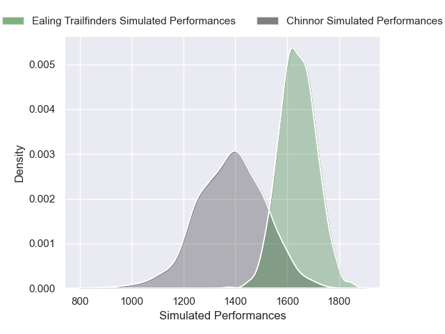
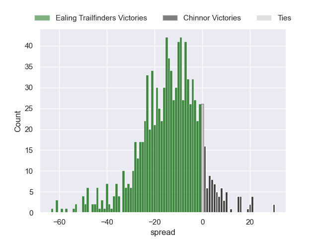

---  
title: "RFU Championship 2024 Status"  
date: 2025-01-17 6:00:00 -0500  
categories: model review projection  
layout: article  
aside:  
    toc: true  
---
# Current Team Rankings

# Standings

## Current Standings

| Club                |   Played |   Wins |   Point Differential |   Losing Bonus Points |   Try Bonus Points |   Competition Points |
|:--------------------|---------:|-------:|---------------------:|----------------------:|-------------------:|---------------------:|
| Ealing Trailfinders |       10 |      9 |                  315 |                     1 |                  9 |                   46 |
| Coventry            |       10 |      7 |                   47 |                     0 |                  6 |                   34 |
| Bedford             |       10 |      7 |                   42 |                     0 |                  5 |                   33 |
| Nottingham          |       10 |      6 |                   84 |                     2 |                  5 |                   31 |
| Cornish Pirates     |       10 |      6 |                   53 |                     3 |                  4 |                   31 |
| Hartpury College    |        9 |      5 |                   25 |                     2 |                  5 |                   27 |
| Doncaster           |       10 |      5 |                   34 |                     2 |                  4 |                   26 |
| Chinnor             |       10 |      4 |                   17 |                     3 |                  3 |                   22 |
| London Scottish     |       10 |      3 |                  -75 |                     3 |                  3 |                   18 |
| Ampthill            |        9 |      3 |                 -141 |                     2 |                  3 |                   17 |
| Cambridge           |       10 |      3 |                 -264 |                     0 |                  2 |                   14 |
| Caldy               |       10 |      1 |                 -137 |                     2 |                  2 |                    8 |

## Projected Remaining Table

| Club                |   Matches Remaining |   Wins |   Point Differential |   Losing Bonus Points |   Try Bonus Points |   Competition Points |
|:--------------------|--------------------:|-------:|---------------------:|----------------------:|-------------------:|---------------------:|
| Ealing Trailfinders |                  12 |   11   |            203.676   |                   0.5 |                8.5 |                 53.1 |
| Coventry            |                  12 |    9.1 |            112.11    |                   1.5 |                6.8 |                 44.5 |
| Bedford             |                  12 |    7.7 |             44.768   |                   2.2 |                5.9 |                 38.8 |
| Cornish Pirates     |                  12 |    7.2 |             47.0095  |                   2.3 |                6.4 |                 37.7 |
| Hartpury College    |                  12 |    7.3 |             38.9268  |                   2.6 |                5.2 |                 37.2 |
| Nottingham          |                  12 |    6.3 |              5.61603 |                   2.3 |                6.7 |                 34   |
| Doncaster           |                  12 |    6   |             -3.68155 |                   2.9 |                4.3 |                 31.3 |
| Chinnor             |                  12 |    5.8 |            -10.7693  |                   2.4 |                3.8 |                 29.3 |
| London Scottish     |                  12 |    3.9 |            -67.0701  |                   2.6 |                4.5 |                 22.7 |
| Ampthill            |                  12 |    4   |            -67.2347  |                   2.6 |                4.2 |                 22.7 |
| Cambridge           |                  12 |    1.9 |           -155.292   |                   2.2 |                3.6 |                 13.5 |
| Caldy               |                  12 |    1.8 |           -148.058   |                   2.6 |                3.5 |                 13.2 |

## Projected Total Table

| Club                |   Total Matches |   Wins |   Point Differential |   Losing Bonus Points |   Try Bonus Points |   Competition Points |
|:--------------------|----------------:|-------:|---------------------:|----------------------:|-------------------:|---------------------:|
| Ealing Trailfinders |              22 |   20   |            518.676   |                   1.5 |               17.5 |                 99.1 |
| Coventry            |              22 |   16.1 |            159.11    |                   1.5 |               12.8 |                 78.5 |
| Bedford             |              22 |   14.7 |             86.768   |                   2.2 |               10.9 |                 71.8 |
| Cornish Pirates     |              22 |   13.2 |            100.01    |                   5.3 |               10.4 |                 68.7 |
| Nottingham          |              22 |   12.3 |             89.616   |                   4.3 |               11.7 |                 65   |
| Hartpury College    |              21 |   12.3 |             63.9268  |                   4.6 |               10.2 |                 64.2 |
| Doncaster           |              22 |   11   |             30.3184  |                   4.9 |                8.3 |                 57.3 |
| Chinnor             |              22 |    9.8 |              6.23073 |                   5.4 |                6.8 |                 51.3 |
| London Scottish     |              22 |    6.9 |           -142.07    |                   5.6 |                7.5 |                 40.7 |
| Ampthill            |              21 |    7   |           -208.235   |                   4.6 |                7.2 |                 39.7 |
| Cambridge           |              22 |    4.9 |           -419.292   |                   2.2 |                5.6 |                 27.5 |
| Caldy               |              22 |    2.8 |           -285.058   |                   4.6 |                5.5 |                 21.2 |

# Completed Match Review

| Model | Percent Correct Predictions | Spread Error |
| ------ | ------ | ------ |
| Club Level | 67.8% | 13.9 |
| Player Level: Lineup | 66.7% | 13.8 |
| Player Level: Minutes | 69.2% | 13.3 |

# Future Predictions

## Week 11

### Chinnor V Ealing Trailfinders on 2025/01/17

Average Margin: Ealing Trailfinders by 13.8

Average Scoreline: 25-11

### Bedford V Ampthill on 2025/01/18

Average Margin: Bedford by 12.2

Average Scoreline: 32-20

### Caldy V Nottingham on 2025/01/18

Average Margin: Nottingham by 9.3

Average Scoreline: 35-26

### Cambridge V London Scottish on 2025/01/18

Average Margin: London Scottish by 3.6

Average Scoreline: 28-25

### Hartpury College V Cornish Pirates on 2025/01/18

Average Margin: Hartpury College by 2.7

Average Scoreline: 27-24

### Coventry V Doncaster on 2025/01/18

Average Margin: Coventry by 11.7

Average Scoreline: 36-24

## Week 12

### Cambridge V Caldy on 2025/01/25

Average Margin: Cambridge by 3.3

Average Scoreline: 27-24

### Chinnor V Ampthill on 2025/01/25

Average Margin: Chinnor by 9.2

Average Scoreline: 28-18

### Nottingham V Doncaster on 2025/01/25

Average Margin: Nottingham by 3.1

Average Scoreline: 21-18

### Ealing Trailfinders V Cornish Pirates on 2025/01/25

Average Margin: Ealing Trailfinders by 16.0

Average Scoreline: 31-15

### Bedford V Coventry on 2025/01/25

Average Margin: Coventry by 2.4

Average Scoreline: 31-28

### London Scottish V Hartpury College on 2025/01/25

Average Margin: Hartpury College by 5.2

Average Scoreline: 34-29

## Week 13

### Caldy V Chinnor on 2025/03/22

Average Margin: Chinnor by 8.9

Average Scoreline: 27-18

### Ampthill V Nottingham on 2025/03/22

Average Margin: Nottingham by 1.5

Average Scoreline: 29-28

### Coventry V Cambridge on 2025/03/22

Average Margin: Coventry by 23.9

Average Scoreline: 42-18

### Doncaster V Ealing Trailfinders on 2025/03/22

Average Margin: Ealing Trailfinders by 12.5

Average Scoreline: 41-28

### Hartpury College V Bedford on 2025/03/22

Average Margin: Hartpury College by 3.6

Average Scoreline: 29-25

### Cornish Pirates V London Scottish on 2025/03/22

Average Margin: Cornish Pirates by 13.5

Average Scoreline: 27-14

## Week 14

### London Scottish V Doncaster on 2025/03/29

Average Margin: Doncaster by 2.8

Average Scoreline: 21-18

### Chinnor V Coventry on 2025/03/29

Average Margin: Coventry by 4.8

Average Scoreline: 35-30

### Bedford V Cornish Pirates on 2025/03/29

Average Margin: Bedford by 2.7

Average Scoreline: 26-23

### Cambridge V Hartpury College on 2025/03/29

Average Margin: Hartpury College by 12.0

Average Scoreline: 46-34

### Ealing Trailfinders V Nottingham on 2025/03/29

Average Margin: Ealing Trailfinders by 19.9

Average Scoreline: 43-23

### Caldy V Ampthill on 2025/03/29

Average Margin: Ampthill by 3.4

Average Scoreline: 25-22

## Week 15

### Ampthill V Ealing Trailfinders on 2025/04/05

Average Margin: Ealing Trailfinders by 17.2

Average Scoreline: 44-27

### Nottingham V London Scottish on 2025/04/05

Average Margin: Nottingham by 9.8

Average Scoreline: 25-15

### Hartpury College V Chinnor on 2025/04/05

Average Margin: Hartpury College by 6.5

Average Scoreline: 20-14

### Coventry V Caldy on 2025/04/05

Average Margin: Coventry by 23.8

Average Scoreline: 34-10

### Doncaster V Bedford on 2025/04/05

Average Margin: Doncaster by 1.4

Average Scoreline: 26-24

### Cornish Pirates V Cambridge on 2025/04/05

Average Margin: Cornish Pirates by 19.7

Average Scoreline: 39-19

## Week 16

### Caldy V Hartpury College on 2025/04/12

Average Margin: Hartpury College by 11.3

Average Scoreline: 44-33

### Coventry V Ampthill on 2025/04/12

Average Margin: Coventry by 15.8

Average Scoreline: 35-19

### London Scottish V Ealing Trailfinders on 2025/04/12

Average Margin: Ealing Trailfinders by 18.1

Average Scoreline: 44-26

### Chinnor V Cornish Pirates on 2025/04/12

Average Margin: Cornish Pirates by 0.7

Average Scoreline: 28-27

### Cambridge V Doncaster on 2025/04/12

Average Margin: Doncaster by 10.5

Average Scoreline: 40-29

### Bedford V Nottingham on 2025/04/12

Average Margin: Bedford by 7.1

Average Scoreline: 31-24

## Week 17

### Nottingham V Cambridge on 2025/04/19

Average Margin: Nottingham by 15.8

Average Scoreline: 35-19

### Ampthill V London Scottish on 2025/04/19

Average Margin: Ampthill by 3.8

Average Scoreline: 20-16

### Cornish Pirates V Caldy on 2025/04/19

Average Margin: Cornish Pirates by 18.9

Average Scoreline: 29-10

### Ealing Trailfinders V Bedford on 2025/04/19

Average Margin: Ealing Trailfinders by 17.0

Average Scoreline: 36-19

### Hartpury College V Coventry on 2025/04/19

Average Margin: Coventry by 2.5

Average Scoreline: 35-33

### Doncaster V Chinnor on 2025/04/19

Average Margin: Doncaster by 5.6

Average Scoreline: 25-19

## Week 18

### Cambridge V Ealing Trailfinders on 2025/05/03

Average Margin: Ealing Trailfinders by 24.1

Average Scoreline: 39-15

### Caldy V Doncaster on 2025/05/03

Average Margin: Doncaster by 9.0

Average Scoreline: 35-26

### Coventry V Cornish Pirates on 2025/05/03

Average Margin: Coventry by 7.9

Average Scoreline: 32-24

### Hartpury College V Ampthill on 2025/05/03

Average Margin: Hartpury College by 11.0

Average Scoreline: 34-23

### Chinnor V Nottingham on 2025/05/03

Average Margin: Chinnor by 4.1

Average Scoreline: 33-29

### Bedford V London Scottish on 2025/05/03

Average Margin: Bedford by 12.4

Average Scoreline: 35-22

## Week 19

### Doncaster V Coventry on 2025/05/10

Average Margin: Coventry by 3.5

Average Scoreline: 36-32

### Cornish Pirates V Hartpury College on 2025/05/10

Average Margin: Cornish Pirates by 4.9

Average Scoreline: 29-24

### Ampthill V Bedford on 2025/05/10

Average Margin: Bedford by 4.7

Average Scoreline: 32-27

### Ealing Trailfinders V Chinnor on 2025/05/10

Average Margin: Ealing Trailfinders by 19.5

Average Scoreline: 30-11

### Nottingham V Caldy on 2025/05/10

Average Margin: Nottingham by 15.4

Average Scoreline: 30-14

### London Scottish V Cambridge on 2025/05/10

Average Margin: London Scottish by 9.8

Average Scoreline: 29-20

## Week 20

### Cornish Pirates V Ampthill on 2025/05/17

Average Margin: Cornish Pirates by 11.9

Average Scoreline: 35-23

### Chinnor V London Scottish on 2025/05/17

Average Margin: Chinnor by 9.0

Average Scoreline: 32-23

### Hartpury College V Doncaster on 2025/05/17

Average Margin: Hartpury College by 5.3

Average Scoreline: 27-22

### Coventry V Nottingham on 2025/05/17

Average Margin: Coventry by 11.5

Average Scoreline: 38-26

### Caldy V Ealing Trailfinders on 2025/05/17

Average Margin: Ealing Trailfinders by 23.4

Average Scoreline: 46-23

### Cambridge V Bedford on 2025/05/17

Average Margin: Bedford by 12.1

Average Scoreline: 39-27

## Week 21

### Ealing Trailfinders V Coventry on 2025/05/24

Average Margin: Ealing Trailfinders by 11.8

Average Scoreline: 36-24

### London Scottish V Caldy on 2025/05/24

Average Margin: London Scottish by 10.1

Average Scoreline: 24-14

### Ampthill V Cambridge on 2025/05/24

Average Margin: Ampthill by 11.5

Average Scoreline: 31-19

### Bedford V Chinnor on 2025/05/24

Average Margin: Bedford by 6.6

Average Scoreline: 24-18

### Nottingham V Hartpury College on 2025/05/24

Average Margin: Nottingham by 0.9

Average Scoreline: 30-29

### Doncaster V Cornish Pirates on 2025/05/24

Average Margin: Doncaster by 0.8

Average Scoreline: 26-25

## Week 22

### Ampthill V Doncaster on 2025/05/31

Average Margin: Doncaster by 2.5

Average Scoreline: 29-26

### Cornish Pirates V Nottingham on 2025/05/31

Average Margin: Cornish Pirates by 7.5

Average Scoreline: 29-22

### Caldy V Bedford on 2025/05/31

Average Margin: Bedford by 11.4

Average Scoreline: 39-27

### Chinnor V Cambridge on 2025/05/31

Average Margin: Chinnor by 15.5

Average Scoreline: 35-20

### Hartpury College V Ealing Trailfinders on 2025/05/31

Average Margin: Ealing Trailfinders by 10.3

Average Scoreline: 36-25

### Coventry V London Scottish on 2025/05/31

Average Margin: Coventry by 16.1

Average Scoreline: 36-20

