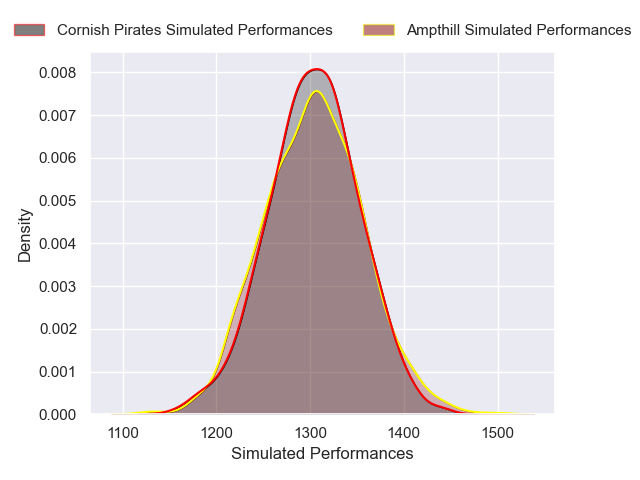
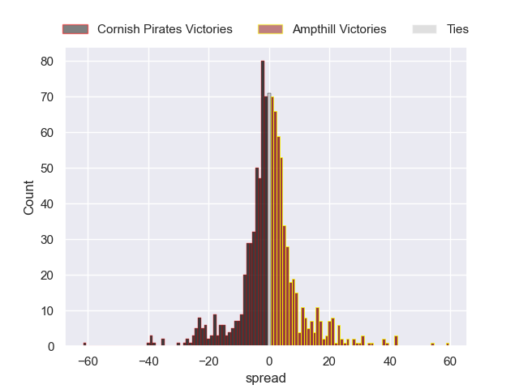
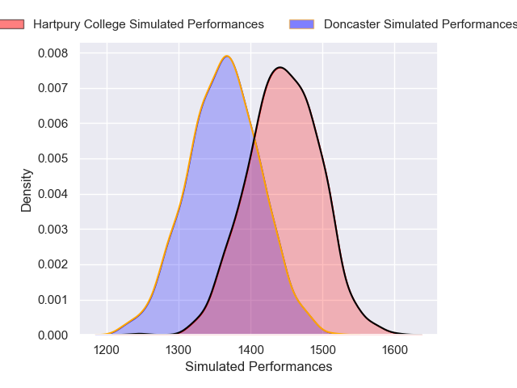
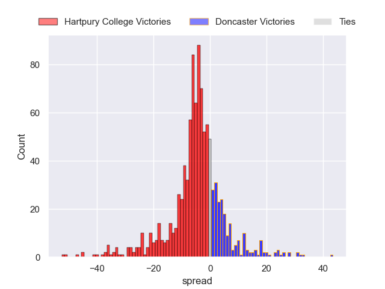

---  
title: "RFU Championship 2024 Status"  
date: 2024-12-23 6:00:00 -0500  
categories: model review projection  
layout: article  
aside:  
    toc: true  
---
# Current Team Rankings

# Standings

## Current Standings

| Club                |   Played |   Wins |   Point Differential |   Losing Bonus Points |   Try Bonus Points |   Competition Points |
|:--------------------|---------:|-------:|---------------------:|----------------------:|-------------------:|---------------------:|
| Ealing Trailfinders |        9 |      8 |                  286 |                     1 |                  8 |                   41 |
| Coventry            |        9 |      7 |                   62 |                     0 |                  5 |                   33 |
| Bedford             |        9 |      6 |                   -1 |                     0 |                  4 |                   28 |
| Hartpury College    |        8 |      5 |                   41 |                     2 |                  5 |                   27 |
| Nottingham          |        9 |      5 |                   69 |                     2 |                  4 |                   26 |
| Cornish Pirates     |        9 |      5 |                   37 |                     3 |                  3 |                   26 |
| Chinnor             |        9 |      4 |                   28 |                     3 |                  3 |                   22 |
| Doncaster           |        9 |      4 |                   18 |                     2 |                  3 |                   21 |
| Ampthill            |        8 |      3 |                 -125 |                     2 |                  3 |                   17 |
| London Scottish     |        9 |      2 |                  -86 |                     3 |                  3 |                   14 |
| Cambridge           |        9 |      3 |                 -221 |                     0 |                  2 |                   14 |
| Caldy               |        9 |      1 |                 -108 |                     2 |                  1 |                    7 |

## Projected Remaining Table

| Club                |   Matches Remaining |   Wins |   Point Differential |   Losing Bonus Points |   Try Bonus Points |   Competition Points |
|:--------------------|--------------------:|-------:|---------------------:|----------------------:|-------------------:|---------------------:|
| Ealing Trailfinders |                  13 |   11.7 |             211.558  |                   0.7 |                8.9 |                 56.5 |
| Hartpury College    |                  13 |    9.8 |              90.8294 |                   1.9 |                7.3 |                 48.5 |
| Chinnor             |                  13 |    9.2 |              96.3349 |                   1.9 |                6.9 |                 45.7 |
| Coventry            |                  13 |    8.4 |              72.0827 |                   2.3 |                7.4 |                 43.4 |
| Bedford             |                  13 |    8.6 |              56.1911 |                   2.1 |                6.9 |                 43.4 |
| Nottingham          |                  13 |    7.3 |              29.7797 |                   2.7 |                6.3 |                 38.4 |
| Cornish Pirates     |                  13 |    5.6 |             -26.8962 |                   2.9 |                5.3 |                 30.8 |
| Doncaster           |                  13 |    4.8 |             -44.0416 |                   3.8 |                4.4 |                 27.6 |
| Ampthill            |                  13 |    4.4 |             -68.3151 |                   3   |                4.3 |                 24.9 |
| London Scottish     |                  13 |    4.1 |             -71.7804 |                   2.7 |                4.5 |                 23.7 |
| Caldy               |                  13 |    2.2 |            -153.044  |                   2.7 |                2.5 |                 14   |
| Cambridge           |                  13 |    1.7 |            -192.698  |                   2   |                2.9 |                 11.6 |

## Projected Total Table

| Club                |   Total Matches |   Wins |   Point Differential |   Losing Bonus Points |   Try Bonus Points |   Competition Points |
|:--------------------|----------------:|-------:|---------------------:|----------------------:|-------------------:|---------------------:|
| Ealing Trailfinders |              22 |   19.7 |             497.558  |                   1.7 |               16.9 |                 97.5 |
| Coventry            |              22 |   15.4 |             134.083  |                   2.3 |               12.4 |                 76.4 |
| Hartpury College    |              21 |   14.8 |             131.829  |                   3.9 |               12.3 |                 75.5 |
| Bedford             |              22 |   14.6 |              55.1911 |                   2.1 |               10.9 |                 71.4 |
| Chinnor             |              22 |   13.2 |             124.335  |                   4.9 |                9.9 |                 67.7 |
| Nottingham          |              22 |   12.3 |              98.7797 |                   4.7 |               10.3 |                 64.4 |
| Cornish Pirates     |              22 |   10.6 |              10.1038 |                   5.9 |                8.3 |                 56.8 |
| Doncaster           |              22 |    8.8 |             -26.0416 |                   5.8 |                7.4 |                 48.6 |
| Ampthill            |              21 |    7.4 |            -193.315  |                   5   |                7.3 |                 41.9 |
| London Scottish     |              22 |    6.1 |            -157.78   |                   5.7 |                7.5 |                 37.7 |
| Cambridge           |              22 |    4.7 |            -413.698  |                   2   |                4.9 |                 25.6 |
| Caldy               |              22 |    3.2 |            -261.044  |                   4.7 |                3.5 |                 21   |

# Completed Match Review

| Model | Percent Correct Predictions | Spread Error |
| ------ | ------ | ------ |
| Club Level | 66.0% | 13.9 |
| Player Level: Lineup | 69.8% | 14.7 |
| Player Level: Minutes | 69.8% | 14.4 |

# Future Predictions

## Week 10

### London Scottish V Chinnor on 2024/12/28

Average Margin: Chinnor by 9.6

Average Scoreline: 30-21

### Bedford V Cambridge on 2024/12/28

Average Margin: Bedford by 19.5

Average Scoreline: 32-13

### Nottingham V Coventry on 2024/12/28

Average Margin: Nottingham by 0.6

Average Scoreline: 29-29

### Ealing Trailfinders V Caldy on 2024/12/28

Average Margin: Ealing Trailfinders by 29.1

Average Scoreline: 40-10

### Ampthill V Cornish Pirates on 2024/12/29

Average Margin: Ampthill by 0.2

Average Scoreline: 29-29

### Doncaster V Hartpury College on 2024/12/29

Average Margin: Hartpury College by 4.7

Average Scoreline: 38-34

## Week 11

### Coventry V Doncaster on 2025/01/18

Average Margin: Coventry by 10.9

Average Scoreline: 38-27

### Hartpury College V Cornish Pirates on 2025/01/18

Average Margin: Hartpury College by 11.8

Average Scoreline: 38-27

### Bedford V Ampthill on 2025/01/18

Average Margin: Bedford by 12.0

Average Scoreline: 38-26

### Caldy V Nottingham on 2025/01/18

Average Margin: Nottingham by 9.5

Average Scoreline: 41-31

### Cambridge V London Scottish on 2025/01/18

Average Margin: London Scottish by 4.7

Average Scoreline: 34-30

### Chinnor V Ealing Trailfinders on 2025/01/18

Average Margin: Ealing Trailfinders by 5.1

Average Scoreline: 36-31

## Week 12

### Chinnor V Ampthill on 2025/01/25

Average Margin: Chinnor by 15.8

Average Scoreline: 31-15

### Ealing Trailfinders V Cornish Pirates on 2025/01/25

Average Margin: Ealing Trailfinders by 20.3

Average Scoreline: 37-17

### Bedford V Coventry on 2025/01/25

Average Margin: Bedford by 0.6

Average Scoreline: 31-30

### Cambridge V Caldy on 2025/01/25

Average Margin: Caldy by 0.4

Average Scoreline: 30-29

### Nottingham V Doncaster on 2025/01/25

Average Margin: Nottingham by 8.2

Average Scoreline: 31-23

### London Scottish V Hartpury College on 2025/01/25

Average Margin: Hartpury College by 8.0

Average Scoreline: 42-34

## Week 13

### Caldy V Chinnor on 2025/03/22

Average Margin: Chinnor by 13.7

Average Scoreline: 34-20

### Coventry V Cambridge on 2025/03/22

Average Margin: Coventry by 22.6

Average Scoreline: 33-11

### Hartpury College V Bedford on 2025/03/22

Average Margin: Hartpury College by 8.1

Average Scoreline: 33-25

### Doncaster V Ealing Trailfinders on 2025/03/22

Average Margin: Ealing Trailfinders by 13.8

Average Scoreline: 37-23

### Ampthill V Nottingham on 2025/03/22

Average Margin: Nottingham by 3.6

Average Scoreline: 36-33

### Cornish Pirates V London Scottish on 2025/03/22

Average Margin: Cornish Pirates by 8.1

Average Scoreline: 30-22

## Week 14

### Caldy V Ampthill on 2025/03/29

Average Margin: Ampthill by 1.2

Average Scoreline: 31-30

### Bedford V Cornish Pirates on 2025/03/29

Average Margin: Bedford by 7.7

Average Scoreline: 31-24

### Ealing Trailfinders V Nottingham on 2025/03/29

Average Margin: Ealing Trailfinders by 17.3

Average Scoreline: 35-18

### London Scottish V Doncaster on 2025/03/29

Average Margin: London Scottish by 0.4

Average Scoreline: 31-31

### Chinnor V Coventry on 2025/03/29

Average Margin: Chinnor by 6.7

Average Scoreline: 33-26

### Cambridge V Hartpury College on 2025/03/29

Average Margin: Hartpury College by 16.8

Average Scoreline: 38-21

## Week 15

### Nottingham V London Scottish on 2025/04/05

Average Margin: Nottingham by 11.4

Average Scoreline: 33-22

### Cornish Pirates V Cambridge on 2025/04/05

Average Margin: Cornish Pirates by 15.3

Average Scoreline: 35-20

### Coventry V Caldy on 2025/04/05

Average Margin: Coventry by 17.4

Average Scoreline: 32-14

### Hartpury College V Chinnor on 2025/04/05

Average Margin: Hartpury College by 2.2

Average Scoreline: 25-23

### Doncaster V Bedford on 2025/04/05

Average Margin: Bedford by 1.3

Average Scoreline: 31-29

### Ampthill V Ealing Trailfinders on 2025/04/05

Average Margin: Ealing Trailfinders by 16.0

Average Scoreline: 33-17

## Week 16

### Cambridge V Doncaster on 2025/04/12

Average Margin: Doncaster by 8.8

Average Scoreline: 35-26

### Bedford V Nottingham on 2025/04/12

Average Margin: Bedford by 3.9

Average Scoreline: 28-24

### Chinnor V Cornish Pirates on 2025/04/12

Average Margin: Chinnor by 12.8

Average Scoreline: 39-26

### Caldy V Hartpury College on 2025/04/12

Average Margin: Hartpury College by 12.0

Average Scoreline: 35-23

### Coventry V Ampthill on 2025/04/12

Average Margin: Coventry by 13.4

Average Scoreline: 34-21

### London Scottish V Ealing Trailfinders on 2025/04/12

Average Margin: Ealing Trailfinders by 16.1

Average Scoreline: 36-20

## Week 17

### Ealing Trailfinders V Bedford on 2025/04/19

Average Margin: Ealing Trailfinders by 16.7

Average Scoreline: 35-18

### Hartpury College V Coventry on 2025/04/19

Average Margin: Hartpury College by 4.2

Average Scoreline: 27-23

### Ampthill V London Scottish on 2025/04/19

Average Margin: Ampthill by 4.1

Average Scoreline: 29-25

### Nottingham V Cambridge on 2025/04/19

Average Margin: Nottingham by 19.1

Average Scoreline: 28-9

### Doncaster V Chinnor on 2025/04/19

Average Margin: Chinnor by 5.8

Average Scoreline: 29-23

### Cornish Pirates V Caldy on 2025/04/19

Average Margin: Cornish Pirates by 12.1

Average Scoreline: 35-23

## Week 18

### Caldy V Doncaster on 2025/05/03

Average Margin: Doncaster by 4.3

Average Scoreline: 37-33

### Chinnor V Nottingham on 2025/05/03

Average Margin: Chinnor by 9.6

Average Scoreline: 33-23

### Hartpury College V Ampthill on 2025/05/03

Average Margin: Hartpury College by 14.4

Average Scoreline: 37-22

### Cambridge V Ealing Trailfinders on 2025/05/03

Average Margin: Ealing Trailfinders by 24.3

Average Scoreline: 38-14

### Coventry V Cornish Pirates on 2025/05/03

Average Margin: Coventry by 10.3

Average Scoreline: 37-27

### Bedford V London Scottish on 2025/05/03

Average Margin: Bedford by 11.7

Average Scoreline: 36-25

## Week 19

### Nottingham V Caldy on 2025/05/10

Average Margin: Nottingham by 15.4

Average Scoreline: 27-11

### Doncaster V Coventry on 2025/05/10

Average Margin: Coventry by 3.5

Average Scoreline: 30-27

### Ampthill V Bedford on 2025/05/10

Average Margin: Bedford by 3.7

Average Scoreline: 34-30

### London Scottish V Cambridge on 2025/05/10

Average Margin: London Scottish by 12.4

Average Scoreline: 29-17

### Ealing Trailfinders V Chinnor on 2025/05/10

Average Margin: Ealing Trailfinders by 11.3

Average Scoreline: 25-14

### Cornish Pirates V Hartpury College on 2025/05/10

Average Margin: Hartpury College by 3.8

Average Scoreline: 31-27

## Week 20

### Hartpury College V Doncaster on 2025/05/17

Average Margin: Hartpury College by 11.2

Average Scoreline: 38-27

### Caldy V Ealing Trailfinders on 2025/05/17

Average Margin: Ealing Trailfinders by 21.0

Average Scoreline: 33-12

### Cornish Pirates V Ampthill on 2025/05/17

Average Margin: Cornish Pirates by 7.4

Average Scoreline: 30-22

### Coventry V Nottingham on 2025/05/17

Average Margin: Coventry by 6.9

Average Scoreline: 31-24

### Cambridge V Bedford on 2025/05/17

Average Margin: Bedford by 12.9

Average Scoreline: 42-29

### Chinnor V London Scottish on 2025/05/17

Average Margin: Chinnor by 15.7

Average Scoreline: 39-23

## Week 21

### Doncaster V Cornish Pirates on 2025/05/24

Average Margin: Doncaster by 3.2

Average Scoreline: 28-25

### London Scottish V Caldy on 2025/05/24

Average Margin: London Scottish by 8.7

Average Scoreline: 31-23

### Ampthill V Cambridge on 2025/05/24

Average Margin: Ampthill by 12.0

Average Scoreline: 31-19

### Nottingham V Hartpury College on 2025/05/24

Average Margin: Hartpury College by 0.2

Average Scoreline: 23-23

### Bedford V Chinnor on 2025/05/24

Average Margin: Chinnor by 1.4

Average Scoreline: 29-28

### Ealing Trailfinders V Coventry on 2025/05/24

Average Margin: Ealing Trailfinders by 14.1

Average Scoreline: 35-20

## Week 22

### Coventry V London Scottish on 2025/05/31

Average Margin: Coventry by 13.4

Average Scoreline: 40-27

### Hartpury College V Ealing Trailfinders on 2025/05/31

Average Margin: Ealing Trailfinders by 6.5

Average Scoreline: 30-24

### Cornish Pirates V Nottingham on 2025/05/31

Average Margin: Cornish Pirates by 0.3

Average Scoreline: 27-26

### Ampthill V Doncaster on 2025/05/31

Average Margin: Ampthill by 0.5

Average Scoreline: 29-28

### Caldy V Bedford on 2025/05/31

Average Margin: Bedford by 9.1

Average Scoreline: 33-23

### Chinnor V Cambridge on 2025/05/31

Average Margin: Chinnor by 23.9

Average Scoreline: 38-14

