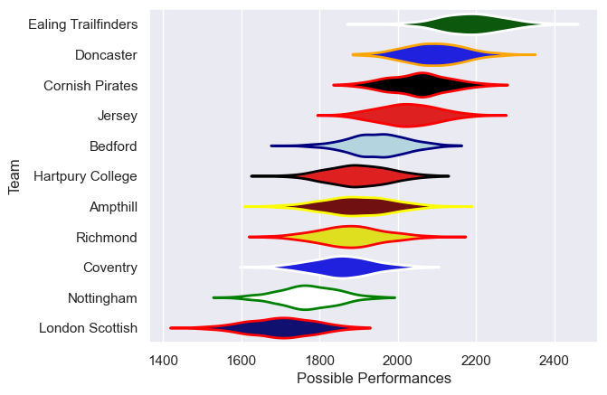

---  
title: "RFU Championship 21/22"  
date: 2025-07-29 6:00:00 -0500  
categories: model review projection  
layout: article  
aside:  
    toc: true  
---
# Current Team Rankings

# Standings

## Current Standings

| Club                |   Played |   Wins |   Point Differential |   Losing Bonus Points | Try Bonus Points   |   Competition Points |
|:--------------------|---------:|-------:|---------------------:|----------------------:|:-------------------|---------------------:|
| Doncaster           |       20 |     17 |                  202 |                     0 |                    |                   68 |
| Ealing Trailfinders |       20 |     16 |                  554 |                     1 |                    |                   65 |
| Cornish Pirates     |       20 |     14 |                  156 |                     1 |                    |                   61 |
| Jersey              |       20 |     13 |                  160 |                     3 |                    |                   57 |
| Bedford             |       20 |      9 |                   33 |                     4 |                    |                   40 |
| Ampthill            |       20 |      8 |                  -91 |                     4 |                    |                   40 |
| Coventry            |       20 |      9 |                 -114 |                     2 |                    |                   38 |
| Hartpury College    |       20 |      7 |                    9 |                     6 |                    |                   36 |
| Richmond            |       20 |      7 |                 -106 |                     5 |                    |                   35 |
| Nottingham          |       20 |      5 |                 -283 |                     4 |                    |                   24 |
| London Scottish     |       20 |      1 |                 -520 |                     2 |                    |                    8 |

# Completed Match Review

| Model | Percent Correct Predictions | Spread Error |
| ------ | ------ | ------ |
| Club Level | 70.0% | 14.0 |
| Player Level: Lineup | nan% | nan |
| Player Level: Minutes | nan% | nan |

