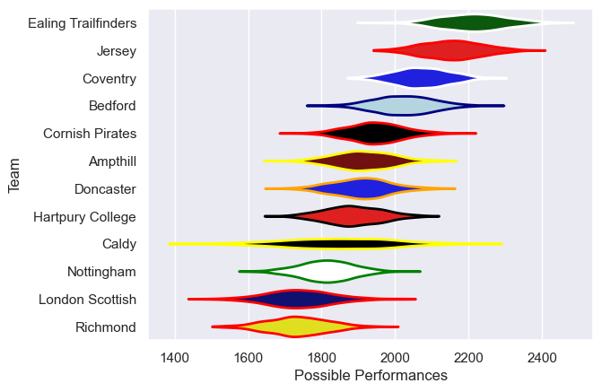

---  
title: "RFU Championship 22/23 Status"  
date: 2025-07-28 6:00:00 -0500  
categories: model review projection  
layout: article  
aside:  
    toc: true  
---
# Current Team Rankings

# Standings

## Current Standings

| Club                |   Played |   Wins |   Point Differential |   Losing Bonus Points |   Try Bonus Points |   Competition Points |
|:--------------------|---------:|-------:|---------------------:|----------------------:|-------------------:|---------------------:|
| Jersey              |       22 |     20 |                  411 |                     0 |                 18 |                  100 |
| Ealing Trailfinders |       22 |     19 |                  553 |                     3 |                 19 |                   98 |
| Coventry            |       22 |     17 |                  210 |                     1 |                 17 |                   88 |
| Bedford             |       22 |     12 |                   78 |                     3 |                 16 |                   67 |
| Cornish Pirates     |       22 |     13 |                   -6 |                     2 |                  7 |                   61 |
| Doncaster           |       22 |     10 |                  -18 |                     3 |                  9 |                   52 |
| Hartpury College    |       22 |     10 |                  -64 |                     3 |                  7 |                   50 |
| Ampthill            |       22 |      8 |                 -114 |                     3 |                 10 |                   47 |
| Nottingham          |       22 |      7 |                 -107 |                     3 |                 12 |                   43 |
| Caldy               |       22 |      7 |                 -267 |                     3 |                  8 |                   39 |
| London Scottish     |       22 |      4 |                 -287 |                     5 |                  5 |                   26 |
| Richmond            |       22 |      3 |                 -389 |                     4 |                  5 |                   23 |

# Completed Match Review

| Model | Percent Correct Predictions | Spread Error |
| ------ | ------ | ------ |
| Club Level | 73.5% | 15.1 |
| Player Level: Lineup | nan% | nan |
| Player Level: Minutes | nan% | nan |

