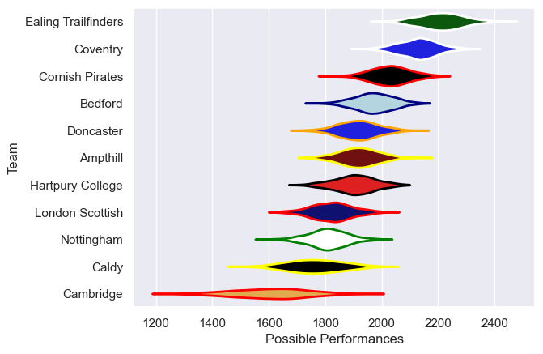

---  
title: "RFU Championship 23/24 Status"  
date: 2025-07-28 6:00:00 -0500  
categories: model review projection  
layout: article  
aside:  
    toc: true  
---
# Current Team Rankings

# Standings

## Current Standings

| Club                |   Played |   Wins |   Point Differential |   Losing Bonus Points |   Try Bonus Points |   Competition Points |
|:--------------------|---------:|-------:|---------------------:|----------------------:|-------------------:|---------------------:|
| Ealing Trailfinders |       20 |     16 |                  406 |                     2 |                 16 |                   82 |
| Cornish Pirates     |       20 |     15 |                  178 |                     1 |                 12 |                   75 |
| Coventry            |       20 |     14 |                  270 |                     2 |                 15 |                   73 |
| Bedford             |       20 |     12 |                   27 |                     4 |                 13 |                   65 |
| Hartpury College    |       20 |     11 |                   81 |                     4 |                 11 |                   59 |
| Doncaster           |       20 |     11 |                  -20 |                     2 |                  9 |                   57 |
| Ampthill            |       20 |     10 |                  -34 |                     2 |                 14 |                   56 |
| Nottingham          |       20 |      8 |                 -123 |                     2 |                 13 |                   47 |
| London Scottish     |       20 |      4 |                 -106 |                     7 |                 10 |                   35 |
| Caldy               |       20 |      5 |                 -260 |                     1 |                  8 |                   31 |
| Cambridge           |       20 |      2 |                 -419 |                     5 |                  7 |                   20 |

# Completed Match Review

| Model | Percent Correct Predictions | Spread Error |
| ------ | ------ | ------ |
| Club Level | 67.3% | 13.1 |
| Player Level: Lineup | nan% | nan |
| Player Level: Minutes | nan% | nan |

