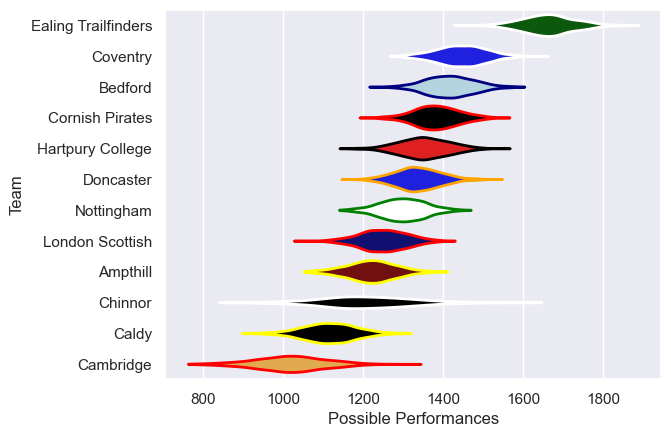

---  
title: "RFU Championship 24/25 Status"  
date: 2025-02-14 6:00:00 -0500  
categories: model review projection  
layout: article  
aside:  
    toc: true  
---
# Current Team Rankings

# Standings

## Current Standings

| Club                |   Played |   Wins |   Point Differential |   Losing Bonus Points |   Try Bonus Points |   Competition Points |
|:--------------------|---------:|-------:|---------------------:|----------------------:|-------------------:|---------------------:|
| Ealing Trailfinders |       12 |     11 |                  390 |                     1 |                 11 |                   56 |
| Bedford             |       12 |      9 |                   67 |                     0 |                  7 |                   43 |
| Coventry            |       12 |      8 |                   44 |                     1 |                  6 |                   39 |
| Nottingham          |       12 |      7 |                  104 |                     3 |                  6 |                   37 |
| Hartpury College    |       11 |      6 |                   24 |                     2 |                  6 |                   32 |
| Cornish Pirates     |       12 |      6 |                  -26 |                     3 |                  5 |                   32 |
| London Scottish     |       12 |      5 |                  -28 |                     3 |                  5 |                   28 |
| Doncaster           |       12 |      5 |                    8 |                     3 |                  4 |                   27 |
| Chinnor             |       12 |      4 |                  -16 |                     3 |                  3 |                   22 |
| Ampthill            |       11 |      4 |                 -149 |                     2 |                  4 |                   22 |
| Caldy               |       12 |      3 |                 -118 |                     2 |                  4 |                   18 |
| Cambridge           |       12 |      3 |                 -300 |                     0 |                  4 |                   16 |

## Projected Remaining Table

| Club                |   Matches Remaining |   Wins |   Point Differential |   Losing Bonus Points |   Try Bonus Points |   Competition Points |
|:--------------------|--------------------:|-------:|---------------------:|----------------------:|-------------------:|---------------------:|
| Ealing Trailfinders |                  10 |    9.3 |             190.288  |                   0.3 |                7.8 |                 45.2 |
| Coventry            |                  10 |    7.7 |             100.542  |                   1   |                5.4 |                 37.2 |
| Bedford             |                  10 |    7.1 |              56.011  |                   1.3 |                5.6 |                 35.2 |
| Cornish Pirates     |                  10 |    6.6 |              59.1342 |                   1.8 |                4.6 |                 32.9 |
| Hartpury College    |                  10 |    6.1 |              37.5658 |                   2.1 |                4.1 |                 30.7 |
| Doncaster           |                  10 |    5.4 |               9.7951 |                   2.4 |                3.6 |                 27.5 |
| Nottingham          |                  10 |    4.8 |             -10.8701 |                   2   |                4.8 |                 25.9 |
| London Scottish     |                  10 |    3.6 |             -38.0268 |                   2.3 |                3.6 |                 20.4 |
| Ampthill            |                  10 |    3.7 |             -45.6268 |                   2.2 |                3.4 |                 20.2 |
| Chinnor             |                  10 |    3.3 |             -61.3566 |                   2.2 |                3.2 |                 18.7 |
| Caldy               |                  10 |    1.7 |            -115.116  |                   2.2 |                2.7 |                 11.5 |
| Cambridge           |                  10 |    0.8 |            -182.34   |                   1.1 |                2.3 |                  6.5 |

## Projected Total Table

| Club                |   Total Matches |   Wins |   Point Differential |   Losing Bonus Points |   Try Bonus Points |   Competition Points |
|:--------------------|----------------:|-------:|---------------------:|----------------------:|-------------------:|---------------------:|
| Ealing Trailfinders |              22 |   20.3 |             580.288  |                   1.3 |               18.8 |                101.2 |
| Bedford             |              22 |   16.1 |             123.011  |                   1.3 |               12.6 |                 78.2 |
| Coventry            |              22 |   15.7 |             144.542  |                   2   |               11.4 |                 76.2 |
| Cornish Pirates     |              22 |   12.6 |              33.1342 |                   4.8 |                9.6 |                 64.9 |
| Nottingham          |              22 |   11.8 |              93.1299 |                   5   |               10.8 |                 62.9 |
| Hartpury College    |              21 |   12.1 |              61.5658 |                   4.1 |               10.1 |                 62.7 |
| Doncaster           |              22 |   10.4 |              17.7951 |                   5.4 |                7.6 |                 54.5 |
| London Scottish     |              22 |    8.6 |             -66.0268 |                   5.3 |                8.6 |                 48.4 |
| Ampthill            |              21 |    7.7 |            -194.627  |                   4.2 |                7.4 |                 42.2 |
| Chinnor             |              22 |    7.3 |             -77.3566 |                   5.2 |                6.2 |                 40.7 |
| Caldy               |              22 |    4.7 |            -233.116  |                   4.2 |                6.7 |                 29.5 |
| Cambridge           |              22 |    3.8 |            -482.34   |                   1.1 |                6.3 |                 22.5 |

# Completed Match Review

| Model | Percent Correct Predictions | Spread Error |
| ------ | ------ | ------ |
| Club Level | 66.2% | 14.5 |
| Player Level: Lineup | 66.7% | 15.5 |
| Player Level: Minutes | 62.2% | 15.6 |

# Future Predictions

## Week 13

### Doncaster V Ealing Trailfinders on 2025/03/22

Average Margin: Ealing Trailfinders by 14.1

Average Scoreline: 40-26

### Ampthill V Nottingham on 2025/03/22

Average Margin: Nottingham by 0.4

Average Scoreline: 32-32

### Coventry V Cambridge on 2025/03/22

Average Margin: Coventry by 27.8

Average Scoreline: 40-13

### Hartpury College V Bedford on 2025/03/22

Average Margin: Hartpury College by 1.9

Average Scoreline: 30-28

### Cornish Pirates V London Scottish on 2025/03/22

Average Margin: Cornish Pirates by 9.8

Average Scoreline: 28-18

### Caldy V Chinnor on 2025/03/22

Average Margin: Chinnor by 1.5

Average Scoreline: 35-33

## Week 14

### Ealing Trailfinders V Nottingham on 2025/03/29

Average Margin: Ealing Trailfinders by 22.5

Average Scoreline: 35-12

### London Scottish V Doncaster on 2025/03/29

Average Margin: Doncaster by 0.0

Average Scoreline: 27-27

### Caldy V Ampthill on 2025/03/29

Average Margin: Ampthill by 2.1

Average Scoreline: 31-29

### Cambridge V Hartpury College on 2025/03/29

Average Margin: Hartpury College by 14.8

Average Scoreline: 37-22

### Chinnor V Coventry on 2025/03/29

Average Margin: Coventry by 10.7

Average Scoreline: 33-22

### Bedford V Cornish Pirates on 2025/03/29

Average Margin: Bedford by 5.7

Average Scoreline: 28-23

## Week 15

### Cornish Pirates V Cambridge on 2025/04/05

Average Margin: Cornish Pirates by 21.4

Average Scoreline: 34-12

### Ampthill V Ealing Trailfinders on 2025/04/05

Average Margin: Ealing Trailfinders by 17.9

Average Scoreline: 40-22

### Doncaster V Bedford on 2025/04/05

Average Margin: Bedford by 0.7

Average Scoreline: 30-30

### Nottingham V London Scottish on 2025/04/05

Average Margin: Nottingham by 6.7

Average Scoreline: 28-21

### Coventry V Caldy on 2025/04/05

Average Margin: Coventry by 21.0

Average Scoreline: 40-19

### Hartpury College V Chinnor on 2025/04/05

Average Margin: Hartpury College by 11.7

Average Scoreline: 29-17

## Week 16

### London Scottish V Ealing Trailfinders on 2025/04/12

Average Margin: Ealing Trailfinders by 17.3

Average Scoreline: 40-22

### Caldy V Hartpury College on 2025/04/12

Average Margin: Hartpury College by 9.6

Average Scoreline: 35-25

### Chinnor V Cornish Pirates on 2025/04/12

Average Margin: Cornish Pirates by 5.2

Average Scoreline: 27-22

### Bedford V Nottingham on 2025/04/12

Average Margin: Bedford by 9.0

Average Scoreline: 34-25

### Cambridge V Doncaster on 2025/04/12

Average Margin: Doncaster by 13.0

Average Scoreline: 35-22

### Coventry V Ampthill on 2025/04/12

Average Margin: Coventry by 15.5

Average Scoreline: 31-15

## Week 17

### Ampthill V London Scottish on 2025/04/19

Average Margin: Ampthill by 2.6

Average Scoreline: 30-27

### Nottingham V Cambridge on 2025/04/19

Average Margin: Nottingham by 17.7

Average Scoreline: 33-15

### Hartpury College V Coventry on 2025/04/19

Average Margin: Coventry by 1.6

Average Scoreline: 33-32

### Ealing Trailfinders V Bedford on 2025/04/19

Average Margin: Ealing Trailfinders by 15.8

Average Scoreline: 35-20

### Cornish Pirates V Caldy on 2025/04/19

Average Margin: Cornish Pirates by 16.1

Average Scoreline: 42-26

### Doncaster V Chinnor on 2025/04/19

Average Margin: Doncaster by 10.0

Average Scoreline: 29-19

## Week 18

### Coventry V Cornish Pirates on 2025/05/03

Average Margin: Coventry by 8.4

Average Scoreline: 29-21

### Cambridge V Ealing Trailfinders on 2025/05/03

Average Margin: Ealing Trailfinders by 29.3

Average Scoreline: 48-19

### Hartpury College V Ampthill on 2025/05/03

Average Margin: Hartpury College by 11.5

Average Scoreline: 36-24

### Chinnor V Nottingham on 2025/05/03

Average Margin: Nottingham by 1.4

Average Scoreline: 28-26

### Caldy V Doncaster on 2025/05/03

Average Margin: Doncaster by 7.3

Average Scoreline: 32-24

### Bedford V London Scottish on 2025/05/03

Average Margin: Bedford by 11.8

Average Scoreline: 33-21

## Week 19

### Cornish Pirates V Hartpury College on 2025/05/10

Average Margin: Cornish Pirates by 4.0

Average Scoreline: 28-24

### Ampthill V Bedford on 2025/05/10

Average Margin: Bedford by 6.0

Average Scoreline: 38-32

### Ealing Trailfinders V Chinnor on 2025/05/10

Average Margin: Ealing Trailfinders by 24.8

Average Scoreline: 37-12

### Nottingham V Caldy on 2025/05/10

Average Margin: Nottingham by 12.3

Average Scoreline: 33-20

### London Scottish V Cambridge on 2025/05/10

Average Margin: London Scottish by 15.6

Average Scoreline: 34-18

### Doncaster V Coventry on 2025/05/10

Average Margin: Coventry by 3.7

Average Scoreline: 34-30

## Week 20

### Cornish Pirates V Ampthill on 2025/05/17

Average Margin: Cornish Pirates by 11.0

Average Scoreline: 35-24

### Caldy V Ealing Trailfinders on 2025/05/17

Average Margin: Ealing Trailfinders by 23.5

Average Scoreline: 47-23

### Hartpury College V Doncaster on 2025/05/17

Average Margin: Hartpury College by 5.7

Average Scoreline: 28-22

### Cambridge V Bedford on 2025/05/17

Average Margin: Bedford by 15.8

Average Scoreline: 41-26

### Coventry V Nottingham on 2025/05/17

Average Margin: Coventry by 11.2

Average Scoreline: 35-24

### Chinnor V London Scottish on 2025/05/17

Average Margin: Chinnor by 1.5

Average Scoreline: 24-23

## Week 21

### Nottingham V Hartpury College on 2025/05/24

Average Margin: Nottingham by 0.6

Average Scoreline: 24-23

### London Scottish V Caldy on 2025/05/24

Average Margin: London Scottish by 10.4

Average Scoreline: 36-25

### Ampthill V Cambridge on 2025/05/24

Average Margin: Ampthill by 14.0

Average Scoreline: 38-24

### Ealing Trailfinders V Coventry on 2025/05/24

Average Margin: Ealing Trailfinders by 13.7

Average Scoreline: 34-20

### Bedford V Chinnor on 2025/05/24

Average Margin: Bedford by 13.5

Average Scoreline: 32-18

### Doncaster V Cornish Pirates on 2025/05/24

Average Margin: Doncaster by 1.5

Average Scoreline: 28-26

## Week 22

### Hartpury College V Ealing Trailfinders on 2025/05/31

Average Margin: Ealing Trailfinders by 11.5

Average Scoreline: 41-30

### Caldy V Bedford on 2025/05/31

Average Margin: Bedford by 11.4

Average Scoreline: 42-30

### Ampthill V Doncaster on 2025/05/31

Average Margin: Doncaster by 2.1

Average Scoreline: 32-30

### Cornish Pirates V Nottingham on 2025/05/31

Average Margin: Cornish Pirates by 7.3

Average Scoreline: 32-25

### Chinnor V Cambridge on 2025/05/31

Average Margin: Chinnor by 12.9

Average Scoreline: 35-22

### Coventry V London Scottish on 2025/05/31

Average Margin: Coventry by 14.3

Average Scoreline: 32-17

