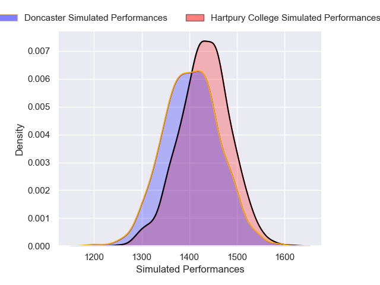
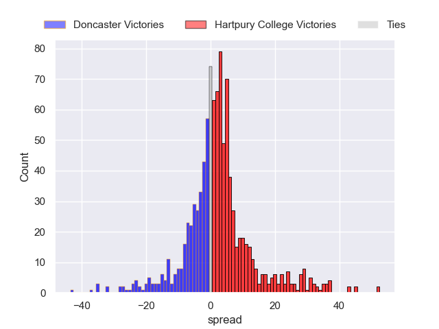

---  
title: "RFU Championship 24/25 Status"  
date: 2025-05-12 6:00:00 -0500  
categories: model review projection  
layout: article  
aside:  
    toc: true  
---
# Current Team Rankings

# Standings

## Current Standings

| Club                |   Played |   Wins |   Point Differential |   Losing Bonus Points |   Try Bonus Points |   Competition Points |
|:--------------------|---------:|-------:|---------------------:|----------------------:|-------------------:|---------------------:|
| Ealing Trailfinders |       19 |     16 |                  618 |                     3 |                nan |                   83 |
| Bedford             |       19 |     14 |                  176 |                     1 |                nan |                   70 |
| Cornish Pirates     |       20 |     13 |                   22 |                     3 |                nan |                   65 |
| Hartpury College    |       20 |     12 |                   89 |                     2 |                nan |                   64 |
| Doncaster           |       19 |     12 |                  147 |                     3 |                nan |                   60 |
| Coventry            |       19 |     11 |                   47 |                     4 |                nan |                   59 |
| Nottingham          |       19 |      8 |                  -42 |                     5 |                nan |                   47 |
| Ampthill            |       19 |      8 |                 -176 |                     4 |                nan |                   45 |
| London Scottish     |       19 |      7 |                 -102 |                     3 |                nan |                   40 |
| Chinnor             |       19 |      6 |                  -66 |                     4 |                nan |                   36 |
| Caldy               |       19 |      4 |                 -189 |                     5 |                nan |                   27 |
| Cambridge           |       19 |      3 |                 -524 |                     0 |                nan |                   18 |

## Projected Remaining Table

| Club                |   Matches Remaining |   Wins |   Point Differential |   Losing Bonus Points |   Try Bonus Points |   Competition Points |
|:--------------------|--------------------:|-------:|---------------------:|----------------------:|-------------------:|---------------------:|
| Bedford             |                   3 |    2.8 |             46.7175  |                   0.1 |                2.5 |                 13.7 |
| Ealing Trailfinders |                   3 |    2.7 |             53.1737  |                   0.1 |                2.5 |                 13.6 |
| Cornish Pirates     |                   3 |    2.1 |             18.0417  |                   0.5 |                1.6 |                 10.3 |
| Doncaster           |                   3 |    1.8 |              6.09129 |                   0.7 |                1.4 |                  9.5 |
| Chinnor             |                   3 |    1.8 |              9.13323 |                   0.4 |                1.5 |                  8.9 |
| Coventry            |                   3 |    1.9 |              5.93548 |                   0.2 |                1.3 |                  8.9 |
| Ampthill            |                   3 |    1.3 |              1.71983 |                   0.7 |                1.3 |                  7.1 |
| Hartpury College    |                   3 |    1.4 |             -6.76393 |                   0.6 |                0.9 |                  7.1 |
| London Scottish     |                   3 |    1.3 |             -7.71628 |                   0.6 |                1.2 |                  6.9 |
| Nottingham          |                   3 |    0.5 |            -25.1447  |                   0.8 |                1.1 |                  4.1 |
| Caldy               |                   3 |    0.3 |            -47.3438  |                   0.5 |                0.6 |                  2.1 |
| Cambridge           |                   3 |    0.2 |            -53.844   |                   0.3 |                0.8 |                  2.1 |

## Projected Total Table

| Club                |   Total Matches |   Wins |   Point Differential |   Losing Bonus Points |   Try Bonus Points |   Competition Points |
|:--------------------|----------------:|-------:|---------------------:|----------------------:|-------------------:|---------------------:|
| Ealing Trailfinders |              22 |   18.7 |             671.174  |                   3.1 |                2.5 |                 96.6 |
| Bedford             |              22 |   16.8 |             222.718  |                   1.1 |                2.5 |                 83.7 |
| Cornish Pirates     |              23 |   15.1 |              40.0417 |                   3.5 |                1.6 |                 75.3 |
| Hartpury College    |              23 |   13.4 |              82.2361 |                   2.6 |                0.9 |                 71.1 |
| Doncaster           |              22 |   13.8 |             153.091  |                   3.7 |                1.4 |                 69.5 |
| Coventry            |              22 |   12.9 |              52.9355 |                   4.2 |                1.3 |                 67.9 |
| Ampthill            |              22 |    9.3 |            -174.28   |                   4.7 |                1.3 |                 52.1 |
| Nottingham          |              22 |    8.5 |             -67.1447 |                   5.8 |                1.1 |                 51.1 |
| London Scottish     |              22 |    8.3 |            -109.716  |                   3.6 |                1.2 |                 46.9 |
| Chinnor             |              22 |    7.8 |             -56.8668 |                   4.4 |                1.5 |                 44.9 |
| Caldy               |              22 |    4.3 |            -236.344  |                   5.5 |                0.6 |                 29.1 |
| Cambridge           |              22 |    3.2 |            -577.844  |                   0.3 |                0.8 |                 20.1 |

# Completed Match Review

| Model | Percent Correct Predictions | Spread Error |
| ------ | ------ | ------ |
| Club Level | 71.9% | 14.3 |
| Player Level: Lineup | 72.1% | 14.5 |
| Player Level: Minutes | 70.6% | 15.0 |

# Future Predictions

## Week 21

### Caldy V Ealing Trailfinders on 2025/05/17

Average Margin: Ealing Trailfinders by 24.3

Average Scoreline: 43-19

### Coventry V Nottingham on 2025/05/17

Average Margin: Coventry by 11.2

Average Scoreline: 41-30

### Chinnor V London Scottish on 2025/05/17

Average Margin: Chinnor by 5.6

Average Scoreline: 28-22

### Cambridge V Bedford on 2025/05/17

Average Margin: Bedford by 19.8

Average Scoreline: 44-24

### Cornish Pirates V Ampthill on 2025/05/17

Average Margin: Cornish Pirates by 10.7

Average Scoreline: 34-23

### Hartpury College V Doncaster on 2025/05/18

Average Margin: Hartpury College by 2.4

Average Scoreline: 34-31

## Week 22

### Ampthill V Cambridge on 2025/05/24

Average Margin: Ampthill by 17.1

Average Scoreline: 41-23

### Ealing Trailfinders V Coventry on 2025/05/24

Average Margin: Ealing Trailfinders by 16.9

Average Scoreline: 47-30

### Doncaster V Cornish Pirates on 2025/05/24

Average Margin: Doncaster by 3.8

Average Scoreline: 34-30

### Bedford V Chinnor on 2025/05/24

Average Margin: Bedford by 13.5

Average Scoreline: 33-20

### London Scottish V Caldy on 2025/05/24

Average Margin: London Scottish by 9.5

Average Scoreline: 40-31

### Nottingham V Hartpury College on 2025/05/24

Average Margin: Hartpury College by 2.8

Average Scoreline: 42-39

## Week 23

### Ampthill V Doncaster on 2025/05/31

Average Margin: Doncaster by 4.7

Average Scoreline: 38-34

### Caldy V Bedford on 2025/05/31

Average Margin: Bedford by 13.5

Average Scoreline: 41-27

### Chinnor V Cambridge on 2025/05/31

Average Margin: Chinnor by 17.0

Average Scoreline: 41-24

### Cornish Pirates V Nottingham on 2025/05/31

Average Margin: Cornish Pirates by 11.1

Average Scoreline: 35-24

### Coventry V London Scottish on 2025/05/31

Average Margin: Coventry by 11.6

Average Scoreline: 39-27

### Hartpury College V Ealing Trailfinders on 2025/05/31

Average Margin: Ealing Trailfinders by 12.0

Average Scoreline: 42-30

