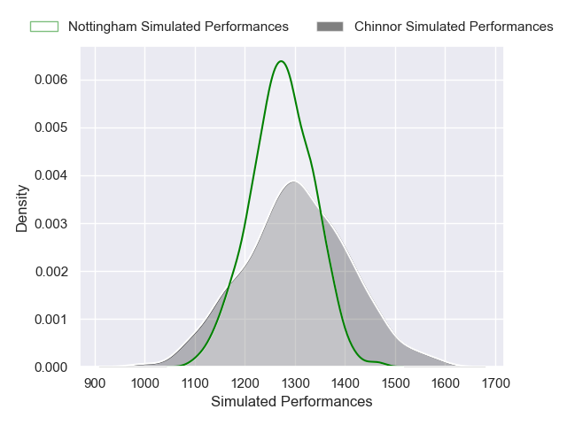
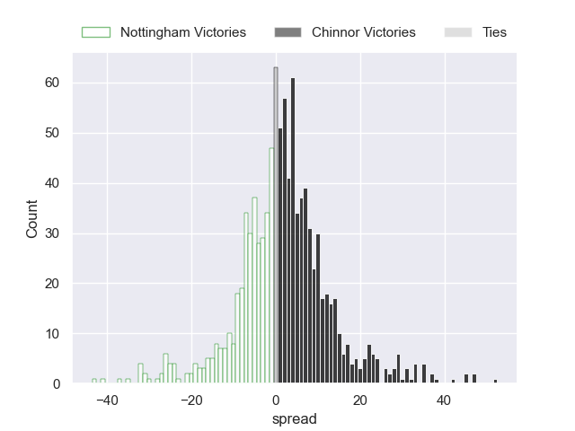

---  
title: "RFU Championship 24/25 Status"  
date: 2025-05-02 6:00:00 -0500  
categories: model review projection  
layout: article  
aside:  
    toc: true  
---
# Current Team Rankings

# Standings

## Current Standings

| Club                |   Played |   Wins |   Point Differential |   Losing Bonus Points |   Try Bonus Points |   Competition Points |
|:--------------------|---------:|-------:|---------------------:|----------------------:|-------------------:|---------------------:|
| Ealing Trailfinders |       17 |     14 |                  512 |                     3 |                 15 |                   74 |
| Bedford             |       17 |     12 |                  150 |                     1 |                 12 |                   61 |
| Hartpury College    |       17 |     11 |                   83 |                     2 |                 11 |                   59 |
| Coventry            |       17 |     11 |                   68 |                     3 |                 11 |                   58 |
| Cornish Pirates     |       17 |     10 |                   -3 |                     3 |                 10 |                   53 |
| Doncaster           |       17 |     10 |                  115 |                     3 |                  8 |                   51 |
| Nottingham          |       17 |      8 |                  -18 |                     4 |                  9 |                   45 |
| Ampthill            |       17 |      8 |                 -149 |                     3 |                  9 |                   44 |
| London Scottish     |       17 |      6 |                 -106 |                     3 |                  8 |                   35 |
| Chinnor             |       17 |      5 |                  -49 |                     4 |                  5 |                   31 |
| Caldy               |       17 |      3 |                 -176 |                     5 |                  6 |                   23 |
| Cambridge           |       17 |      3 |                 -427 |                     0 |                  6 |                   18 |

## Projected Remaining Table

| Club                |   Matches Remaining |   Wins |   Point Differential |   Losing Bonus Points |   Try Bonus Points |   Competition Points |
|:--------------------|--------------------:|-------:|---------------------:|----------------------:|-------------------:|---------------------:|
| Ealing Trailfinders |                   5 |    4.7 |            108.097   |                   0.2 |                4.2 |                 23   |
| Bedford             |                   5 |    4.5 |             69.0461  |                   0.3 |                4.1 |                 22.4 |
| Doncaster           |                   5 |    3.3 |             17.503   |                   1.1 |                2.4 |                 16.5 |
| Coventry            |                   5 |    3.1 |             13.4461  |                   0.7 |                2.8 |                 15.8 |
| Cornish Pirates     |                   5 |    2.9 |             12.0482  |                   1.1 |                2.1 |                 14.9 |
| Hartpury College    |                   5 |    2.5 |             -1.48686 |                   1.2 |                1.9 |                 13   |
| London Scottish     |                   5 |    2.3 |             -5.66967 |                   0.7 |                2.3 |                 12.1 |
| Chinnor             |                   5 |    2.4 |            -17.6329  |                   0.7 |                1.5 |                 11.7 |
| Nottingham          |                   5 |    2   |            -13.2346  |                   1.3 |                2.3 |                 11.4 |
| Ampthill            |                   5 |    1.7 |            -13.2767  |                   1.4 |                2.1 |                 10.1 |
| Caldy               |                   5 |    0.5 |            -72.2828  |                   0.9 |                1   |                  3.7 |
| Cambridge           |                   5 |    0.4 |            -96.5565  |                   0.5 |                1.2 |                  3.2 |

## Projected Total Table

| Club                |   Total Matches |   Wins |   Point Differential |   Losing Bonus Points |   Try Bonus Points |   Competition Points |
|:--------------------|----------------:|-------:|---------------------:|----------------------:|-------------------:|---------------------:|
| Ealing Trailfinders |              22 |   18.7 |            620.097   |                   3.2 |               19.2 |                 97   |
| Bedford             |              22 |   16.5 |            219.046   |                   1.3 |               16.1 |                 83.4 |
| Coventry            |              22 |   14.1 |             81.4461  |                   3.7 |               13.8 |                 73.8 |
| Hartpury College    |              22 |   13.5 |             81.5131  |                   3.2 |               12.9 |                 72   |
| Cornish Pirates     |              22 |   12.9 |              9.04823 |                   4.1 |               12.1 |                 67.9 |
| Doncaster           |              22 |   13.3 |            132.503   |                   4.1 |               10.4 |                 67.5 |
| Nottingham          |              22 |   10   |            -31.2346  |                   5.3 |               11.3 |                 56.4 |
| Ampthill            |              22 |    9.7 |           -162.277   |                   4.4 |               11.1 |                 54.1 |
| London Scottish     |              22 |    8.3 |           -111.67    |                   3.7 |               10.3 |                 47.1 |
| Chinnor             |              22 |    7.4 |            -66.6329  |                   4.7 |                6.5 |                 42.7 |
| Caldy               |              22 |    3.5 |           -248.283   |                   5.9 |                7   |                 26.7 |
| Cambridge           |              22 |    3.4 |           -523.556   |                   0.5 |                7.2 |                 21.2 |

# Completed Match Review

| Model | Percent Correct Predictions | Spread Error |
| ------ | ------ | ------ |
| Club Level | 70.6% | 14.4 |
| Player Level: Lineup | 71.0% | 13.9 |
| Player Level: Minutes | 69.4% | 14.2 |

# Future Predictions

## Week 18

### Chinnor V Nottingham on 2025/05/02

Average Margin: Chinnor by 2.2

Average Scoreline: 32-30

### Caldy V Doncaster on 2025/05/03

Average Margin: Doncaster by 10.7

Average Scoreline: 36-25

### Bedford V London Scottish on 2025/05/03

Average Margin: Bedford by 15.1

Average Scoreline: 42-27

### Hartpury College V Ampthill on 2025/05/03

Average Margin: Hartpury College by 9.9

Average Scoreline: 34-24

### Cambridge V Ealing Trailfinders on 2025/05/03

Average Margin: Ealing Trailfinders by 30.3

Average Scoreline: 50-20

### Coventry V Cornish Pirates on 2025/05/03

Average Margin: Coventry by 6.7

Average Scoreline: 36-29

## Week 19

### Nottingham V Caldy on 2025/05/10

Average Margin: Nottingham by 12.0

Average Scoreline: 31-19

### Ealing Trailfinders V Chinnor on 2025/05/10

Average Margin: Ealing Trailfinders by 24.4

Average Scoreline: 32-8

### Doncaster V Coventry on 2025/05/10

Average Margin: Doncaster by 2.0

Average Scoreline: 30-28

### Ampthill V Bedford on 2025/05/10

Average Margin: Bedford by 7.2

Average Scoreline: 30-23

### London Scottish V Cambridge on 2025/05/10

Average Margin: London Scottish by 15.2

Average Scoreline: 39-23

### Cornish Pirates V Hartpury College on 2025/05/10

Average Margin: Cornish Pirates by 4.1

Average Scoreline: 35-31

## Week 20

### Caldy V Ealing Trailfinders on 2025/05/17

Average Margin: Ealing Trailfinders by 24.7

Average Scoreline: 42-17

### Cambridge V Bedford on 2025/05/17

Average Margin: Bedford by 18.9

Average Scoreline: 50-31

### Cornish Pirates V Ampthill on 2025/05/17

Average Margin: Cornish Pirates by 9.8

Average Scoreline: 31-21

### Coventry V Nottingham on 2025/05/17

Average Margin: Coventry by 11.9

Average Scoreline: 34-22

### Hartpury College V Doncaster on 2025/05/17

Average Margin: Hartpury College by 3.1

Average Scoreline: 29-26

### Chinnor V London Scottish on 2025/05/17

Average Margin: Chinnor by 3.8

Average Scoreline: 31-27

## Week 21

### Doncaster V Cornish Pirates on 2025/05/24

Average Margin: Doncaster by 4.6

Average Scoreline: 29-25

### Ealing Trailfinders V Coventry on 2025/05/24

Average Margin: Ealing Trailfinders by 16.6

Average Scoreline: 35-19

### Ampthill V Cambridge on 2025/05/24

Average Margin: Ampthill by 16.9

Average Scoreline: 41-24

### Nottingham V Hartpury College on 2025/05/24

Average Margin: Hartpury College by 1.7

Average Scoreline: 32-31

### London Scottish V Caldy on 2025/05/24

Average Margin: London Scottish by 11.4

Average Scoreline: 28-16

### Bedford V Chinnor on 2025/05/24

Average Margin: Bedford by 14.4

Average Scoreline: 27-12

## Week 22

### Ampthill V Doncaster on 2025/05/31

Average Margin: Doncaster by 3.3

Average Scoreline: 28-25

### Caldy V Bedford on 2025/05/31

Average Margin: Bedford by 13.4

Average Scoreline: 40-27

### Coventry V London Scottish on 2025/05/31

Average Margin: Coventry by 13.4

Average Scoreline: 41-28

### Hartpury College V Ealing Trailfinders on 2025/05/31

Average Margin: Ealing Trailfinders by 12.0

Average Scoreline: 34-22

### Chinnor V Cambridge on 2025/05/31

Average Margin: Chinnor by 15.2

Average Scoreline: 31-16

### Cornish Pirates V Nottingham on 2025/05/31

Average Margin: Cornish Pirates by 9.4

Average Scoreline: 33-24

