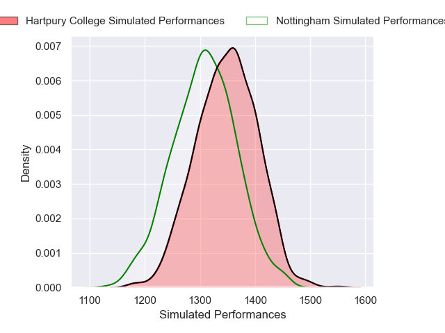
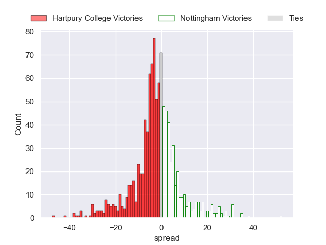

---  
title: "RFU Championship 24/25 Status"  
date: 2025-05-23 6:00:00 -0500  
categories: model review projection  
layout: article  
aside:  
    toc: true  
---
# Current Team Rankings

# Standings

## Current Standings

| Club                |   Played |   Wins |   Point Differential |   Losing Bonus Points |   Try Bonus Points |   Competition Points |
|:--------------------|---------:|-------:|---------------------:|----------------------:|-------------------:|---------------------:|
| Ealing Trailfinders |       20 |     17 |                  645 |                     3 |                nan |                   87 |
| Bedford             |       20 |     15 |                  234 |                     1 |                nan |                   74 |
| Cornish Pirates     |       21 |     14 |                   27 |                     3 |                nan |                   69 |
| Doncaster           |       21 |     14 |                  159 |                     3 |                nan |                   68 |
| Hartpury College    |       22 |     12 |                   77 |                     4 |                nan |                   66 |
| Coventry            |       20 |     12 |                  109 |                     4 |                nan |                   63 |
| Nottingham          |       20 |      8 |                 -104 |                     5 |                nan |                   47 |
| Ampthill            |       20 |      8 |                 -181 |                     5 |                nan |                   46 |
| London Scottish     |       20 |      8 |                  -97 |                     3 |                nan |                   44 |
| Chinnor             |       20 |      6 |                  -71 |                     5 |                nan |                   37 |
| Caldy               |       20 |      4 |                 -216 |                     5 |                nan |                   27 |
| Cambridge           |       20 |      3 |                 -582 |                     0 |                nan |                   18 |

## Projected Remaining Table

| Club                |   Matches Remaining |   Wins |   Point Differential |   Losing Bonus Points |   Try Bonus Points |   Competition Points |
|:--------------------|--------------------:|-------:|---------------------:|----------------------:|-------------------:|---------------------:|
| Ealing Trailfinders |                   2 |    1.8 |             29.5979  |                   0.1 |                1.7 |                  9.1 |
| Bedford             |                   2 |    1.8 |             28.6295  |                   0.1 |                1.7 |                  9.1 |
| Doncaster           |                   2 |    1.6 |             10.6065  |                   0.2 |                0.9 |                  7.5 |
| Ampthill            |                   2 |    1.2 |             13.0906  |                   0.4 |                1.2 |                  6.3 |
| Cornish Pirates     |                   2 |    1.1 |              4.89478 |                   0.5 |                1   |                  5.8 |
| Chinnor             |                   2 |    1   |              2.04317 |                   0.2 |                1   |                  5.2 |
| London Scottish     |                   2 |    1   |             -1.0137  |                   0.2 |                0.9 |                  5.1 |
| Coventry            |                   2 |    1   |             -4.20424 |                   0.1 |                0.8 |                  4.9 |
| Hartpury College    |                   2 |    0.7 |            -10.7946  |                   0.4 |                0.8 |                  4.1 |
| Nottingham          |                   2 |    0.5 |            -13.3839  |                   0.6 |                0.6 |                  3.1 |
| Caldy               |                   2 |    0.2 |            -25.0579  |                   0.3 |                0.4 |                  1.6 |
| Cambridge           |                   2 |    0.1 |            -34.4081  |                   0.2 |                0.8 |                  1.5 |

## Projected Total Table

| Club                |   Total Matches |   Wins |   Point Differential |   Losing Bonus Points |   Try Bonus Points |   Competition Points |
|:--------------------|----------------:|-------:|---------------------:|----------------------:|-------------------:|---------------------:|
| Ealing Trailfinders |              22 |   18.8 |             674.598  |                   3.1 |                1.7 |                 96.1 |
| Bedford             |              22 |   16.8 |             262.629  |                   1.1 |                1.7 |                 83.1 |
| Doncaster           |              23 |   15.6 |             169.607  |                   3.2 |                0.9 |                 75.5 |
| Cornish Pirates     |              23 |   15.1 |              31.8948 |                   3.5 |                1   |                 74.8 |
| Hartpury College    |              24 |   12.7 |              66.2054 |                   4.4 |                0.8 |                 70.1 |
| Coventry            |              22 |   13   |             104.796  |                   4.1 |                0.8 |                 67.9 |
| Ampthill            |              22 |    9.2 |            -167.909  |                   5.4 |                1.2 |                 52.3 |
| Nottingham          |              22 |    8.5 |            -117.384  |                   5.6 |                0.6 |                 50.1 |
| London Scottish     |              22 |    9   |             -98.0137 |                   3.2 |                0.9 |                 49.1 |
| Chinnor             |              22 |    7   |             -68.9568 |                   5.2 |                1   |                 42.2 |
| Caldy               |              22 |    4.2 |            -241.058  |                   5.3 |                0.4 |                 28.6 |
| Cambridge           |              22 |    3.1 |            -616.408  |                   0.2 |                0.8 |                 19.5 |

# Completed Match Review

| Model | Percent Correct Predictions | Spread Error |
| ------ | ------ | ------ |
| Club Level | 71.7% | 14.6 |
| Player Level: Lineup | 71.2% | 13.8 |
| Player Level: Minutes | 67.8% | 14.3 |

# Future Predictions

## Week 23

### Nottingham V Hartpury College on 2025/05/23

Average Margin: Hartpury College by 2.8

Average Scoreline: 39-36

### Bedford V Chinnor on 2025/05/24

Average Margin: Bedford by 14.4

Average Scoreline: 27-13

### Ealing Trailfinders V Coventry on 2025/05/24

Average Margin: Ealing Trailfinders by 16.0

Average Scoreline: 46-29

### Doncaster V Cornish Pirates on 2025/05/24

Average Margin: Doncaster by 5.7

Average Scoreline: 39-34

### Ampthill V Cambridge on 2025/05/24

Average Margin: Ampthill by 18.0

Average Scoreline: 49-31

### London Scottish V Caldy on 2025/05/24

Average Margin: London Scottish by 10.8

Average Scoreline: 43-32

## Week 24

### Ampthill V Doncaster on 2025/05/31

Average Margin: Doncaster by 4.9

Average Scoreline: 38-34

### Coventry V London Scottish on 2025/05/31

Average Margin: Coventry by 11.8

Average Scoreline: 37-25

### Hartpury College V Ealing Trailfinders on 2025/05/31

Average Margin: Ealing Trailfinders by 13.6

Average Scoreline: 38-25

### Caldy V Bedford on 2025/05/31

Average Margin: Bedford by 14.2

Average Scoreline: 41-27

### Chinnor V Cambridge on 2025/05/31

Average Margin: Chinnor by 16.4

Average Scoreline: 43-26

### Cornish Pirates V Nottingham on 2025/05/31

Average Margin: Cornish Pirates by 10.6

Average Scoreline: 40-29

