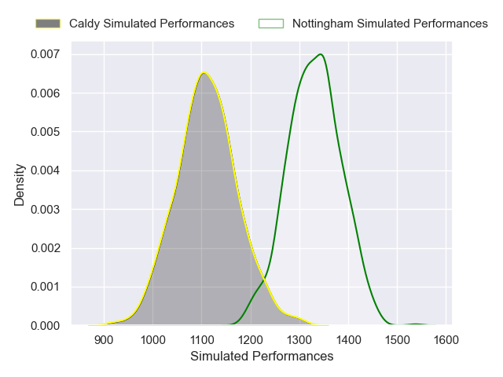
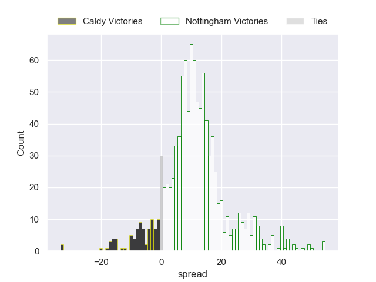

---  
title: "RFU Championship 24/25 Status"  
date: 2025-05-09 6:00:00 -0500  
categories: model review projection  
layout: article  
aside:  
    toc: true  
---
# Current Team Rankings

# Standings

## Current Standings

| Club                |   Played |   Wins |   Point Differential |   Losing Bonus Points |   Try Bonus Points |   Competition Points |
|:--------------------|---------:|-------:|---------------------:|----------------------:|-------------------:|---------------------:|
| Ealing Trailfinders |       19 |     16 |                  653 |                     3 |                 17 |                   84 |
| Bedford             |       18 |     13 |                  173 |                     1 |                 13 |                   66 |
| Hartpury College    |       18 |     12 |                  107 |                     2 |                 12 |                   64 |
| Coventry            |       18 |     11 |                   61 |                     4 |                 11 |                   59 |
| Cornish Pirates     |       18 |     11 |                    4 |                     3 |                 10 |                   57 |
| Doncaster           |       18 |     11 |                  133 |                     3 |                  9 |                   56 |
| Nottingham          |       18 |      8 |                  -37 |                     4 |                 10 |                   46 |
| Ampthill            |       18 |      8 |                 -173 |                     3 |                  9 |                   44 |
| Chinnor             |       18 |      6 |                  -30 |                     4 |                  6 |                   36 |
| London Scottish     |       18 |      6 |                 -129 |                     3 |                  9 |                   36 |
| Caldy               |       18 |      3 |                 -194 |                     5 |                  6 |                   23 |
| Cambridge           |       19 |      3 |                 -568 |                     0 |                  6 |                   18 |

## Projected Remaining Table

| Club                |   Matches Remaining |   Wins |   Point Differential |   Losing Bonus Points |   Try Bonus Points |   Competition Points |
|:--------------------|--------------------:|-------:|---------------------:|----------------------:|-------------------:|---------------------:|
| Bedford             |                   4 |    3.6 |             55.201   |                   0.2 |                3.4 |                 18   |
| Ealing Trailfinders |                   4 |    3.7 |             77.0946  |                   0.2 |                2.9 |                 17.7 |
| Cornish Pirates     |                   4 |    2.8 |             20.9421  |                   0.7 |                1.9 |                 13.7 |
| Doncaster           |                   4 |    2.5 |              8.72967 |                   1   |                1.6 |                 12.5 |
| Coventry            |                   4 |    2.2 |              5.02849 |                   0.6 |                1.7 |                 11.3 |
| London Scottish     |                   4 |    2.1 |              7.46021 |                   0.6 |                2.1 |                 11.2 |
| Chinnor             |                   4 |    1.8 |            -15.4829  |                   0.4 |                1.6 |                  9.4 |
| Hartpury College    |                   4 |    1.7 |             -9.43342 |                   1.1 |                1.3 |                  9.2 |
| Ampthill            |                   4 |    1.5 |             -5.16697 |                   1.1 |                1.6 |                  8.6 |
| Nottingham          |                   4 |    1.4 |            -13.1632  |                   0.9 |                1.6 |                  8.2 |
| Caldy               |                   4 |    0.4 |            -62.1688  |                   0.6 |                0.9 |                  3   |
| Cambridge           |                   4 |    0.3 |            -69.0408  |                   0.4 |                0.9 |                  2.5 |

## Projected Total Table

| Club                |   Total Matches |   Wins |   Point Differential |   Losing Bonus Points |   Try Bonus Points |   Competition Points |
|:--------------------|----------------:|-------:|---------------------:|----------------------:|-------------------:|---------------------:|
| Ealing Trailfinders |              23 |   19.7 |             730.095  |                   3.2 |               19.9 |                101.7 |
| Bedford             |              22 |   16.6 |             228.201  |                   1.2 |               16.4 |                 84   |
| Hartpury College    |              22 |   13.7 |              97.5666 |                   3.1 |               13.3 |                 73.2 |
| Cornish Pirates     |              22 |   13.8 |              24.9421 |                   3.7 |               11.9 |                 70.7 |
| Coventry            |              22 |   13.2 |              66.0285 |                   4.6 |               12.7 |                 70.3 |
| Doncaster           |              22 |   13.5 |             141.73   |                   4   |               10.6 |                 68.5 |
| Nottingham          |              22 |    9.4 |             -50.1632 |                   4.9 |               11.6 |                 54.2 |
| Ampthill            |              22 |    9.5 |            -178.167  |                   4.1 |               10.6 |                 52.6 |
| London Scottish     |              22 |    8.1 |            -121.54   |                   3.6 |               11.1 |                 47.2 |
| Chinnor             |              22 |    7.8 |             -45.4829 |                   4.4 |                7.6 |                 45.4 |
| Caldy               |              22 |    3.4 |            -256.169  |                   5.6 |                6.9 |                 26   |
| Cambridge           |              23 |    3.3 |            -637.041  |                   0.4 |                6.9 |                 20.5 |

# Completed Match Review

| Model | Percent Correct Predictions | Spread Error |
| ------ | ------ | ------ |
| Club Level | 71.6% | 14.8 |
| Player Level: Lineup | 72.7% | 14.2 |
| Player Level: Minutes | 69.7% | 14.9 |

# Future Predictions

## Week 20

### Nottingham V Caldy on 2025/05/09

Average Margin: Nottingham by 11.9

Average Scoreline: 42-30

### London Scottish V Cambridge on 2025/05/10

Average Margin: London Scottish by 15.3

Average Scoreline: 48-33

### Cornish Pirates V Hartpury College on 2025/05/10

Average Margin: Cornish Pirates by 3.8

Average Scoreline: 30-26

### Doncaster V Coventry on 2025/05/10

Average Margin: Doncaster by 3.6

Average Scoreline: 27-24

### Ampthill V Bedford on 2025/05/10

Average Margin: Bedford by 6.9

Average Scoreline: 35-28

### Ealing Trailfinders V Chinnor on 2025/05/10

Average Margin: Ealing Trailfinders by 24.5

Average Scoreline: 44-20

## Week 21

### Caldy V Ealing Trailfinders on 2025/05/17

Average Margin: Ealing Trailfinders by 25.3

Average Scoreline: 43-18

### Cambridge V Bedford on 2025/05/17

Average Margin: Bedford by 20.1

Average Scoreline: 39-19

### Cornish Pirates V Ampthill on 2025/05/17

Average Margin: Cornish Pirates by 10.7

Average Scoreline: 33-23

### Coventry V Nottingham on 2025/05/17

Average Margin: Coventry by 11.4

Average Scoreline: 36-24

### Hartpury College V Doncaster on 2025/05/17

Average Margin: Hartpury College by 3.5

Average Scoreline: 28-24

### Chinnor V London Scottish on 2025/05/17

Average Margin: Chinnor by 5.7

Average Scoreline: 27-22

## Week 22

### Nottingham V Hartpury College on 2025/05/24

Average Margin: Hartpury College by 2.7

Average Scoreline: 33-30

### Doncaster V Cornish Pirates on 2025/05/24

Average Margin: Doncaster by 4.6

Average Scoreline: 29-25

### Ealing Trailfinders V Coventry on 2025/05/24

Average Margin: Ealing Trailfinders by 15.4

Average Scoreline: 39-24

### Bedford V Chinnor on 2025/05/24

Average Margin: Bedford by 13.7

Average Scoreline: 37-23

### Ampthill V Cambridge on 2025/05/24

Average Margin: Ampthill by 16.7

Average Scoreline: 51-34

### London Scottish V Caldy on 2025/05/24

Average Margin: London Scottish by 10.4

Average Scoreline: 36-26

## Week 23

### Chinnor V Cambridge on 2025/05/31

Average Margin: Chinnor by 17.0

Average Scoreline: 49-32

### Ampthill V Doncaster on 2025/05/31

Average Margin: Doncaster by 4.2

Average Scoreline: 35-31

### Hartpury College V Ealing Trailfinders on 2025/05/31

Average Margin: Ealing Trailfinders by 11.9

Average Scoreline: 34-22

### Coventry V London Scottish on 2025/05/31

Average Margin: Coventry by 12.6

Average Scoreline: 39-27

### Caldy V Bedford on 2025/05/31

Average Margin: Bedford by 14.5

Average Scoreline: 36-22

### Cornish Pirates V Nottingham on 2025/05/31

Average Margin: Cornish Pirates by 11.0

Average Scoreline: 35-24

