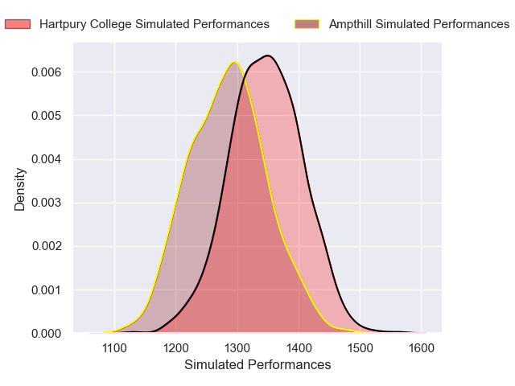
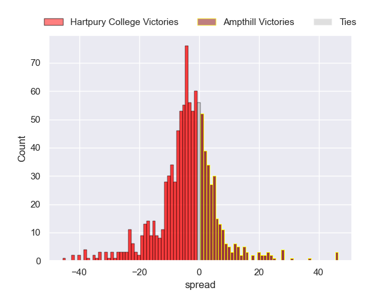

---  
title: "RFU Championship 24/25 Status"  
date: 2025-02-27 6:00:00 -0500  
categories: model review projection  
layout: article  
aside:  
    toc: true  
---
# Current Team Rankings

# Standings

## Current Standings

| Club                |   Played |   Wins |   Point Differential |   Losing Bonus Points |   Try Bonus Points |   Competition Points |
|:--------------------|---------:|-------:|---------------------:|----------------------:|-------------------:|---------------------:|
| Ealing Trailfinders |       12 |     11 |                  390 |                     1 |                 11 |                   56 |
| Bedford             |       12 |      9 |                   67 |                     0 |                  7 |                   43 |
| Coventry            |       12 |      8 |                   44 |                     1 |                  6 |                   39 |
| Nottingham          |       12 |      7 |                  104 |                     3 |                  6 |                   37 |
| Hartpury College    |       11 |      6 |                   24 |                     2 |                  6 |                   32 |
| Cornish Pirates     |       12 |      6 |                  -26 |                     3 |                  5 |                   32 |
| London Scottish     |       12 |      5 |                  -28 |                     3 |                  5 |                   28 |
| Doncaster           |       12 |      5 |                    8 |                     3 |                  4 |                   27 |
| Chinnor             |       12 |      4 |                  -16 |                     3 |                  3 |                   22 |
| Ampthill            |       11 |      4 |                 -149 |                     2 |                  4 |                   22 |
| Caldy               |       12 |      3 |                 -118 |                     2 |                  4 |                   18 |
| Cambridge           |       12 |      3 |                 -300 |                     0 |                  4 |                   16 |

## Projected Remaining Table

| Club                |   Matches Remaining |   Wins |   Point Differential |   Losing Bonus Points |   Try Bonus Points |   Competition Points |
|:--------------------|--------------------:|-------:|---------------------:|----------------------:|-------------------:|---------------------:|
| Ealing Trailfinders |                  10 |    9.3 |             195.449  |                   0.4 |                8.2 |                 45.5 |
| Coventry            |                  10 |    7.6 |              94.2506 |                   1   |                5.1 |                 36.6 |
| Bedford             |                  10 |    7.3 |              61.8099 |                   1.2 |                5.6 |                 36   |
| Cornish Pirates     |                  10 |    6.8 |              68.4081 |                   1.7 |                5   |                 34.1 |
| Hartpury College    |                  11 |    6.6 |              30.9624 |                   2.2 |                4.9 |                 33.5 |
| Doncaster           |                  10 |    5.6 |              13.81   |                   2.3 |                4.1 |                 28.6 |
| Nottingham          |                  10 |    4.8 |             -11.4379 |                   1.9 |                5   |                 26   |
| Ampthill            |                  11 |    3.7 |             -54.511  |                   2.7 |                3.6 |                 21.3 |
| London Scottish     |                  10 |    3.6 |             -38.8055 |                   2.2 |                3.7 |                 20.2 |
| Chinnor             |                  10 |    3.4 |             -59.1663 |                   2.2 |                3   |                 18.8 |
| Caldy               |                  10 |    1.6 |            -119.528  |                   2.1 |                2.2 |                 10.7 |
| Cambridge           |                  10 |    0.8 |            -181.241  |                   1.1 |                1.8 |                  5.9 |

## Projected Total Table

| Club                |   Total Matches |   Wins |   Point Differential |   Losing Bonus Points |   Try Bonus Points |   Competition Points |
|:--------------------|----------------:|-------:|---------------------:|----------------------:|-------------------:|---------------------:|
| Ealing Trailfinders |              22 |   20.3 |             585.449  |                   1.4 |               19.2 |                101.5 |
| Bedford             |              22 |   16.3 |             128.81   |                   1.2 |               12.6 |                 79   |
| Coventry            |              22 |   15.6 |             138.251  |                   2   |               11.1 |                 75.6 |
| Cornish Pirates     |              22 |   12.8 |              42.4081 |                   4.7 |               10   |                 66.1 |
| Hartpury College    |              22 |   12.6 |              54.9624 |                   4.2 |               10.9 |                 65.5 |
| Nottingham          |              22 |   11.8 |              92.5621 |                   4.9 |               11   |                 63   |
| Doncaster           |              22 |   10.6 |              21.81   |                   5.3 |                8.1 |                 55.6 |
| London Scottish     |              22 |    8.6 |             -66.8055 |                   5.2 |                8.7 |                 48.2 |
| Ampthill            |              22 |    7.7 |            -203.511  |                   4.7 |                7.6 |                 43.3 |
| Chinnor             |              22 |    7.4 |             -75.1663 |                   5.2 |                6   |                 40.8 |
| Caldy               |              22 |    4.6 |            -237.528  |                   4.1 |                6.2 |                 28.7 |
| Cambridge           |              22 |    3.8 |            -481.241  |                   1.1 |                5.8 |                 21.9 |

# Completed Match Review

| Model | Percent Correct Predictions | Spread Error |
| ------ | ------ | ------ |
| Club Level | 66.2% | 14.5 |
| Player Level: Lineup | 62.2% | 15.5 |
| Player Level: Minutes | 62.2% | 15.6 |

# Future Predictions

## Week 13

### Ampthill V Hartpury College on 2025/03/01

Average Margin: Hartpury College by 3.3

Average Scoreline: 30-27

## Week 14

### Hartpury College V Bedford on 2025/03/22

Average Margin: Bedford by 0.1

Average Scoreline: 26-26

### Doncaster V Ealing Trailfinders on 2025/03/22

Average Margin: Ealing Trailfinders by 14.9

Average Scoreline: 34-19

### Ampthill V Nottingham on 2025/03/22

Average Margin: Nottingham by 1.0

Average Scoreline: 27-26

### Coventry V Cambridge on 2025/03/22

Average Margin: Coventry by 26.5

Average Scoreline: 39-13

### Cornish Pirates V London Scottish on 2025/03/22

Average Margin: Cornish Pirates by 11.3

Average Scoreline: 36-25

### Caldy V Chinnor on 2025/03/22

Average Margin: Chinnor by 1.7

Average Scoreline: 30-28

## Week 15

### Chinnor V Coventry on 2025/03/29

Average Margin: Coventry by 9.7

Average Scoreline: 33-24

### London Scottish V Doncaster on 2025/03/29

Average Margin: Doncaster by 0.6

Average Scoreline: 27-26

### Ealing Trailfinders V Nottingham on 2025/03/29

Average Margin: Ealing Trailfinders by 21.9

Average Scoreline: 40-18

### Caldy V Ampthill on 2025/03/29

Average Margin: Ampthill by 1.8

Average Scoreline: 30-28

### Bedford V Cornish Pirates on 2025/03/29

Average Margin: Bedford by 5.8

Average Scoreline: 28-22

### Cambridge V Hartpury College on 2025/03/29

Average Margin: Hartpury College by 14.5

Average Scoreline: 37-23

## Week 16

### Doncaster V Bedford on 2025/04/05

Average Margin: Bedford by 0.6

Average Scoreline: 30-30

### Nottingham V London Scottish on 2025/04/05

Average Margin: Nottingham by 7.0

Average Scoreline: 31-24

### Hartpury College V Chinnor on 2025/04/05

Average Margin: Hartpury College by 11.0

Average Scoreline: 29-18

### Ampthill V Ealing Trailfinders on 2025/04/05

Average Margin: Ealing Trailfinders by 19.3

Average Scoreline: 35-16

### Cornish Pirates V Cambridge on 2025/04/05

Average Margin: Cornish Pirates by 22.3

Average Scoreline: 36-14

### Coventry V Caldy on 2025/04/05

Average Margin: Coventry by 21.3

Average Scoreline: 39-18

## Week 17

### London Scottish V Ealing Trailfinders on 2025/04/12

Average Margin: Ealing Trailfinders by 17.3

Average Scoreline: 34-17

### Coventry V Ampthill on 2025/04/12

Average Margin: Coventry by 15.4

Average Scoreline: 35-20

### Chinnor V Cornish Pirates on 2025/04/12

Average Margin: Cornish Pirates by 5.3

Average Scoreline: 32-26

### Cambridge V Doncaster on 2025/04/12

Average Margin: Doncaster by 13.3

Average Scoreline: 40-27

### Caldy V Hartpury College on 2025/04/12

Average Margin: Hartpury College by 9.6

Average Scoreline: 29-20

### Bedford V Nottingham on 2025/04/12

Average Margin: Bedford by 10.1

Average Scoreline: 28-18

## Week 18

### Cornish Pirates V Caldy on 2025/04/19

Average Margin: Cornish Pirates by 17.4

Average Scoreline: 36-18

### Ampthill V London Scottish on 2025/04/19

Average Margin: Ampthill by 1.9

Average Scoreline: 29-27

### Ealing Trailfinders V Bedford on 2025/04/19

Average Margin: Ealing Trailfinders by 16.1

Average Scoreline: 38-22

### Doncaster V Chinnor on 2025/04/19

Average Margin: Doncaster by 10.1

Average Scoreline: 29-19

### Nottingham V Cambridge on 2025/04/19

Average Margin: Nottingham by 17.3

Average Scoreline: 40-22

### Hartpury College V Coventry on 2025/04/19

Average Margin: Coventry by 2.0

Average Scoreline: 28-26

## Week 19

### Hartpury College V Ampthill on 2025/05/03

Average Margin: Hartpury College by 11.1

Average Scoreline: 28-17

### Cambridge V Ealing Trailfinders on 2025/05/03

Average Margin: Ealing Trailfinders by 28.2

Average Scoreline: 42-14

### Coventry V Cornish Pirates on 2025/05/03

Average Margin: Coventry by 7.1

Average Scoreline: 32-25

### Chinnor V Nottingham on 2025/05/03

Average Margin: Nottingham by 0.5

Average Scoreline: 29-29

### Caldy V Doncaster on 2025/05/03

Average Margin: Doncaster by 8.2

Average Scoreline: 33-25

### Bedford V London Scottish on 2025/05/03

Average Margin: Bedford by 12.3

Average Scoreline: 27-15

## Week 20

### Ealing Trailfinders V Chinnor on 2025/05/10

Average Margin: Ealing Trailfinders by 26.0

Average Scoreline: 38-12

### Nottingham V Caldy on 2025/05/10

Average Margin: Nottingham by 12.8

Average Scoreline: 33-20

### Doncaster V Coventry on 2025/05/10

Average Margin: Coventry by 2.7

Average Scoreline: 30-27

### Ampthill V Bedford on 2025/05/10

Average Margin: Bedford by 7.1

Average Scoreline: 35-28

### Cornish Pirates V Hartpury College on 2025/05/10

Average Margin: Cornish Pirates by 5.6

Average Scoreline: 27-21

### London Scottish V Cambridge on 2025/05/10

Average Margin: London Scottish by 15.3

Average Scoreline: 33-18

## Week 21

### Hartpury College V Doncaster on 2025/05/17

Average Margin: Hartpury College by 4.4

Average Scoreline: 28-24

### Coventry V Nottingham on 2025/05/17

Average Margin: Coventry by 11.1

Average Scoreline: 33-21

### Chinnor V London Scottish on 2025/05/17

Average Margin: Chinnor by 2.0

Average Scoreline: 29-27

### Caldy V Ealing Trailfinders on 2025/05/17

Average Margin: Ealing Trailfinders by 23.5

Average Scoreline: 35-12

### Cambridge V Bedford on 2025/05/17

Average Margin: Bedford by 16.4

Average Scoreline: 39-22

### Cornish Pirates V Ampthill on 2025/05/17

Average Margin: Cornish Pirates by 12.4

Average Scoreline: 32-20

## Week 22

### London Scottish V Caldy on 2025/05/24

Average Margin: London Scottish by 11.5

Average Scoreline: 30-19

### Doncaster V Cornish Pirates on 2025/05/24

Average Margin: Doncaster by 1.7

Average Scoreline: 28-26

### Bedford V Chinnor on 2025/05/24

Average Margin: Bedford by 13.6

Average Scoreline: 30-17

### Nottingham V Hartpury College on 2025/05/24

Average Margin: Nottingham by 1.7

Average Scoreline: 32-30

### Ampthill V Cambridge on 2025/05/24

Average Margin: Ampthill by 13.9

Average Scoreline: 33-19

### Ealing Trailfinders V Coventry on 2025/05/24

Average Margin: Ealing Trailfinders by 14.7

Average Scoreline: 38-24

## Week 23

### Ampthill V Doncaster on 2025/05/31

Average Margin: Doncaster by 2.6

Average Scoreline: 32-29

### Chinnor V Cambridge on 2025/05/31

Average Margin: Chinnor by 13.4

Average Scoreline: 35-22

### Hartpury College V Ealing Trailfinders on 2025/05/31

Average Margin: Ealing Trailfinders by 13.5

Average Scoreline: 32-19

### Cornish Pirates V Nottingham on 2025/05/31

Average Margin: Cornish Pirates by 8.6

Average Scoreline: 36-27

### Coventry V London Scottish on 2025/05/31

Average Margin: Coventry by 13.1

Average Scoreline: 30-17

### Caldy V Bedford on 2025/05/31

Average Margin: Bedford by 11.8

Average Scoreline: 35-23

