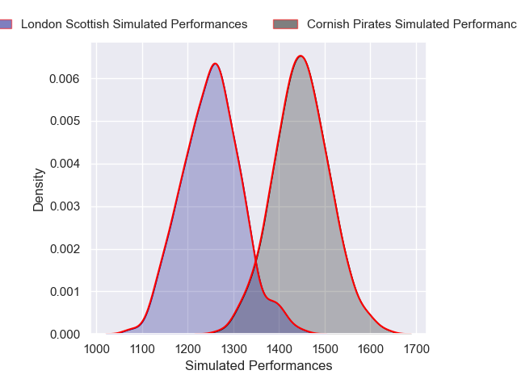
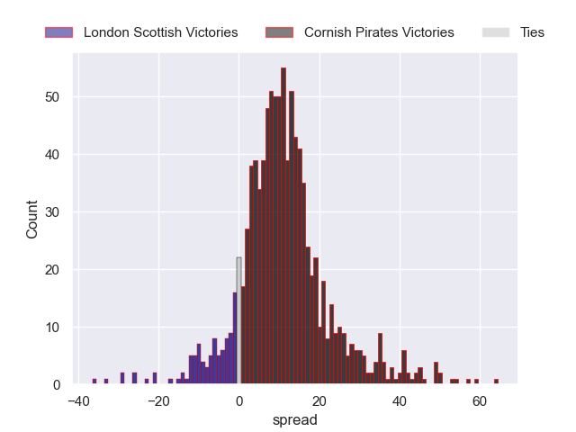

---  
title: "RFU Championship 24/25 Status"  
date: 2025-03-17 6:00:00 -0500  
categories: model review projection  
layout: article  
aside:  
    toc: true  
---
# Current Team Rankings

# Standings

## Current Standings

| Club                |   Played |   Wins |   Point Differential |   Losing Bonus Points |   Try Bonus Points |   Competition Points |
|:--------------------|---------:|-------:|---------------------:|----------------------:|-------------------:|---------------------:|
| Ealing Trailfinders |       12 |     11 |                  390 |                     1 |                 11 |                   56 |
| Bedford             |       12 |      9 |                   67 |                     0 |                  7 |                   43 |
| Coventry            |       12 |      8 |                   44 |                     1 |                  6 |                   39 |
| Nottingham          |       12 |      7 |                  104 |                     3 |                  6 |                   37 |
| Hartpury College    |       12 |      7 |                   28 |                     2 |                  7 |                   37 |
| Cornish Pirates     |       12 |      6 |                  -26 |                     3 |                  5 |                   32 |
| London Scottish     |       12 |      5 |                  -28 |                     3 |                  5 |                   28 |
| Doncaster           |       12 |      5 |                    8 |                     3 |                  4 |                   27 |
| Ampthill            |       12 |      4 |                 -153 |                     3 |                  5 |                   24 |
| Chinnor             |       12 |      4 |                  -16 |                     3 |                  3 |                   22 |
| Caldy               |       12 |      3 |                 -118 |                     2 |                  4 |                   18 |
| Cambridge           |       12 |      3 |                 -300 |                     0 |                  4 |                   16 |

## Projected Remaining Table

| Club                |   Matches Remaining |   Wins |   Point Differential |   Losing Bonus Points |   Try Bonus Points |   Competition Points |
|:--------------------|--------------------:|-------:|---------------------:|----------------------:|-------------------:|---------------------:|
| Ealing Trailfinders |                  10 |    9.3 |             203.834  |                   0.3 |                8.7 |                 46.2 |
| Coventry            |                  10 |    7.5 |              93.2665 |                   1   |                5.8 |                 37   |
| Bedford             |                  10 |    7.2 |              60.2977 |                   1.2 |                5.9 |                 36.1 |
| Cornish Pirates     |                  10 |    6.8 |              68.3037 |                   1.7 |                5.1 |                 34.1 |
| Hartpury College    |                  10 |    6   |              28.2066 |                   2   |                4.2 |                 30.2 |
| Doncaster           |                  10 |    5.6 |              15.0828 |                   2.3 |                4.3 |                 28.9 |
| Nottingham          |                  10 |    4.8 |             -10.8951 |                   1.9 |                4.2 |                 25.2 |
| London Scottish     |                  10 |    3.6 |             -42.1102 |                   2.1 |                3.5 |                 20   |
| Ampthill            |                  10 |    3.4 |             -53.0179 |                   2.2 |                3.7 |                 19.7 |
| Chinnor             |                  10 |    3.4 |             -60.9002 |                   2.2 |                2.9 |                 18.5 |
| Caldy               |                  10 |    1.6 |            -119.459  |                   2.1 |                2.5 |                 10.9 |
| Cambridge           |                  10 |    0.8 |            -182.609  |                   1.1 |                2.1 |                  6.3 |

## Projected Total Table

| Club                |   Total Matches |   Wins |   Point Differential |   Losing Bonus Points |   Try Bonus Points |   Competition Points |
|:--------------------|----------------:|-------:|---------------------:|----------------------:|-------------------:|---------------------:|
| Ealing Trailfinders |              22 |   20.3 |             593.834  |                   1.3 |               19.7 |                102.2 |
| Bedford             |              22 |   16.2 |             127.298  |                   1.2 |               12.9 |                 79.1 |
| Coventry            |              22 |   15.5 |             137.267  |                   2   |               11.8 |                 76   |
| Hartpury College    |              22 |   13   |              56.2066 |                   4   |               11.2 |                 67.2 |
| Cornish Pirates     |              22 |   12.8 |              42.3037 |                   4.7 |               10.1 |                 66.1 |
| Nottingham          |              22 |   11.8 |              93.1049 |                   4.9 |               10.2 |                 62.2 |
| Doncaster           |              22 |   10.6 |              23.0828 |                   5.3 |                8.3 |                 55.9 |
| London Scottish     |              22 |    8.6 |             -70.1102 |                   5.1 |                8.5 |                 48   |
| Ampthill            |              22 |    7.4 |            -206.018  |                   5.2 |                8.7 |                 43.7 |
| Chinnor             |              22 |    7.4 |             -76.9002 |                   5.2 |                5.9 |                 40.5 |
| Caldy               |              22 |    4.6 |            -237.459  |                   4.1 |                6.5 |                 28.9 |
| Cambridge           |              22 |    3.8 |            -482.609  |                   1.1 |                6.1 |                 22.3 |

# Completed Match Review

| Model | Percent Correct Predictions | Spread Error |
| ------ | ------ | ------ |
| Club Level | 66.7% | 14.4 |
| Player Level: Lineup | 65.2% | 15.2 |
| Player Level: Minutes | 63.0% | 15.3 |

# Future Predictions

## Week 13

### Cornish Pirates V London Scottish on 2025/03/21

Average Margin: Cornish Pirates by 11.6

Average Scoreline: 29-17

### Coventry V Cambridge on 2025/03/22

Average Margin: Coventry by 27.0

Average Scoreline: 37-10

### Ampthill V Nottingham on 2025/03/22

Average Margin: Nottingham by 0.9

Average Scoreline: 32-32

### Caldy V Chinnor on 2025/03/22

Average Margin: Chinnor by 1.5

Average Scoreline: 29-28

### Hartpury College V Bedford on 2025/03/22

Average Margin: Hartpury College by 0.4

Average Scoreline: 36-36

### Doncaster V Ealing Trailfinders on 2025/03/22

Average Margin: Ealing Trailfinders by 14.1

Average Scoreline: 40-26

## Week 14

### Ealing Trailfinders V Nottingham on 2025/03/29

Average Margin: Ealing Trailfinders by 23.3

Average Scoreline: 38-15

### Chinnor V Coventry on 2025/03/29

Average Margin: Coventry by 10.0

Average Scoreline: 33-23

### Cambridge V Hartpury College on 2025/03/29

Average Margin: Hartpury College by 14.4

Average Scoreline: 42-27

### Bedford V Cornish Pirates on 2025/03/29

Average Margin: Bedford by 6.3

Average Scoreline: 24-18

### London Scottish V Doncaster on 2025/03/29

Average Margin: Doncaster by 1.2

Average Scoreline: 25-23

### Caldy V Ampthill on 2025/03/29

Average Margin: Ampthill by 1.4

Average Scoreline: 31-29

## Week 15

### Coventry V Caldy on 2025/04/05

Average Margin: Coventry by 20.7

Average Scoreline: 30-9

### Hartpury College V Chinnor on 2025/04/05

Average Margin: Hartpury College by 11.0

Average Scoreline: 25-14

### Cornish Pirates V Cambridge on 2025/04/05

Average Margin: Cornish Pirates by 22.2

Average Scoreline: 36-13

### Nottingham V London Scottish on 2025/04/05

Average Margin: Nottingham by 6.6

Average Scoreline: 32-26

### Doncaster V Bedford on 2025/04/05

Average Margin: Bedford by 0.8

Average Scoreline: 30-29

### Ampthill V Ealing Trailfinders on 2025/04/05

Average Margin: Ealing Trailfinders by 20.3

Average Scoreline: 36-16

## Week 16

### Caldy V Hartpury College on 2025/04/12

Average Margin: Hartpury College by 9.8

Average Scoreline: 44-34

### Coventry V Ampthill on 2025/04/12

Average Margin: Coventry by 15.9

Average Scoreline: 31-15

### London Scottish V Ealing Trailfinders on 2025/04/12

Average Margin: Ealing Trailfinders by 18.7

Average Scoreline: 36-18

### Chinnor V Cornish Pirates on 2025/04/12

Average Margin: Cornish Pirates by 5.6

Average Scoreline: 28-22

### Cambridge V Doncaster on 2025/04/12

Average Margin: Doncaster by 13.4

Average Scoreline: 37-24

### Bedford V Nottingham on 2025/04/12

Average Margin: Bedford by 9.5

Average Scoreline: 35-26

## Week 17

### Doncaster V Chinnor on 2025/04/19

Average Margin: Doncaster by 10.2

Average Scoreline: 26-16

### Hartpury College V Coventry on 2025/04/19

Average Margin: Coventry by 2.0

Average Scoreline: 36-34

### Cornish Pirates V Caldy on 2025/04/19

Average Margin: Cornish Pirates by 16.9

Average Scoreline: 31-15

### Ampthill V London Scottish on 2025/04/19

Average Margin: Ampthill by 2.0

Average Scoreline: 33-31

### Nottingham V Cambridge on 2025/04/19

Average Margin: Nottingham by 18.3

Average Scoreline: 33-15

### Ealing Trailfinders V Bedford on 2025/04/19

Average Margin: Ealing Trailfinders by 17.1

Average Scoreline: 32-15

## Week 18

### Chinnor V Nottingham on 2025/05/03

Average Margin: Nottingham by 1.4

Average Scoreline: 24-23

### Caldy V Doncaster on 2025/05/03

Average Margin: Doncaster by 8.4

Average Scoreline: 35-27

### Hartpury College V Ampthill on 2025/05/03

Average Margin: Hartpury College by 10.0

Average Scoreline: 38-28

### Coventry V Cornish Pirates on 2025/05/03

Average Margin: Coventry by 7.6

Average Scoreline: 30-23

### Cambridge V Ealing Trailfinders on 2025/05/03

Average Margin: Ealing Trailfinders by 29.5

Average Scoreline: 36-7

### Bedford V London Scottish on 2025/05/03

Average Margin: Bedford by 12.3

Average Scoreline: 31-19

## Week 19

### Ampthill V Bedford on 2025/05/10

Average Margin: Bedford by 7.2

Average Scoreline: 36-28

### London Scottish V Cambridge on 2025/05/10

Average Margin: London Scottish by 14.6

Average Scoreline: 34-20

### Ealing Trailfinders V Chinnor on 2025/05/10

Average Margin: Ealing Trailfinders by 26.2

Average Scoreline: 36-10

### Doncaster V Coventry on 2025/05/10

Average Margin: Coventry by 2.3

Average Scoreline: 31-28

### Cornish Pirates V Hartpury College on 2025/05/10

Average Margin: Cornish Pirates by 5.6

Average Scoreline: 33-27

### Nottingham V Caldy on 2025/05/10

Average Margin: Nottingham by 13.1

Average Scoreline: 33-20

## Week 20

### Hartpury College V Doncaster on 2025/05/17

Average Margin: Hartpury College by 4.9

Average Scoreline: 29-24

### Caldy V Ealing Trailfinders on 2025/05/17

Average Margin: Ealing Trailfinders by 24.8

Average Scoreline: 36-11

### Cambridge V Bedford on 2025/05/17

Average Margin: Bedford by 16.3

Average Scoreline: 35-19

### Cornish Pirates V Ampthill on 2025/05/17

Average Margin: Cornish Pirates by 13.0

Average Scoreline: 36-23

### Chinnor V London Scottish on 2025/05/17

Average Margin: Chinnor by 2.3

Average Scoreline: 25-22

### Coventry V Nottingham on 2025/05/17

Average Margin: Coventry by 11.0

Average Scoreline: 36-25

## Week 21

### London Scottish V Caldy on 2025/05/24

Average Margin: London Scottish by 11.2

Average Scoreline: 31-20

### Nottingham V Hartpury College on 2025/05/24

Average Margin: Nottingham by 1.2

Average Scoreline: 33-32

### Doncaster V Cornish Pirates on 2025/05/24

Average Margin: Doncaster by 1.3

Average Scoreline: 31-30

### Bedford V Chinnor on 2025/05/24

Average Margin: Bedford by 13.7

Average Scoreline: 26-13

### Ealing Trailfinders V Coventry on 2025/05/24

Average Margin: Ealing Trailfinders by 16.4

Average Scoreline: 27-10

### Ampthill V Cambridge on 2025/05/24

Average Margin: Ampthill by 13.6

Average Scoreline: 32-18

## Week 22

### Ampthill V Doncaster on 2025/05/31

Average Margin: Doncaster by 2.8

Average Scoreline: 31-28

### Cornish Pirates V Nottingham on 2025/05/31

Average Margin: Cornish Pirates by 8.5

Average Scoreline: 33-25

### Chinnor V Cambridge on 2025/05/31

Average Margin: Chinnor by 13.4

Average Scoreline: 35-22

### Hartpury College V Ealing Trailfinders on 2025/05/31

Average Margin: Ealing Trailfinders by 13.4

Average Scoreline: 34-21

### Caldy V Bedford on 2025/05/31

Average Margin: Bedford by 11.7

Average Scoreline: 41-29

### Coventry V London Scottish on 2025/05/31

Average Margin: Coventry by 13.1

Average Scoreline: 31-17

