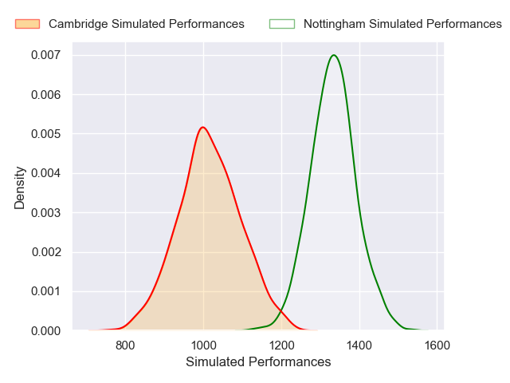
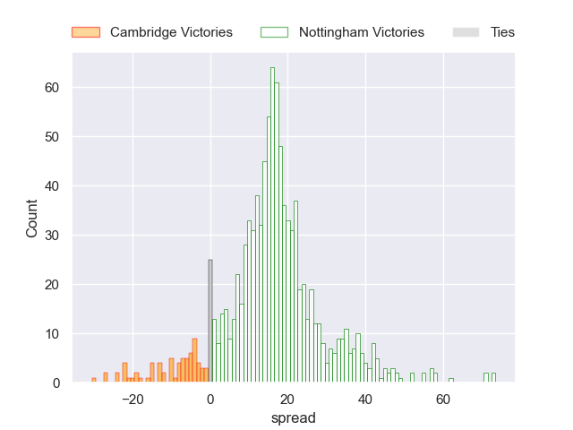

---  
title: "RFU Championship 24/25 Status"  
date: 2025-04-14 6:00:00 -0500  
categories: model review projection  
layout: article  
aside:  
    toc: true  
---
# Current Team Rankings

# Standings

## Current Standings

| Club                |   Played |   Wins |   Point Differential |   Losing Bonus Points |   Try Bonus Points |   Competition Points |
|:--------------------|---------:|-------:|---------------------:|----------------------:|-------------------:|---------------------:|
| Ealing Trailfinders |       16 |     14 |                  518 |                     2 |                nan |                   71 |
| Hartpury College    |       17 |     11 |                  107 |                     2 |                nan |                   57 |
| Bedford             |       16 |     11 |                  144 |                     1 |                 11 |                   56 |
| Coventry            |       16 |     11 |                   75 |                     2 |                nan |                   55 |
| Cornish Pirates     |       16 |      9 |                   -6 |                     3 |                nan |                   47 |
| Doncaster           |       16 |      9 |                   91 |                     3 |                nan |                   45 |
| Nottingham          |       16 |      7 |                  -57 |                     4 |                  8 |                   40 |
| Ampthill            |       16 |      7 |                 -168 |                     3 |                nan |                   38 |
| London Scottish     |       16 |      6 |                  -87 |                     3 |                nan |                   34 |
| Chinnor             |       16 |      5 |                  -25 |                     4 |                nan |                   30 |
| Caldy               |       17 |      3 |                 -204 |                     4 |                nan |                   21 |
| Cambridge           |       16 |      3 |                 -388 |                     0 |                nan |                   18 |

## Projected Remaining Table

| Club                |   Matches Remaining |   Wins |   Point Differential |   Losing Bonus Points |   Try Bonus Points |   Competition Points |
|:--------------------|--------------------:|-------:|---------------------:|----------------------:|-------------------:|---------------------:|
| Ealing Trailfinders |                   6 |    5.6 |           126.066    |                   0.2 |                4.8 |                 27.3 |
| Bedford             |                   6 |    4.6 |            48.103    |                   0.4 |                4   |                 22.6 |
| Doncaster           |                   6 |    4.1 |            28.9671   |                   1.2 |                2.5 |                 20.3 |
| Cornish Pirates     |                   6 |    3.8 |            31.1875   |                   1.2 |                3   |                 19.6 |
| Coventry            |                   6 |    3.6 |            14.3969   |                   1   |                2.6 |                 18.2 |
| Hartpury College    |                   6 |    3.1 |            -0.523672 |                   1.4 |                2   |                 15.8 |
| Nottingham          |                   6 |    2.8 |             1.5715   |                   1.3 |                2.5 |                 14.9 |
| London Scottish     |                   6 |    2.6 |            -6.11567  |                   1.2 |                2.6 |                 14   |
| Chinnor             |                   6 |    2.5 |           -26.0232   |                   1   |                2.3 |                 13.4 |
| Ampthill            |                   6 |    2.3 |           -12.8911   |                   1.5 |                2.3 |                 13.1 |
| Caldy               |                   6 |    0.5 |           -94.5522   |                   0.8 |                1.2 |                  4   |
| Cambridge           |                   6 |    0.5 |          -110.186    |                   0.5 |                1.5 |                  4   |

## Projected Total Table

| Club                |   Total Matches |   Wins |   Point Differential |   Losing Bonus Points |   Try Bonus Points |   Competition Points |
|:--------------------|----------------:|-------:|---------------------:|----------------------:|-------------------:|---------------------:|
| Ealing Trailfinders |              22 |   19.6 |             644.066  |                   2.2 |                4.8 |                 98.3 |
| Bedford             |              22 |   15.6 |             192.103  |                   1.4 |               15   |                 78.6 |
| Coventry            |              22 |   14.6 |              89.3969 |                   3   |                2.6 |                 73.2 |
| Hartpury College    |              23 |   14.1 |             106.476  |                   3.4 |                2   |                 72.8 |
| Cornish Pirates     |              22 |   12.8 |              25.1875 |                   4.2 |                3   |                 66.6 |
| Doncaster           |              22 |   13.1 |             119.967  |                   4.2 |                2.5 |                 65.3 |
| Nottingham          |              22 |    9.8 |             -55.4285 |                   5.3 |               10.5 |                 54.9 |
| Ampthill            |              22 |    9.3 |            -180.891  |                   4.5 |                2.3 |                 51.1 |
| London Scottish     |              22 |    8.6 |             -93.1157 |                   4.2 |                2.6 |                 48   |
| Chinnor             |              22 |    7.5 |             -51.0232 |                   5   |                2.3 |                 43.4 |
| Caldy               |              23 |    3.5 |            -298.552  |                   4.8 |                1.2 |                 25   |
| Cambridge           |              22 |    3.5 |            -498.186  |                   0.5 |                1.5 |                 22   |

# Completed Match Review

| Model | Percent Correct Predictions | Spread Error |
| ------ | ------ | ------ |
| Club Level | 69.8% | 14.4 |
| Player Level: Lineup | 71.7% | 14.9 |
| Player Level: Minutes | 69.8% | 15.0 |

# Future Predictions

## Week 18

### Ealing Trailfinders V Bedford on 2025/04/19

Average Margin: Ealing Trailfinders by 16.2

Average Scoreline: 39-23

### Ampthill V London Scottish on 2025/04/19

Average Margin: Ampthill by 3.1

Average Scoreline: 31-28

### Hartpury College V Coventry on 2025/04/19

Average Margin: Hartpury College by 0.1

Average Scoreline: 36-36

### Doncaster V Chinnor on 2025/04/19

Average Margin: Doncaster by 10.6

Average Scoreline: 34-23

### Cornish Pirates V Caldy on 2025/04/19

Average Margin: Cornish Pirates by 17.6

Average Scoreline: 39-21

### Nottingham V Cambridge on 2025/04/20

Average Margin: Nottingham by 17.1

Average Scoreline: 47-30

## Week 19

### Coventry V Cornish Pirates on 2025/05/03

Average Margin: Coventry by 6.8

Average Scoreline: 38-32

### Chinnor V Nottingham on 2025/05/03

Average Margin: Chinnor by 3.2

Average Scoreline: 33-30

### Cambridge V Ealing Trailfinders on 2025/05/03

Average Margin: Ealing Trailfinders by 29.2

Average Scoreline: 46-16

### Caldy V Doncaster on 2025/05/03

Average Margin: Doncaster by 11.7

Average Scoreline: 46-34

### Bedford V London Scottish on 2025/05/03

Average Margin: Bedford by 13.6

Average Scoreline: 41-28

### Hartpury College V Ampthill on 2025/05/03

Average Margin: Hartpury College by 10.4

Average Scoreline: 44-33

## Week 20

### Nottingham V Caldy on 2025/05/10

Average Margin: Nottingham by 12.6

Average Scoreline: 34-22

### Ampthill V Bedford on 2025/05/10

Average Margin: Bedford by 5.9

Average Scoreline: 41-35

### London Scottish V Cambridge on 2025/05/10

Average Margin: London Scottish by 15.4

Average Scoreline: 39-24

### Ealing Trailfinders V Chinnor on 2025/05/10

Average Margin: Ealing Trailfinders by 25.4

Average Scoreline: 41-15

### Cornish Pirates V Hartpury College on 2025/05/10

Average Margin: Cornish Pirates by 3.9

Average Scoreline: 35-31

### Doncaster V Coventry on 2025/05/10

Average Margin: Doncaster by 1.8

Average Scoreline: 35-34

## Week 21

### Caldy V Ealing Trailfinders on 2025/05/17

Average Margin: Ealing Trailfinders by 26.9

Average Scoreline: 51-24

### Coventry V Nottingham on 2025/05/17

Average Margin: Coventry by 12.6

Average Scoreline: 49-36

### Hartpury College V Doncaster on 2025/05/17

Average Margin: Hartpury College by 3.1

Average Scoreline: 38-35

### Cornish Pirates V Ampthill on 2025/05/17

Average Margin: Cornish Pirates by 10.9

Average Scoreline: 41-30

### Cambridge V Bedford on 2025/05/17

Average Margin: Bedford by 18.0

Average Scoreline: 47-29

### Chinnor V London Scottish on 2025/05/17

Average Margin: Chinnor by 4.3

Average Scoreline: 31-27

## Week 22

### Nottingham V Hartpury College on 2025/05/24

Average Margin: Hartpury College by 2.3

Average Scoreline: 39-36

### Ampthill V Cambridge on 2025/05/24

Average Margin: Ampthill by 14.8

Average Scoreline: 37-22

### Bedford V Chinnor on 2025/05/24

Average Margin: Bedford by 13.3

Average Scoreline: 36-22

### London Scottish V Caldy on 2025/05/24

Average Margin: London Scottish by 12.1

Average Scoreline: 34-22

### Ealing Trailfinders V Coventry on 2025/05/24

Average Margin: Ealing Trailfinders by 15.8

Average Scoreline: 40-24

### Doncaster V Cornish Pirates on 2025/05/24

Average Margin: Doncaster by 4.4

Average Scoreline: 34-30

## Week 23

### Hartpury College V Ealing Trailfinders on 2025/05/31

Average Margin: Ealing Trailfinders by 12.6

Average Scoreline: 40-27

### Ampthill V Doncaster on 2025/05/31

Average Margin: Doncaster by 3.6

Average Scoreline: 40-37

### Caldy V Bedford on 2025/05/31

Average Margin: Bedford by 13.6

Average Scoreline: 49-35

### Chinnor V Cambridge on 2025/05/31

Average Margin: Chinnor by 15.8

Average Scoreline: 41-25

### Coventry V London Scottish on 2025/05/31

Average Margin: Coventry by 12.7

Average Scoreline: 41-28

### Cornish Pirates V Nottingham on 2025/05/31

Average Margin: Cornish Pirates by 9.9

Average Scoreline: 42-32

