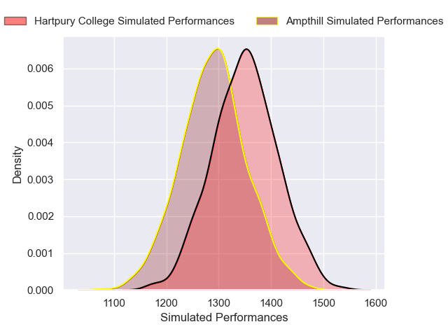
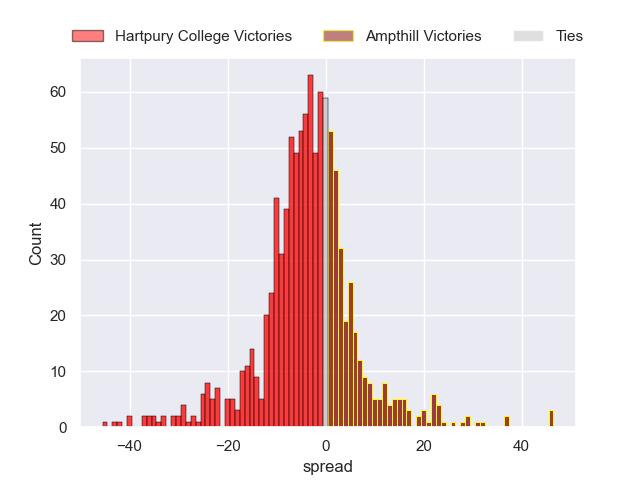

---  
title: "RFU Championship 24/25 Status"  
date: 2025-02-20 6:00:00 -0500  
categories: model review projection  
layout: article  
aside:  
    toc: true  
---
# Current Team Rankings

# Standings

## Current Standings

| Club                |   Played |   Wins |   Point Differential |   Losing Bonus Points |   Try Bonus Points |   Competition Points |
|:--------------------|---------:|-------:|---------------------:|----------------------:|-------------------:|---------------------:|
| Ealing Trailfinders |       12 |     11 |                  390 |                     1 |                 11 |                   56 |
| Bedford             |       12 |      9 |                   67 |                     0 |                  7 |                   43 |
| Coventry            |       12 |      8 |                   44 |                     1 |                  6 |                   39 |
| Nottingham          |       12 |      7 |                  104 |                     3 |                  6 |                   37 |
| Hartpury College    |       11 |      6 |                   24 |                     2 |                  6 |                   32 |
| Cornish Pirates     |       12 |      6 |                  -26 |                     3 |                  5 |                   32 |
| London Scottish     |       12 |      5 |                  -28 |                     3 |                  5 |                   28 |
| Doncaster           |       12 |      5 |                    8 |                     3 |                  4 |                   27 |
| Chinnor             |       12 |      4 |                  -16 |                     3 |                  3 |                   22 |
| Ampthill            |       11 |      4 |                 -149 |                     2 |                  4 |                   22 |
| Caldy               |       12 |      3 |                 -118 |                     2 |                  4 |                   18 |
| Cambridge           |       12 |      3 |                 -300 |                     0 |                  4 |                   16 |

## Projected Remaining Table

| Club                |   Matches Remaining |   Wins |   Point Differential |   Losing Bonus Points |   Try Bonus Points |   Competition Points |
|:--------------------|--------------------:|-------:|---------------------:|----------------------:|-------------------:|---------------------:|
| Ealing Trailfinders |                  10 |    9.3 |            193.529   |                   0.4 |                8.1 |                 45.5 |
| Coventry            |                  10 |    7.6 |             93.7565  |                   1.1 |                6.5 |                 37.9 |
| Bedford             |                  10 |    7.2 |             58.4597  |                   1.3 |                6.3 |                 36.3 |
| Cornish Pirates     |                  10 |    6.9 |             70.5566  |                   1.7 |                5.2 |                 34.4 |
| Hartpury College    |                  11 |    6.6 |             33.9302  |                   2.3 |                5.2 |                 34   |
| Doncaster           |                  10 |    5.6 |             15.6348  |                   2.4 |                4.5 |                 29.2 |
| Nottingham          |                  10 |    4.8 |             -9.85349 |                   1.9 |                4.1 |                 25.3 |
| Ampthill            |                  11 |    3.7 |            -55.754   |                   2.7 |                3.7 |                 21.2 |
| London Scottish     |                  10 |    3.6 |            -39.7215  |                   2.1 |                3.8 |                 20.4 |
| Chinnor             |                  10 |    3.3 |            -62.0063  |                   2.2 |                3   |                 18.5 |
| Caldy               |                  10 |    1.6 |           -119.206   |                   2   |                2.7 |                 11.3 |
| Cambridge           |                  10 |    0.8 |           -179.325   |                   1.1 |                2.4 |                  6.6 |

## Projected Total Table

| Club                |   Total Matches |   Wins |   Point Differential |   Losing Bonus Points |   Try Bonus Points |   Competition Points |
|:--------------------|----------------:|-------:|---------------------:|----------------------:|-------------------:|---------------------:|
| Ealing Trailfinders |              22 |   20.3 |             583.529  |                   1.4 |               19.1 |                101.5 |
| Bedford             |              22 |   16.2 |             125.46   |                   1.3 |               13.3 |                 79.3 |
| Coventry            |              22 |   15.6 |             137.757  |                   2.1 |               12.5 |                 76.9 |
| Cornish Pirates     |              22 |   12.9 |              44.5566 |                   4.7 |               10.2 |                 66.4 |
| Hartpury College    |              22 |   12.6 |              57.9302 |                   4.3 |               11.2 |                 66   |
| Nottingham          |              22 |   11.8 |              94.1465 |                   4.9 |               10.1 |                 62.3 |
| Doncaster           |              22 |   10.6 |              23.6348 |                   5.4 |                8.5 |                 56.2 |
| London Scottish     |              22 |    8.6 |             -67.7215 |                   5.1 |                8.8 |                 48.4 |
| Ampthill            |              22 |    7.7 |            -204.754  |                   4.7 |                7.7 |                 43.2 |
| Chinnor             |              22 |    7.3 |             -78.0063 |                   5.2 |                6   |                 40.5 |
| Caldy               |              22 |    4.6 |            -237.206  |                   4   |                6.7 |                 29.3 |
| Cambridge           |              22 |    3.8 |            -479.325  |                   1.1 |                6.4 |                 22.6 |

# Completed Match Review

| Model | Percent Correct Predictions | Spread Error |
| ------ | ------ | ------ |
| Club Level | 66.2% | 14.5 |
| Player Level: Lineup | 64.4% | 15.5 |
| Player Level: Minutes | 62.2% | 15.6 |

# Future Predictions

## Week 13

### Ampthill V Hartpury College on 2025/02/22

Average Margin: Hartpury College by 4.1

Average Scoreline: 33-29

## Week 14

### Hartpury College V Bedford on 2025/03/22

Average Margin: Hartpury College by 0.4

Average Scoreline: 24-24

### Ampthill V Nottingham on 2025/03/22

Average Margin: Nottingham by 1.5

Average Scoreline: 24-23

### Doncaster V Ealing Trailfinders on 2025/03/22

Average Margin: Ealing Trailfinders by 14.1

Average Scoreline: 36-22

### Cornish Pirates V London Scottish on 2025/03/22

Average Margin: Cornish Pirates by 10.9

Average Scoreline: 30-19

### Caldy V Chinnor on 2025/03/22

Average Margin: Chinnor by 1.4

Average Scoreline: 21-20

### Coventry V Cambridge on 2025/03/22

Average Margin: Coventry by 26.8

Average Scoreline: 43-16

## Week 15

### London Scottish V Doncaster on 2025/03/29

Average Margin: Doncaster by 1.1

Average Scoreline: 22-21

### Ealing Trailfinders V Nottingham on 2025/03/29

Average Margin: Ealing Trailfinders by 22.6

Average Scoreline: 40-18

### Chinnor V Coventry on 2025/03/29

Average Margin: Coventry by 9.8

Average Scoreline: 37-27

### Caldy V Ampthill on 2025/03/29

Average Margin: Ampthill by 1.7

Average Scoreline: 26-24

### Bedford V Cornish Pirates on 2025/03/29

Average Margin: Bedford by 5.4

Average Scoreline: 25-20

### Cambridge V Hartpury College on 2025/03/29

Average Margin: Hartpury College by 14.2

Average Scoreline: 43-29

## Week 16

### Nottingham V London Scottish on 2025/04/05

Average Margin: Nottingham by 6.6

Average Scoreline: 29-22

### Ampthill V Ealing Trailfinders on 2025/04/05

Average Margin: Ealing Trailfinders by 19.0

Average Scoreline: 42-23

### Cornish Pirates V Cambridge on 2025/04/05

Average Margin: Cornish Pirates by 23.1

Average Scoreline: 48-25

### Coventry V Caldy on 2025/04/05

Average Margin: Coventry by 20.3

Average Scoreline: 49-29

### Doncaster V Bedford on 2025/04/05

Average Margin: Bedford by 0.5

Average Scoreline: 25-25

### Hartpury College V Chinnor on 2025/04/05

Average Margin: Hartpury College by 11.6

Average Scoreline: 28-16

## Week 17

### Caldy V Hartpury College on 2025/04/12

Average Margin: Hartpury College by 10.0

Average Scoreline: 33-23

### Coventry V Ampthill on 2025/04/12

Average Margin: Coventry by 14.9

Average Scoreline: 44-29

### Chinnor V Cornish Pirates on 2025/04/12

Average Margin: Cornish Pirates by 6.0

Average Scoreline: 29-23

### Cambridge V Doncaster on 2025/04/12

Average Margin: Doncaster by 13.6

Average Scoreline: 36-22

### London Scottish V Ealing Trailfinders on 2025/04/12

Average Margin: Ealing Trailfinders by 17.5

Average Scoreline: 38-21

### Bedford V Nottingham on 2025/04/12

Average Margin: Bedford by 9.5

Average Scoreline: 31-21

## Week 18

### Ealing Trailfinders V Bedford on 2025/04/19

Average Margin: Ealing Trailfinders by 16.5

Average Scoreline: 40-24

### Hartpury College V Coventry on 2025/04/19

Average Margin: Coventry by 1.7

Average Scoreline: 26-24

### Nottingham V Cambridge on 2025/04/19

Average Margin: Nottingham by 17.5

Average Scoreline: 45-27

### Doncaster V Chinnor on 2025/04/19

Average Margin: Doncaster by 10.4

Average Scoreline: 27-17

### Cornish Pirates V Caldy on 2025/04/19

Average Margin: Cornish Pirates by 17.5

Average Scoreline: 43-26

### Ampthill V London Scottish on 2025/04/19

Average Margin: Ampthill by 2.0

Average Scoreline: 25-23

## Week 19

### Coventry V Cornish Pirates on 2025/05/03

Average Margin: Coventry by 7.2

Average Scoreline: 29-22

### Caldy V Doncaster on 2025/05/03

Average Margin: Doncaster by 8.1

Average Scoreline: 36-27

### Cambridge V Ealing Trailfinders on 2025/05/03

Average Margin: Ealing Trailfinders by 27.3

Average Scoreline: 44-17

### Bedford V London Scottish on 2025/05/03

Average Margin: Bedford by 11.9

Average Scoreline: 38-26

### Hartpury College V Ampthill on 2025/05/03

Average Margin: Hartpury College by 11.0

Average Scoreline: 39-28

### Chinnor V Nottingham on 2025/05/03

Average Margin: Nottingham by 0.8

Average Scoreline: 32-31

## Week 20

### London Scottish V Cambridge on 2025/05/10

Average Margin: London Scottish by 14.7

Average Scoreline: 43-28

### Ampthill V Bedford on 2025/05/10

Average Margin: Bedford by 6.8

Average Scoreline: 33-26

### Nottingham V Caldy on 2025/05/10

Average Margin: Nottingham by 13.2

Average Scoreline: 39-26

### Ealing Trailfinders V Chinnor on 2025/05/10

Average Margin: Ealing Trailfinders by 26.3

Average Scoreline: 34-7

### Doncaster V Coventry on 2025/05/10

Average Margin: Coventry by 2.5

Average Scoreline: 27-25

### Cornish Pirates V Hartpury College on 2025/05/10

Average Margin: Cornish Pirates by 6.0

Average Scoreline: 27-21

## Week 21

### Coventry V Nottingham on 2025/05/17

Average Margin: Coventry by 10.9

Average Scoreline: 38-27

### Chinnor V London Scottish on 2025/05/17

Average Margin: Chinnor by 1.6

Average Scoreline: 29-27

### Cambridge V Bedford on 2025/05/17

Average Margin: Bedford by 15.4

Average Scoreline: 40-24

### Cornish Pirates V Ampthill on 2025/05/17

Average Margin: Cornish Pirates by 12.6

Average Scoreline: 40-27

### Hartpury College V Doncaster on 2025/05/17

Average Margin: Hartpury College by 4.4

Average Scoreline: 26-21

### Caldy V Ealing Trailfinders on 2025/05/17

Average Margin: Ealing Trailfinders by 23.7

Average Scoreline: 42-19

## Week 22

### London Scottish V Caldy on 2025/05/24

Average Margin: London Scottish by 11.2

Average Scoreline: 36-25

### Doncaster V Cornish Pirates on 2025/05/24

Average Margin: Doncaster by 1.2

Average Scoreline: 26-25

### Bedford V Chinnor on 2025/05/24

Average Margin: Bedford by 13.8

Average Scoreline: 31-17

### Ampthill V Cambridge on 2025/05/24

Average Margin: Ampthill by 13.2

Average Scoreline: 40-27

### Ealing Trailfinders V Coventry on 2025/05/24

Average Margin: Ealing Trailfinders by 14.3

Average Scoreline: 39-25

### Nottingham V Hartpury College on 2025/05/24

Average Margin: Nottingham by 1.7

Average Scoreline: 25-23

## Week 23

### Coventry V London Scottish on 2025/05/31

Average Margin: Coventry by 13.9

Average Scoreline: 40-26

### Ampthill V Doncaster on 2025/05/31

Average Margin: Doncaster by 2.7

Average Scoreline: 28-25

### Hartpury College V Ealing Trailfinders on 2025/05/31

Average Margin: Ealing Trailfinders by 12.3

Average Scoreline: 35-23

### Chinnor V Cambridge on 2025/05/31

Average Margin: Chinnor by 13.5

Average Scoreline: 42-29

### Cornish Pirates V Nottingham on 2025/05/31

Average Margin: Cornish Pirates by 8.3

Average Scoreline: 29-21

### Caldy V Bedford on 2025/05/31

Average Margin: Bedford by 12.1

Average Scoreline: 38-26

