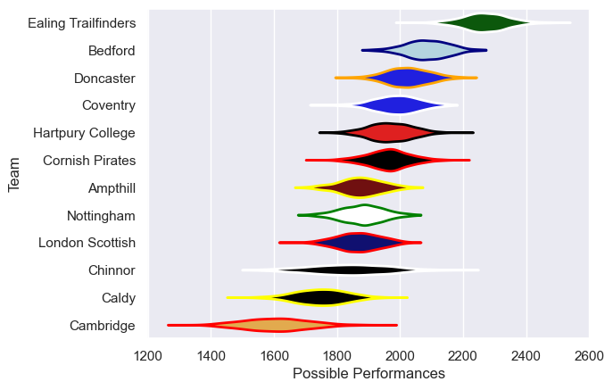

---  
title: "RFU Championship 24/25 Status"  
date: 2025-07-28 6:00:00 -0500  
categories: model review projection  
layout: article  
aside:  
    toc: true  
---
# Current Team Rankings

# Standings

## Current Standings

| Club                |   Played |   Wins |   Point Differential |   Losing Bonus Points |   Try Bonus Points |   Competition Points |
|:--------------------|---------:|-------:|---------------------:|----------------------:|-------------------:|---------------------:|
| Ealing Trailfinders |       22 |     19 |                  695 |                     3 |                 16 |                   95 |
| Bedford             |       22 |     17 |                  272 |                     1 |                 13 |                   82 |
| Doncaster           |       22 |     15 |                  185 |                     3 |                  9 |                   72 |
| Cornish Pirates     |       22 |     14 |                   -3 |                     3 |                 10 |                   69 |
| Coventry            |       22 |     13 |                  111 |                     4 |                 11 |                   67 |
| Hartpury College    |       22 |     12 |                   38 |                     3 |                 12 |                   65 |
| Nottingham          |       22 |      9 |                  -84 |                     6 |                 10 |                   52 |
| Ampthill            |       22 |      9 |                 -180 |                     5 |                  9 |                   50 |
| London Scottish     |       22 |      9 |                  -98 |                     3 |                  9 |                   48 |
| Chinnor             |       22 |      7 |                  -58 |                     5 |                  6 |                   41 |
| Caldy               |       22 |      4 |                 -237 |                     6 |                  6 |                   28 |
| Cambridge           |       22 |      3 |                 -641 |                     0 |                  6 |                   18 |

# Completed Match Review

| Model | Percent Correct Predictions | Spread Error |
| ------ | ------ | ------ |
| Club Level | 72.7% | 14.5 |
| Player Level: Lineup | nan% | nan |
| Player Level: Minutes | nan% | nan |

