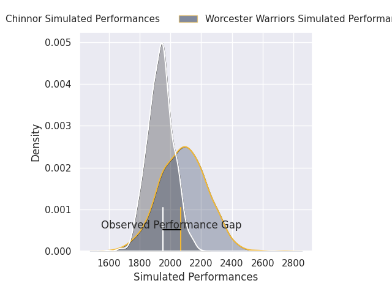
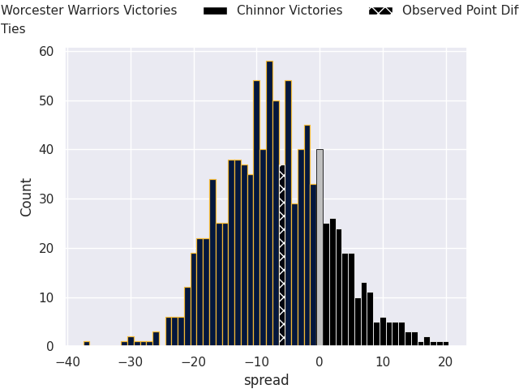
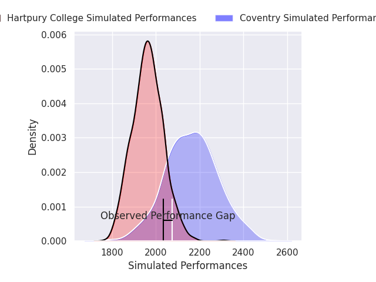
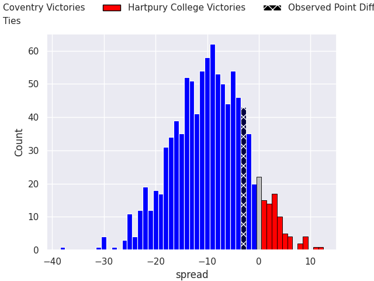

# Team Rankings

# Standings

## Current Standings

| Club                |   Played |   Wins |   Point Differential |   Losing Bonus Points |   Try Bonus Points |   Competition Points |
|:--------------------|---------:|-------:|---------------------:|----------------------:|-------------------:|---------------------:|
| Ealing Trailfinders |       26 |     26 |                  688 |                     0 |                  8 |                  112 |
| Bedford             |       26 |     18 |                  159 |                     3 |                 10 |                   87 |
| Coventry            |       26 |     16 |                  330 |                     7 |                  8 |                   79 |
| Worcester Warriors  |       26 |     15 |                  247 |                     6 |                  7 |                   73 |
| Chinnor             |       26 |     16 |                   62 |                     6 |                  2 |                   72 |
| Hartpury College    |       26 |     15 |                  140 |                     3 |                  4 |                   71 |
| Nottingham          |       26 |     12 |                   -8 |                     8 |                  8 |                   66 |
| Cornish Pirates     |       26 |     13 |                   99 |                     3 |                  6 |                   63 |
| Doncaster           |       26 |     12 |                   74 |                     4 |                  4 |                   62 |
| Ampthill            |       26 |     12 |                  -62 |                     5 |                  4 |                   57 |
| Caldy               |       26 |      9 |                 -240 |                     5 |                  6 |                   47 |
| Richmond            |       26 |      7 |                 -298 |                     4 |                  1 |                   35 |
| London Scottish     |       26 |      6 |                 -448 |                     3 |                  2 |                   29 |
| Cambridge           |       26 |      0 |                 -743 |                     4 |                  4 |                   10 |

## Projected Remaining Table

| Club               |   To Play |   Projected Wins |   Projected Differential |   Projected Losing Bonus Points | Projected Try Bonus Points   |   Projected Competition Points |
|:-------------------|----------:|-----------------:|-------------------------:|--------------------------------:|:-----------------------------|-------------------------------:|
| Coventry           |         1 |            0.911 |                    9.702 |                           0.056 |                              |                          3.75  |
| Worcester Warriors |         1 |            0.739 |                    5.993 |                           0.169 |                              |                          3.197 |
| Chinnor            |         1 |            0.225 |                   -5.993 |                           0.317 |                              |                          1.289 |
| Hartpury College   |         1 |            0.064 |                   -9.702 |                           0.281 |                              |                          0.587 |

## Projected Total Table

| Club                |   Played |   Wins |   Point Differential |   Losing Bonus Points |   Try Bonus Points |   Competition Points |
|:--------------------|---------:|-------:|---------------------:|----------------------:|-------------------:|---------------------:|
| Ealing Trailfinders |       26 | 26     |              688     |                 0     |                  8 |              112     |
| Bedford             |       26 | 18     |              159     |                 3     |                 10 |               87     |
| Coventry            |       27 | 16.911 |              339.702 |                 7.056 |                  8 |               82.75  |
| Worcester Warriors  |       27 | 15.739 |              252.993 |                 6.169 |                  7 |               76.197 |
| Chinnor             |       27 | 16.225 |               56.007 |                 6.317 |                  2 |               73.289 |
| Hartpury College    |       27 | 15.064 |              130.298 |                 3.281 |                  4 |               71.587 |
| Nottingham          |       26 | 12     |               -8     |                 8     |                  8 |               66     |
| Cornish Pirates     |       26 | 13     |               99     |                 3     |                  6 |               63     |
| Doncaster           |       26 | 12     |               74     |                 4     |                  4 |               62     |
| Ampthill            |       26 | 12     |              -62     |                 5     |                  4 |               57     |
| Caldy               |       26 |  9     |             -240     |                 5     |                  6 |               47     |
| Richmond            |       26 |  7     |             -298     |                 4     |                  1 |               35     |
| London Scottish     |       26 |  6     |             -448     |                 3     |                  2 |               29     |
| Cambridge           |       26 |  0     |             -743     |                 4     |                  4 |               10     |

# Completed Match Review

| Model | Percent Correct Predictions | Spread Error |
| ------ | ------ | ------ |
| Club Level | 72.3% | 13.8 |
| Player Level: Lineup | nan% | nan |
| Player Level: Minutes | nan% | nan |

# Future Predictions

## Week 27

### Worcester Warriors V Chinnor on 2026/05/16

Average Margin: Worcester Warriors by 6.0

### Coventry V Hartpury College RFC on 2026/05/16

Average Margin: Coventry by 9.7

