# Team Rankings

# Standings

## Current Standings

| Club                |   Played |   Wins |   Point Differential |   Losing Bonus Points |   Try Bonus Points |   Competition Points |
|:--------------------|---------:|-------:|---------------------:|----------------------:|-------------------:|---------------------:|
| Ealing Trailfinders |       18 |     18 |                  502 |                     0 |                  8 |                   80 |
| Bedford             |       18 |     12 |                  109 |                     2 |                 10 |                   62 |
| Worcester Warriors  |       18 |     12 |                  228 |                     5 |                  7 |                   60 |
| Coventry            |       18 |     10 |                  137 |                     5 |                  8 |                   53 |
| Hartpury College    |       18 |     11 |                   25 |                     1 |                  4 |                   51 |
| Chinnor             |       18 |     11 |                   29 |                     4 |                  2 |                   50 |
| Nottingham          |       18 |      8 |                   38 |                     7 |                  8 |                   49 |
| Cornish Pirates     |       18 |      9 |                   47 |                     3 |                  6 |                   47 |
| Doncaster           |       18 |      7 |                   68 |                     4 |                  4 |                   42 |
| Caldy               |       18 |      8 |                  -94 |                     2 |                  6 |                   40 |
| Ampthill            |       18 |      6 |                 -272 |                     3 |                  4 |                   31 |
| Richmond            |       18 |      6 |                 -137 |                     4 |                  1 |                   29 |
| London Scottish     |       18 |      4 |                 -275 |                     2 |                  2 |                   20 |
| Cambridge           |       18 |      0 |                 -405 |                     4 |                  4 |                   10 |

## Projected Remaining Table

| Club                |   To Play |   Projected Wins |   Projected Differential |   Projected Losing Bonus Points | Projected Try Bonus Points   |   Projected Competition Points |
|:--------------------|----------:|-----------------:|-------------------------:|--------------------------------:|:-----------------------------|-------------------------------:|
| Ealing Trailfinders |         8 |            5.809 |                   75.055 |                           1.049 |                              |                         24.785 |
| Hartpury College    |         8 |            5.053 |                   33.717 |                           1.47  |                              |                         22.298 |
| Coventry            |         8 |            4.894 |                   31.198 |                           1.558 |                              |                         21.806 |
| Doncaster           |         8 |            4.546 |                   18.821 |                           1.612 |                              |                         20.488 |
| Bedford             |         8 |            4.56  |                   16.52  |                           1.476 |                              |                         20.368 |
| Worcester Warriors  |         8 |            4.284 |                   17.344 |                           1.798 |                              |                         19.62  |
| Chinnor             |         8 |            3.936 |                    7.582 |                           1.828 |                              |                         18.346 |
| Cornish Pirates     |         8 |            3.684 |                   -4.486 |                           1.891 |                              |                         17.401 |
| Ampthill            |         8 |            3.531 |                   -7.441 |                           1.983 |                              |                         16.839 |
| Nottingham          |         8 |            3.236 |                  -19.119 |                           1.907 |                              |                         15.513 |
| Richmond            |         8 |            2.768 |                  -29.043 |                           2.032 |                              |                         13.818 |
| Caldy               |         8 |            2.645 |                  -33.658 |                           1.979 |                              |                         13.253 |
| London Scottish     |         8 |            2.68  |                  -40.04  |                           1.899 |                              |                         13.219 |
| Cambridge           |         8 |            2.042 |                  -66.45  |                           1.493 |                              |                         10.221 |

## Projected Total Table

| Club                |   Played |   Wins |   Point Differential |   Losing Bonus Points |   Try Bonus Points |   Competition Points |
|:--------------------|---------:|-------:|---------------------:|----------------------:|-------------------:|---------------------:|
| Ealing Trailfinders |       26 | 23.809 |              577.055 |                 1.049 |                  8 |              104.785 |
| Bedford             |       26 | 16.56  |              125.52  |                 3.476 |                 10 |               82.368 |
| Worcester Warriors  |       26 | 16.284 |              245.344 |                 6.798 |                  7 |               79.62  |
| Coventry            |       26 | 14.894 |              168.198 |                 6.558 |                  8 |               74.806 |
| Hartpury College    |       26 | 16.053 |               58.717 |                 2.47  |                  4 |               73.298 |
| Chinnor             |       26 | 14.936 |               36.582 |                 5.828 |                  2 |               68.346 |
| Nottingham          |       26 | 11.236 |               18.881 |                 8.907 |                  8 |               64.513 |
| Cornish Pirates     |       26 | 12.684 |               42.514 |                 4.891 |                  6 |               64.401 |
| Doncaster           |       26 | 11.546 |               86.821 |                 5.612 |                  4 |               62.488 |
| Caldy               |       26 | 10.645 |             -127.658 |                 3.979 |                  6 |               53.253 |
| Ampthill            |       26 |  9.531 |             -279.441 |                 4.983 |                  4 |               47.839 |
| Richmond            |       26 |  8.768 |             -166.043 |                 6.032 |                  1 |               42.818 |
| London Scottish     |       26 |  6.68  |             -315.04  |                 3.899 |                  2 |               33.219 |
| Cambridge           |       26 |  2.042 |             -471.45  |                 5.493 |                  4 |               20.221 |

# Completed Match Review

| Model | Percent Correct Predictions | Spread Error |
| ------ | ------ | ------ |
| Club Level | 67.0% | 11.6 |
| Player Level: Lineup | nan% | nan |
| Player Level: Minutes | nan% | nan |

# Future Predictions

## Week 19

### London Scottish V Chinnor on 2026/02/28

Average Margin: Chinnor by 2.4

### Hartpury College V Richmond on 2026/02/28

Average Margin: Hartpury College by 8.3

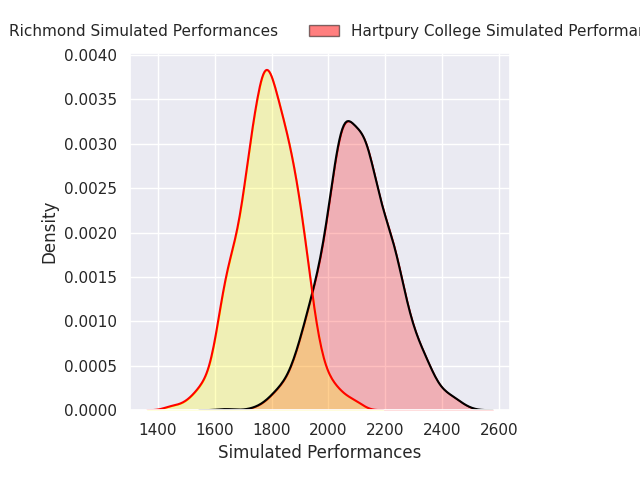

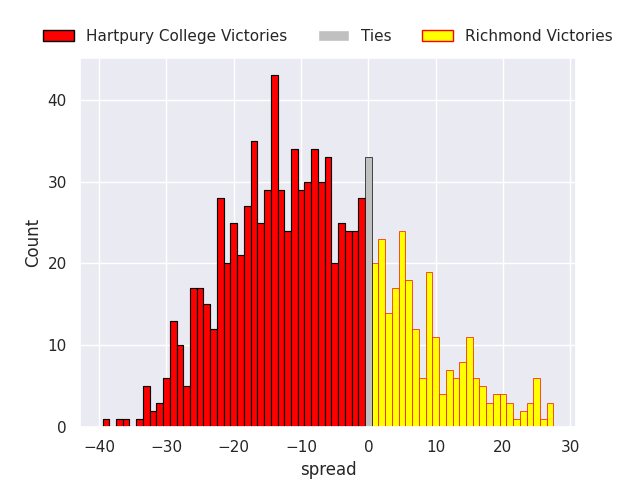

### Ampthill V Coventry on 2026/02/28

Average Margin: Coventry by 2.9

### Caldy V Bedford on 2026/02/28

Average Margin: Bedford by 4.4

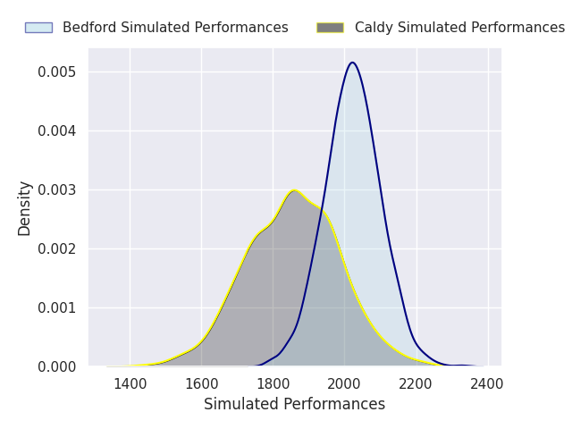

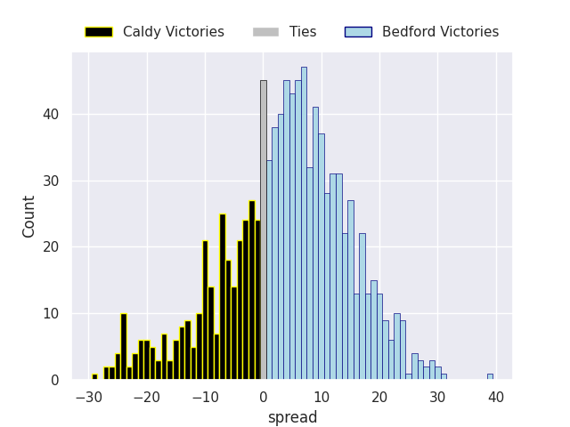

### Nottingham V Worcester Warriors on 2026/02/28

Average Margin: Worcester Warriors by 1.2

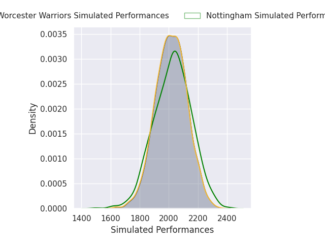

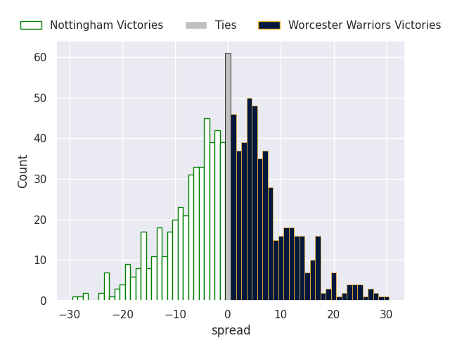

### Cambridge V Cornish Pirates on 2026/02/28

Average Margin: Cornish Pirates by 5.8

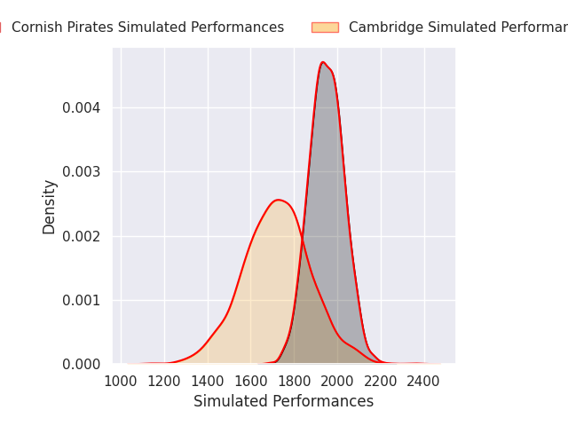

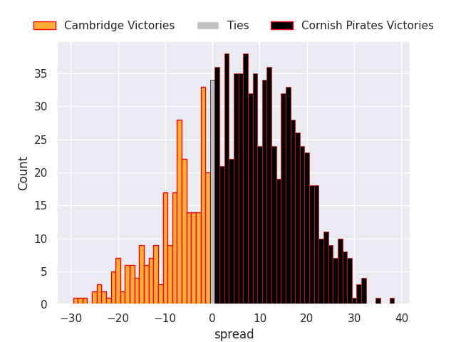

### Doncaster V Ealing Trailfinders on 2026/02/28

Average Margin: Ealing Trailfinders by 4.8

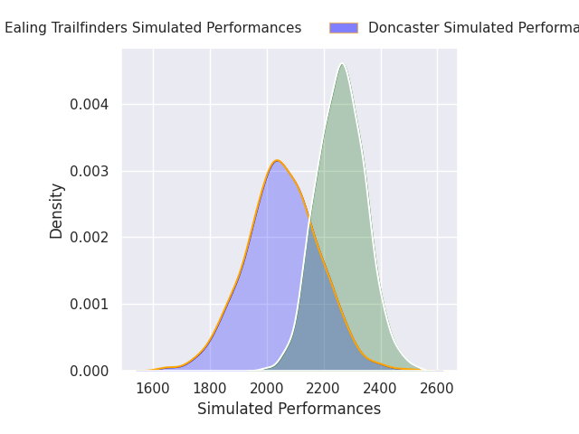
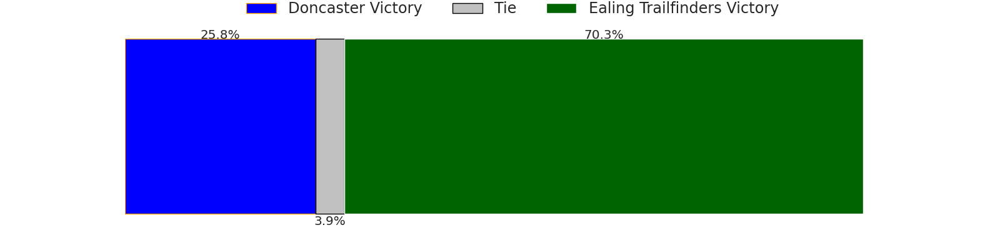
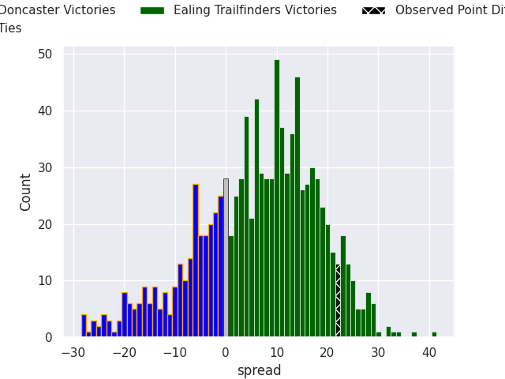

## Week 20

### Coventry V Doncaster on 2026/03/21

Average Margin: Coventry by 3.3

### Chinnor V Caldy on 2026/03/21

Average Margin: Chinnor by 4.5

### Worcester Warriors V Cambridge on 2026/03/21

Average Margin: Worcester Warriors by 12.8

### Bedford V Nottingham on 2026/03/21

Average Margin: Bedford by 4.8

### Ealing Trailfinders V London Scottish on 2026/03/21

Average Margin: Ealing Trailfinders by 16.2

### Richmond V Cornish Pirates on 2026/03/21

Average Margin: Cornish Pirates by 1.2

### Hartpury College V Ampthill on 2026/03/21

Average Margin: Hartpury College by 6.4

## Week 21

### Nottingham V Chinnor on 2026/03/28

Average Margin: Nottingham by 2.2

### Ampthill V Richmond on 2026/03/28

Average Margin: Ampthill by 2.6

### Doncaster V Hartpury College on 2026/03/28

Average Margin: Doncaster by 3.2

### Cornish Pirates V Worcester Warriors on 2026/03/28

Average Margin: Worcester Warriors by 0.5

### London Scottish V Coventry on 2026/03/28

Average Margin: Coventry by 5.5

### Caldy V Ealing Trailfinders on 2026/03/28

Average Margin: Ealing Trailfinders by 10.7

### Cambridge V Bedford on 2026/03/28

Average Margin: Bedford by 7.5

## Week 22

### Hartpury College V London Scottish on 2026/04/04

Average Margin: Hartpury College by 7.7

### Richmond V Worcester Warriors on 2026/04/04

Average Margin: Worcester Warriors by 3.6

### Coventry V Caldy on 2026/04/04

Average Margin: Coventry by 7.0

### Chinnor V Cambridge on 2026/04/04

Average Margin: Chinnor by 8.1

### Bedford V Cornish Pirates on 2026/04/04

Average Margin: Bedford by 3.2

### Ampthill V Doncaster on 2026/04/04

Average Margin: Doncaster by 2.3

### Ealing Trailfinders V Nottingham on 2026/04/04

Average Margin: Ealing Trailfinders by 11.2

## Week 23

### Doncaster V Richmond on 2026/04/11

Average Margin: Doncaster by 6.5

### Cambridge V Ealing Trailfinders on 2026/04/11

Average Margin: Ealing Trailfinders by 12.8

### Cornish Pirates V Chinnor on 2026/04/11

Average Margin: Cornish Pirates by 3.6

### London Scottish V Ampthill on 2026/04/11

Average Margin: Ampthill by 0.0

### Nottingham V Coventry on 2026/04/11

Average Margin: Coventry by 0.5

### Worcester Warriors V Bedford on 2026/04/11

Average Margin: Worcester Warriors by 3.1

### Caldy V Hartpury College on 2026/04/11

Average Margin: Hartpury College by 2.6

## Week 24

### Chinnor V Worcester Warriors on 2026/04/18

Average Margin: Worcester Warriors by 1.0

### Doncaster V London Scottish on 2026/04/18

Average Margin: Doncaster by 8.5

### Ampthill V Caldy on 2026/04/18

Average Margin: Ampthill by 2.2

### Coventry V Cambridge on 2026/04/18

Average Margin: Coventry by 11.3

### Ealing Trailfinders V Cornish Pirates on 2026/04/18

Average Margin: Ealing Trailfinders by 9.9

### Hartpury College V Nottingham on 2026/04/18

Average Margin: Hartpury College by 4.7

### Richmond V Bedford on 2026/04/18

Average Margin: Bedford by 2.5

## Week 25

### Bedford V Chinnor on 2026/05/02

Average Margin: Bedford by 4.5

### Cambridge V Hartpury College on 2026/05/02

Average Margin: Hartpury College by 3.7

### Cornish Pirates V Coventry on 2026/05/02

Average Margin: Cornish Pirates by 1.9

### London Scottish V Richmond on 2026/05/02

Average Margin: London Scottish by 0.5

### Nottingham V Ampthill on 2026/05/02

Average Margin: Nottingham by 5.0

### Worcester Warriors V Ealing Trailfinders on 2026/05/02

Average Margin: Ealing Trailfinders by 2.2

### Caldy V Doncaster on 2026/05/02

Average Margin: Doncaster by 2.5

## Week 26

### Doncaster V Nottingham on 2026/05/09

Average Margin: Doncaster by 3.9

### Ealing Trailfinders V Bedford on 2026/05/09

Average Margin: Ealing Trailfinders by 7.4

### Ampthill V Cambridge on 2026/05/09

Average Margin: Ampthill by 4.4

### London Scottish V Caldy on 2026/05/09

Average Margin: Caldy by 0.3

### Chinnor V Richmond on 2026/05/09

Average Margin: Chinnor by 3.7

### Coventry V Worcester Warriors on 2026/05/09

Average Margin: Coventry by 2.5

### Hartpury College V Cornish Pirates on 2026/05/09

Average Margin: Hartpury College by 3.5

