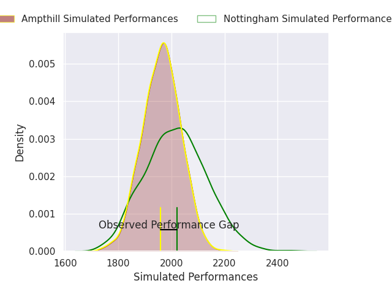
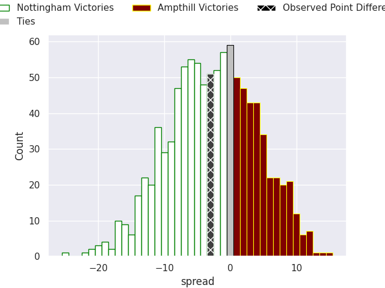

# Team Rankings

# Standings

## Current Standings

| Club                |   Played |   Wins |   Point Differential |   Losing Bonus Points |   Try Bonus Points |   Competition Points |
|:--------------------|---------:|-------:|---------------------:|----------------------:|-------------------:|---------------------:|
| Ealing Trailfinders |       24 |     24 |                  644 |                     0 |                  8 |                  104 |
| Bedford             |       24 |     17 |                  195 |                     3 |                 10 |                   83 |
| Coventry            |       24 |     15 |                  299 |                     6 |                  8 |                   74 |
| Worcester Warriors  |       24 |     15 |                  289 |                     5 |                  7 |                   72 |
| Chinnor             |       24 |     15 |                   49 |                     5 |                  2 |                   67 |
| Hartpury College    |       24 |     13 |                   75 |                     3 |                  4 |                   63 |
| Nottingham          |       24 |     11 |                   -2 |                     8 |                  8 |                   62 |
| Cornish Pirates     |       24 |     12 |                  103 |                     3 |                  6 |                   59 |
| Doncaster           |       24 |     10 |                   45 |                     4 |                  4 |                   54 |
| Ampthill            |       24 |     11 |                 -101 |                     4 |                  4 |                   52 |
| Caldy               |       24 |      9 |                 -215 |                     4 |                  6 |                   46 |
| Richmond            |       24 |      6 |                 -290 |                     4 |                  1 |                   31 |
| London Scottish     |       24 |      5 |                 -446 |                     2 |                  2 |                   24 |
| Cambridge           |       24 |      0 |                 -645 |                     4 |                  4 |                   10 |

## Projected Remaining Table

| Club                |   To Play |   Projected Wins |   Projected Differential |   Projected Losing Bonus Points | Projected Try Bonus Points   |   Projected Competition Points |
|:--------------------|----------:|-----------------:|-------------------------:|--------------------------------:|:-----------------------------|-------------------------------:|
| Ealing Trailfinders |         2 |            1.761 |                   22.501 |                           0.159 |                              |                          7.275 |
| Hartpury College    |         2 |            1.671 |                   19.158 |                           0.216 |                              |                          7.026 |
| Doncaster           |         2 |            1.589 |                   12.562 |                           0.297 |                              |                          6.777 |
| Ampthill            |         2 |            1.353 |                   18.723 |                           0.359 |                              |                          5.871 |
| Coventry            |         2 |            1.284 |                    7.619 |                           0.455 |                              |                          5.769 |
| London Scottish     |         2 |            1.011 |                    0.9   |                           0.595 |                              |                          4.797 |
| Chinnor             |         2 |            1.032 |                    5.031 |                           0.314 |                              |                          4.516 |
| Bedford             |         2 |            0.928 |                   -5.062 |                           0.222 |                              |                          3.988 |
| Caldy               |         2 |            0.769 |                   -4.235 |                           0.65  |                              |                          3.86  |
| Cornish Pirates     |         2 |            0.726 |                   -4.277 |                           0.697 |                              |                          3.811 |
| Nottingham          |         2 |            0.747 |                   -4.221 |                           0.648 |                              |                          3.802 |
| Richmond            |         2 |            0.372 |                  -17.39  |                           0.514 |                              |                          2.114 |
| Worcester Warriors  |         2 |            0.303 |                  -15.657 |                           0.6   |                              |                          1.936 |
| Cambridge           |         2 |            0.038 |                  -35.652 |                           0.199 |                              |                          0.383 |

## Projected Total Table

| Club                |   Played |   Wins |   Point Differential |   Losing Bonus Points |   Try Bonus Points |   Competition Points |
|:--------------------|---------:|-------:|---------------------:|----------------------:|-------------------:|---------------------:|
| Ealing Trailfinders |       26 | 25.761 |              666.501 |                 0.159 |                  8 |              111.275 |
| Bedford             |       26 | 17.928 |              189.938 |                 3.222 |                 10 |               86.988 |
| Coventry            |       26 | 16.284 |              306.619 |                 6.455 |                  8 |               79.769 |
| Worcester Warriors  |       26 | 15.303 |              273.343 |                 5.6   |                  7 |               73.936 |
| Chinnor             |       26 | 16.032 |               54.031 |                 5.314 |                  2 |               71.516 |
| Hartpury College    |       26 | 14.671 |               94.158 |                 3.216 |                  4 |               70.026 |
| Nottingham          |       26 | 11.747 |               -6.221 |                 8.648 |                  8 |               65.802 |
| Cornish Pirates     |       26 | 12.726 |               98.723 |                 3.697 |                  6 |               62.811 |
| Doncaster           |       26 | 11.589 |               57.562 |                 4.297 |                  4 |               60.777 |
| Ampthill            |       26 | 12.353 |              -82.277 |                 4.359 |                  4 |               57.871 |
| Caldy               |       26 |  9.769 |             -219.235 |                 4.65  |                  6 |               49.86  |
| Richmond            |       26 |  6.372 |             -307.39  |                 4.514 |                  1 |               33.114 |
| London Scottish     |       26 |  6.011 |             -445.1   |                 2.595 |                  2 |               28.797 |
| Cambridge           |       26 |  0.038 |             -680.652 |                 4.199 |                  4 |               10.383 |

# Completed Match Review

| Model | Percent Correct Predictions | Spread Error |
| ------ | ------ | ------ |
| Club Level | 72.0% | 13.6 |
| Player Level: Lineup | nan% | nan |
| Player Level: Minutes | nan% | nan |

# Future Predictions

## Week 25

### Nottingham V Ampthill on 2026/05/01

Average Margin: Nottingham by 2.4

### Cornish Pirates V Coventry on 2026/05/02

Average Margin: Cornish Pirates by 0.3

### Caldy V Doncaster on 2026/05/02

Average Margin: Doncaster by 6.0

### Bedford V Chinnor on 2026/05/02

Average Margin: Bedford by 9.7

### London Scottish V Richmond on 2026/05/02

Average Margin: London Scottish by 2.7

### Cambridge V Hartpury College RFC on 2026/05/02

Average Margin: Hartpury College by 14.6

### Worcester Warriors V Ealing Trailfinders on 2026/05/02

Average Margin: Ealing Trailfinders by 7.7

## Week 26

### Hartpury College V Cornish Pirates on 2026/05/09

Average Margin: Hartpury College by 4.6

### Ampthill V Cambridge on 2026/05/09

Average Margin: Ampthill by 21.1

### Chinnor V Richmond on 2026/05/09

Average Margin: Chinnor by 14.7

### Coventry V Worcester Warriors on 2026/05/09

Average Margin: Coventry by 7.9

### Ealing Trailfinders V Bedford on 2026/05/09

Average Margin: Ealing Trailfinders by 14.8

### Doncaster V Nottingham on 2026/05/09

Average Margin: Doncaster by 6.6

### London Scottish V Caldy on 2026/05/09

Average Margin: Caldy by 1.8

