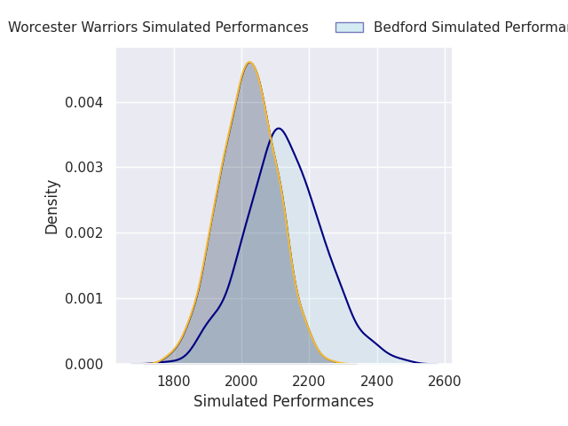
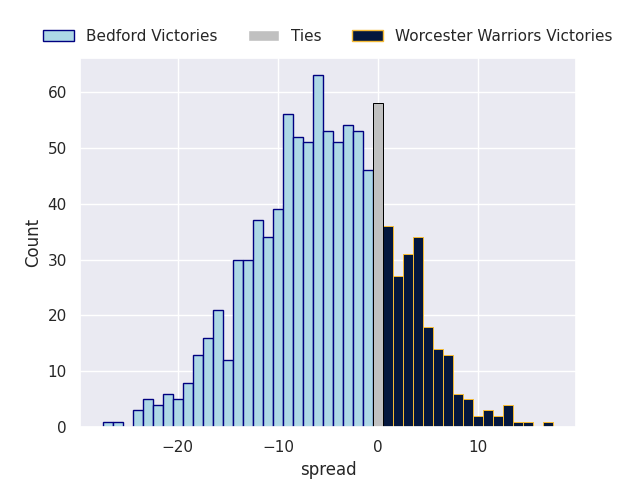

# Team Rankings

# Standings

## Current Standings

| Club                |   Played |   Wins |   Point Differential |   Losing Bonus Points |   Try Bonus Points |   Competition Points |
|:--------------------|---------:|-------:|---------------------:|----------------------:|-------------------:|---------------------:|
| Ealing Trailfinders |       27 |     26 |                  683 |                     1 |                  8 |                  113 |
| Bedford             |       27 |     19 |                  193 |                     3 |                 10 |                   91 |
| Coventry            |       28 |     17 |                  299 |                     7 |                  8 |                   83 |
| Worcester Warriors  |       28 |     17 |                  258 |                     6 |                  7 |                   81 |
| Chinnor             |       27 |     16 |                   56 |                     7 |                  2 |                   73 |
| Hartpury College    |       27 |     15 |                  137 |                     4 |                  4 |                   72 |
| Nottingham          |       26 |     12 |                   -8 |                     8 |                  8 |                   66 |
| Cornish Pirates     |       26 |     13 |                   99 |                     3 |                  6 |                   63 |
| Doncaster           |       26 |     12 |                   74 |                     4 |                  4 |                   62 |
| Ampthill            |       26 |     12 |                  -62 |                     5 |                  4 |                   57 |
| Caldy               |       26 |      9 |                 -240 |                     5 |                  6 |                   47 |
| Richmond            |       27 |      8 |                 -275 |                     4 |                  1 |                   39 |
| London Scottish     |       27 |      6 |                 -471 |                     3 |                  2 |                   29 |
| Cambridge           |       26 |      0 |                 -743 |                     4 |                  4 |                   10 |

## Projected Remaining Table

| Club               |   To Play |   Projected Wins |   Projected Differential |   Projected Losing Bonus Points | Projected Try Bonus Points   |   Projected Competition Points |
|:-------------------|----------:|-----------------:|-------------------------:|--------------------------------:|:-----------------------------|-------------------------------:|
| Bedford            |         1 |            0.718 |                    5.197 |                           0.205 |                              |                          3.159 |
| Worcester Warriors |         1 |            0.241 |                   -5.197 |                           0.348 |                              |                          1.394 |

## Projected Total Table

| Club                |   Played |   Wins |   Point Differential |   Losing Bonus Points |   Try Bonus Points |   Competition Points |
|:--------------------|---------:|-------:|---------------------:|----------------------:|-------------------:|---------------------:|
| Ealing Trailfinders |       27 | 26     |              683     |                 1     |                  8 |              113     |
| Bedford             |       28 | 19.718 |              198.197 |                 3.205 |                 10 |               94.159 |
| Coventry            |       28 | 17     |              299     |                 7     |                  8 |               83     |
| Worcester Warriors  |       29 | 17.241 |              252.803 |                 6.348 |                  7 |               82.394 |
| Chinnor             |       27 | 16     |               56     |                 7     |                  2 |               73     |
| Hartpury College    |       27 | 15     |              137     |                 4     |                  4 |               72     |
| Nottingham          |       26 | 12     |               -8     |                 8     |                  8 |               66     |
| Cornish Pirates     |       26 | 13     |               99     |                 3     |                  6 |               63     |
| Doncaster           |       26 | 12     |               74     |                 4     |                  4 |               62     |
| Ampthill            |       26 | 12     |              -62     |                 5     |                  4 |               57     |
| Caldy               |       26 |  9     |             -240     |                 5     |                  6 |               47     |
| Richmond            |       27 |  8     |             -275     |                 4     |                  1 |               39     |
| London Scottish     |       27 |  6     |             -471     |                 3     |                  2 |               29     |
| Cambridge           |       26 |  0     |             -743     |                 4     |                  4 |               10     |

# Completed Match Review

| Model | Percent Correct Predictions | Spread Error |
| ------ | ------ | ------ |
| Club Level | 72.3% | 13.9 |
| Player Level: Lineup | nan% | nan |
| Player Level: Minutes | nan% | nan |

# Future Predictions

## Week 29

### Bedford V Worcester Warriors on 2026/05/31

Average Margin: Bedford by 5.2

