# Team Rankings

# Standings

## Current Standings

| Club                |   Played |   Wins |   Point Differential |   Losing Bonus Points |   Try Bonus Points |   Competition Points |
|:--------------------|---------:|-------:|---------------------:|----------------------:|-------------------:|---------------------:|
| Ealing Trailfinders |       16 |     16 |                  437 |                     0 |                  8 |                   72 |
| Bedford             |       16 |     11 |                  119 |                     2 |                 10 |                   58 |
| Worcester Warriors  |       16 |     10 |                  152 |                     5 |                  7 |                   52 |
| Hartpury College    |       16 |     11 |                   64 |                     1 |                  4 |                   51 |
| Chinnor             |       16 |     10 |                   45 |                     4 |                  2 |                   46 |
| Coventry            |       16 |      8 |                   98 |                     5 |                  8 |                   45 |
| Nottingham          |       16 |      7 |                   39 |                     6 |                  8 |                   44 |
| Caldy               |       16 |      8 |                  -57 |                     2 |                  6 |                   40 |
| Cornish Pirates     |       16 |      7 |                   22 |                     3 |                  6 |                   39 |
| Doncaster           |       16 |      5 |                   13 |                     4 |                  4 |                   34 |
| Ampthill            |       16 |      6 |                 -233 |                     2 |                  4 |                   30 |
| Richmond            |       16 |      5 |                 -126 |                     4 |                  1 |                   25 |
| London Scottish     |       16 |      4 |                 -188 |                     2 |                  2 |                   20 |
| Cambridge           |       16 |      0 |                 -385 |                     3 |                  4 |                    9 |

## Projected Remaining Table

| Club                |   To Play |   Projected Wins |   Projected Differential |   Projected Losing Bonus Points | Projected Try Bonus Points   |   Projected Competition Points |
|:--------------------|----------:|-----------------:|-------------------------:|--------------------------------:|:-----------------------------|-------------------------------:|
| Ealing Trailfinders |        10 |            7.111 |                   83.745 |                           1.35  |                              |                         30.494 |
| Coventry            |        10 |            6.201 |                   38.413 |                           1.88  |                              |                         27.53  |
| Hartpury College    |        10 |            5.901 |                   30.674 |                           1.925 |                              |                         26.323 |
| Bedford             |        10 |            5.898 |                   28.031 |                           1.811 |                              |                         26.257 |
| Chinnor             |        10 |            5.605 |                   23.175 |                           2.037 |                              |                         25.339 |
| Worcester Warriors  |        10 |            5.23  |                   17.569 |                           2.209 |                              |                         24.025 |
| Doncaster           |        10 |            4.633 |                   -2.837 |                           2.446 |                              |                         21.954 |
| Cornish Pirates     |        10 |            4.598 |                   -7.708 |                           2.342 |                              |                         21.618 |
| Nottingham          |        10 |            4.469 |                   -5.208 |                           2.332 |                              |                         21.14  |
| Ampthill            |        10 |            4.182 |                  -22.869 |                           2.31  |                              |                         19.916 |
| Richmond            |        10 |            3.747 |                  -26.579 |                           2.401 |                              |                         18.271 |
| Caldy               |        10 |            3.447 |                  -35.67  |                           2.549 |                              |                         17.253 |
| London Scottish     |        10 |            3.476 |                  -40.491 |                           2.432 |                              |                         17.144 |
| Cambridge           |        10 |            2.518 |                  -80.245 |                           1.975 |                              |                         12.735 |

## Projected Total Table

| Club                |   Played |   Wins |   Point Differential |   Losing Bonus Points |   Try Bonus Points |   Competition Points |
|:--------------------|---------:|-------:|---------------------:|----------------------:|-------------------:|---------------------:|
| Ealing Trailfinders |       26 | 23.111 |              520.745 |                 1.35  |                  8 |              102.494 |
| Bedford             |       26 | 16.898 |              147.031 |                 3.811 |                 10 |               84.257 |
| Hartpury College    |       26 | 16.901 |               94.674 |                 2.925 |                  4 |               77.323 |
| Worcester Warriors  |       26 | 15.23  |              169.569 |                 7.209 |                  7 |               76.025 |
| Coventry            |       26 | 14.201 |              136.413 |                 6.88  |                  8 |               72.53  |
| Chinnor             |       26 | 15.605 |               68.175 |                 6.037 |                  2 |               71.339 |
| Nottingham          |       26 | 11.469 |               33.792 |                 8.332 |                  8 |               65.14  |
| Cornish Pirates     |       26 | 11.598 |               14.292 |                 5.342 |                  6 |               60.618 |
| Caldy               |       26 | 11.447 |              -92.67  |                 4.549 |                  6 |               57.253 |
| Doncaster           |       26 |  9.633 |               10.163 |                 6.446 |                  4 |               55.954 |
| Ampthill            |       26 | 10.182 |             -255.869 |                 4.31  |                  4 |               49.916 |
| Richmond            |       26 |  8.747 |             -152.579 |                 6.401 |                  1 |               43.271 |
| London Scottish     |       26 |  7.476 |             -228.491 |                 4.432 |                  2 |               37.144 |
| Cambridge           |       26 |  2.518 |             -465.245 |                 4.975 |                  4 |               21.735 |

# Completed Match Review

| Model | Percent Correct Predictions | Spread Error |
| ------ | ------ | ------ |
| Club Level | 68.1% | 11.4 |
| Player Level: Lineup | nan% | nan |
| Player Level: Minutes | nan% | nan |

# Future Predictions

## Week 17

### Doncaster V Bedford on 2026/02/14

Average Margin: Bedford by 0.0

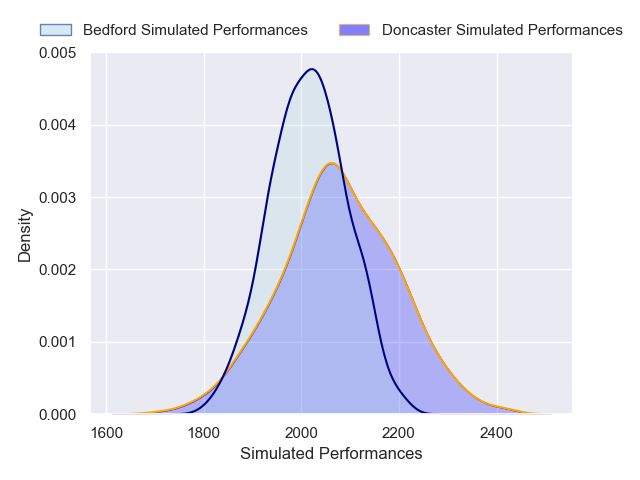

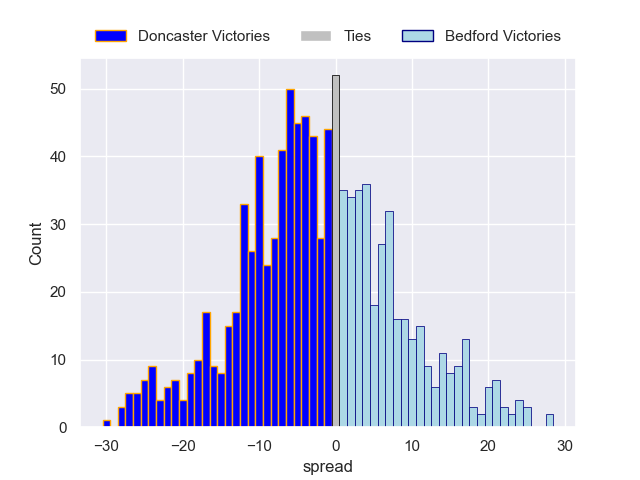

### Coventry V Richmond on 2026/02/14

Average Margin: Coventry by 8.0

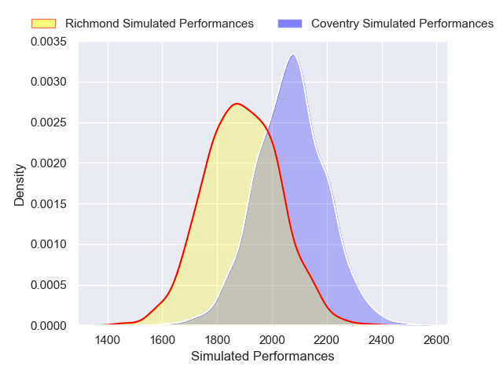

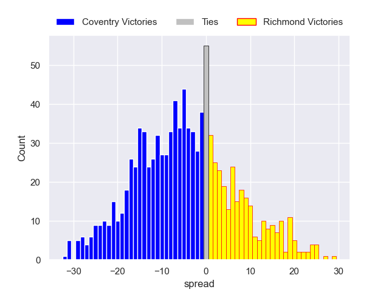

### Ampthill V Chinnor on 2026/02/14

Average Margin: Chinnor by 1.9

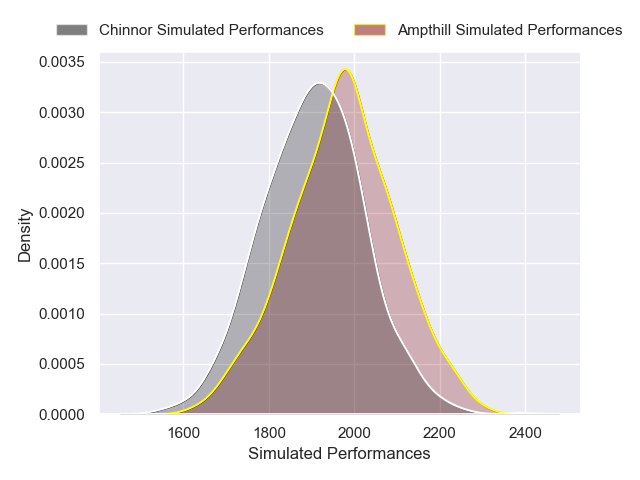

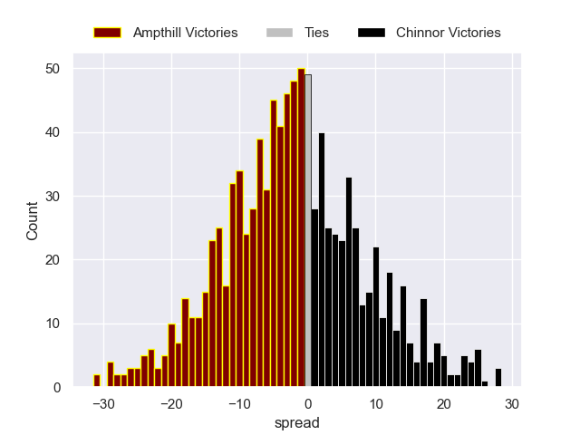

### Caldy V Cornish Pirates on 2026/02/14

Average Margin: Cornish Pirates by 1.2

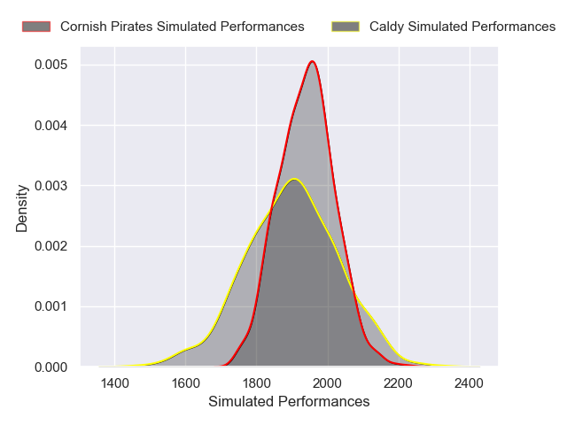

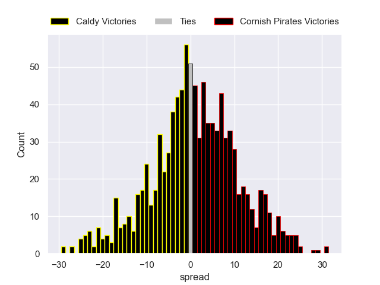

### Hartpury College V Ealing Trailfinders on 2026/02/14

Average Margin: Ealing Trailfinders by 3.6

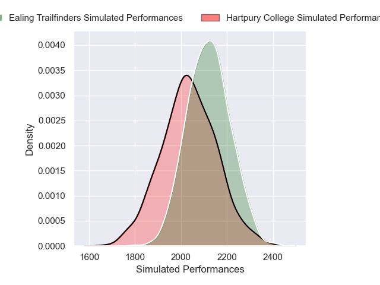
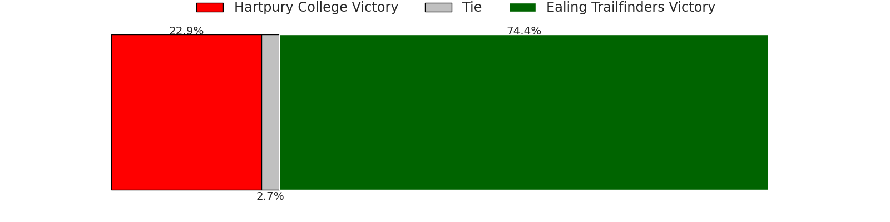
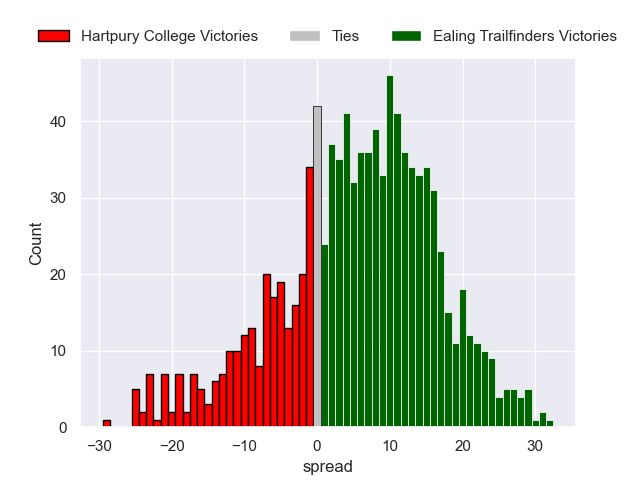

### London Scottish V Worcester Warriors on 2026/02/14

Average Margin: Worcester Warriors by 4.5

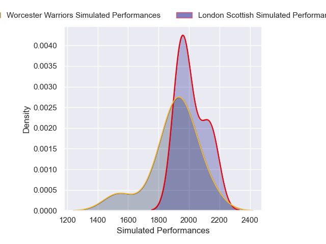

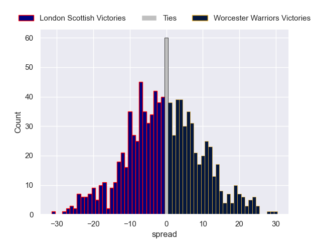

### Nottingham V Cambridge on 2026/02/14

Average Margin: Nottingham by 10.4

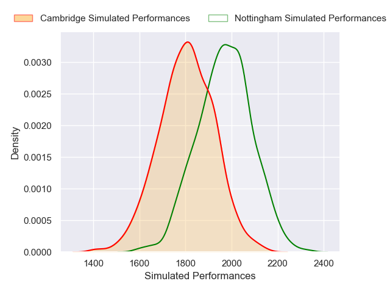

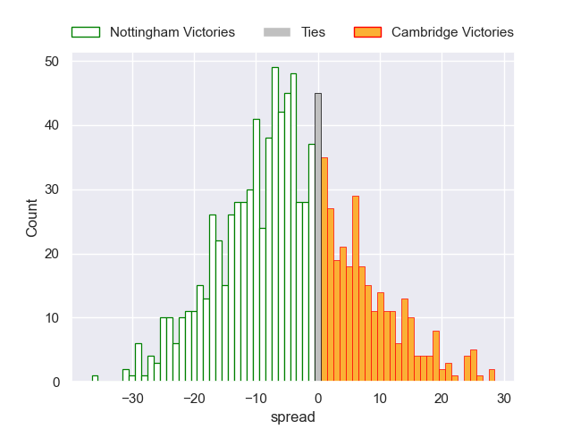

## Week 18

### Richmond V Cambridge on 2026/02/21

Average Margin: Richmond by 7.2

### Ealing Trailfinders V Ampthill on 2026/02/21

Average Margin: Ealing Trailfinders by 13.7

### Bedford V London Scottish on 2026/02/21

Average Margin: Bedford by 8.1

### Cornish Pirates V Nottingham on 2026/02/21

Average Margin: Cornish Pirates by 2.0

### Coventry V Hartpury College on 2026/02/21

Average Margin: Coventry by 2.8

### Chinnor V Doncaster on 2026/02/21

Average Margin: Chinnor by 3.6

### Worcester Warriors V Caldy on 2026/02/21

Average Margin: Worcester Warriors by 7.5

## Week 19

### London Scottish V Chinnor on 2026/02/28

Average Margin: Chinnor by 3.2

### Doncaster V Ealing Trailfinders on 2026/02/28

Average Margin: Ealing Trailfinders by 6.9

### Hartpury College V Richmond on 2026/02/28

Average Margin: Hartpury College by 8.5

### Ampthill V Coventry on 2026/02/28

Average Margin: Coventry by 3.3

### Nottingham V Worcester Warriors on 2026/02/28

Average Margin: Worcester Warriors by 0.3

### Cambridge V Cornish Pirates on 2026/02/28

Average Margin: Cornish Pirates by 6.3

### Caldy V Bedford on 2026/02/28

Average Margin: Bedford by 4.4

## Week 20

### Bedford V Nottingham on 2026/03/21

Average Margin: Bedford by 4.9

### Ealing Trailfinders V London Scottish on 2026/03/21

Average Margin: Ealing Trailfinders by 11.6

### Coventry V Doncaster on 2026/03/21

Average Margin: Coventry by 4.7

### Hartpury College V Ampthill on 2026/03/21

Average Margin: Hartpury College by 7.1

### Richmond V Cornish Pirates on 2026/03/21

Average Margin: Richmond by 0.5

### Chinnor V Caldy on 2026/03/21

Average Margin: Chinnor by 5.3

### Worcester Warriors V Cambridge on 2026/03/21

Average Margin: Worcester Warriors by 10.9

## Week 21

### Cornish Pirates V Worcester Warriors on 2026/03/28

Average Margin: Worcester Warriors by 0.2

### Caldy V Ealing Trailfinders on 2026/03/28

Average Margin: Ealing Trailfinders by 8.3

### London Scottish V Coventry on 2026/03/28

Average Margin: Coventry by 3.5

### Ampthill V Richmond on 2026/03/28

Average Margin: Ampthill by 3.0

### Cambridge V Bedford on 2026/03/28

Average Margin: Bedford by 7.5

### Nottingham V Chinnor on 2026/03/28

Average Margin: Nottingham by 1.6

### Doncaster V Hartpury College on 2026/03/28

Average Margin: Doncaster by 0.1

## Week 22

### Coventry V Caldy on 2026/04/04

Average Margin: Coventry by 5.5

### Chinnor V Cambridge on 2026/04/04

Average Margin: Chinnor by 8.6

### Ealing Trailfinders V Nottingham on 2026/04/04

Average Margin: Ealing Trailfinders by 9.2

### Bedford V Cornish Pirates on 2026/04/04

Average Margin: Bedford by 4.7

### Ampthill V Doncaster on 2026/04/04

Average Margin: Doncaster by 0.9

### Hartpury College V London Scottish on 2026/04/04

Average Margin: Hartpury College by 6.3

### Richmond V Worcester Warriors on 2026/04/04

Average Margin: Worcester Warriors by 1.5

## Week 23

### Nottingham V Coventry on 2026/04/11

Average Margin: Nottingham by 1.2

### Cambridge V Ealing Trailfinders on 2026/04/11

Average Margin: Ealing Trailfinders by 10.4

### Cornish Pirates V Chinnor on 2026/04/11

Average Margin: Cornish Pirates by 1.2

### London Scottish V Ampthill on 2026/04/11

Average Margin: London Scottish by 0.7

### Caldy V Hartpury College on 2026/04/11

Average Margin: Hartpury College by 2.6

### Worcester Warriors V Bedford on 2026/04/11

Average Margin: Worcester Warriors by 1.1

### Doncaster V Richmond on 2026/04/11

Average Margin: Doncaster by 5.4

## Week 24

### Doncaster V London Scottish on 2026/04/18

Average Margin: Doncaster by 5.4

### Ealing Trailfinders V Cornish Pirates on 2026/04/18

Average Margin: Ealing Trailfinders by 10.6

### Coventry V Cambridge on 2026/04/18

Average Margin: Coventry by 10.5

### Richmond V Bedford on 2026/04/18

Average Margin: Bedford by 2.7

### Chinnor V Worcester Warriors on 2026/04/18

Average Margin: Chinnor by 2.8

### Ampthill V Caldy on 2026/04/18

Average Margin: Ampthill by 1.6

### Hartpury College V Nottingham on 2026/04/18

Average Margin: Hartpury College by 4.7

## Week 25

### London Scottish V Richmond on 2026/05/02

Average Margin: London Scottish by 1.1

### Cambridge V Hartpury College on 2026/05/02

Average Margin: Hartpury College by 4.0

### Worcester Warriors V Ealing Trailfinders on 2026/05/02

Average Margin: Ealing Trailfinders by 2.9

### Cornish Pirates V Coventry on 2026/05/02

Average Margin: Cornish Pirates by 1.5

### Bedford V Chinnor on 2026/05/02

Average Margin: Bedford by 3.4

### Nottingham V Ampthill on 2026/05/02

Average Margin: Nottingham by 4.4

### Caldy V Doncaster on 2026/05/02

Average Margin: Caldy by 1.1

## Week 26

### Ampthill V Cambridge on 2026/05/09

Average Margin: Ampthill by 4.4

### Ealing Trailfinders V Bedford on 2026/05/09

Average Margin: Ealing Trailfinders by 6.5

### Doncaster V Nottingham on 2026/05/09

Average Margin: Doncaster by 1.6

### London Scottish V Caldy on 2026/05/09

Average Margin: London Scottish by 0.4

### Hartpury College V Cornish Pirates on 2026/05/09

Average Margin: Hartpury College by 3.9

### Coventry V Worcester Warriors on 2026/05/09

Average Margin: Coventry by 2.7

### Chinnor V Richmond on 2026/05/09

Average Margin: Chinnor by 4.0

