# Team Rankings

# Standings

## Current Standings

| Club                |   Played |   Wins |   Point Differential |   Losing Bonus Points |   Try Bonus Points |   Competition Points |
|:--------------------|---------:|-------:|---------------------:|----------------------:|-------------------:|---------------------:|
| Ealing Trailfinders |       17 |     17 |                  464 |                     0 |                  8 |                   76 |
| Bedford             |       17 |     11 |                   81 |                     2 |                 10 |                   58 |
| Worcester Warriors  |       17 |     11 |                  211 |                     5 |                  7 |                   56 |
| Hartpury College    |       17 |     11 |                   37 |                     1 |                  4 |                   51 |
| Chinnor             |       17 |     11 |                   46 |                     4 |                  2 |                   50 |
| Coventry            |       17 |      9 |                  125 |                     5 |                  8 |                   49 |
| Nottingham          |       17 |      8 |                   43 |                     6 |                  8 |                   48 |
| Cornish Pirates     |       17 |      8 |                   42 |                     3 |                  6 |                   43 |
| Caldy               |       17 |      8 |                  -77 |                     2 |                  6 |                   40 |
| Doncaster           |       17 |      6 |                   51 |                     4 |                  4 |                   38 |
| Ampthill            |       17 |      6 |                 -234 |                     3 |                  4 |                   31 |
| Richmond            |       17 |      5 |                 -153 |                     4 |                  1 |                   25 |
| London Scottish     |       17 |      4 |                 -247 |                     2 |                  2 |                   20 |
| Cambridge           |       17 |      0 |                 -389 |                     4 |                  4 |                   10 |

## Projected Remaining Table

| Club                |   To Play |   Projected Wins |   Projected Differential |   Projected Losing Bonus Points | Projected Try Bonus Points   |   Projected Competition Points |
|:--------------------|----------:|-----------------:|-------------------------:|--------------------------------:|:-----------------------------|-------------------------------:|
| Ealing Trailfinders |         9 |            6.525 |                   86.205 |                           1.146 |                              |                         27.818 |
| Hartpury College    |         9 |            5.477 |                   32.811 |                           1.725 |                              |                         24.383 |
| Coventry            |         9 |            5.452 |                   31.937 |                           1.747 |                              |                         24.375 |
| Bedford             |         9 |            5.132 |                   19.558 |                           1.679 |                              |                         23.005 |
| Chinnor             |         9 |            4.969 |                   21.1   |                           1.918 |                              |                         22.57  |
| Worcester Warriors  |         9 |            4.839 |                   21.027 |                           1.892 |                              |                         22.082 |
| Doncaster           |         9 |            4.58  |                    6.868 |                           1.996 |                              |                         21.13  |
| Cornish Pirates     |         9 |            4.387 |                   -0.853 |                           2.042 |                              |                         20.446 |
| Ampthill            |         9 |            3.855 |                  -18.76  |                           2.007 |                              |                         18.251 |
| Nottingham          |         9 |            3.565 |                  -19.167 |                           2.319 |                              |                         17.411 |
| Richmond            |         9 |            3.321 |                  -27.254 |                           2.16  |                              |                         16.21  |
| London Scottish     |         9 |            3.073 |                  -41.141 |                           2.049 |                              |                         15.061 |
| Caldy               |         9 |            2.808 |                  -43.369 |                           2.222 |                              |                         14.222 |
| Cambridge           |         9 |            2.334 |                  -68.962 |                           1.891 |                              |                         11.829 |

## Projected Total Table

| Club                |   Played |   Wins |   Point Differential |   Losing Bonus Points |   Try Bonus Points |   Competition Points |
|:--------------------|---------:|-------:|---------------------:|----------------------:|-------------------:|---------------------:|
| Ealing Trailfinders |       26 | 23.525 |              550.205 |                 1.146 |                  8 |              103.818 |
| Bedford             |       26 | 16.132 |              100.558 |                 3.679 |                 10 |               81.005 |
| Worcester Warriors  |       26 | 15.839 |              232.027 |                 6.892 |                  7 |               78.082 |
| Hartpury College    |       26 | 16.477 |               69.811 |                 2.725 |                  4 |               75.383 |
| Coventry            |       26 | 14.452 |              156.937 |                 6.747 |                  8 |               73.375 |
| Chinnor             |       26 | 15.969 |               67.1   |                 5.918 |                  2 |               72.57  |
| Nottingham          |       26 | 11.565 |               23.833 |                 8.319 |                  8 |               65.411 |
| Cornish Pirates     |       26 | 12.387 |               41.147 |                 5.042 |                  6 |               63.446 |
| Doncaster           |       26 | 10.58  |               57.868 |                 5.996 |                  4 |               59.13  |
| Caldy               |       26 | 10.808 |             -120.369 |                 4.222 |                  6 |               54.222 |
| Ampthill            |       26 |  9.855 |             -252.76  |                 5.007 |                  4 |               49.251 |
| Richmond            |       26 |  8.321 |             -180.254 |                 6.16  |                  1 |               41.21  |
| London Scottish     |       26 |  7.073 |             -288.141 |                 4.049 |                  2 |               35.061 |
| Cambridge           |       26 |  2.334 |             -457.962 |                 5.891 |                  4 |               21.829 |

# Completed Match Review

| Model | Percent Correct Predictions | Spread Error |
| ------ | ------ | ------ |
| Club Level | 69.2% | 11.8 |
| Player Level: Lineup | nan% | nan |
| Player Level: Minutes | nan% | nan |

# Future Predictions

## Week 18

### Ealing Trailfinders V Ampthill on 2026/02/21

Average Margin: Ealing Trailfinders by 13.8

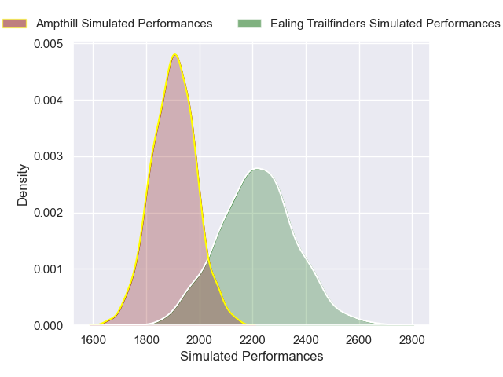

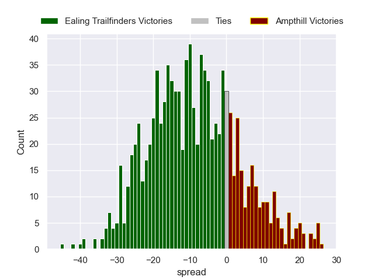

### Chinnor V Doncaster on 2026/02/21

Average Margin: Chinnor by 3.2

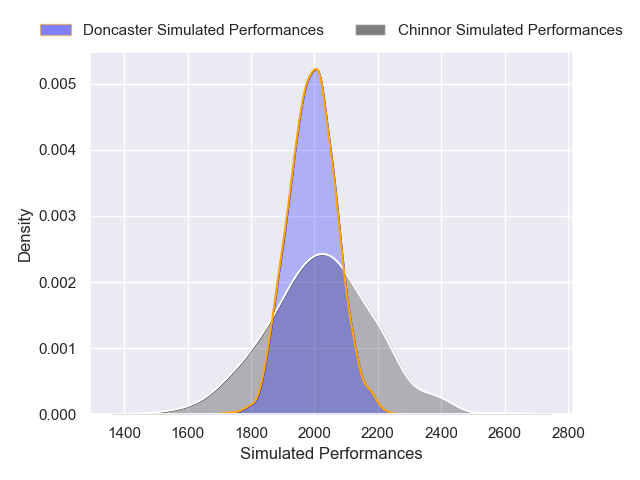

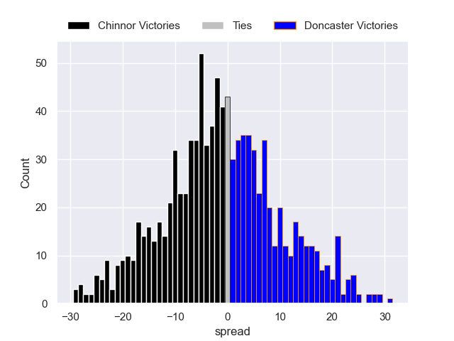

### Bedford V London Scottish on 2026/02/21

Average Margin: Bedford by 7.9

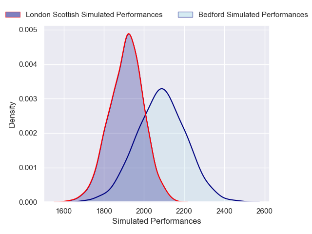

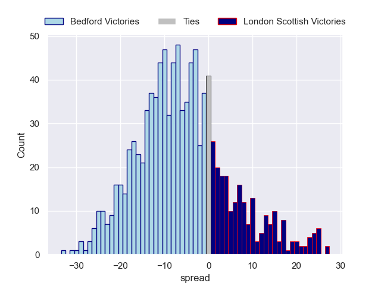

### Richmond V Cambridge on 2026/02/21

Average Margin: Richmond by 5.6

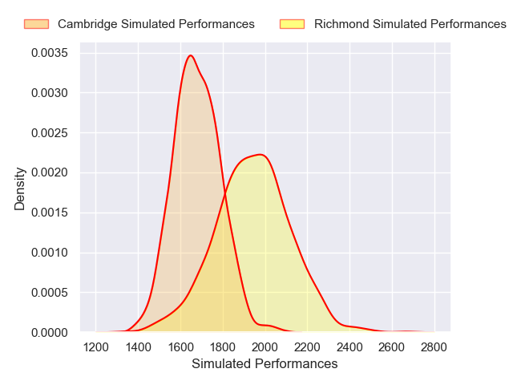

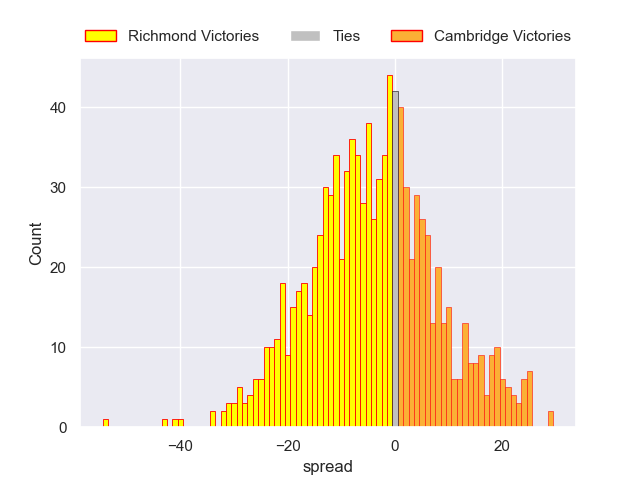

### Worcester Warriors V Caldy on 2026/02/21

Average Margin: Worcester Warriors by 8.7

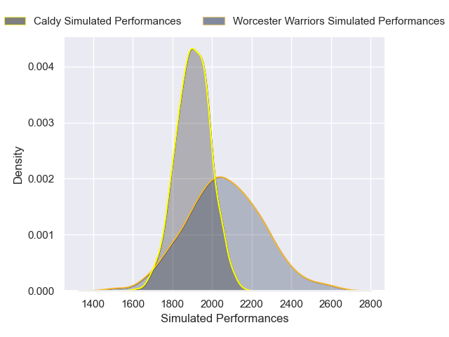

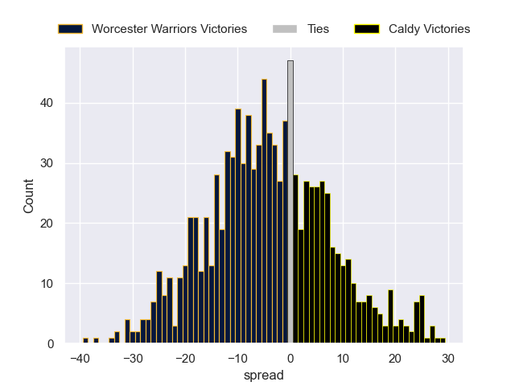

### Cornish Pirates V Nottingham on 2026/02/21

Average Margin: Cornish Pirates by 3.4

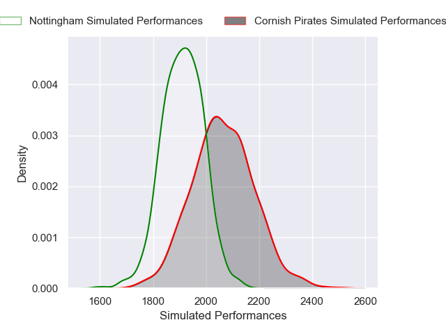

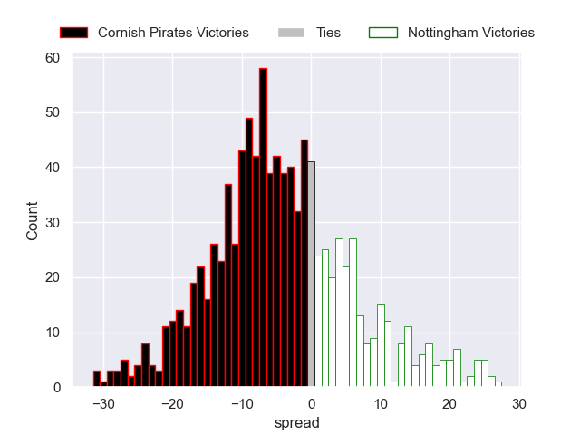

### Coventry V Hartpury College on 2026/02/21

Average Margin: Coventry by 3.2

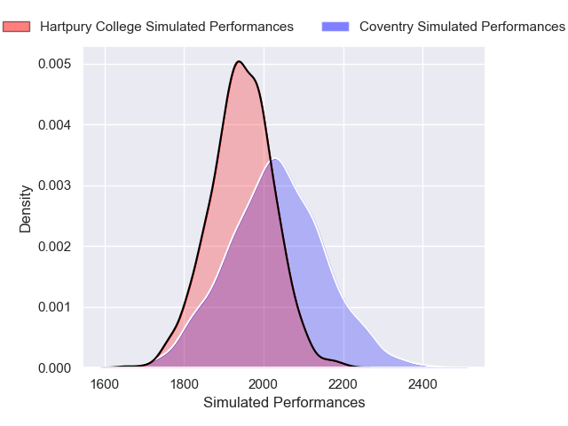

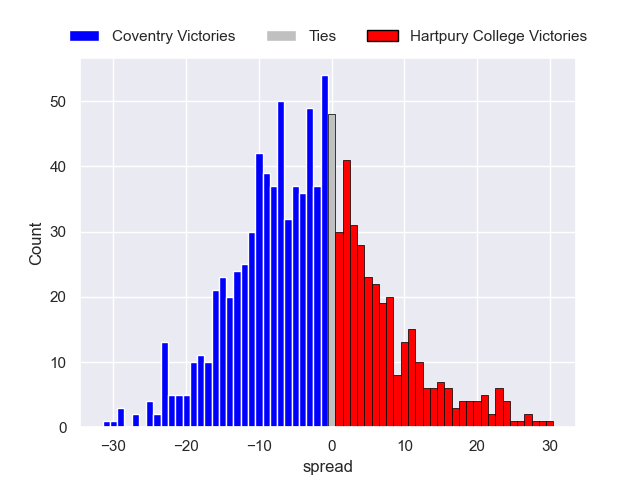

## Week 19

### Cambridge V Cornish Pirates on 2026/02/28

Average Margin: Cornish Pirates by 6.0

### Ampthill V Coventry on 2026/02/28

Average Margin: Coventry by 2.9

### Caldy V Bedford on 2026/02/28

Average Margin: Bedford by 4.2

### Doncaster V Ealing Trailfinders on 2026/02/28

Average Margin: Ealing Trailfinders by 6.1

### London Scottish V Chinnor on 2026/02/28

Average Margin: Chinnor by 3.8

### Hartpury College V Richmond on 2026/02/28

Average Margin: Hartpury College by 8.1

### Nottingham V Worcester Warriors on 2026/02/28

Average Margin: Worcester Warriors by 1.0

## Week 20

### Hartpury College V Ampthill on 2026/03/21

Average Margin: Hartpury College by 7.1

### Coventry V Doncaster on 2026/03/21

Average Margin: Coventry by 3.6

### Chinnor V Caldy on 2026/03/21

Average Margin: Chinnor by 5.9

### Richmond V Cornish Pirates on 2026/03/21

Average Margin: Cornish Pirates by 1.5

### Worcester Warriors V Cambridge on 2026/03/21

Average Margin: Worcester Warriors by 11.3

### Ealing Trailfinders V London Scottish on 2026/03/21

Average Margin: Ealing Trailfinders by 13.8

### Bedford V Nottingham on 2026/03/21

Average Margin: Bedford by 3.4

## Week 21

### Caldy V Ealing Trailfinders on 2026/03/28

Average Margin: Ealing Trailfinders by 9.9

### Doncaster V Hartpury College on 2026/03/28

Average Margin: Doncaster by 1.8

### London Scottish V Coventry on 2026/03/28

Average Margin: Coventry by 5.0

### Ampthill V Richmond on 2026/03/28

Average Margin: Ampthill by 4.0

### Cornish Pirates V Worcester Warriors on 2026/03/28

Average Margin: Cornish Pirates by 0.1

### Cambridge V Bedford on 2026/03/28

Average Margin: Bedford by 6.7

### Nottingham V Chinnor on 2026/03/28

Average Margin: Nottingham by 1.5

## Week 22

### Ampthill V Doncaster on 2026/04/04

Average Margin: Doncaster by 1.3

### Bedford V Cornish Pirates on 2026/04/04

Average Margin: Bedford by 3.2

### Coventry V Caldy on 2026/04/04

Average Margin: Coventry by 7.2

### Richmond V Worcester Warriors on 2026/04/04

Average Margin: Worcester Warriors by 3.3

### Hartpury College V London Scottish on 2026/04/04

Average Margin: Hartpury College by 7.2

### Ealing Trailfinders V Nottingham on 2026/04/04

Average Margin: Ealing Trailfinders by 9.9

### Chinnor V Cambridge on 2026/04/04

Average Margin: Chinnor by 8.3

## Week 23

### Doncaster V Richmond on 2026/04/11

Average Margin: Doncaster by 5.8

### Nottingham V Coventry on 2026/04/11

Average Margin: Nottingham by 0.9

### Caldy V Hartpury College on 2026/04/11

Average Margin: Hartpury College by 2.8

### Cornish Pirates V Chinnor on 2026/04/11

Average Margin: Cornish Pirates by 2.4

### Worcester Warriors V Bedford on 2026/04/11

Average Margin: Worcester Warriors by 3.2

### Cambridge V Ealing Trailfinders on 2026/04/11

Average Margin: Ealing Trailfinders by 11.9

### London Scottish V Ampthill on 2026/04/11

Average Margin: London Scottish by 0.2

## Week 24

### Hartpury College V Nottingham on 2026/04/18

Average Margin: Hartpury College by 5.2

### Richmond V Bedford on 2026/04/18

Average Margin: Bedford by 2.6

### Doncaster V London Scottish on 2026/04/18

Average Margin: Doncaster by 6.2

### Ealing Trailfinders V Cornish Pirates on 2026/04/18

Average Margin: Ealing Trailfinders by 9.9

### Ampthill V Caldy on 2026/04/18

Average Margin: Ampthill by 2.6

### Coventry V Cambridge on 2026/04/18

Average Margin: Coventry by 10.5

### Chinnor V Worcester Warriors on 2026/04/18

Average Margin: Chinnor by 1.2

## Week 25

### Caldy V Doncaster on 2026/05/02

Average Margin: Doncaster by 1.5

### Worcester Warriors V Ealing Trailfinders on 2026/05/02

Average Margin: Ealing Trailfinders by 2.5

### Bedford V Chinnor on 2026/05/02

Average Margin: Bedford by 3.2

### Nottingham V Ampthill on 2026/05/02

Average Margin: Nottingham by 4.6

### London Scottish V Richmond on 2026/05/02

Average Margin: London Scottish by 1.9

### Cornish Pirates V Coventry on 2026/05/02

Average Margin: Cornish Pirates by 2.2

### Cambridge V Hartpury College on 2026/05/02

Average Margin: Hartpury College by 4.1

## Week 26

### Hartpury College V Cornish Pirates on 2026/05/09

Average Margin: Hartpury College by 3.4

### Doncaster V Nottingham on 2026/05/09

Average Margin: Doncaster by 3.3

### Chinnor V Richmond on 2026/05/09

Average Margin: Chinnor by 5.8

### London Scottish V Caldy on 2026/05/09

Average Margin: London Scottish by 0.6

### Ealing Trailfinders V Bedford on 2026/05/09

Average Margin: Ealing Trailfinders by 8.3

### Coventry V Worcester Warriors on 2026/05/09

Average Margin: Coventry by 2.6

### Ampthill V Cambridge on 2026/05/09

Average Margin: Ampthill by 4.5

