# Team Rankings

# Standings

## Current Standings

| Club                |   Played |   Wins |   Point Differential |   Losing Bonus Points |   Try Bonus Points |   Competition Points |
|:--------------------|---------:|-------:|---------------------:|----------------------:|-------------------:|---------------------:|
| Ealing Trailfinders |       13 |     13 |                  371 |                     0 |                  8 |                   60 |
| Bedford             |       12 |      9 |                  105 |                     1 |                 10 |                   49 |
| Worcester Warriors  |       13 |      8 |                  126 |                     4 |                  7 |                   43 |
| Coventry            |       13 |      8 |                  112 |                     2 |                  8 |                   42 |
| Hartpury College    |       13 |      8 |                   35 |                     1 |                  4 |                   39 |
| Nottingham          |       13 |      6 |                   28 |                     4 |                  8 |                   38 |
| Chinnor             |       12 |      8 |                   54 |                     3 |                  2 |                   37 |
| Caldy               |       13 |      6 |                  -42 |                     2 |                  6 |                   32 |
| Cornish Pirates     |       13 |      5 |                    2 |                     3 |                  6 |                   31 |
| Ampthill            |       13 |      6 |                 -163 |                     2 |                  4 |                   30 |
| Doncaster           |       13 |      4 |                  -14 |                     3 |                  4 |                   27 |
| Richmond            |       13 |      3 |                  -89 |                     4 |                  1 |                   17 |
| London Scottish     |       13 |      3 |                 -159 |                     2 |                  2 |                   16 |
| Cambridge           |       13 |      0 |                 -366 |                     2 |                  4 |                    6 |

## Projected Remaining Table

| Club                |   To Play |   Projected Wins |   Projected Differential |   Projected Losing Bonus Points | Projected Try Bonus Points   |   Projected Competition Points |
|:--------------------|----------:|-----------------:|-------------------------:|--------------------------------:|:-----------------------------|-------------------------------:|
| Ealing Trailfinders |        13 |            9.576 |                  122.548 |                           1.564 |                              |                         40.674 |
| Bedford             |        14 |            8.439 |                   44     |                           2.563 |                              |                         37.587 |
| Coventry            |        13 |            7.452 |                   34.051 |                           2.596 |                              |                         33.66  |
| Chinnor             |        14 |            7.317 |                   21.563 |                           3.094 |                              |                         33.654 |
| Worcester Warriors  |        13 |            7.07  |                   27.809 |                           2.775 |                              |                         32.243 |
| Hartpury College    |        13 |            6.621 |                    9.414 |                           2.873 |                              |                         30.537 |
| Doncaster           |        13 |            6.422 |                    6.964 |                           2.928 |                              |                         29.848 |
| Cornish Pirates     |        13 |            6.321 |                    0.139 |                           3.007 |                              |                         29.477 |
| Nottingham          |        13 |            6.008 |                   -3.281 |                           3.091 |                              |                         28.371 |
| Ampthill            |        13 |            5.374 |                  -24.007 |                           3.206 |                              |                         25.918 |
| Caldy               |        13 |            4.986 |                  -31.749 |                           3.296 |                              |                         24.438 |
| London Scottish     |        13 |            4.7   |                  -41.706 |                           3.148 |                              |                         23.01  |
| Richmond            |        13 |            4.558 |                  -54.521 |                           2.972 |                              |                         22.326 |
| Cambridge           |        13 |            3.126 |                 -111.224 |                           2.442 |                              |                         15.812 |

## Projected Total Table

| Club                |   Played |   Wins |   Point Differential |   Losing Bonus Points |   Try Bonus Points |   Competition Points |
|:--------------------|---------:|-------:|---------------------:|----------------------:|-------------------:|---------------------:|
| Ealing Trailfinders |       26 | 22.576 |              493.548 |                 1.564 |                  8 |              100.674 |
| Bedford             |       26 | 17.439 |              149     |                 3.563 |                 10 |               86.587 |
| Coventry            |       26 | 15.452 |              146.051 |                 4.596 |                  8 |               75.66  |
| Worcester Warriors  |       26 | 15.07  |              153.809 |                 6.775 |                  7 |               75.243 |
| Chinnor             |       26 | 15.317 |               75.563 |                 6.094 |                  2 |               70.654 |
| Hartpury College    |       26 | 14.621 |               44.414 |                 3.873 |                  4 |               69.537 |
| Nottingham          |       26 | 12.008 |               24.719 |                 7.091 |                  8 |               66.371 |
| Cornish Pirates     |       26 | 11.321 |                2.139 |                 6.007 |                  6 |               60.477 |
| Doncaster           |       26 | 10.422 |               -7.036 |                 5.928 |                  4 |               56.848 |
| Caldy               |       26 | 10.986 |              -73.749 |                 5.296 |                  6 |               56.438 |
| Ampthill            |       26 | 11.374 |             -187.007 |                 5.206 |                  4 |               55.918 |
| Richmond            |       26 |  7.558 |             -143.521 |                 6.972 |                  1 |               39.326 |
| London Scottish     |       26 |  7.7   |             -200.706 |                 5.148 |                  2 |               39.01  |
| Cambridge           |       26 |  3.126 |             -477.224 |                 4.442 |                  4 |               21.812 |

# Completed Match Review

| Model | Percent Correct Predictions | Spread Error |
| ------ | ------ | ------ |
| Club Level | 70.9% | 10.4 |
| Player Level: Lineup | nan% | nan |
| Player Level: Minutes | nan% | nan |

# Future Predictions

## Week 14

### Chinnor V Bedford on 2026/01/17

Average Margin: Chinnor by 0.1

## Week 15

### Nottingham V London Scottish on 2026/01/24

Average Margin: Nottingham by 5.0

### Cornish Pirates V Ampthill on 2026/01/24

Average Margin: Cornish Pirates by 4.3

### Richmond V Caldy on 2026/01/24

Average Margin: Caldy by 0.8

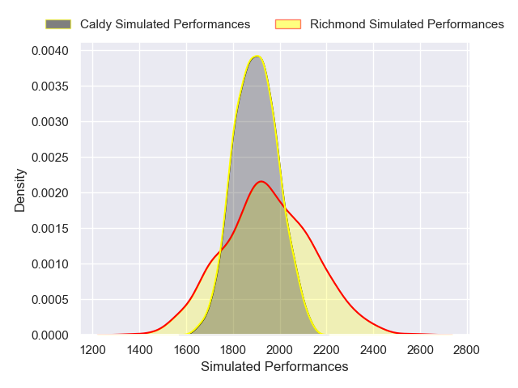

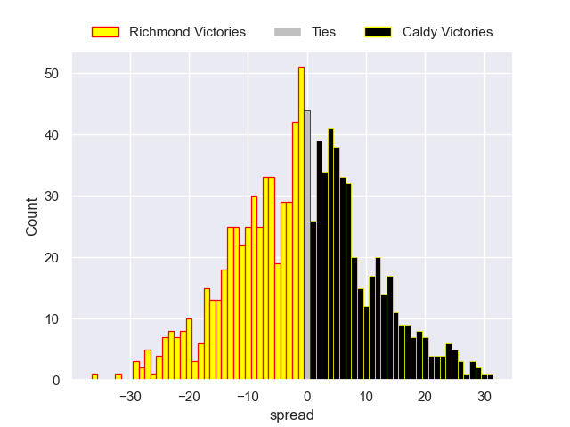

### Cambridge V Doncaster on 2026/01/24

Average Margin: Doncaster by 9.2

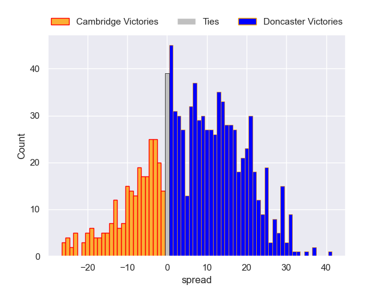

### Bedford V Coventry on 2026/01/24

Average Margin: Bedford by 3.3

### Chinnor V Ealing Trailfinders on 2026/01/24

Average Margin: Ealing Trailfinders by 5.2

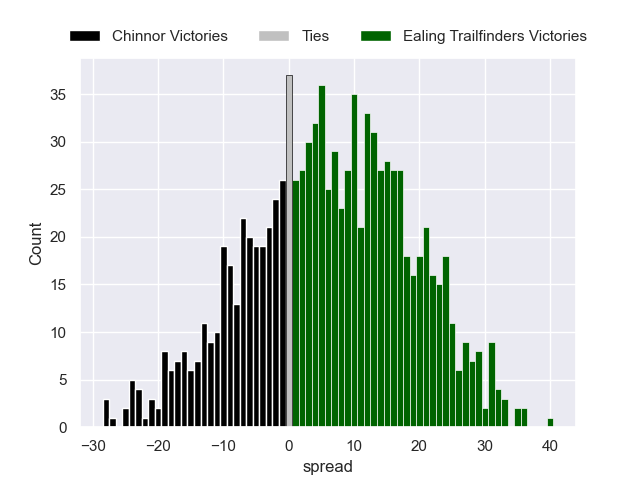

### Worcester Warriors V Hartpury College on 2026/01/24

Average Margin: Worcester Warriors by 4.7

## Week 16

### London Scottish V Cambridge on 2026/01/31

Average Margin: London Scottish by 8.2

### Ealing Trailfinders V Richmond on 2026/01/31

Average Margin: Ealing Trailfinders by 17.1

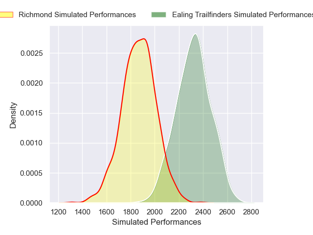

### Hartpury College V Bedford on 2026/01/31

Average Margin: Bedford by 0.1

### Ampthill V Worcester Warriors on 2026/01/31

Average Margin: Worcester Warriors by 2.9

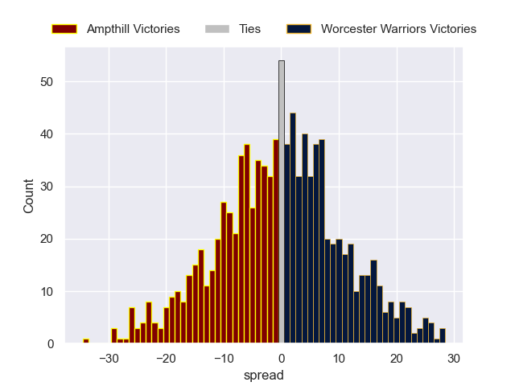

### Doncaster V Cornish Pirates on 2026/01/31

Average Margin: Doncaster by 3.4

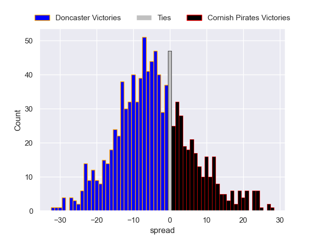

### Coventry V Chinnor on 2026/01/31

Average Margin: Coventry by 3.8

### Caldy V Nottingham on 2026/01/31

Average Margin: Nottingham by 0.9

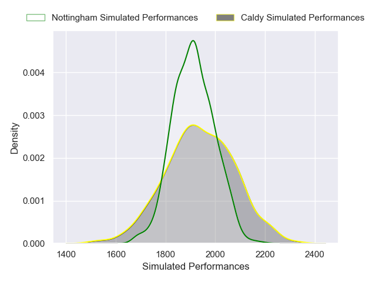

## Week 17

### Ealing Trailfinders V Coventry on 2026/02/07

Average Margin: Ealing Trailfinders by 9.6

### Richmond V Nottingham on 2026/02/07

Average Margin: Nottingham by 2.1

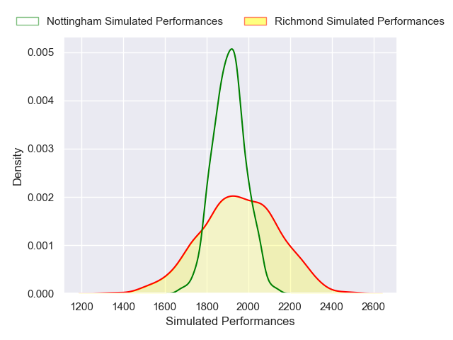

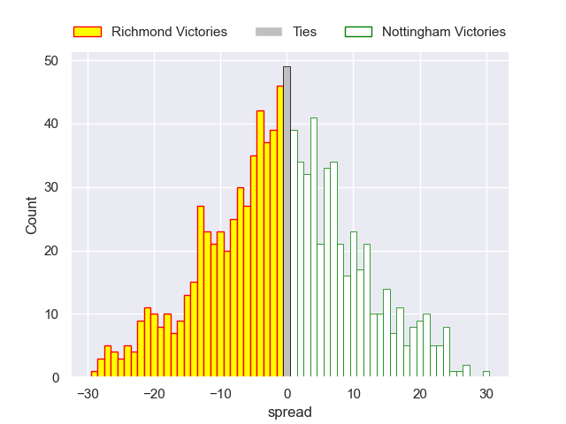

### Bedford V Ampthill on 2026/02/07

Average Margin: Bedford by 7.2

### Worcester Warriors V Doncaster on 2026/02/07

Average Margin: Worcester Warriors by 4.7

### Chinnor V Hartpury College on 2026/02/07

Average Margin: Chinnor by 3.4

### Cambridge V Caldy on 2026/02/07

Average Margin: Caldy by 5.0

### Cornish Pirates V London Scottish on 2026/02/07

Average Margin: Cornish Pirates by 4.4

## Week 18

### Nottingham V Cambridge on 2026/02/14

Average Margin: Nottingham by 10.2

### London Scottish V Worcester Warriors on 2026/02/14

Average Margin: Worcester Warriors by 4.4

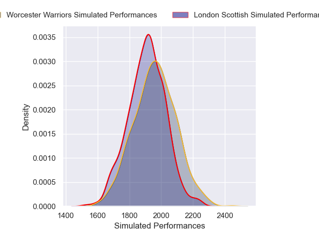

### Caldy V Cornish Pirates on 2026/02/14

Average Margin: Cornish Pirates by 0.8

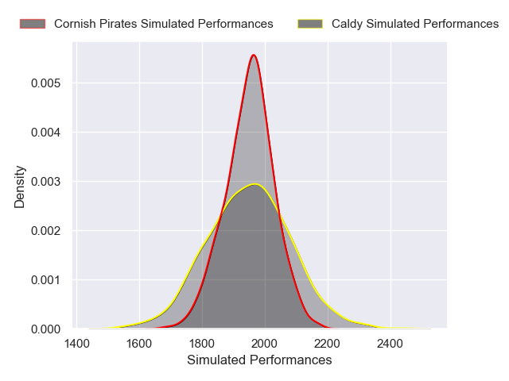

### Coventry V Richmond on 2026/02/14

Average Margin: Coventry by 9.5

### Doncaster V Bedford on 2026/02/14

Average Margin: Bedford by 0.8

### Hartpury College V Ealing Trailfinders on 2026/02/14

Average Margin: Ealing Trailfinders by 5.4

### Ampthill V Chinnor on 2026/02/14

Average Margin: Chinnor by 0.6

## Week 19

### Worcester Warriors V Caldy on 2026/02/21

Average Margin: Worcester Warriors by 6.5

### Chinnor V Doncaster on 2026/02/21

Average Margin: Chinnor by 4.5

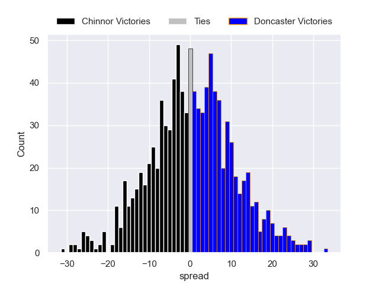

### Bedford V London Scottish on 2026/02/21

Average Margin: Bedford by 9.0

### Cornish Pirates V Nottingham on 2026/02/21

Average Margin: Cornish Pirates by 2.3

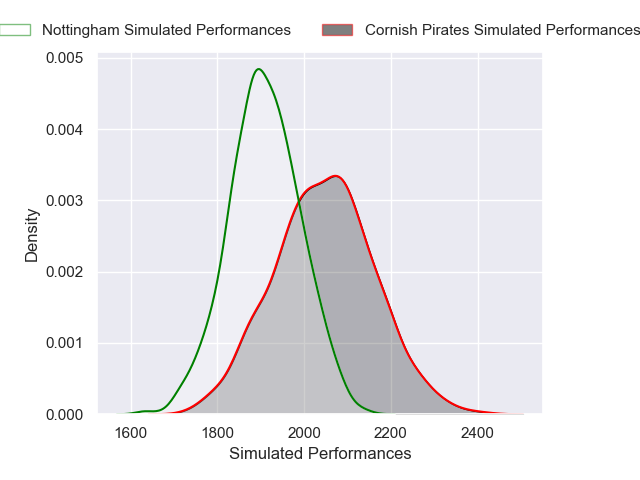

### Coventry V Hartpury College on 2026/02/21

Average Margin: Coventry by 4.9

### Ealing Trailfinders V Ampthill on 2026/02/21

Average Margin: Ealing Trailfinders by 13.6

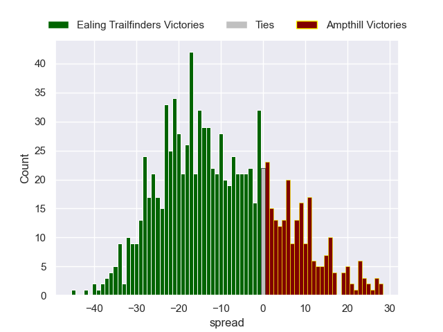

### Richmond V Cambridge on 2026/02/21

Average Margin: Richmond by 7.5

## Week 20

### Caldy V Bedford on 2026/02/28

Average Margin: Bedford by 4.7

### London Scottish V Chinnor on 2026/02/28

Average Margin: Chinnor by 3.1

### Nottingham V Worcester Warriors on 2026/02/28

Average Margin: Worcester Warriors by 0.4

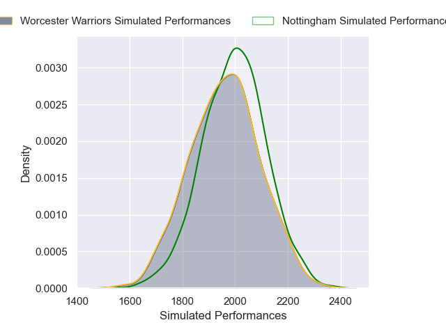

### Ampthill V Coventry on 2026/02/28

Average Margin: Coventry by 1.5

### Hartpury College V Richmond on 2026/02/28

Average Margin: Hartpury College by 7.4

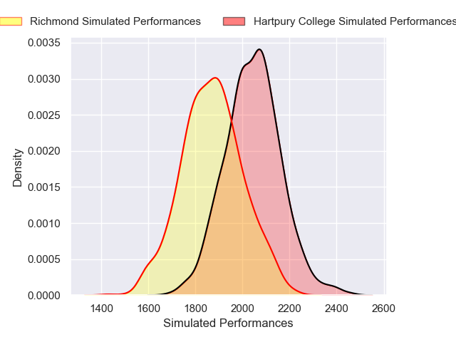

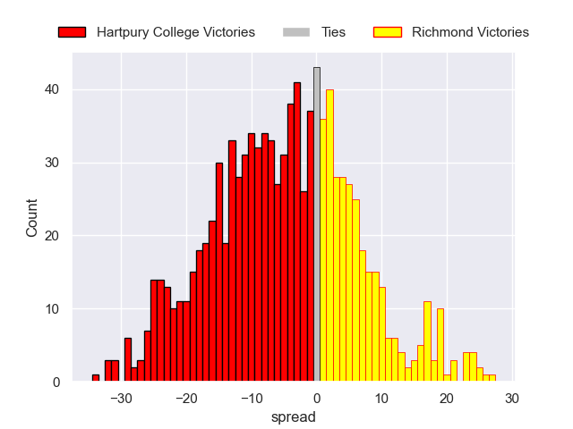

### Cambridge V Cornish Pirates on 2026/02/28

Average Margin: Cornish Pirates by 6.9

### Doncaster V Ealing Trailfinders on 2026/02/28

Average Margin: Ealing Trailfinders by 6.2

## Week 21

### Coventry V Doncaster on 2026/03/21

Average Margin: Coventry by 4.5

### Hartpury College V Ampthill on 2026/03/21

Average Margin: Hartpury College by 4.3

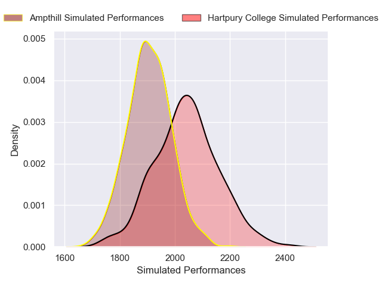

### Ealing Trailfinders V London Scottish on 2026/03/21

Average Margin: Ealing Trailfinders by 13.3

### Richmond V Cornish Pirates on 2026/03/21

Average Margin: Cornish Pirates by 0.8

### Bedford V Nottingham on 2026/03/21

Average Margin: Bedford by 5.8

### Worcester Warriors V Cambridge on 2026/03/21

Average Margin: Worcester Warriors by 10.9

### Chinnor V Caldy on 2026/03/21

Average Margin: Chinnor by 5.8

## Week 22

### Ampthill V Richmond on 2026/03/28

Average Margin: Ampthill by 4.2

### Doncaster V Hartpury College on 2026/03/28

Average Margin: Doncaster by 1.9

### Nottingham V Chinnor on 2026/03/28

Average Margin: Nottingham by 0.9

### Cambridge V Bedford on 2026/03/28

Average Margin: Bedford by 8.7

### London Scottish V Coventry on 2026/03/28

Average Margin: Coventry by 3.2

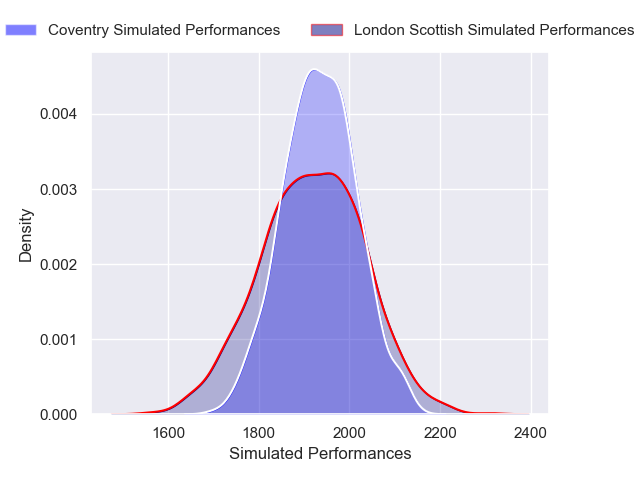

### Caldy V Ealing Trailfinders on 2026/03/28

Average Margin: Ealing Trailfinders by 8.5

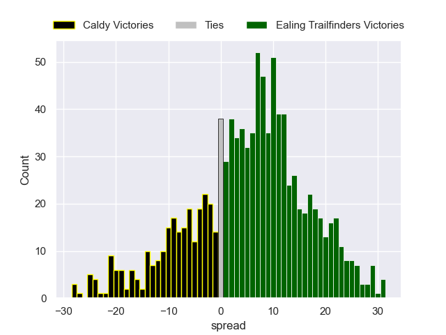

### Cornish Pirates V Worcester Warriors on 2026/03/28

Average Margin: Cornish Pirates by 1.2

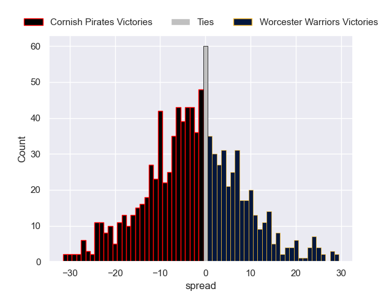

## Week 23

### Bedford V Cornish Pirates on 2026/04/04

Average Margin: Bedford by 5.3

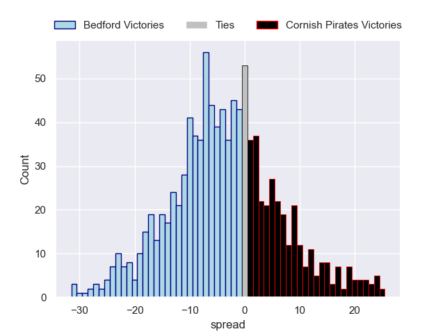

### Ealing Trailfinders V Nottingham on 2026/04/04

Average Margin: Ealing Trailfinders by 10.6

### Chinnor V Cambridge on 2026/04/04

Average Margin: Chinnor by 10.7

### Ampthill V Doncaster on 2026/04/04

Average Margin: Ampthill by 0.8

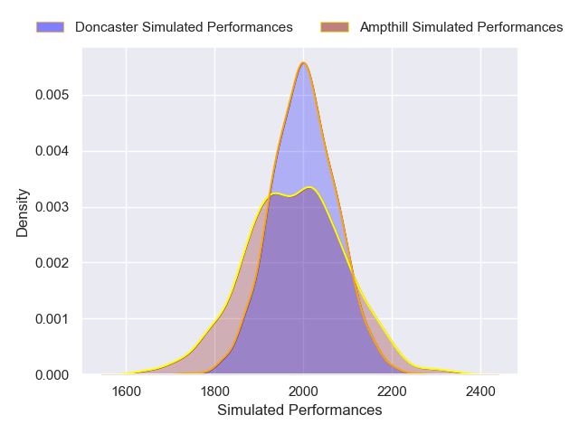

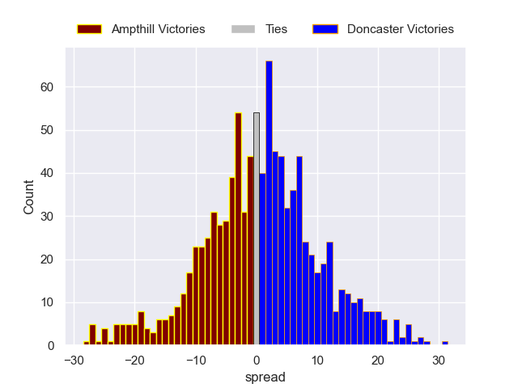

### Hartpury College V London Scottish on 2026/04/04

Average Margin: Hartpury College by 5.7

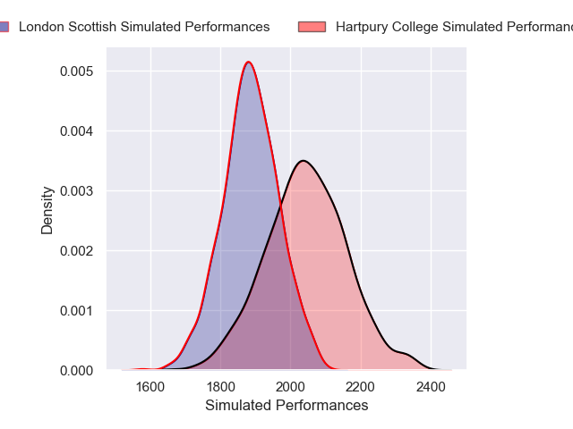

### Coventry V Caldy on 2026/04/04

Average Margin: Coventry by 6.1

### Richmond V Worcester Warriors on 2026/04/04

Average Margin: Worcester Warriors by 2.7

## Week 24

### Worcester Warriors V Bedford on 2026/04/11

Average Margin: Worcester Warriors by 0.8

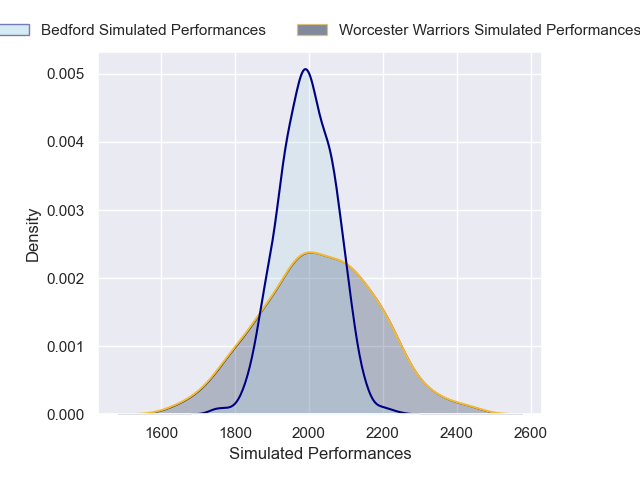

### Cornish Pirates V Chinnor on 2026/04/11

Average Margin: Cornish Pirates by 1.1

### Cambridge V Ealing Trailfinders on 2026/04/11

Average Margin: Ealing Trailfinders by 12.6

### Nottingham V Coventry on 2026/04/11

Average Margin: Coventry by 0.1

### Doncaster V Richmond on 2026/04/11

Average Margin: Doncaster by 6.2

### London Scottish V Ampthill on 2026/04/11

Average Margin: London Scottish by 0.3

### Caldy V Hartpury College on 2026/04/11

Average Margin: Hartpury College by 0.9

## Week 25

### Ampthill V Caldy on 2026/04/18

Average Margin: Ampthill by 2.5

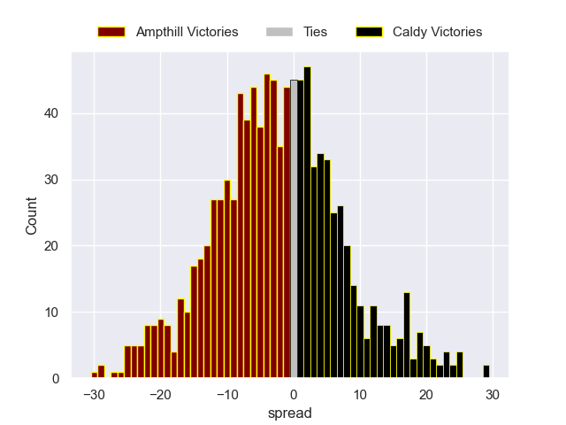

### Chinnor V Worcester Warriors on 2026/04/18

Average Margin: Chinnor by 2.5

### Richmond V Bedford on 2026/04/18

Average Margin: Bedford by 4.0

### Coventry V Cambridge on 2026/04/18

Average Margin: Coventry by 11.0

### Doncaster V London Scottish on 2026/04/18

Average Margin: Doncaster by 5.2

### Ealing Trailfinders V Cornish Pirates on 2026/04/18

Average Margin: Ealing Trailfinders by 10.2

### Hartpury College V Nottingham on 2026/04/18

Average Margin: Hartpury College by 3.7

## Week 26

### Cambridge V Hartpury College on 2026/05/02

Average Margin: Hartpury College by 4.0

### Cornish Pirates V Coventry on 2026/05/02

Average Margin: Cornish Pirates by 0.9

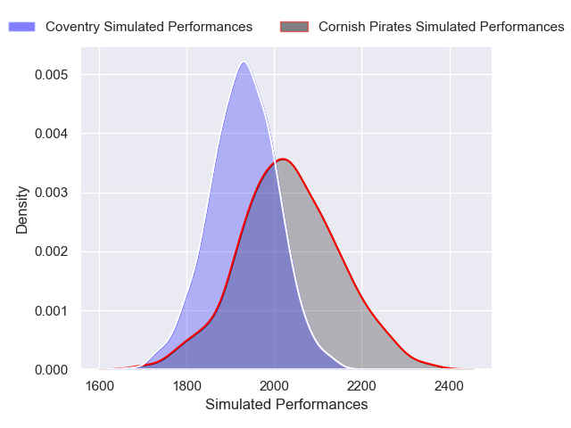

### Worcester Warriors V Ealing Trailfinders on 2026/05/02

Average Margin: Ealing Trailfinders by 3.1

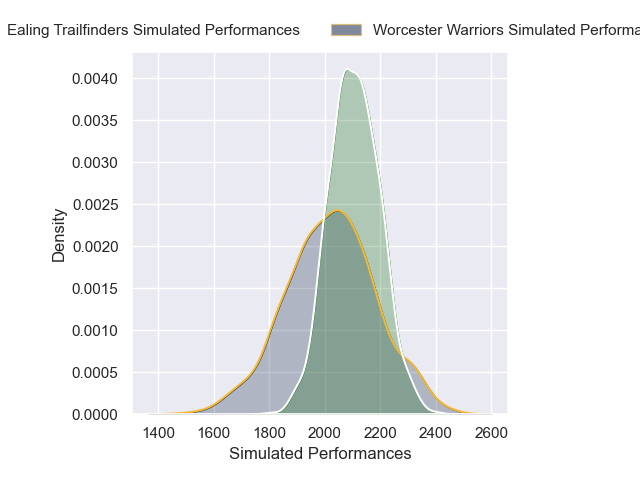

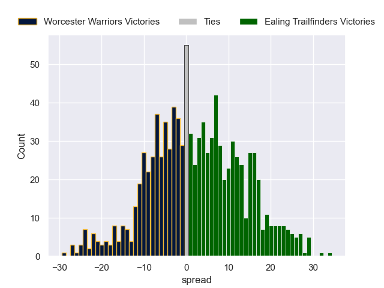

### Caldy V Doncaster on 2026/05/02

Average Margin: Doncaster by 0.0

### London Scottish V Richmond on 2026/05/02

Average Margin: London Scottish by 2.3

### Bedford V Chinnor on 2026/05/02

Average Margin: Bedford by 3.3

### Nottingham V Ampthill on 2026/05/02

Average Margin: Nottingham by 3.2

## Week 27

### Chinnor V Richmond on 2026/05/09

Average Margin: Chinnor by 5.1

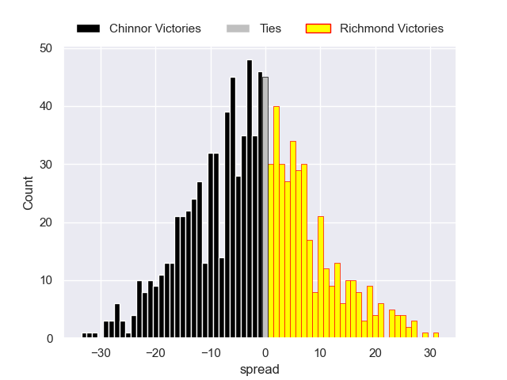

### Coventry V Worcester Warriors on 2026/05/09

Average Margin: Coventry by 3.5

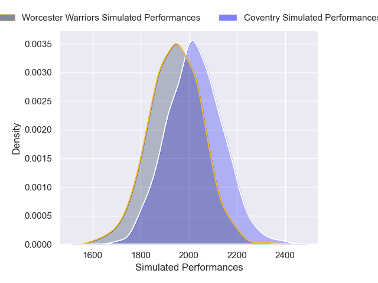

### Doncaster V Nottingham on 2026/05/09

Average Margin: Doncaster by 2.6

### Hartpury College V Cornish Pirates on 2026/05/09

Average Margin: Hartpury College by 3.8

### Ealing Trailfinders V Bedford on 2026/05/09

Average Margin: Ealing Trailfinders by 7.2

### London Scottish V Caldy on 2026/05/09

Average Margin: London Scottish by 0.7

### Ampthill V Cambridge on 2026/05/09

Average Margin: Ampthill by 6.3

