# Team Rankings

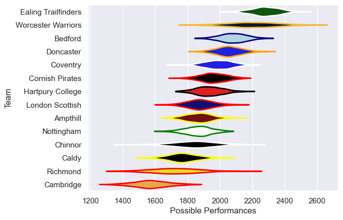
# Standings

## Current Standings

| Club                |   Played |   Wins |   Point Differential |   Losing Bonus Points |   Try Bonus Points |   Competition Points |
|:--------------------|---------:|-------:|---------------------:|----------------------:|-------------------:|---------------------:|
| Ealing Trailfinders |       13 |     13 |                  371 |                     0 |                  8 |                   60 |
| Bedford             |       13 |      9 |                   95 |                     1 |                 10 |                   49 |
| Worcester Warriors  |       13 |      8 |                  126 |                     4 |                  7 |                   43 |
| Coventry            |       13 |      8 |                  112 |                     2 |                  8 |                   42 |
| Chinnor             |       13 |      9 |                   64 |                     3 |                  2 |                   41 |
| Hartpury College    |       13 |      8 |                   35 |                     1 |                  4 |                   39 |
| Nottingham          |       13 |      6 |                   28 |                     4 |                  8 |                   38 |
| Caldy               |       13 |      6 |                  -42 |                     2 |                  6 |                   32 |
| Cornish Pirates     |       13 |      5 |                    2 |                     3 |                  6 |                   31 |
| Ampthill            |       13 |      6 |                 -163 |                     2 |                  4 |                   30 |
| Doncaster           |       13 |      4 |                  -14 |                     3 |                  4 |                   27 |
| Richmond            |       13 |      3 |                  -89 |                     4 |                  1 |                   17 |
| London Scottish     |       13 |      3 |                 -159 |                     2 |                  2 |                   16 |
| Cambridge           |       13 |      0 |                 -366 |                     2 |                  4 |                    6 |

## Projected Remaining Table

| Club                |   To Play |   Projected Wins |   Projected Differential |   Projected Losing Bonus Points | Projected Try Bonus Points   |   Projected Competition Points |
|:--------------------|----------:|-----------------:|-------------------------:|--------------------------------:|:-----------------------------|-------------------------------:|
| Ealing Trailfinders |        13 |            9.61  |                  126.004 |                           1.531 |                              |                         40.817 |
| Bedford             |        13 |            7.749 |                   38.023 |                           2.478 |                              |                         34.588 |
| Coventry            |        13 |            7.475 |                   30.414 |                           2.52  |                              |                         33.532 |
| Chinnor             |        13 |            7.01  |                   24.537 |                           2.75  |                              |                         32.008 |
| Worcester Warriors  |        13 |            7.033 |                   25.955 |                           2.783 |                              |                         31.973 |
| Hartpury College    |        13 |            6.601 |                    9.328 |                           2.817 |                              |                         30.443 |
| Doncaster           |        13 |            6.494 |                    6.655 |                           2.911 |                              |                         30.099 |
| Cornish Pirates     |        13 |            6.415 |                    1.962 |                           2.983 |                              |                         29.827 |
| Nottingham          |        13 |            6.064 |                   -1.842 |                           3.027 |                              |                         28.477 |
| Ampthill            |        13 |            5.395 |                  -21.939 |                           3.244 |                              |                         26.114 |
| Caldy               |        13 |            4.951 |                  -30.833 |                           3.425 |                              |                         24.507 |
| London Scottish     |        13 |            4.608 |                  -43.373 |                           3.094 |                              |                         22.646 |
| Richmond            |        13 |            4.541 |                  -53.395 |                           3.001 |                              |                         22.269 |
| Cambridge           |        13 |            3.092 |                 -111.496 |                           2.411 |                              |                         15.675 |

## Projected Total Table

| Club                |   Played |   Wins |   Point Differential |   Losing Bonus Points |   Try Bonus Points |   Competition Points |
|:--------------------|---------:|-------:|---------------------:|----------------------:|-------------------:|---------------------:|
| Ealing Trailfinders |       26 | 22.61  |              497.004 |                 1.531 |                  8 |              100.817 |
| Bedford             |       26 | 16.749 |              133.023 |                 3.478 |                 10 |               83.588 |
| Coventry            |       26 | 15.475 |              142.414 |                 4.52  |                  8 |               75.532 |
| Worcester Warriors  |       26 | 15.033 |              151.955 |                 6.783 |                  7 |               74.973 |
| Chinnor             |       26 | 16.01  |               88.537 |                 5.75  |                  2 |               73.008 |
| Hartpury College    |       26 | 14.601 |               44.328 |                 3.817 |                  4 |               69.443 |
| Nottingham          |       26 | 12.064 |               26.158 |                 7.027 |                  8 |               66.477 |
| Cornish Pirates     |       26 | 11.415 |                3.962 |                 5.983 |                  6 |               60.827 |
| Doncaster           |       26 | 10.494 |               -7.345 |                 5.911 |                  4 |               57.099 |
| Caldy               |       26 | 10.951 |              -72.833 |                 5.425 |                  6 |               56.507 |
| Ampthill            |       26 | 11.395 |             -184.939 |                 5.244 |                  4 |               56.114 |
| Richmond            |       26 |  7.541 |             -142.395 |                 7.001 |                  1 |               39.269 |
| London Scottish     |       26 |  7.608 |             -202.373 |                 5.094 |                  2 |               38.646 |
| Cambridge           |       26 |  3.092 |             -477.496 |                 4.411 |                  4 |               21.675 |

# Completed Match Review

| Model | Percent Correct Predictions | Spread Error |
| ------ | ------ | ------ |
| Club Level | 67.0% | 10.9 |
| Player Level: Lineup | nan% | nan |
| Player Level: Minutes | nan% | nan |

# Future Predictions

## Week 14

### Chinnor V Ealing Trailfinders on 2026/01/23

Average Margin: Ealing Trailfinders by 5.2

### Nottingham V London Scottish on 2026/01/23

Average Margin: Nottingham by 5.8

### Cambridge V Doncaster on 2026/01/24

Average Margin: Doncaster by 9.1

### Richmond V Caldy on 2026/01/24

Average Margin: Caldy by 0.7

### Bedford V Coventry on 2026/01/24

Average Margin: Bedford by 2.8

### Cornish Pirates V Ampthill on 2026/01/24

Average Margin: Cornish Pirates by 4.5

### Worcester Warriors V Hartpury College RFC on 2026/01/24

Average Margin: Worcester Warriors by 5.3

## Week 15

### Caldy V Nottingham on 2026/01/31

Average Margin: Nottingham by 0.8

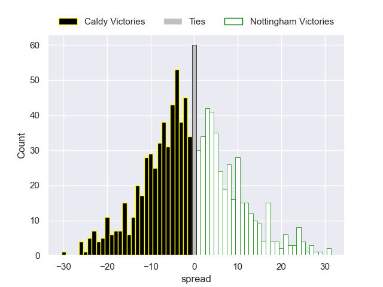

### London Scottish V Cambridge on 2026/01/31

Average Margin: London Scottish by 8.6

### Doncaster V Cornish Pirates on 2026/01/31

Average Margin: Doncaster by 3.2

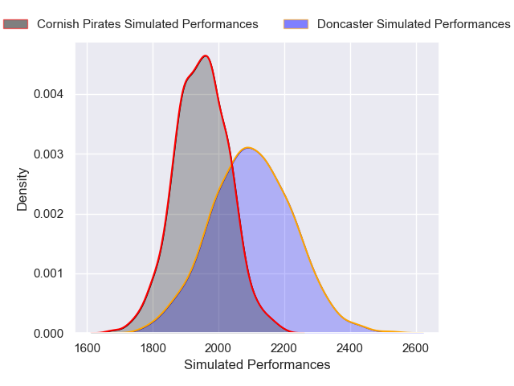

### Coventry V Chinnor on 2026/01/31

Average Margin: Coventry by 3.3

### Hartpury College V Bedford on 2026/01/31

Average Margin: Hartpury College by 0.3

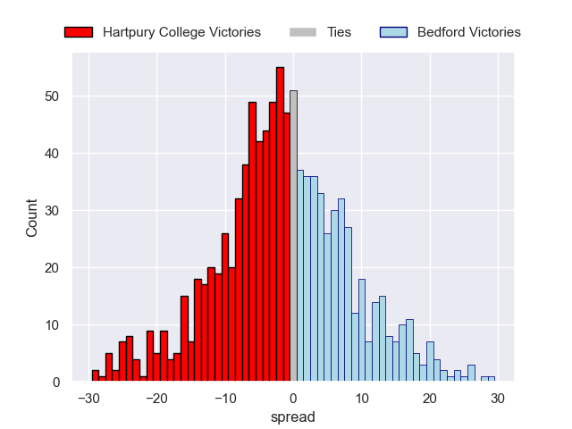

### Ealing Trailfinders V Richmond on 2026/01/31

Average Margin: Ealing Trailfinders by 17.5

### Ampthill V Worcester Warriors on 2026/01/31

Average Margin: Worcester Warriors by 2.2

## Week 16

### Cornish Pirates V London Scottish on 2026/02/07

Average Margin: Cornish Pirates by 5.3

### Ealing Trailfinders V Coventry on 2026/02/07

Average Margin: Ealing Trailfinders by 9.9

### Richmond V Nottingham on 2026/02/07

Average Margin: Nottingham by 2.0

### Bedford V Ampthill on 2026/02/07

Average Margin: Bedford by 7.0

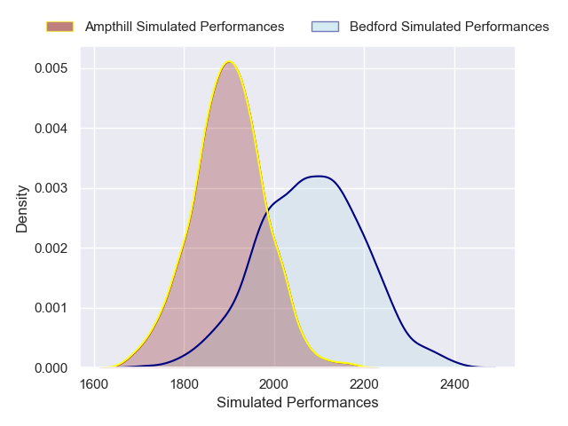

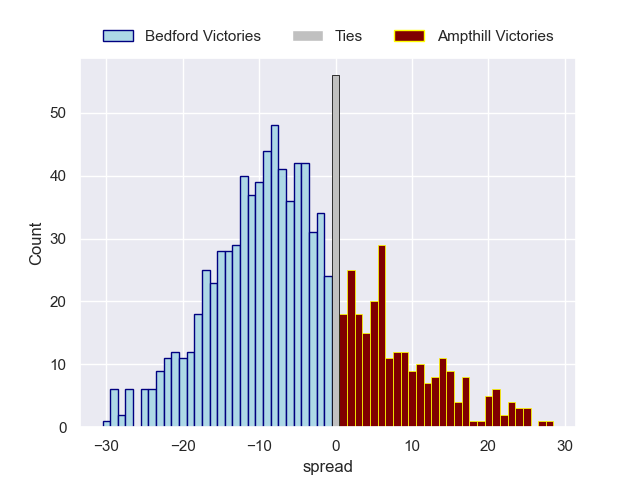

### Worcester Warriors V Doncaster on 2026/02/07

Average Margin: Worcester Warriors by 4.4

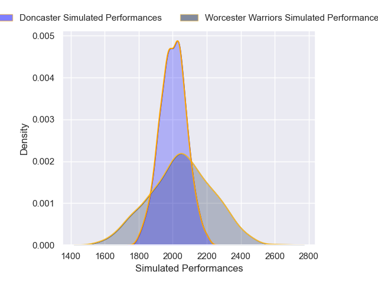

### Cambridge V Caldy on 2026/02/07

Average Margin: Caldy by 5.4

### Chinnor V Hartpury College on 2026/02/07

Average Margin: Chinnor by 3.9

## Week 17

### London Scottish V Worcester Warriors on 2026/02/14

Average Margin: Worcester Warriors by 4.4

### Hartpury College V Ealing Trailfinders on 2026/02/14

Average Margin: Ealing Trailfinders by 6.4

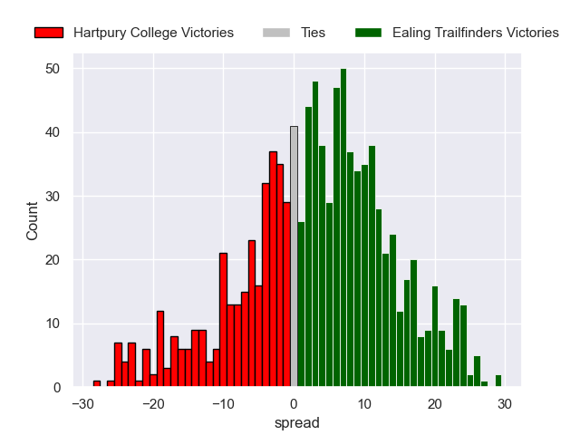

### Doncaster V Bedford on 2026/02/14

Average Margin: Bedford by 1.2

### Ampthill V Chinnor on 2026/02/14

Average Margin: Chinnor by 1.0

### Coventry V Richmond on 2026/02/14

Average Margin: Coventry by 9.0

### Caldy V Cornish Pirates on 2026/02/14

Average Margin: Cornish Pirates by 0.5

### Nottingham V Cambridge on 2026/02/14

Average Margin: Nottingham by 11.0

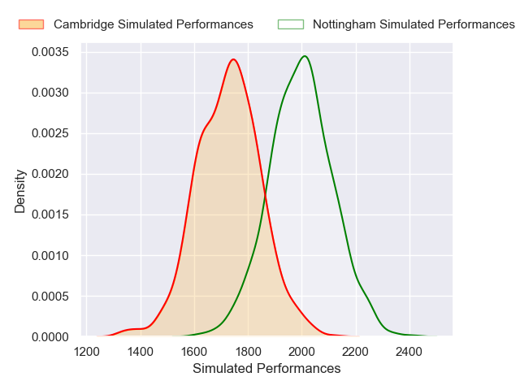

## Week 18

### Bedford V London Scottish on 2026/02/21

Average Margin: Bedford by 8.1

### Worcester Warriors V Caldy on 2026/02/21

Average Margin: Worcester Warriors by 6.8

### Coventry V Hartpury College on 2026/02/21

Average Margin: Coventry by 4.4

### Richmond V Cambridge on 2026/02/21

Average Margin: Richmond by 7.4

### Ealing Trailfinders V Ampthill on 2026/02/21

Average Margin: Ealing Trailfinders by 13.0

### Chinnor V Doncaster on 2026/02/21

Average Margin: Chinnor by 4.6

### Cornish Pirates V Nottingham on 2026/02/21

Average Margin: Cornish Pirates by 2.6

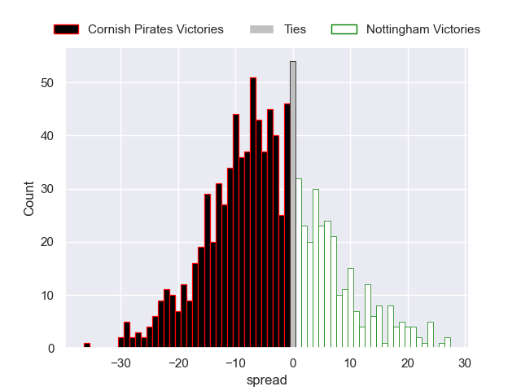

## Week 19

### London Scottish V Chinnor on 2026/02/28

Average Margin: Chinnor by 4.0

### Hartpury College V Richmond on 2026/02/28

Average Margin: Hartpury College by 7.3

### Nottingham V Worcester Warriors on 2026/02/28

Average Margin: Worcester Warriors by 0.1

### Ampthill V Coventry on 2026/02/28

Average Margin: Coventry by 1.0

### Caldy V Bedford on 2026/02/28

Average Margin: Bedford by 3.6

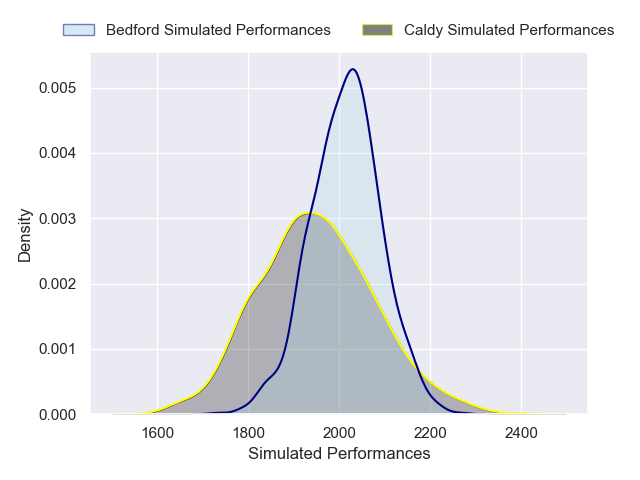

### Cambridge V Cornish Pirates on 2026/02/28

Average Margin: Cornish Pirates by 7.1

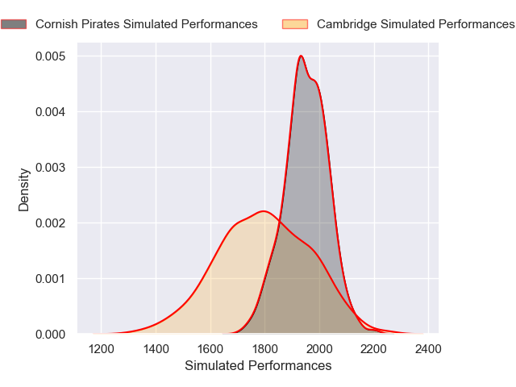

### Doncaster V Ealing Trailfinders on 2026/02/28

Average Margin: Ealing Trailfinders by 6.9

## Week 20

### Richmond V Cornish Pirates on 2026/03/21

Average Margin: Cornish Pirates by 0.9

### Chinnor V Caldy on 2026/03/21

Average Margin: Chinnor by 5.5

### Coventry V Doncaster on 2026/03/21

Average Margin: Coventry by 4.2

### Hartpury College V Ampthill on 2026/03/21

Average Margin: Hartpury College by 4.0

### Worcester Warriors V Cambridge on 2026/03/21

Average Margin: Worcester Warriors by 10.8

### Ealing Trailfinders V London Scottish on 2026/03/21

Average Margin: Ealing Trailfinders by 13.5

### Bedford V Nottingham on 2026/03/21

Average Margin: Bedford by 5.1

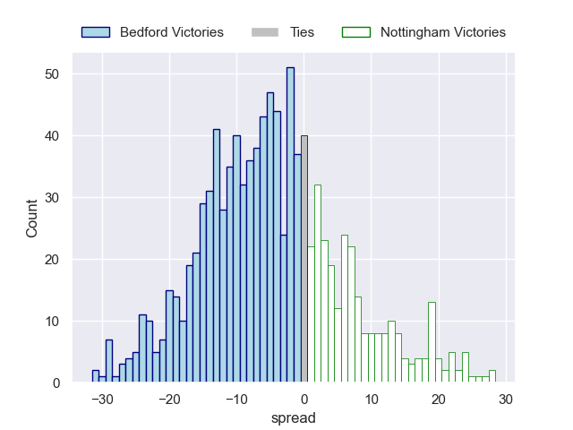

## Week 21

### Doncaster V Hartpury College on 2026/03/28

Average Margin: Doncaster by 2.2

### London Scottish V Coventry on 2026/03/28

Average Margin: Coventry by 2.9

### Ampthill V Richmond on 2026/03/28

Average Margin: Ampthill by 4.5

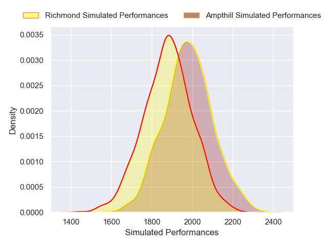

### Nottingham V Chinnor on 2026/03/28

Average Margin: Nottingham by 0.7

### Caldy V Ealing Trailfinders on 2026/03/28

Average Margin: Ealing Trailfinders by 8.9

### Cambridge V Bedford on 2026/03/28

Average Margin: Bedford by 8.6

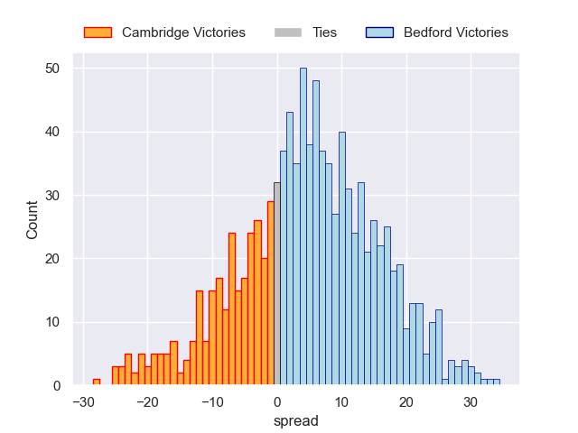

### Cornish Pirates V Worcester Warriors on 2026/03/28

Average Margin: Cornish Pirates by 0.9

## Week 22

### Richmond V Worcester Warriors on 2026/04/04

Average Margin: Worcester Warriors by 1.9

### Coventry V Caldy on 2026/04/04

Average Margin: Coventry by 5.6

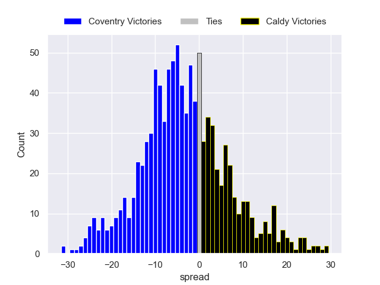

### Ampthill V Doncaster on 2026/04/04

Average Margin: Ampthill by 0.5

### Hartpury College V London Scottish on 2026/04/04

Average Margin: Hartpury College by 6.1

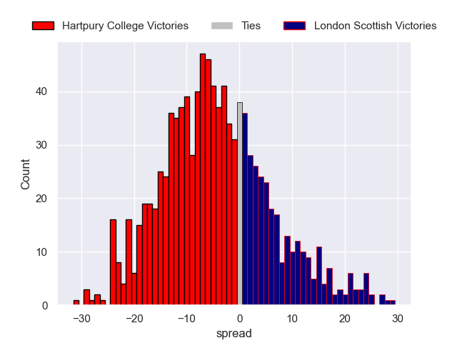

### Ealing Trailfinders V Nottingham on 2026/04/04

Average Margin: Ealing Trailfinders by 10.6

### Bedford V Cornish Pirates on 2026/04/04

Average Margin: Bedford by 4.7

### Chinnor V Cambridge on 2026/04/04

Average Margin: Chinnor by 10.1

## Week 23

### Doncaster V Richmond on 2026/04/11

Average Margin: Doncaster by 6.4

### London Scottish V Ampthill on 2026/04/11

Average Margin: London Scottish by 0.4

### Caldy V Hartpury College on 2026/04/11

Average Margin: Hartpury College by 1.6

### Nottingham V Coventry on 2026/04/11

Average Margin: Nottingham by 0.2

### Cambridge V Ealing Trailfinders on 2026/04/11

Average Margin: Ealing Trailfinders by 12.5

### Worcester Warriors V Bedford on 2026/04/11

Average Margin: Worcester Warriors by 1.1

### Cornish Pirates V Chinnor on 2026/04/11

Average Margin: Cornish Pirates by 1.4

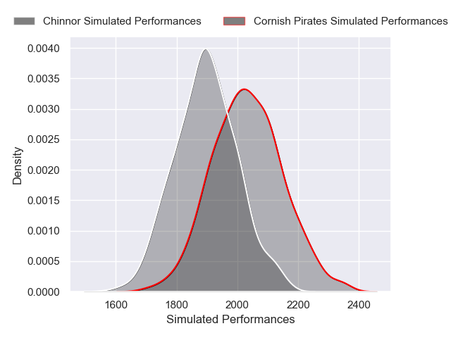

## Week 24

### Hartpury College V Nottingham on 2026/04/18

Average Margin: Hartpury College by 4.4

### Ampthill V Caldy on 2026/04/18

Average Margin: Ampthill by 2.7

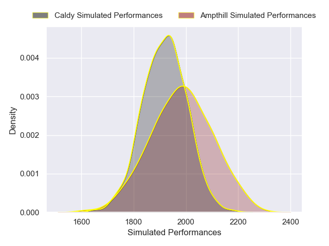

### Richmond V Bedford on 2026/04/18

Average Margin: Bedford by 2.5

### Chinnor V Worcester Warriors on 2026/04/18

Average Margin: Chinnor by 3.3

### Coventry V Cambridge on 2026/04/18

Average Margin: Coventry by 10.3

### Doncaster V London Scottish on 2026/04/18

Average Margin: Doncaster by 5.1

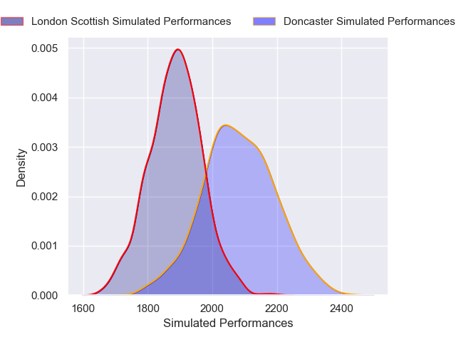

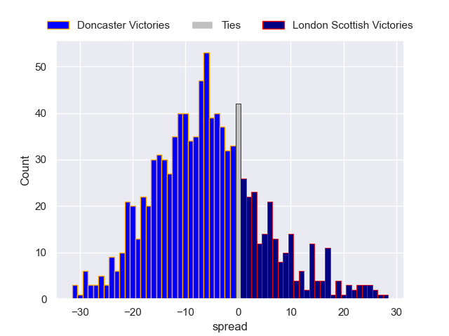

### Ealing Trailfinders V Cornish Pirates on 2026/04/18

Average Margin: Ealing Trailfinders by 10.7

## Week 25

### Worcester Warriors V Ealing Trailfinders on 2026/05/02

Average Margin: Ealing Trailfinders by 3.3

### Cambridge V Hartpury College on 2026/05/02

Average Margin: Hartpury College by 4.1

### Caldy V Doncaster on 2026/05/02

Average Margin: Doncaster by 0.2

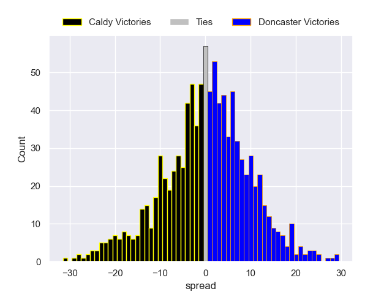

### Nottingham V Ampthill on 2026/05/02

Average Margin: Nottingham by 2.9

### Cornish Pirates V Coventry on 2026/05/02

Average Margin: Cornish Pirates by 1.0

### London Scottish V Richmond on 2026/05/02

Average Margin: London Scottish by 2.1

### Bedford V Chinnor on 2026/05/02

Average Margin: Bedford by 3.4

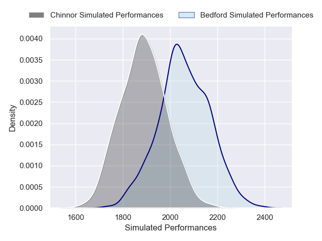

## Week 26

### London Scottish V Caldy on 2026/05/09

Average Margin: London Scottish by 0.9

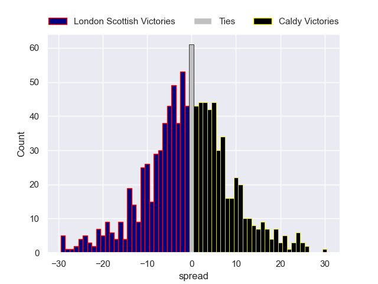

### Coventry V Worcester Warriors on 2026/05/09

Average Margin: Coventry by 3.6

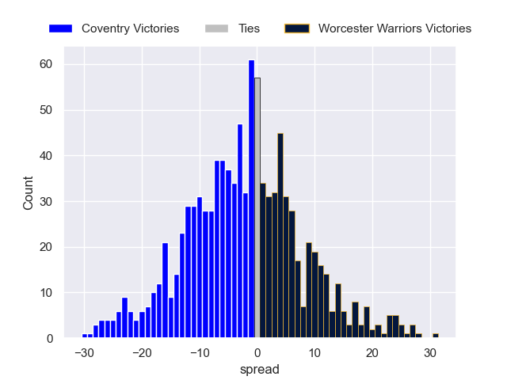

### Doncaster V Nottingham on 2026/05/09

Average Margin: Doncaster by 2.5

### Ealing Trailfinders V Bedford on 2026/05/09

Average Margin: Ealing Trailfinders by 7.6

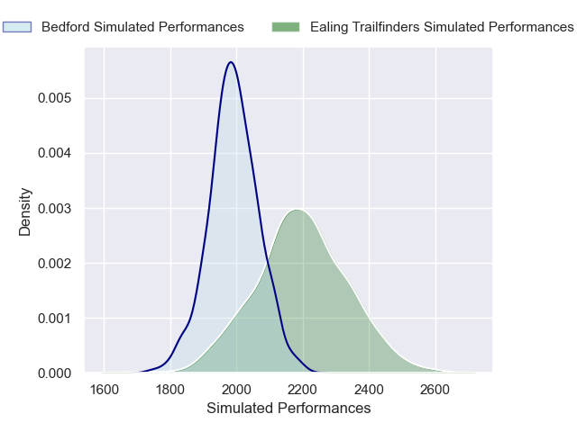

### Hartpury College V Cornish Pirates on 2026/05/09

Average Margin: Hartpury College by 3.7

### Ampthill V Cambridge on 2026/05/09

Average Margin: Ampthill by 6.5

### Chinnor V Richmond on 2026/05/09

Average Margin: Chinnor by 6.1

