# Team Rankings

# Standings

## Current Standings

| Club                |   Played |   Wins |   Point Differential |   Losing Bonus Points |   Try Bonus Points |   Competition Points |
|:--------------------|---------:|-------:|---------------------:|----------------------:|-------------------:|---------------------:|
| Ealing Trailfinders |       13 |     13 |                  371 |                     0 |                  8 |                   60 |
| Bedford             |       12 |      9 |                  105 |                     1 |                 10 |                   49 |
| Worcester Warriors  |       13 |      8 |                  126 |                     4 |                  7 |                   43 |
| Coventry            |       13 |      8 |                  112 |                     2 |                  8 |                   42 |
| Hartpury College    |       13 |      8 |                   35 |                     1 |                  4 |                   39 |
| Nottingham          |       13 |      6 |                   28 |                     4 |                  8 |                   38 |
| Chinnor             |       12 |      8 |                   54 |                     3 |                  2 |                   37 |
| Caldy               |       13 |      6 |                  -42 |                     2 |                  6 |                   32 |
| Cornish Pirates     |       13 |      5 |                    2 |                     3 |                  6 |                   31 |
| Ampthill            |       13 |      6 |                 -163 |                     2 |                  4 |                   30 |
| Doncaster           |       13 |      4 |                  -14 |                     3 |                  4 |                   27 |
| Richmond            |       13 |      3 |                  -89 |                     4 |                  1 |                   17 |
| London Scottish     |       13 |      3 |                 -159 |                     2 |                  2 |                   16 |
| Cambridge           |       13 |      0 |                 -366 |                     2 |                  4 |                    6 |

## Projected Remaining Table

| Club                |   To Play |   Projected Wins |   Projected Differential |   Projected Losing Bonus Points | Projected Try Bonus Points   |   Projected Competition Points |
|:--------------------|----------:|-----------------:|-------------------------:|--------------------------------:|:-----------------------------|-------------------------------:|
| Ealing Trailfinders |        13 |            9.632 |                  126.227 |                           1.499 |                              |                         40.797 |
| Bedford             |        13 |            8.067 |                   48.196 |                           2.354 |                              |                         35.714 |
| Coventry            |        13 |            7.426 |                   29.654 |                           2.45  |                              |                         33.354 |
| Worcester Warriors  |        13 |            6.854 |                   24.249 |                           2.885 |                              |                         31.553 |
| Chinnor             |        13 |            6.632 |                   13.908 |                           2.941 |                              |                         30.701 |
| Hartpury College    |        13 |            6.636 |                   10.216 |                           2.922 |                              |                         30.68  |
| Doncaster           |        13 |            6.592 |                    9.712 |                           2.945 |                              |                         30.611 |
| Cornish Pirates     |        13 |            6.458 |                    2.21  |                           2.941 |                              |                         29.975 |
| Nottingham          |        13 |            6.209 |                    2.471 |                           3.059 |                              |                         29.233 |
| Ampthill            |        13 |            5.388 |                  -23.847 |                           3.22  |                              |                         26.018 |
| Caldy               |        13 |            4.798 |                  -33.798 |                           3.457 |                              |                         23.923 |
| London Scottish     |        13 |            4.733 |                  -41.064 |                           3.105 |                              |                         23.135 |
| Richmond            |        13 |            4.574 |                  -52.411 |                           3.096 |                              |                         22.55  |
| Cambridge           |        13 |            2.975 |                 -115.723 |                           2.448 |                              |                         15.078 |

## Projected Total Table

| Club                |   Played |   Wins |   Point Differential |   Losing Bonus Points |   Try Bonus Points |   Competition Points |
|:--------------------|---------:|-------:|---------------------:|----------------------:|-------------------:|---------------------:|
| Ealing Trailfinders |       26 | 22.632 |              497.227 |                 1.499 |                  8 |              100.797 |
| Bedford             |       25 | 17.067 |              153.196 |                 3.354 |                 10 |               84.714 |
| Coventry            |       26 | 15.426 |              141.654 |                 4.45  |                  8 |               75.354 |
| Worcester Warriors  |       26 | 14.854 |              150.249 |                 6.885 |                  7 |               74.553 |
| Hartpury College    |       26 | 14.636 |               45.216 |                 3.922 |                  4 |               69.68  |
| Chinnor             |       25 | 14.632 |               67.908 |                 5.941 |                  2 |               67.701 |
| Nottingham          |       26 | 12.209 |               30.471 |                 7.059 |                  8 |               67.233 |
| Cornish Pirates     |       26 | 11.458 |                4.21  |                 5.941 |                  6 |               60.975 |
| Doncaster           |       26 | 10.592 |               -4.288 |                 5.945 |                  4 |               57.611 |
| Ampthill            |       26 | 11.388 |             -186.847 |                 5.22  |                  4 |               56.018 |
| Caldy               |       26 | 10.798 |              -75.798 |                 5.457 |                  6 |               55.923 |
| Richmond            |       26 |  7.574 |             -141.411 |                 7.096 |                  1 |               39.55  |
| London Scottish     |       26 |  7.733 |             -200.064 |                 5.105 |                  2 |               39.135 |
| Cambridge           |       26 |  2.975 |             -481.723 |                 4.448 |                  4 |               21.078 |

# Completed Match Review

| Model | Percent Correct Predictions | Spread Error |
| ------ | ------ | ------ |
| Club Level | 68.5% | 10.3 |
| Player Level: Lineup | nan% | nan |
| Player Level: Minutes | nan% | nan |

# Future Predictions

## Week 14

### Nottingham V London Scottish on 2026/01/24

Average Margin: Nottingham by 5.2

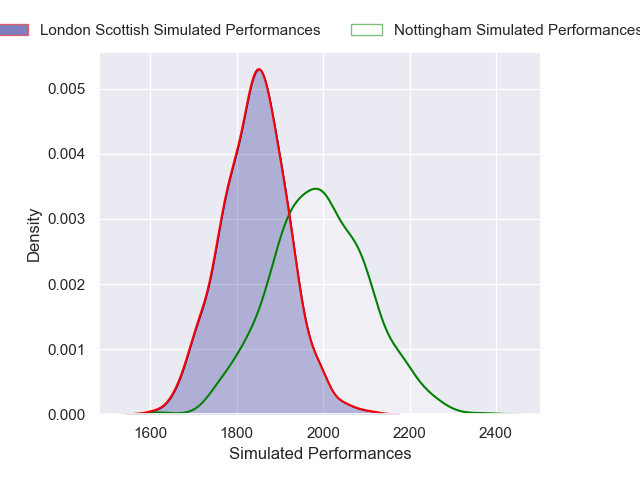

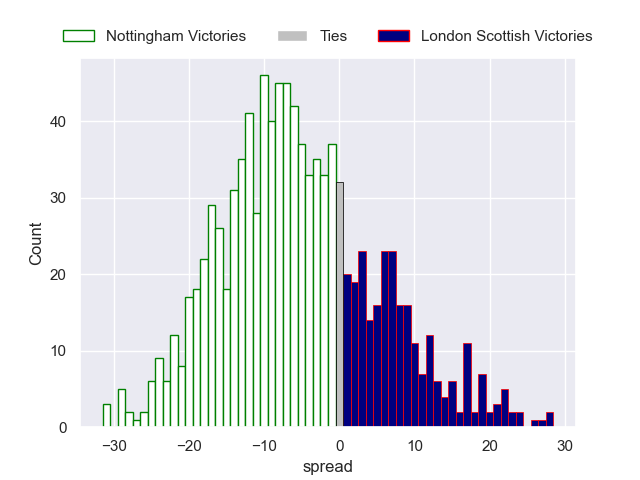

### Cornish Pirates V Ampthill on 2026/01/24

Average Margin: Cornish Pirates by 4.4

### Richmond V Caldy on 2026/01/24

Average Margin: Caldy by 0.3

### Bedford V Coventry on 2026/01/24

Average Margin: Bedford by 3.9

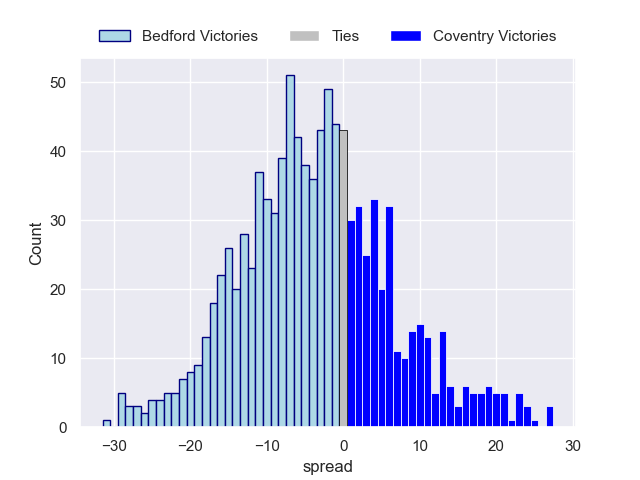

### Cambridge V Doncaster on 2026/01/24

Average Margin: Doncaster by 9.0

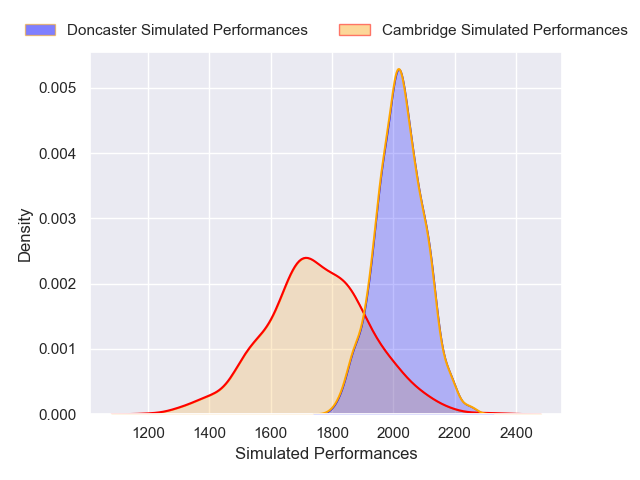

### Worcester Warriors V Hartpury College on 2026/01/24

Average Margin: Worcester Warriors by 4.0

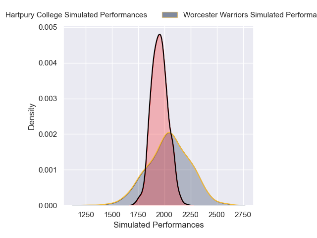

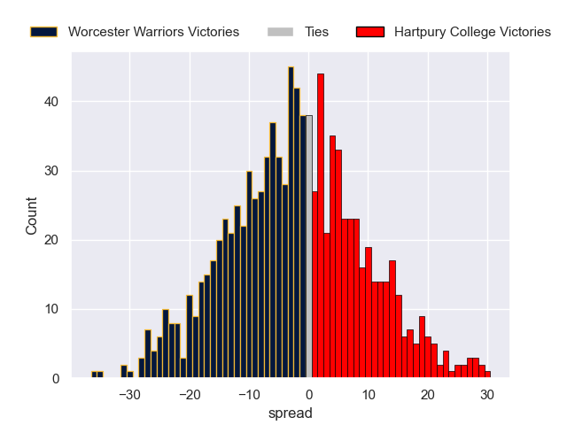

### Chinnor V Ealing Trailfinders on 2026/01/24

Average Margin: Ealing Trailfinders by 6.2

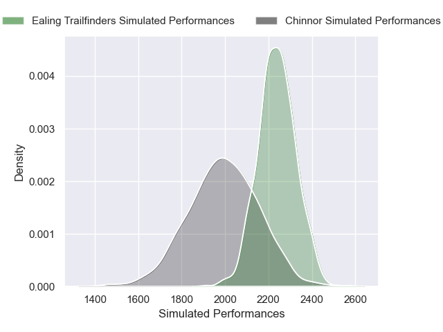

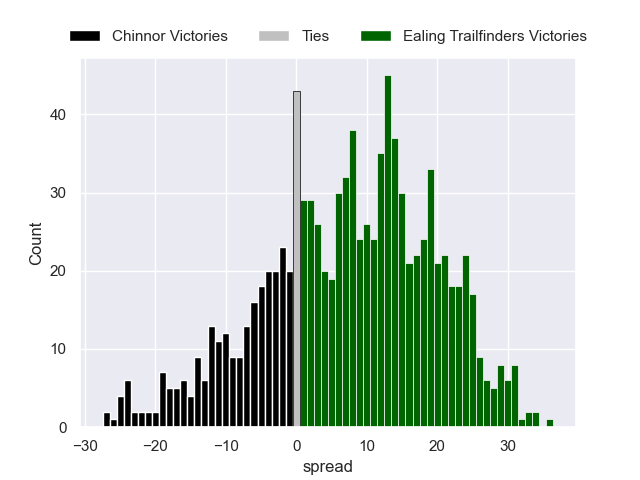

## Week 15

### Ealing Trailfinders V Richmond on 2026/01/31

Average Margin: Ealing Trailfinders by 16.6

### Hartpury College V Bedford on 2026/01/31

Average Margin: Bedford by 0.7

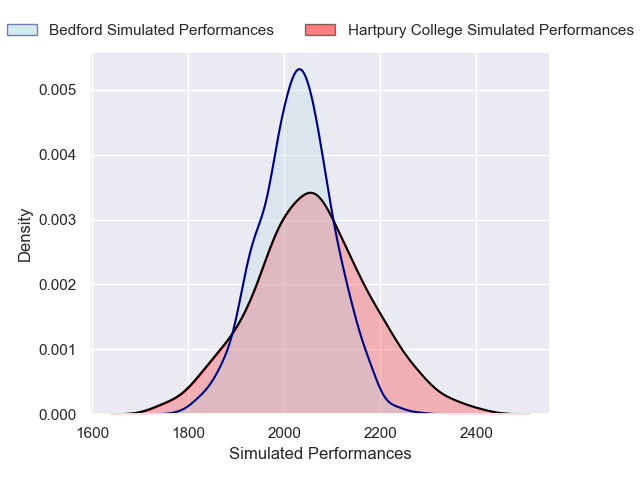

### Ampthill V Worcester Warriors on 2026/01/31

Average Margin: Worcester Warriors by 2.5

### Doncaster V Cornish Pirates on 2026/01/31

Average Margin: Doncaster by 3.2

### London Scottish V Cambridge on 2026/01/31

Average Margin: London Scottish by 8.4

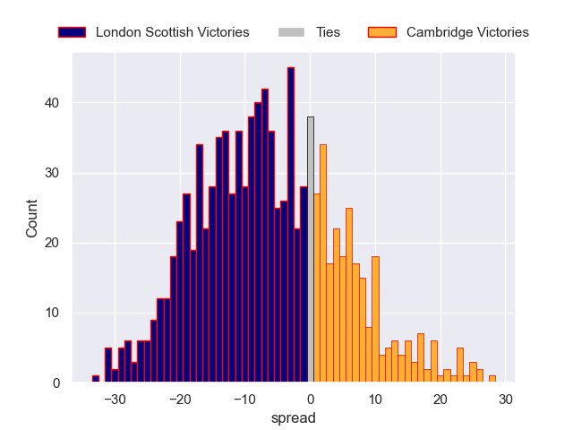

### Coventry V Chinnor on 2026/01/31

Average Margin: Coventry by 4.7

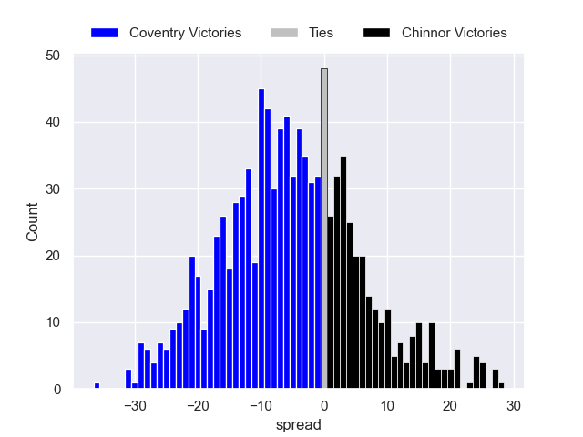

### Caldy V Nottingham on 2026/01/31

Average Margin: Nottingham by 1.4

## Week 16

### Richmond V Nottingham on 2026/02/07

Average Margin: Nottingham by 2.6

### Worcester Warriors V Doncaster on 2026/02/07

Average Margin: Worcester Warriors by 4.4

### Bedford V Ampthill on 2026/02/07

Average Margin: Bedford by 7.5

### Cambridge V Caldy on 2026/02/07

Average Margin: Caldy by 5.5

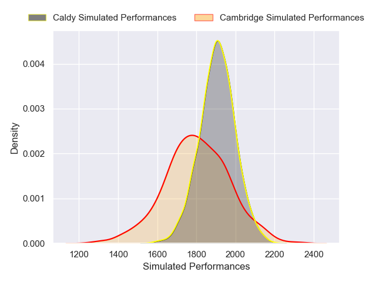

### Chinnor V Hartpury College on 2026/02/07

Average Margin: Chinnor by 2.8

### Cornish Pirates V London Scottish on 2026/02/07

Average Margin: Cornish Pirates by 5.9

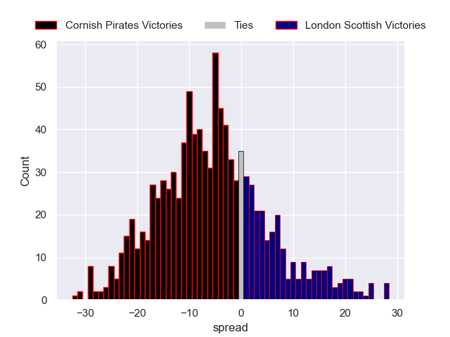

### Ealing Trailfinders V Coventry on 2026/02/07

Average Margin: Ealing Trailfinders by 10.4

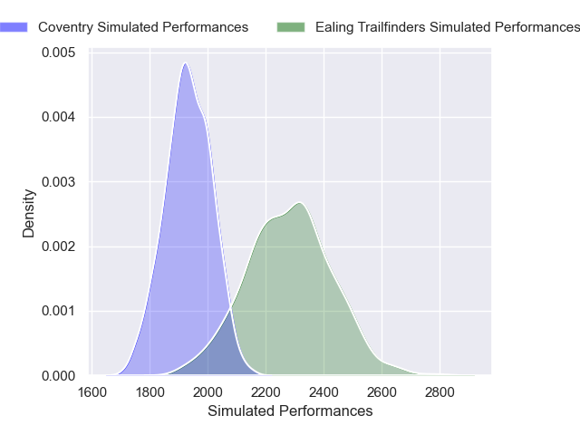

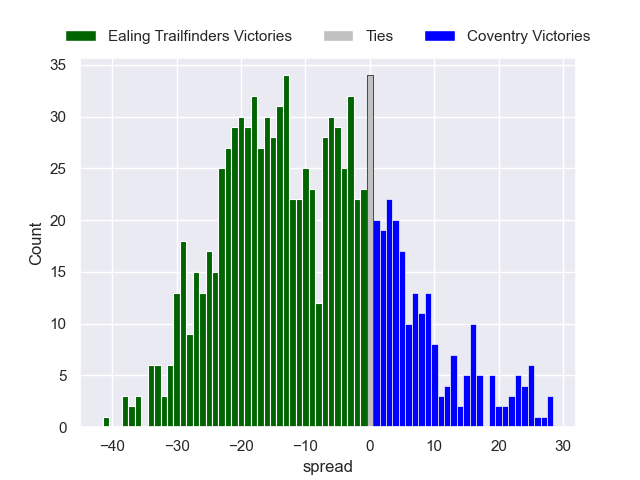

## Week 17

### Caldy V Cornish Pirates on 2026/02/14

Average Margin: Cornish Pirates by 0.7

### Coventry V Richmond on 2026/02/14

Average Margin: Coventry by 8.3

### Doncaster V Bedford on 2026/02/14

Average Margin: Bedford by 1.0

### Hartpury College V Ealing Trailfinders on 2026/02/14

Average Margin: Ealing Trailfinders by 6.0

### Ampthill V Chinnor on 2026/02/14

Average Margin: Chinnor by 0.5

### Nottingham V Cambridge on 2026/02/14

Average Margin: Nottingham by 11.4

### London Scottish V Worcester Warriors on 2026/02/14

Average Margin: Worcester Warriors by 3.6

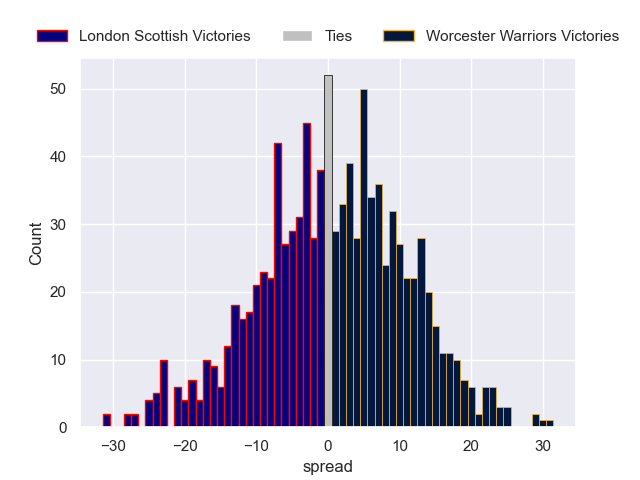

## Week 18

### Bedford V London Scottish on 2026/02/21

Average Margin: Bedford by 8.7

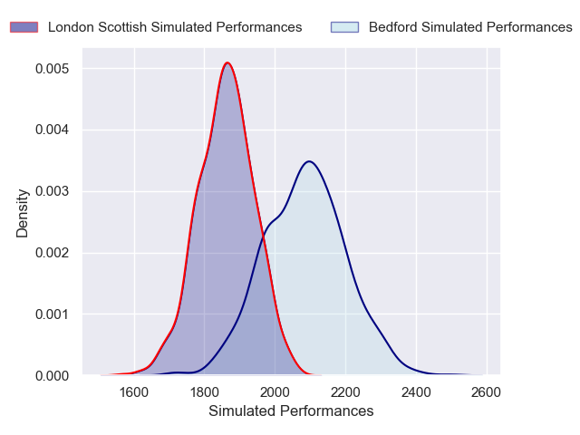

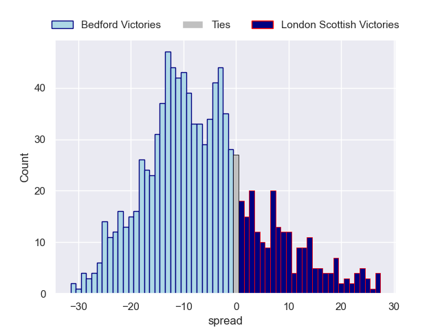

### Cornish Pirates V Nottingham on 2026/02/21

Average Margin: Cornish Pirates by 2.6

### Coventry V Hartpury College on 2026/02/21

Average Margin: Coventry by 4.7

### Ealing Trailfinders V Ampthill on 2026/02/21

Average Margin: Ealing Trailfinders by 13.2

### Richmond V Cambridge on 2026/02/21

Average Margin: Richmond by 6.7

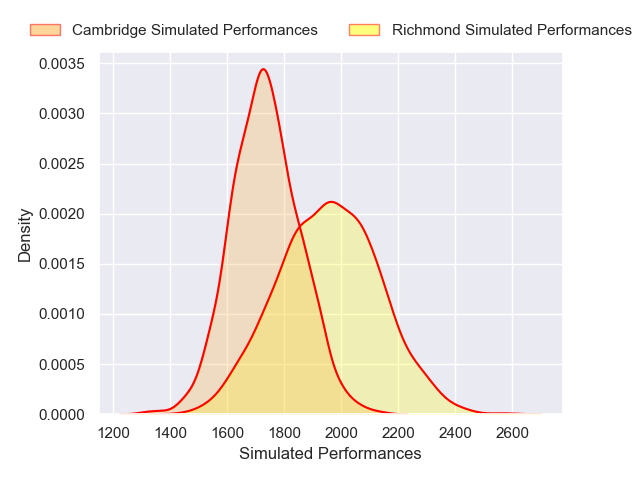

### Worcester Warriors V Caldy on 2026/02/21

Average Margin: Worcester Warriors by 6.1

### Chinnor V Doncaster on 2026/02/21

Average Margin: Chinnor by 3.7

## Week 19

### London Scottish V Chinnor on 2026/02/28

Average Margin: Chinnor by 2.1

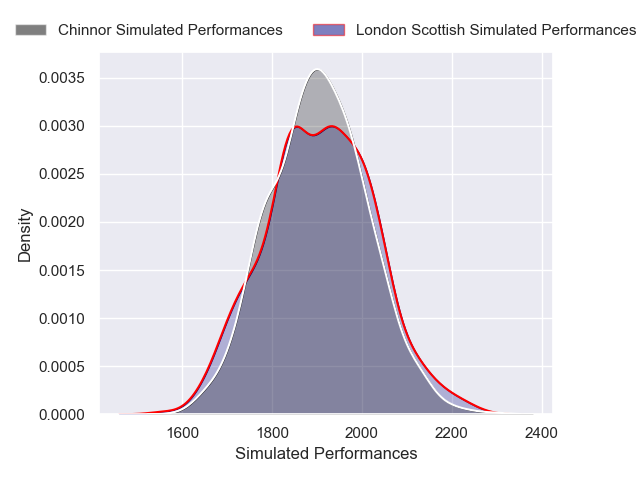

### Nottingham V Worcester Warriors on 2026/02/28

Average Margin: Nottingham by 0.6

### Ampthill V Coventry on 2026/02/28

Average Margin: Coventry by 0.8

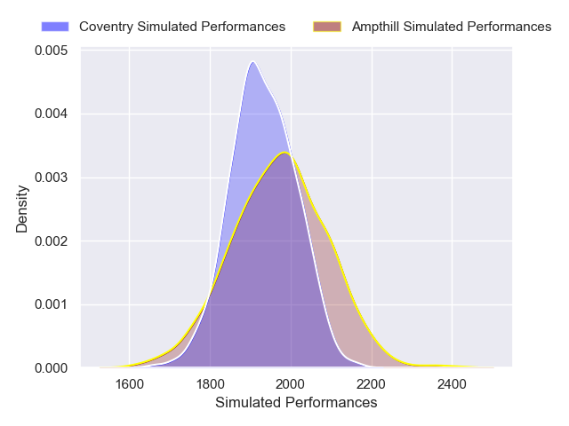

### Hartpury College V Richmond on 2026/02/28

Average Margin: Hartpury College by 6.7

### Cambridge V Cornish Pirates on 2026/02/28

Average Margin: Cornish Pirates by 7.3

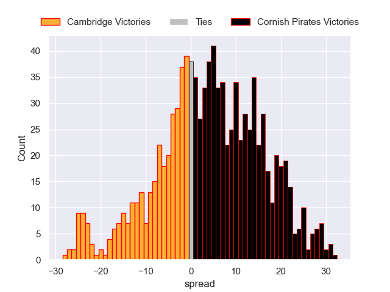

### Doncaster V Ealing Trailfinders on 2026/02/28

Average Margin: Ealing Trailfinders by 6.7

### Caldy V Bedford on 2026/02/28

Average Margin: Bedford by 4.9

## Week 20

### Coventry V Doncaster on 2026/03/21

Average Margin: Coventry by 3.7

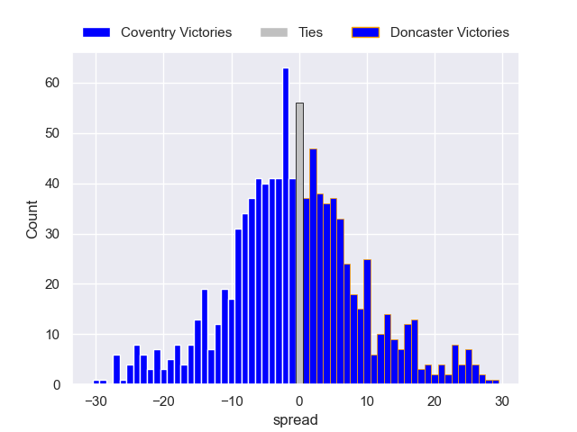

### Hartpury College V Ampthill on 2026/03/21

Average Margin: Hartpury College by 4.5

### Ealing Trailfinders V London Scottish on 2026/03/21

Average Margin: Ealing Trailfinders by 13.6

### Bedford V Nottingham on 2026/03/21

Average Margin: Bedford by 5.5

### Richmond V Cornish Pirates on 2026/03/21

Average Margin: Cornish Pirates by 0.7

### Chinnor V Caldy on 2026/03/21

Average Margin: Chinnor by 5.4

### Worcester Warriors V Cambridge on 2026/03/21

Average Margin: Worcester Warriors by 11.4

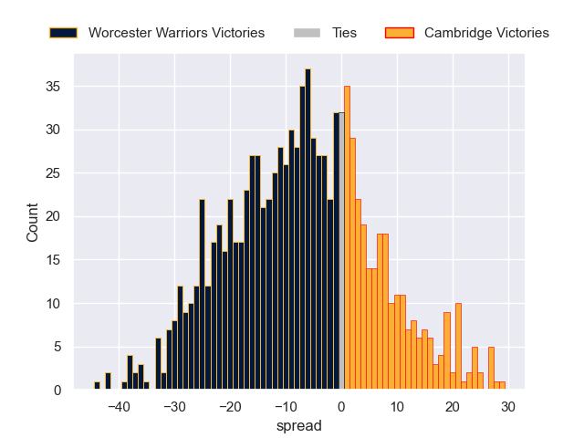

## Week 21

### Doncaster V Hartpury College on 2026/03/28

Average Margin: Doncaster by 2.1

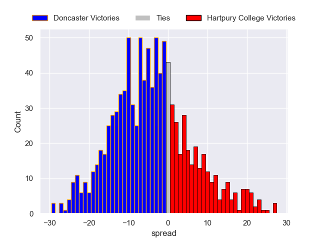

### Ampthill V Richmond on 2026/03/28

Average Margin: Ampthill by 4.3

### Nottingham V Chinnor on 2026/03/28

Average Margin: Nottingham by 1.4

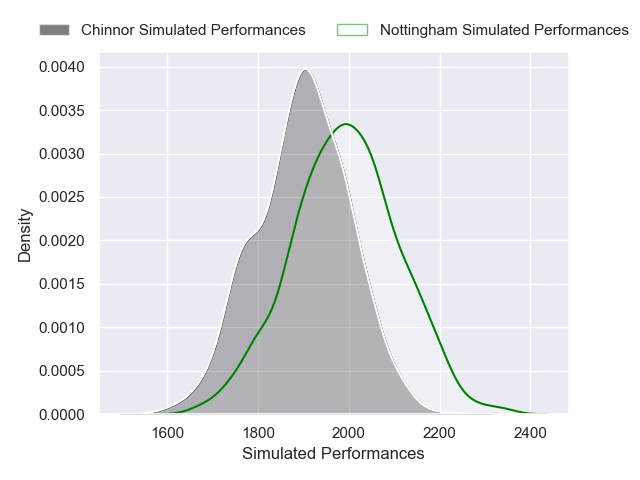

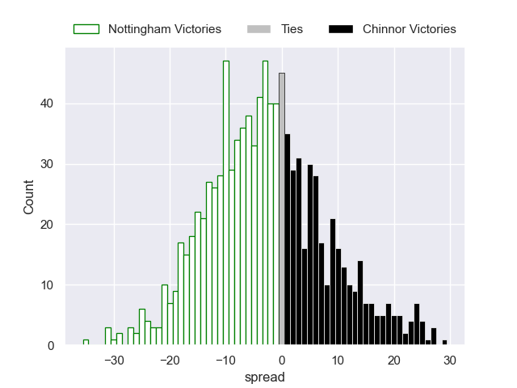

### London Scottish V Coventry on 2026/03/28

Average Margin: Coventry by 2.8

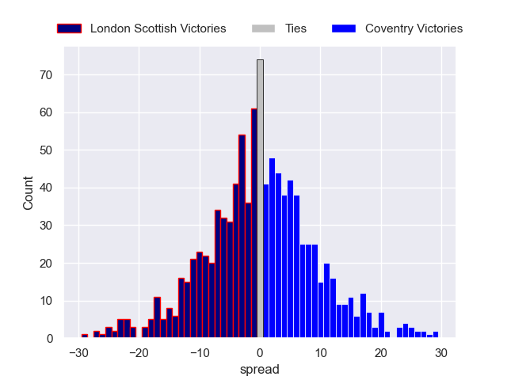

### Caldy V Ealing Trailfinders on 2026/03/28

Average Margin: Ealing Trailfinders by 9.6

### Cornish Pirates V Worcester Warriors on 2026/03/28

Average Margin: Cornish Pirates by 0.5

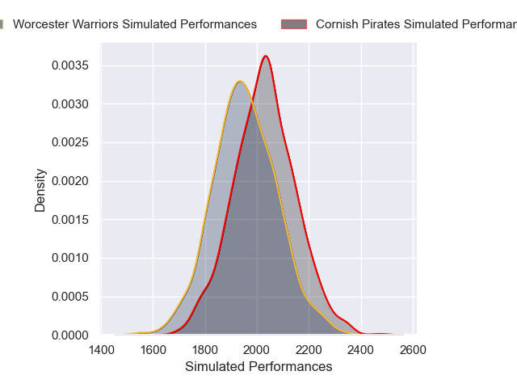

### Cambridge V Bedford on 2026/03/28

Average Margin: Bedford by 9.9

## Week 22

### Ampthill V Doncaster on 2026/04/04

Average Margin: Doncaster by 0.2

### Hartpury College V London Scottish on 2026/04/04

Average Margin: Hartpury College by 5.1

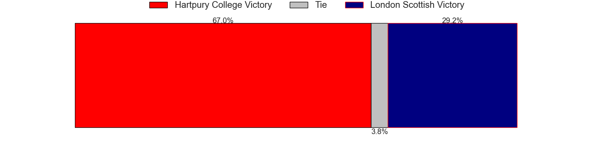

### Ealing Trailfinders V Nottingham on 2026/04/04

Average Margin: Ealing Trailfinders by 9.5

### Chinnor V Cambridge on 2026/04/04

Average Margin: Chinnor by 9.9

### Bedford V Cornish Pirates on 2026/04/04

Average Margin: Bedford by 5.5

### Coventry V Caldy on 2026/04/04

Average Margin: Coventry by 6.3

### Richmond V Worcester Warriors on 2026/04/04

Average Margin: Worcester Warriors by 2.0

## Week 23

### Nottingham V Coventry on 2026/04/11

Average Margin: Nottingham by 1.0

### Doncaster V Richmond on 2026/04/11

Average Margin: Doncaster by 5.7

### Worcester Warriors V Bedford on 2026/04/11

Average Margin: Worcester Warriors by 0.7

### Cornish Pirates V Chinnor on 2026/04/11

Average Margin: Cornish Pirates by 1.5

### Cambridge V Ealing Trailfinders on 2026/04/11

Average Margin: Ealing Trailfinders by 13.3

### London Scottish V Ampthill on 2026/04/11

Average Margin: London Scottish by 0.1

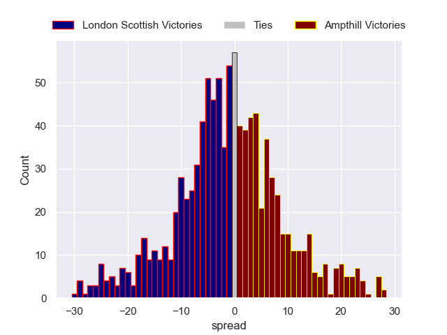

### Caldy V Hartpury College on 2026/04/11

Average Margin: Hartpury College by 1.0

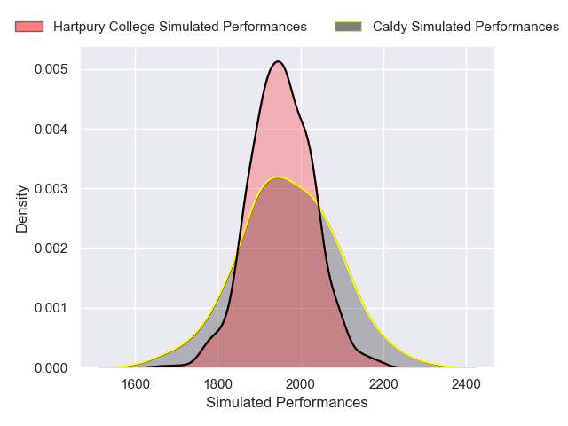

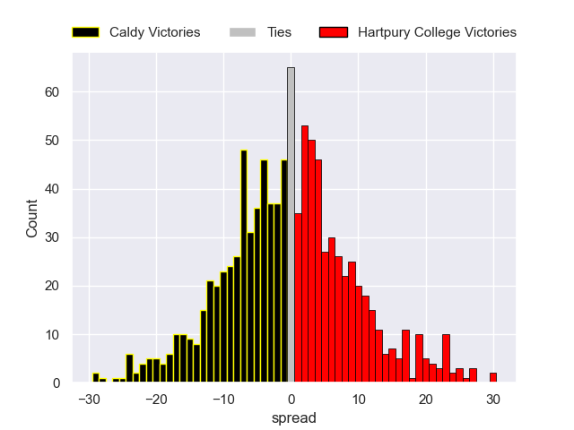

## Week 24

### Richmond V Bedford on 2026/04/18

Average Margin: Bedford by 4.0

### Coventry V Cambridge on 2026/04/18

Average Margin: Coventry by 11.3

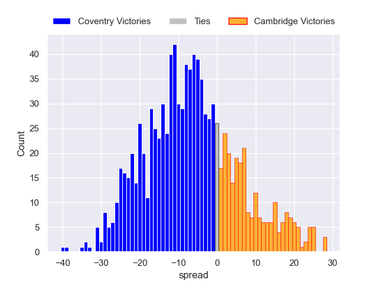

### Doncaster V London Scottish on 2026/04/18

Average Margin: Doncaster by 5.2

### Ealing Trailfinders V Cornish Pirates on 2026/04/18

Average Margin: Ealing Trailfinders by 10.7

### Hartpury College V Nottingham on 2026/04/18

Average Margin: Hartpury College by 4.5

### Ampthill V Caldy on 2026/04/18

Average Margin: Ampthill by 2.6

### Chinnor V Worcester Warriors on 2026/04/18

Average Margin: Chinnor by 2.2

## Week 25

### Bedford V Chinnor on 2026/05/02

Average Margin: Bedford by 4.6

### Cornish Pirates V Coventry on 2026/05/02

Average Margin: Cornish Pirates by 1.4

### Nottingham V Ampthill on 2026/05/02

Average Margin: Nottingham by 3.3

### Cambridge V Hartpury College on 2026/05/02

Average Margin: Hartpury College by 5.3

### Worcester Warriors V Ealing Trailfinders on 2026/05/02

Average Margin: Ealing Trailfinders by 3.2

### Caldy V Doncaster on 2026/05/02

Average Margin: Doncaster by 1.1

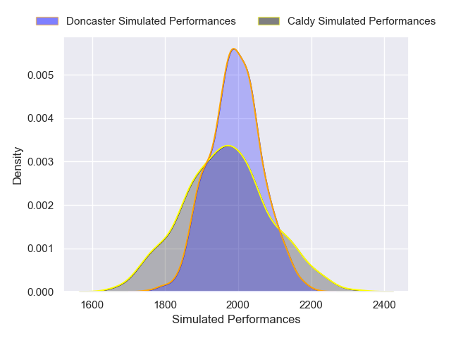

### London Scottish V Richmond on 2026/05/02

Average Margin: London Scottish by 2.1

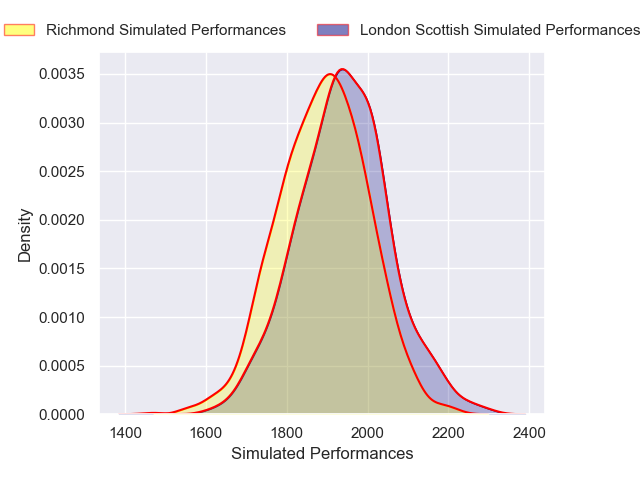

## Week 26

### Chinnor V Richmond on 2026/05/09

Average Margin: Chinnor by 5.7

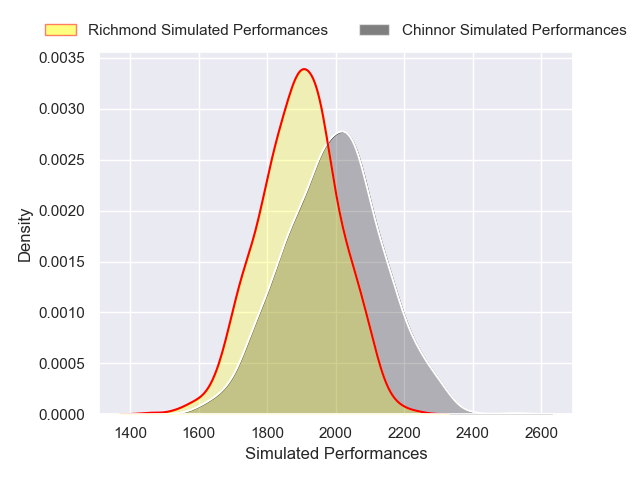

### Coventry V Worcester Warriors on 2026/05/09

Average Margin: Coventry by 3.8

### Doncaster V Nottingham on 2026/05/09

Average Margin: Doncaster by 2.5

### Ealing Trailfinders V Bedford on 2026/05/09

Average Margin: Ealing Trailfinders by 7.1

### Hartpury College V Cornish Pirates on 2026/05/09

Average Margin: Hartpury College by 3.5

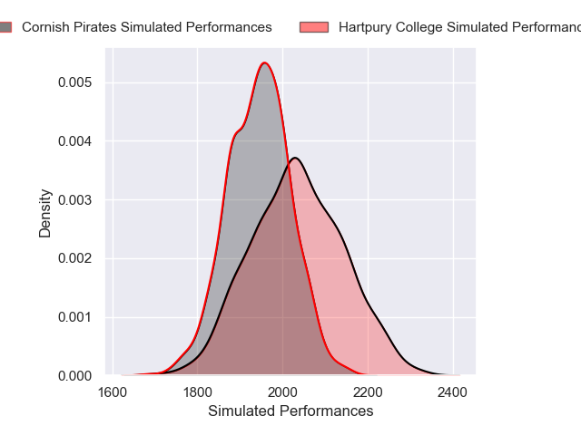

### Ampthill V Cambridge on 2026/05/09

Average Margin: Ampthill by 6.4

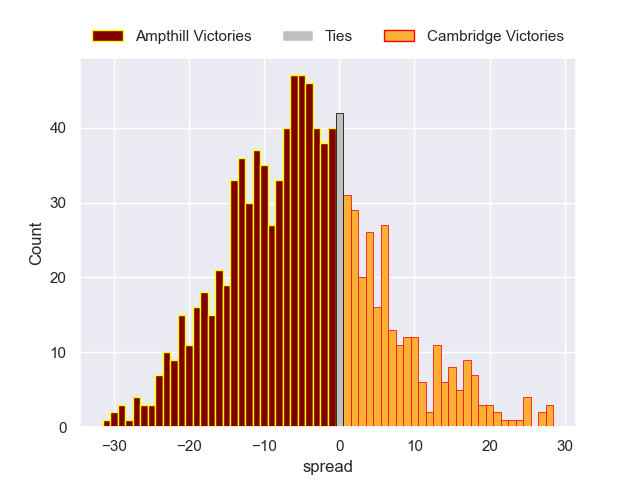

### London Scottish V Caldy on 2026/05/09

Average Margin: London Scottish by 0.5

