# Team Rankings

# Standings

## Current Standings

| Club                |   Played |   Wins |   Point Differential |   Losing Bonus Points |   Try Bonus Points |   Competition Points |
|:--------------------|---------:|-------:|---------------------:|----------------------:|-------------------:|---------------------:|
| Ealing Trailfinders |       15 |     15 |                  435 |                     0 |                  8 |                   68 |
| Bedford             |       15 |     10 |                   97 |                     2 |                 10 |                   54 |
| Worcester Warriors  |       15 |      9 |                  147 |                     5 |                  7 |                   48 |
| Hartpury College    |       15 |     10 |                   46 |                     1 |                  4 |                   47 |
| Chinnor             |       15 |     10 |                   63 |                     4 |                  2 |                   46 |
| Coventry            |       15 |      8 |                  100 |                     4 |                  8 |                   44 |
| Nottingham          |       15 |      7 |                   41 |                     5 |                  8 |                   43 |
| Caldy               |       15 |      7 |                  -59 |                     2 |                  6 |                   36 |
| Cornish Pirates     |       15 |      6 |                   -9 |                     3 |                  6 |                   35 |
| Doncaster           |       15 |      5 |                   18 |                     3 |                  4 |                   33 |
| Ampthill            |       15 |      6 |                 -211 |                     2 |                  4 |                   30 |
| Richmond            |       15 |      4 |                 -128 |                     4 |                  1 |                   21 |
| London Scottish     |       15 |      4 |                 -157 |                     2 |                  2 |                   20 |
| Cambridge           |       15 |      0 |                 -383 |                     2 |                  4 |                    8 |

## Projected Remaining Table

| Club                |   To Play |   Projected Wins |   Projected Differential |   Projected Losing Bonus Points | Projected Try Bonus Points   |   Projected Competition Points |
|:--------------------|----------:|-----------------:|-------------------------:|--------------------------------:|:-----------------------------|-------------------------------:|
| Ealing Trailfinders |        11 |            7.875 |                   94.745 |                           1.388 |                              |                         33.664 |
| Chinnor             |        11 |            6.669 |                   42.207 |                           2.051 |                              |                         29.737 |
| Bedford             |        11 |            6.488 |                   31.908 |                           2.021 |                              |                         28.941 |
| Coventry            |        11 |            6.152 |                   24.738 |                           2.2   |                              |                         27.736 |
| Hartpury College    |        11 |            5.952 |                   18.964 |                           2.233 |                              |                         27.027 |
| Worcester Warriors  |        11 |            5.884 |                   22.34  |                           2.354 |                              |                         26.832 |
| Cornish Pirates     |        11 |            5.303 |                   -1.676 |                           2.428 |                              |                         24.694 |
| Nottingham          |        11 |            5.095 |                   -1.404 |                           2.581 |                              |                         23.995 |
| Doncaster           |        11 |            4.999 |                   -8.95  |                           2.534 |                              |                         23.48  |
| Ampthill            |        11 |            4.469 |                  -27.252 |                           2.552 |                              |                         21.416 |
| Caldy               |        11 |            4.142 |                  -31.453 |                           2.74  |                              |                         20.218 |
| Richmond            |        11 |            4.073 |                  -33.714 |                           2.547 |                              |                         19.793 |
| London Scottish     |        11 |            3.794 |                  -43.917 |                           2.685 |                              |                         18.757 |
| Cambridge           |        11 |            2.818 |                  -86.536 |                           2.182 |                              |                         14.206 |

## Projected Total Table

| Club                |   Played |   Wins |   Point Differential |   Losing Bonus Points |   Try Bonus Points |   Competition Points |
|:--------------------|---------:|-------:|---------------------:|----------------------:|-------------------:|---------------------:|
| Ealing Trailfinders |       26 | 22.875 |              529.745 |                 1.388 |                  8 |              101.664 |
| Bedford             |       26 | 16.488 |              128.908 |                 4.021 |                 10 |               82.941 |
| Chinnor             |       26 | 16.669 |              105.207 |                 6.051 |                  2 |               75.737 |
| Worcester Warriors  |       26 | 14.884 |              169.34  |                 7.354 |                  7 |               74.832 |
| Hartpury College    |       26 | 15.952 |               64.964 |                 3.233 |                  4 |               74.027 |
| Coventry            |       26 | 14.152 |              124.738 |                 6.2   |                  8 |               71.736 |
| Nottingham          |       26 | 12.095 |               39.596 |                 7.581 |                  8 |               66.995 |
| Cornish Pirates     |       26 | 11.303 |              -10.676 |                 5.428 |                  6 |               59.694 |
| Doncaster           |       26 |  9.999 |                9.05  |                 5.534 |                  4 |               56.48  |
| Caldy               |       26 | 11.142 |              -90.453 |                 4.74  |                  6 |               56.218 |
| Ampthill            |       26 | 10.469 |             -238.252 |                 4.552 |                  4 |               51.416 |
| Richmond            |       26 |  8.073 |             -161.714 |                 6.547 |                  1 |               40.793 |
| London Scottish     |       26 |  7.794 |             -200.917 |                 4.685 |                  2 |               38.757 |
| Cambridge           |       26 |  2.818 |             -469.536 |                 4.182 |                  4 |               22.206 |

# Completed Match Review

| Model | Percent Correct Predictions | Spread Error |
| ------ | ------ | ------ |
| Club Level | 62.6% | 10.8 |
| Player Level: Lineup | nan% | nan |
| Player Level: Minutes | nan% | nan |

# Future Predictions

## Week 16

### Cornish Pirates V London Scottish on 2026/02/07

Average Margin: Cornish Pirates by 5.5

### Bedford V Ampthill on 2026/02/07

Average Margin: Bedford by 7.7

### Cambridge V Caldy on 2026/02/07

Average Margin: Caldy by 4.7

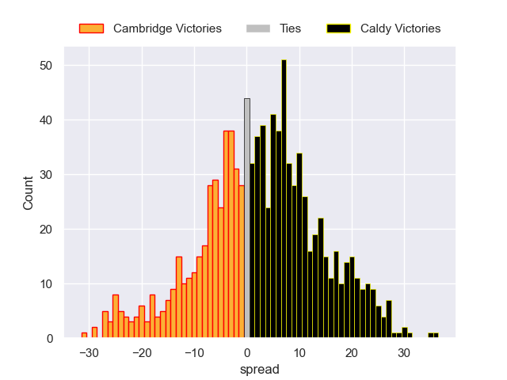

### Richmond V Nottingham on 2026/02/07

Average Margin: Nottingham by 1.8

### Ealing Trailfinders V Coventry on 2026/02/07

Average Margin: Ealing Trailfinders by 10.0

### Chinnor V Hartpury College on 2026/02/07

Average Margin: Chinnor by 4.9

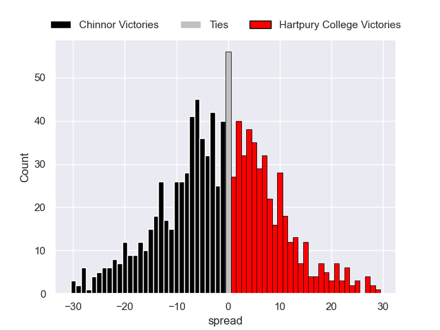

### Worcester Warriors V Doncaster on 2026/02/07

Average Margin: Worcester Warriors by 5.1

## Week 17

### Hartpury College V Ealing Trailfinders on 2026/02/14

Average Margin: Ealing Trailfinders by 5.1

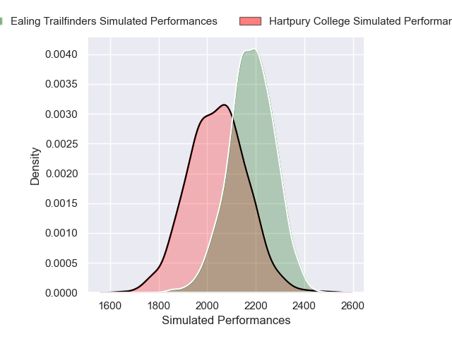
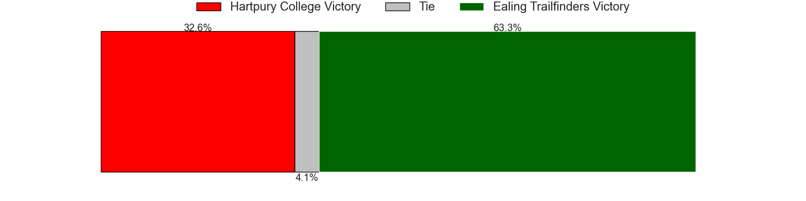

### Ampthill V Chinnor on 2026/02/14

Average Margin: Chinnor by 3.4

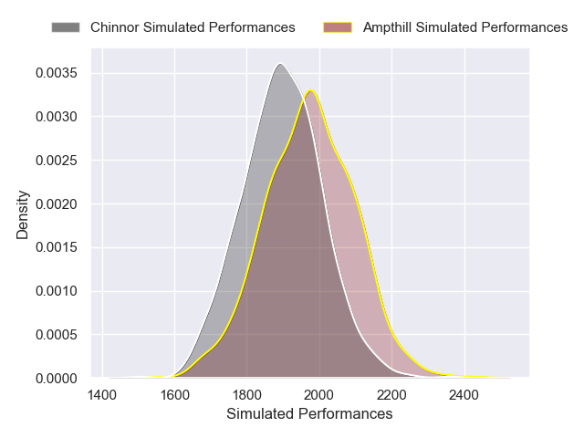

### Coventry V Richmond on 2026/02/14

Average Margin: Coventry by 8.9

### Nottingham V Cambridge on 2026/02/14

Average Margin: Nottingham by 11.1

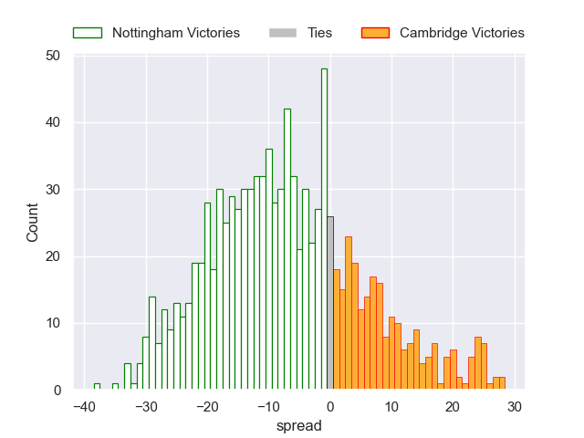

### Doncaster V Bedford on 2026/02/14

Average Margin: Bedford by 0.7

### London Scottish V Worcester Warriors on 2026/02/14

Average Margin: Worcester Warriors by 4.5

### Caldy V Cornish Pirates on 2026/02/14

Average Margin: Cornish Pirates by 0.5

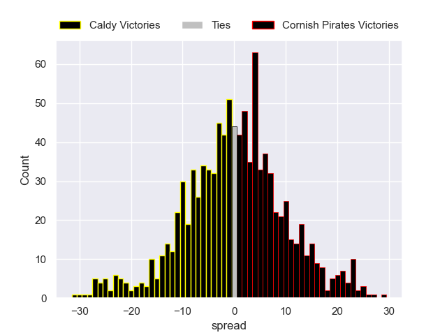

## Week 18

### Coventry V Hartpury College on 2026/02/21

Average Margin: Coventry by 3.1

### Worcester Warriors V Caldy on 2026/02/21

Average Margin: Worcester Warriors by 7.3

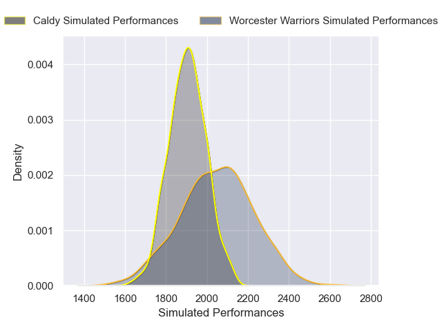

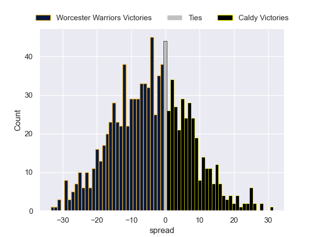

### Bedford V London Scottish on 2026/02/21

Average Margin: Bedford by 7.9

### Cornish Pirates V Nottingham on 2026/02/21

Average Margin: Cornish Pirates by 2.0

### Chinnor V Doncaster on 2026/02/21

Average Margin: Chinnor by 5.7

### Richmond V Cambridge on 2026/02/21

Average Margin: Richmond by 6.6

### Ealing Trailfinders V Ampthill on 2026/02/21

Average Margin: Ealing Trailfinders by 14.5

## Week 19

### Hartpury College V Richmond on 2026/02/28

Average Margin: Hartpury College by 7.7

### London Scottish V Chinnor on 2026/02/28

Average Margin: Chinnor by 5.6

### Cambridge V Cornish Pirates on 2026/02/28

Average Margin: Cornish Pirates by 7.3

### Nottingham V Worcester Warriors on 2026/02/28

Average Margin: Nottingham by 0.5

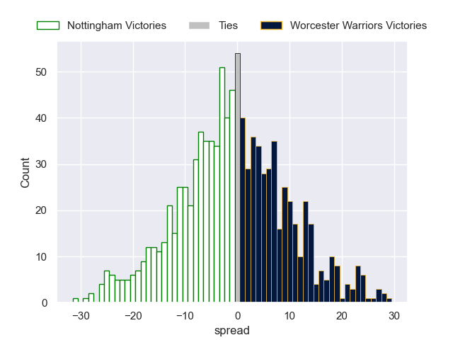

### Doncaster V Ealing Trailfinders on 2026/02/28

Average Margin: Ealing Trailfinders by 6.8

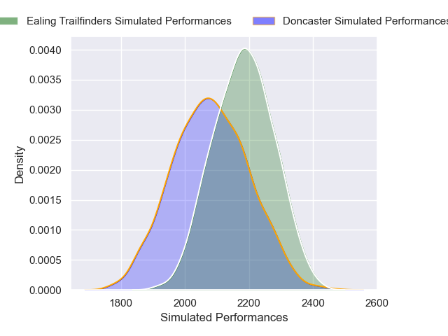

### Ampthill V Coventry on 2026/02/28

Average Margin: Coventry by 1.8

### Caldy V Bedford on 2026/02/28

Average Margin: Bedford by 4.4

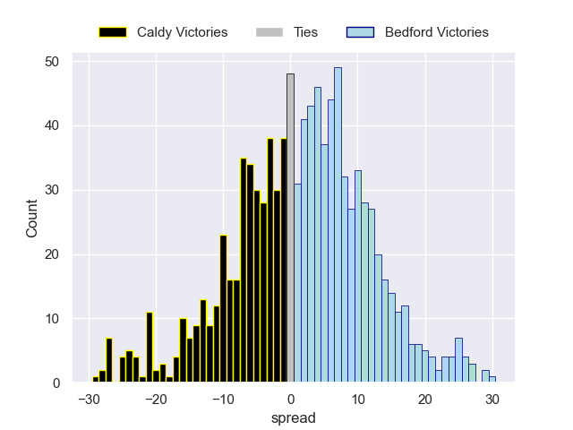

## Week 20

### Ealing Trailfinders V London Scottish on 2026/03/21

Average Margin: Ealing Trailfinders by 11.6

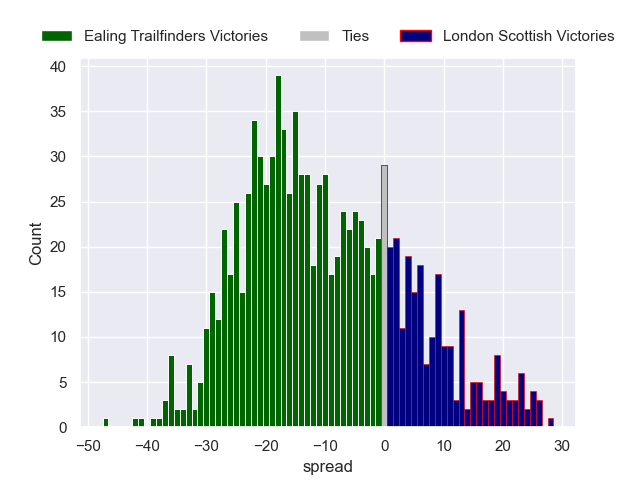

### Coventry V Doncaster on 2026/03/21

Average Margin: Coventry by 3.8

### Richmond V Cornish Pirates on 2026/03/21

Average Margin: Cornish Pirates by 0.2

### Chinnor V Caldy on 2026/03/21

Average Margin: Chinnor by 6.5

### Bedford V Nottingham on 2026/03/21

Average Margin: Bedford by 3.7

### Hartpury College V Ampthill on 2026/03/21

Average Margin: Hartpury College by 5.9

### Worcester Warriors V Cambridge on 2026/03/21

Average Margin: Worcester Warriors by 11.0

## Week 21

### Cornish Pirates V Worcester Warriors on 2026/03/28

Average Margin: Cornish Pirates by 0.5

### Nottingham V Chinnor on 2026/03/28

Average Margin: Nottingham by 0.7

### Caldy V Ealing Trailfinders on 2026/03/28

Average Margin: Ealing Trailfinders by 8.1

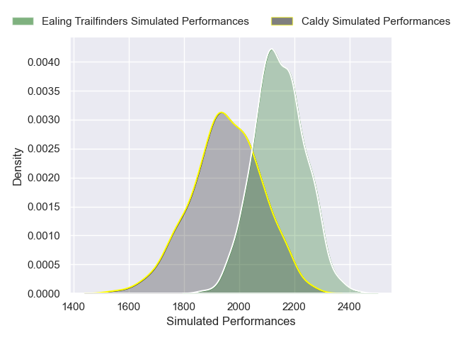

### Ampthill V Richmond on 2026/03/28

Average Margin: Ampthill by 3.8

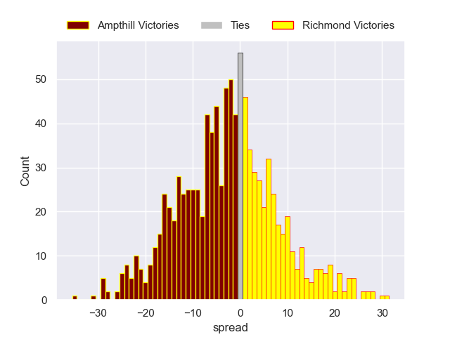

### London Scottish V Coventry on 2026/03/28

Average Margin: Coventry by 2.2

### Cambridge V Bedford on 2026/03/28

Average Margin: Bedford by 7.3

### Doncaster V Hartpury College on 2026/03/28

Average Margin: Doncaster by 1.0

## Week 22

### Hartpury College V London Scottish on 2026/04/04

Average Margin: Hartpury College by 6.2

### Bedford V Cornish Pirates on 2026/04/04

Average Margin: Bedford by 4.3

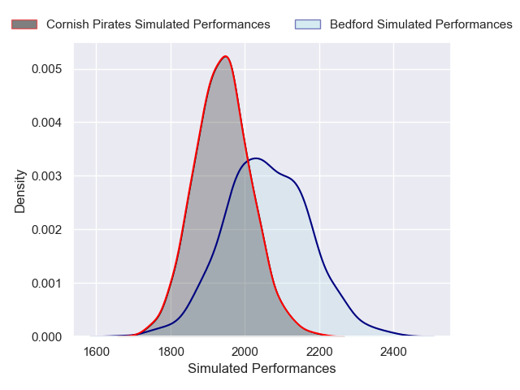

### Ealing Trailfinders V Nottingham on 2026/04/04

Average Margin: Ealing Trailfinders by 8.8

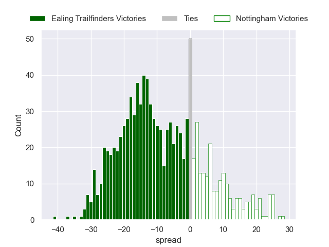

### Ampthill V Doncaster on 2026/04/04

Average Margin: Ampthill by 0.4

### Richmond V Worcester Warriors on 2026/04/04

Average Margin: Worcester Warriors by 1.4

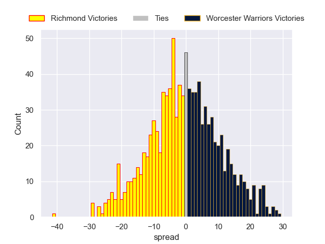

### Coventry V Caldy on 2026/04/04

Average Margin: Coventry by 5.3

### Chinnor V Cambridge on 2026/04/04

Average Margin: Chinnor by 10.3

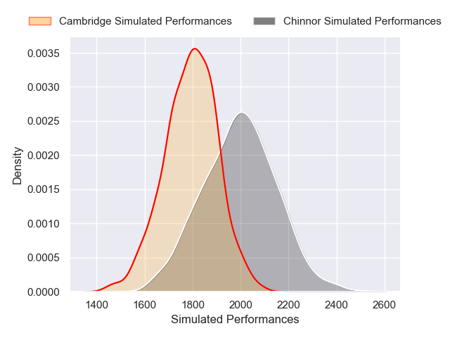

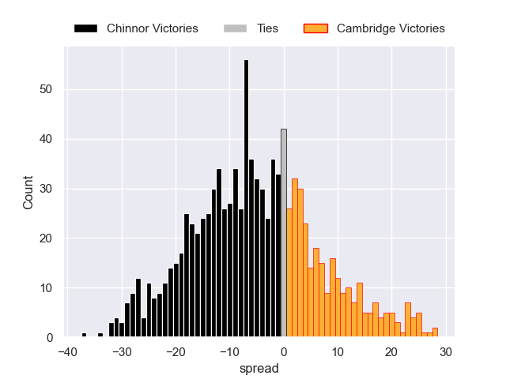

## Week 23

### Cornish Pirates V Chinnor on 2026/04/11

Average Margin: Cornish Pirates by 0.1

### Worcester Warriors V Bedford on 2026/04/11

Average Margin: Worcester Warriors by 1.8

### Doncaster V Richmond on 2026/04/11

Average Margin: Doncaster by 6.3

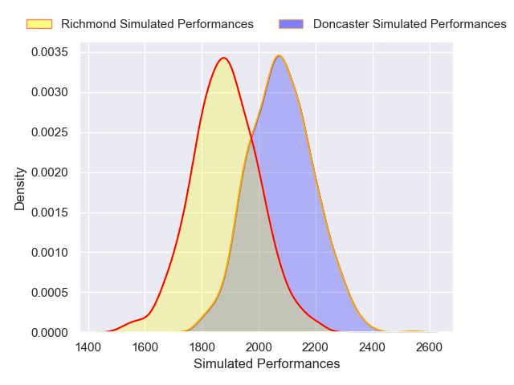

### London Scottish V Ampthill on 2026/04/11

Average Margin: London Scottish by 0.7

### Caldy V Hartpury College on 2026/04/11

Average Margin: Hartpury College by 1.4

### Nottingham V Coventry on 2026/04/11

Average Margin: Nottingham by 1.5

### Cambridge V Ealing Trailfinders on 2026/04/11

Average Margin: Ealing Trailfinders by 10.4

## Week 24

### Hartpury College V Nottingham on 2026/04/18

Average Margin: Hartpury College by 4.8

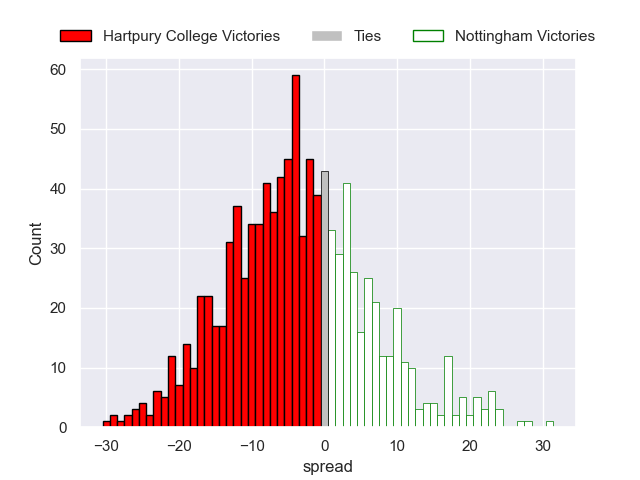

### Chinnor V Worcester Warriors on 2026/04/18

Average Margin: Chinnor by 3.3

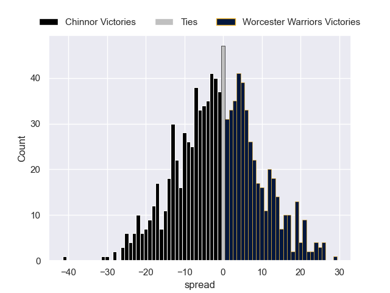

### Richmond V Bedford on 2026/04/18

Average Margin: Bedford by 2.1

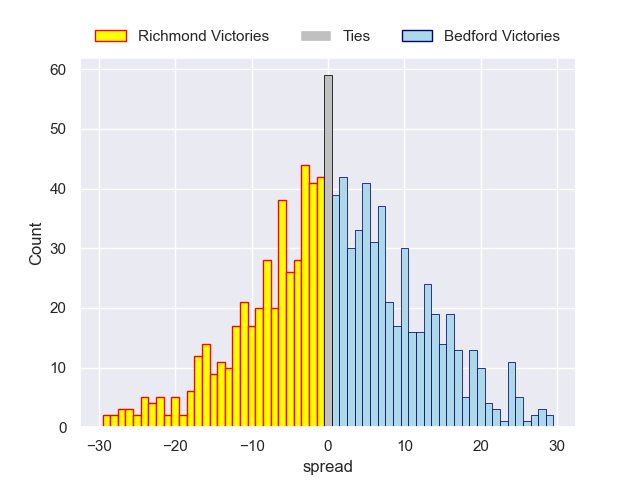

### Doncaster V London Scottish on 2026/04/18

Average Margin: Doncaster by 4.6

### Coventry V Cambridge on 2026/04/18

Average Margin: Coventry by 10.0

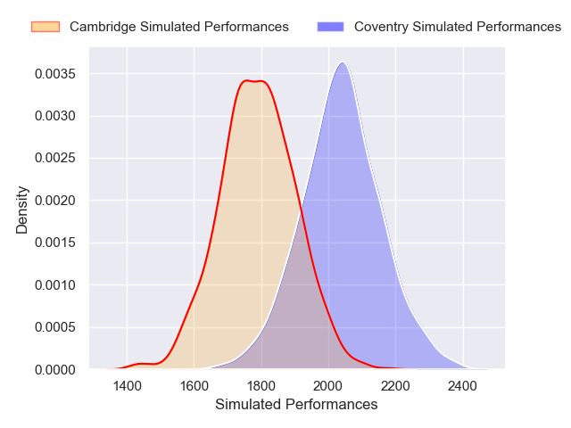

### Ampthill V Caldy on 2026/04/18

Average Margin: Ampthill by 2.1

### Ealing Trailfinders V Cornish Pirates on 2026/04/18

Average Margin: Ealing Trailfinders by 10.7

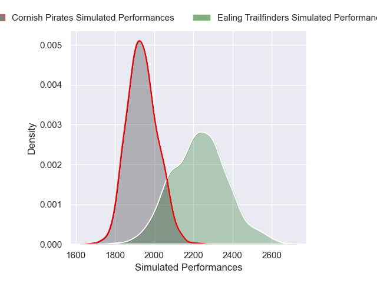

## Week 25

### Cornish Pirates V Coventry on 2026/05/02

Average Margin: Cornish Pirates by 1.4

### Cambridge V Hartpury College on 2026/05/02

Average Margin: Hartpury College by 3.0

### Worcester Warriors V Ealing Trailfinders on 2026/05/02

Average Margin: Ealing Trailfinders by 1.9

### Nottingham V Ampthill on 2026/05/02

Average Margin: Nottingham by 4.3

### Bedford V Chinnor on 2026/05/02

Average Margin: Bedford by 2.2

### Caldy V Doncaster on 2026/05/02

Average Margin: Caldy by 0.4

### London Scottish V Richmond on 2026/05/02

Average Margin: London Scottish by 2.6

## Week 26

### London Scottish V Caldy on 2026/05/09

Average Margin: London Scottish by 0.8

### Hartpury College V Cornish Pirates on 2026/05/09

Average Margin: Hartpury College by 4.1

### Coventry V Worcester Warriors on 2026/05/09

Average Margin: Coventry by 2.5

### Ealing Trailfinders V Bedford on 2026/05/09

Average Margin: Ealing Trailfinders by 6.7

### Doncaster V Nottingham on 2026/05/09

Average Margin: Doncaster by 2.1

### Chinnor V Richmond on 2026/05/09

Average Margin: Chinnor by 5.5

### Ampthill V Cambridge on 2026/05/09

Average Margin: Ampthill by 4.9

