# Team Rankings

# Standings

## Current Standings

| Club                |   Played |   Wins |   Point Differential |   Losing Bonus Points |   Try Bonus Points |   Competition Points |
|:--------------------|---------:|-------:|---------------------:|----------------------:|-------------------:|---------------------:|
| Ealing Trailfinders |       14 |     14 |                  377 |                     0 |                  8 |                   64 |
| Bedford             |       14 |     10 |                  102 |                     1 |                 10 |                   53 |
| Worcester Warriors  |       14 |      8 |                  120 |                     5 |                  7 |                   44 |
| Coventry            |       14 |      8 |                  105 |                     3 |                  8 |                   43 |
| Hartpury College    |       14 |      9 |                   41 |                     1 |                  4 |                   43 |
| Chinnor             |       14 |      9 |                   58 |                     4 |                  2 |                   42 |
| Nottingham          |       14 |      7 |                   43 |                     4 |                  8 |                   42 |
| Cornish Pirates     |       14 |      6 |                   23 |                     3 |                  6 |                   35 |
| Caldy               |       14 |      6 |                  -61 |                     2 |                  6 |                   32 |
| Ampthill            |       14 |      6 |                 -184 |                     2 |                  4 |                   30 |
| Doncaster           |       14 |      4 |                  -14 |                     3 |                  4 |                   29 |
| Richmond            |       14 |      4 |                  -70 |                     4 |                  1 |                   21 |
| London Scottish     |       14 |      3 |                 -174 |                     2 |                  2 |                   16 |
| Cambridge           |       14 |      0 |                 -366 |                     2 |                  4 |                    8 |

## Projected Remaining Table

| Club                |   To Play |   Projected Wins |   Projected Differential |   Projected Losing Bonus Points | Projected Try Bonus Points   |   Projected Competition Points |
|:--------------------|----------:|-----------------:|-------------------------:|--------------------------------:|:-----------------------------|-------------------------------:|
| Ealing Trailfinders |        12 |            8.854 |                  116.097 |                           1.42  |                              |                         37.586 |
| Bedford             |        12 |            7.22  |                   38.022 |                           2.166 |                              |                         32.074 |
| Coventry            |        12 |            7.052 |                   31.384 |                           2.259 |                              |                         31.515 |
| Chinnor             |        12 |            6.695 |                   28.999 |                           2.564 |                              |                         30.43  |
| Hartpury College    |        12 |            6.369 |                   16.024 |                           2.641 |                              |                         29.215 |
| Worcester Warriors  |        12 |            6.023 |                   11.393 |                           2.75  |                              |                         27.916 |
| Cornish Pirates     |        12 |            5.933 |                    1.689 |                           2.747 |                              |                         27.653 |
| Doncaster           |        12 |            5.602 |                   -3.468 |                           2.913 |                              |                         26.491 |
| Nottingham          |        12 |            5.396 |                   -7.855 |                           2.88  |                              |                         25.596 |
| Ampthill            |        12 |            5.126 |                  -21.308 |                           2.863 |                              |                         24.509 |
| London Scottish     |        12 |            4.484 |                  -36.149 |                           2.829 |                              |                         21.785 |
| Richmond            |        12 |            4.379 |                  -41.646 |                           2.858 |                              |                         21.38  |
| Caldy               |        12 |            4.262 |                  -37.496 |                           3.106 |                              |                         21.218 |
| Cambridge           |        12 |            2.965 |                  -95.686 |                           2.418 |                              |                         15.046 |

## Projected Total Table

| Club                |   Played |   Wins |   Point Differential |   Losing Bonus Points |   Try Bonus Points |   Competition Points |
|:--------------------|---------:|-------:|---------------------:|----------------------:|-------------------:|---------------------:|
| Ealing Trailfinders |       26 | 22.854 |              493.097 |                 1.42  |                  8 |              101.586 |
| Bedford             |       26 | 17.22  |              140.022 |                 3.166 |                 10 |               85.074 |
| Coventry            |       26 | 15.052 |              136.384 |                 5.259 |                  8 |               74.515 |
| Chinnor             |       26 | 15.695 |               86.999 |                 6.564 |                  2 |               72.43  |
| Hartpury College    |       26 | 15.369 |               57.024 |                 3.641 |                  4 |               72.215 |
| Worcester Warriors  |       26 | 14.023 |              131.393 |                 7.75  |                  7 |               71.916 |
| Nottingham          |       26 | 12.396 |               35.145 |                 6.88  |                  8 |               67.596 |
| Cornish Pirates     |       26 | 11.933 |               24.689 |                 5.747 |                  6 |               62.653 |
| Doncaster           |       26 |  9.602 |              -17.468 |                 5.913 |                  4 |               55.491 |
| Ampthill            |       26 | 11.126 |             -205.308 |                 4.863 |                  4 |               54.509 |
| Caldy               |       26 | 10.262 |              -98.496 |                 5.106 |                  6 |               53.218 |
| Richmond            |       26 |  8.379 |             -111.646 |                 6.858 |                  1 |               42.38  |
| London Scottish     |       26 |  7.484 |             -210.149 |                 4.829 |                  2 |               37.785 |
| Cambridge           |       26 |  2.965 |             -461.686 |                 4.418 |                  4 |               23.046 |

# Completed Match Review

| Model | Percent Correct Predictions | Spread Error |
| ------ | ------ | ------ |
| Club Level | 70.3% | 10.4 |
| Player Level: Lineup | nan% | nan |
| Player Level: Minutes | nan% | nan |

# Future Predictions

## Week 15

### Hartpury College RFC V Bedford on 2026/01/31

Average Margin: Hartpury College by 0.4

### Caldy V Nottingham on 2026/01/31

Average Margin: Nottingham by 1.3

### London Scottish V Cambridge on 2026/01/31

Average Margin: London Scottish by 7.1

### Doncaster V Cornish Pirates on 2026/01/31

Average Margin: Doncaster by 2.4

### Ealing Trailfinders V Richmond on 2026/01/31

Average Margin: Ealing Trailfinders by 15.4

### Coventry V Chinnor on 2026/01/31

Average Margin: Coventry by 3.2

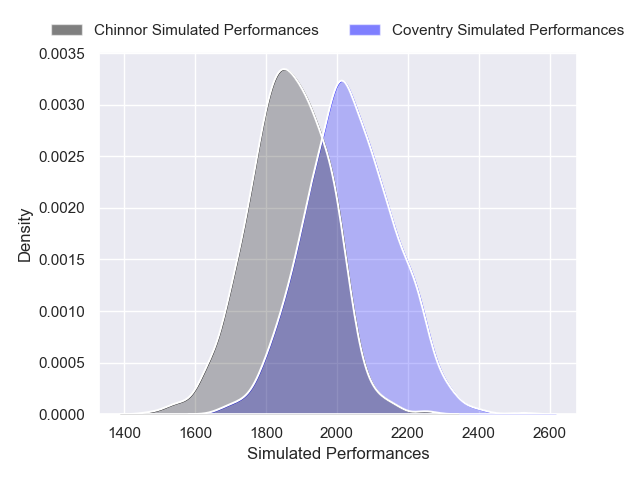

### Ampthill V Worcester Warriors on 2026/01/31

Average Margin: Worcester Warriors by 0.7

## Week 16

### Richmond V Nottingham on 2026/02/07

Average Margin: Nottingham by 0.6

### Ealing Trailfinders V Coventry on 2026/02/07

Average Margin: Ealing Trailfinders by 10.1

### Bedford V Ampthill on 2026/02/07

Average Margin: Bedford by 7.2

### Chinnor V Hartpury College on 2026/02/07

Average Margin: Chinnor by 3.7

### Cambridge V Caldy on 2026/02/07

Average Margin: Caldy by 4.6

### Worcester Warriors V Doncaster on 2026/02/07

Average Margin: Worcester Warriors by 3.8

### Cornish Pirates V London Scottish on 2026/02/07

Average Margin: Cornish Pirates by 5.3

## Week 17

### London Scottish V Worcester Warriors on 2026/02/14

Average Margin: Worcester Warriors by 3.1

### Ampthill V Chinnor on 2026/02/14

Average Margin: Chinnor by 1.6

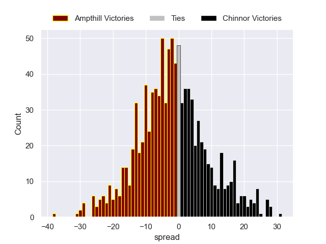

### Nottingham V Cambridge on 2026/02/14

Average Margin: Nottingham by 10.1

### Caldy V Cornish Pirates on 2026/02/14

Average Margin: Cornish Pirates by 1.3

### Coventry V Richmond on 2026/02/14

Average Margin: Coventry by 8.0

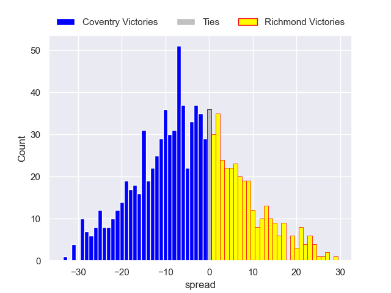

### Doncaster V Bedford on 2026/02/14

Average Margin: Bedford by 1.0

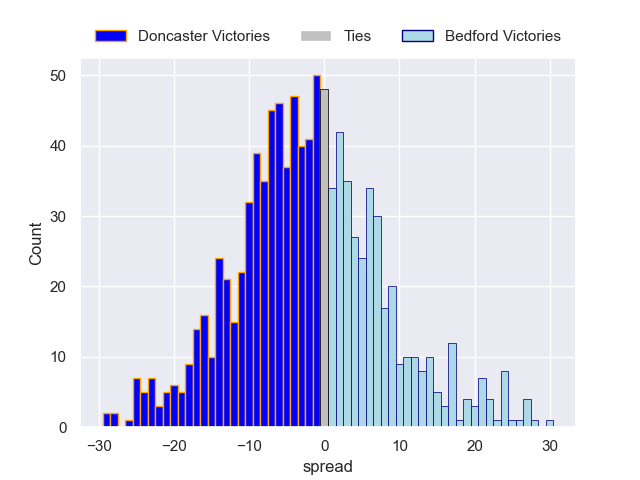

### Hartpury College V Ealing Trailfinders on 2026/02/14

Average Margin: Ealing Trailfinders by 6.1

## Week 18

### Cornish Pirates V Nottingham on 2026/02/21

Average Margin: Cornish Pirates by 3.1

### Coventry V Hartpury College on 2026/02/21

Average Margin: Coventry by 3.6

### Chinnor V Doncaster on 2026/02/21

Average Margin: Chinnor by 4.6

### Worcester Warriors V Caldy on 2026/02/21

Average Margin: Worcester Warriors by 6.5

### Bedford V London Scottish on 2026/02/21

Average Margin: Bedford by 8.5

### Ealing Trailfinders V Ampthill on 2026/02/21

Average Margin: Ealing Trailfinders by 14.1

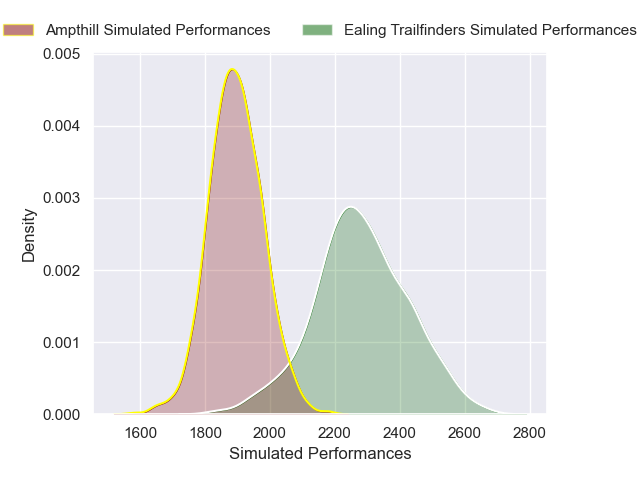

### Richmond V Cambridge on 2026/02/21

Average Margin: Richmond by 7.3

## Week 19

### Doncaster V Ealing Trailfinders on 2026/02/28

Average Margin: Ealing Trailfinders by 6.5

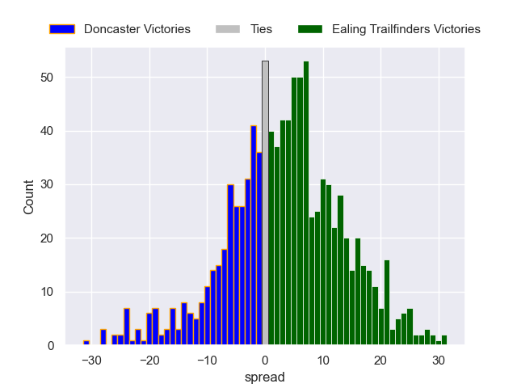

### London Scottish V Chinnor on 2026/02/28

Average Margin: Chinnor by 3.6

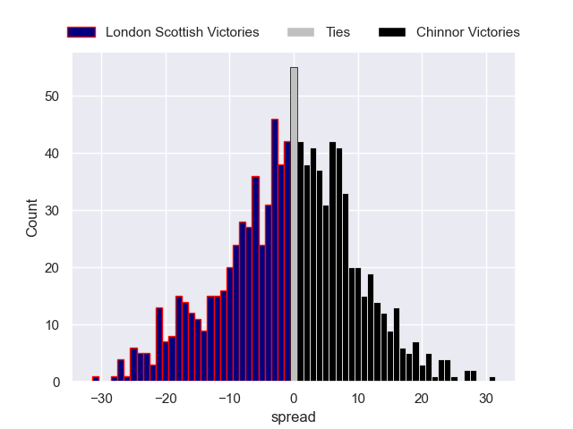

### Ampthill V Coventry on 2026/02/28

Average Margin: Coventry by 1.6

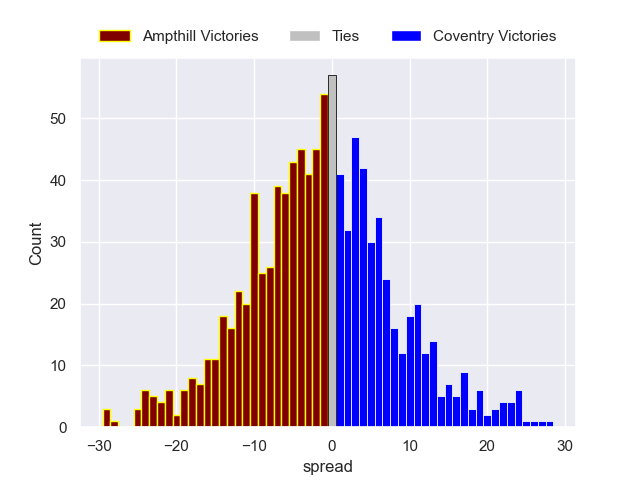

### Cambridge V Cornish Pirates on 2026/02/28

Average Margin: Cornish Pirates by 7.0

### Caldy V Bedford on 2026/02/28

Average Margin: Bedford by 5.1

### Nottingham V Worcester Warriors on 2026/02/28

Average Margin: Nottingham by 0.8

### Hartpury College V Richmond on 2026/02/28

Average Margin: Hartpury College by 6.3

## Week 20

### Richmond V Cornish Pirates on 2026/03/21

Average Margin: Cornish Pirates by 0.1

### Worcester Warriors V Cambridge on 2026/03/21

Average Margin: Worcester Warriors by 10.2

### Chinnor V Caldy on 2026/03/21

Average Margin: Chinnor by 6.4

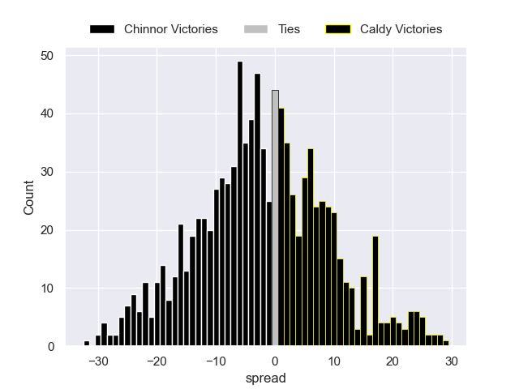

### Bedford V Nottingham on 2026/03/21

Average Margin: Bedford by 5.1

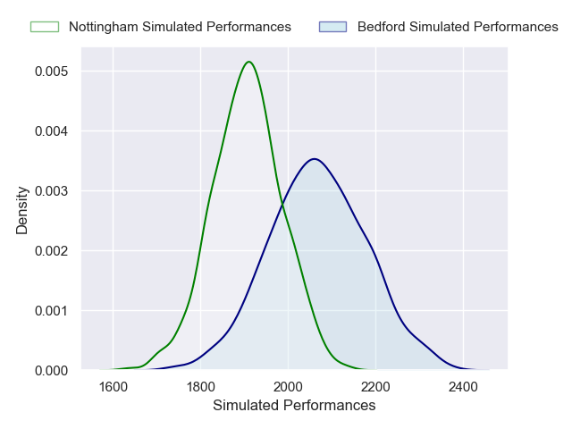

### Coventry V Doncaster on 2026/03/21

Average Margin: Coventry by 4.4

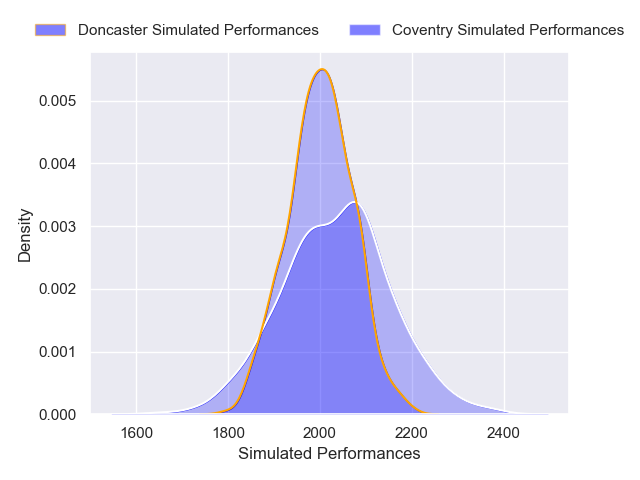

### Ealing Trailfinders V London Scottish on 2026/03/21

Average Margin: Ealing Trailfinders by 12.6

### Hartpury College V Ampthill on 2026/03/21

Average Margin: Hartpury College by 5.5

## Week 21

### Cornish Pirates V Worcester Warriors on 2026/03/28

Average Margin: Cornish Pirates by 1.8

### London Scottish V Coventry on 2026/03/28

Average Margin: Coventry by 2.9

### Nottingham V Chinnor on 2026/03/28

Average Margin: Nottingham by 1.0

### Cambridge V Bedford on 2026/03/28

Average Margin: Bedford by 7.9

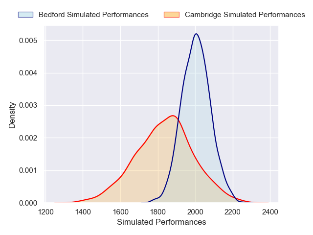

### Doncaster V Hartpury College on 2026/03/28

Average Margin: Doncaster by 1.7

### Ampthill V Richmond on 2026/03/28

Average Margin: Ampthill by 3.5

### Caldy V Ealing Trailfinders on 2026/03/28

Average Margin: Ealing Trailfinders by 9.1

## Week 22

### Richmond V Worcester Warriors on 2026/04/04

Average Margin: Richmond by 0.1

### Bedford V Cornish Pirates on 2026/04/04

Average Margin: Bedford by 4.3

### Hartpury College V London Scottish on 2026/04/04

Average Margin: Hartpury College by 5.3

### Ampthill V Doncaster on 2026/04/04

Average Margin: Ampthill by 0.7

### Ealing Trailfinders V Nottingham on 2026/04/04

Average Margin: Ealing Trailfinders by 10.5

### Chinnor V Cambridge on 2026/04/04

Average Margin: Chinnor by 9.8

### Coventry V Caldy on 2026/04/04

Average Margin: Coventry by 6.0

## Week 23

### London Scottish V Ampthill on 2026/04/11

Average Margin: London Scottish by 0.2

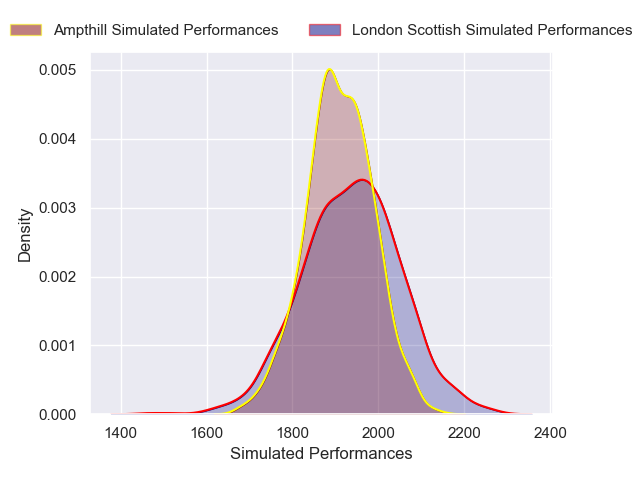

### Doncaster V Richmond on 2026/04/11

Average Margin: Doncaster by 5.6

### Nottingham V Coventry on 2026/04/11

Average Margin: Nottingham by 0.4

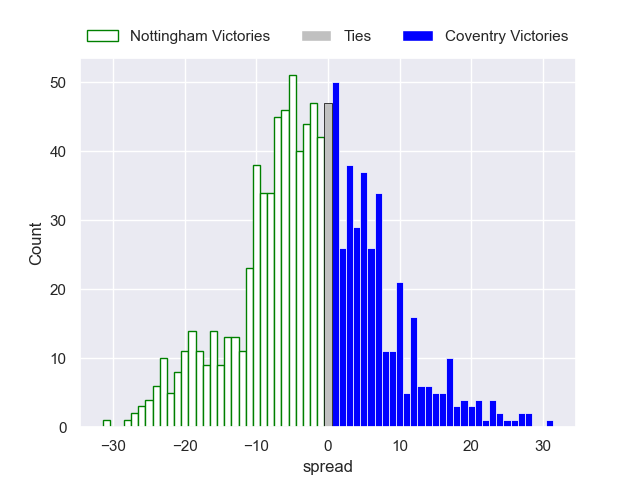

### Cambridge V Ealing Trailfinders on 2026/04/11

Average Margin: Ealing Trailfinders by 11.5

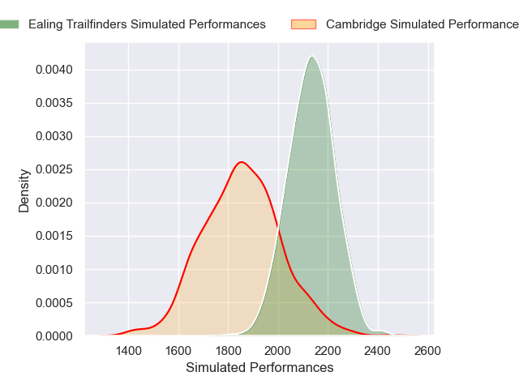

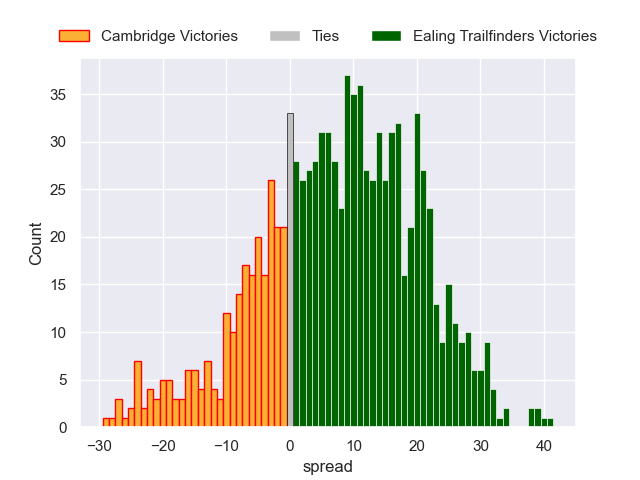

### Worcester Warriors V Bedford on 2026/04/11

Average Margin: Worcester Warriors by 0.6

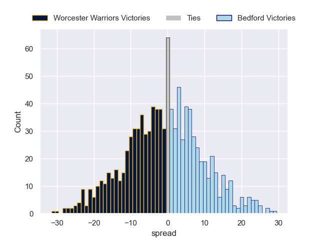

### Cornish Pirates V Chinnor on 2026/04/11

Average Margin: Cornish Pirates by 1.5

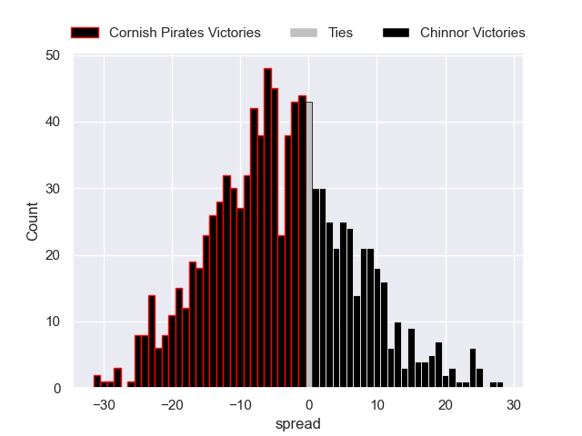

### Caldy V Hartpury College on 2026/04/11

Average Margin: Hartpury College by 1.7

## Week 24

### Coventry V Cambridge on 2026/04/18

Average Margin: Coventry by 10.2

### Chinnor V Worcester Warriors on 2026/04/18

Average Margin: Chinnor by 3.6

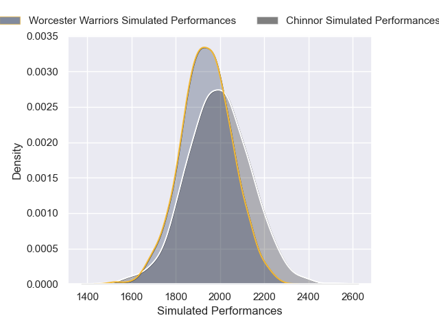

### Ampthill V Caldy on 2026/04/18

Average Margin: Ampthill by 3.1

### Richmond V Bedford on 2026/04/18

Average Margin: Bedford by 2.8

### Doncaster V London Scottish on 2026/04/18

Average Margin: Doncaster by 4.8

### Hartpury College V Nottingham on 2026/04/18

Average Margin: Hartpury College by 4.1

### Ealing Trailfinders V Cornish Pirates on 2026/04/18

Average Margin: Ealing Trailfinders by 9.8

## Week 25

### London Scottish V Richmond on 2026/05/02

Average Margin: London Scottish by 1.4

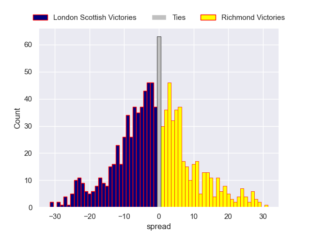

### Nottingham V Ampthill on 2026/05/02

Average Margin: Nottingham by 3.5

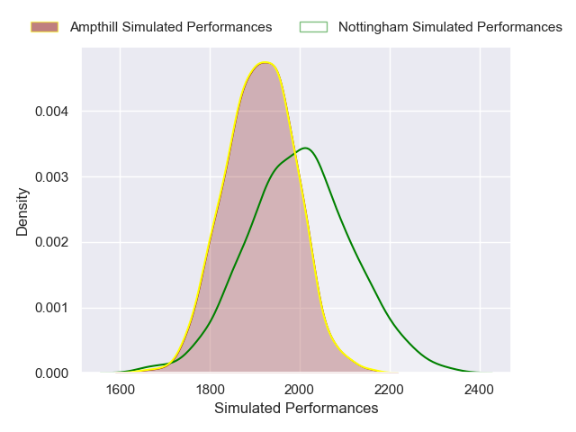

### Caldy V Doncaster on 2026/05/02

Average Margin: Doncaster by 0.3

### Cornish Pirates V Coventry on 2026/05/02

Average Margin: Cornish Pirates by 1.9

### Bedford V Chinnor on 2026/05/02

Average Margin: Bedford by 3.9

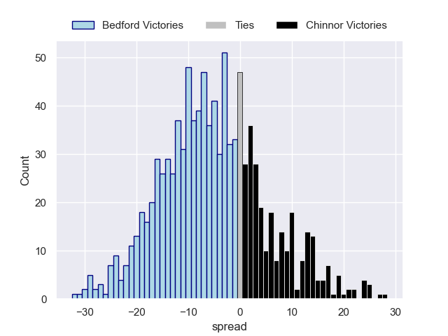

### Cambridge V Hartpury College on 2026/05/02

Average Margin: Hartpury College by 4.0

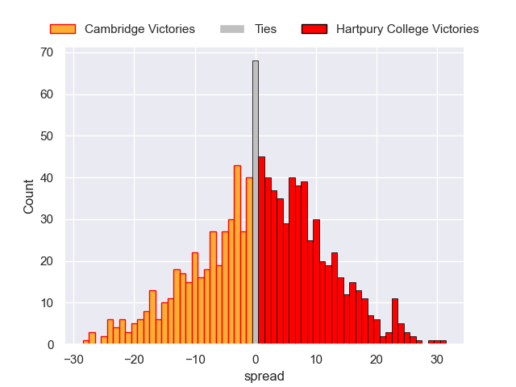

### Worcester Warriors V Ealing Trailfinders on 2026/05/02

Average Margin: Ealing Trailfinders by 3.5

## Week 26

### Hartpury College V Cornish Pirates on 2026/05/09

Average Margin: Hartpury College by 3.8

### Ampthill V Cambridge on 2026/05/09

Average Margin: Ampthill by 5.9

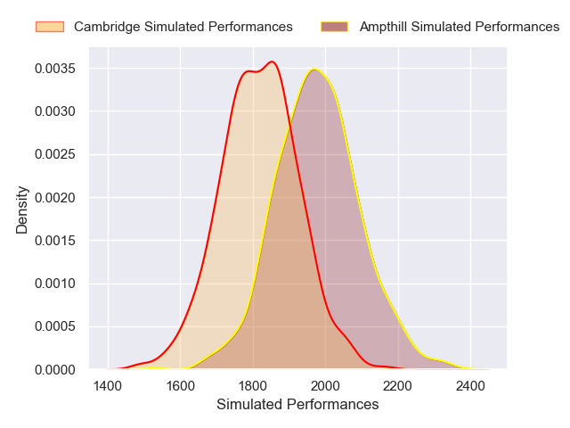

### London Scottish V Caldy on 2026/05/09

Average Margin: London Scottish by 1.3

### Chinnor V Richmond on 2026/05/09

Average Margin: Chinnor by 5.3

### Coventry V Worcester Warriors on 2026/05/09

Average Margin: Coventry by 3.8

### Doncaster V Nottingham on 2026/05/09

Average Margin: Doncaster by 2.7

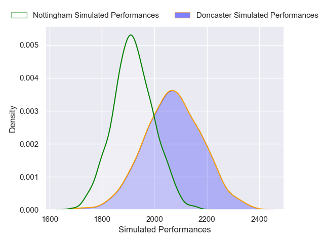

### Ealing Trailfinders V Bedford on 2026/05/09

Average Margin: Ealing Trailfinders by 6.8

