# Team Rankings

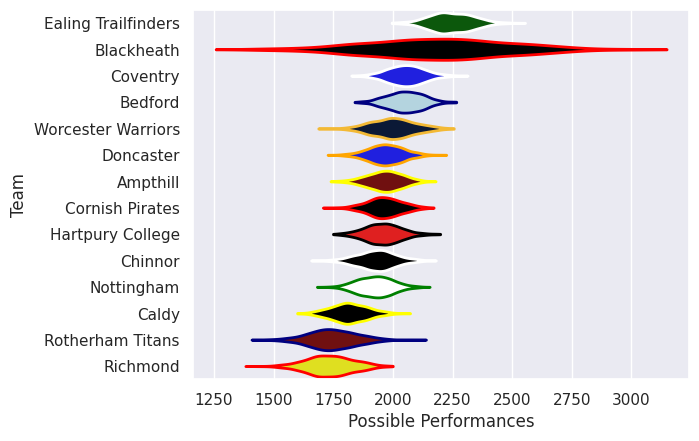
# Standings

## Projected Remaining Table

| Club                |   To Play |   Projected Wins |   Projected Differential |   Projected Losing Bonus Points | Projected Try Bonus Points   |   Projected Competition Points |
|:--------------------|----------:|-----------------:|-------------------------:|--------------------------------:|:-----------------------------|-------------------------------:|
| Hartpury College    |         1 |            0.813 |                    7.38  |                           0.118 |                              |                          3.432 |
| Ealing Trailfinders |         1 |            0.794 |                    7.965 |                           0.136 |                              |                          3.392 |
| Ampthill            |         1 |            0.725 |                    6.007 |                           0.169 |                              |                          3.151 |
| Blackheath          |         1 |            0.718 |                    9.714 |                           0.109 |                              |                          3.025 |
| Coventry            |         1 |            0.72  |                   11.53  |                           0.09  |                              |                          3.006 |
| Worcester Warriors  |         1 |            0.665 |                    4.666 |                           0.199 |                              |                          2.931 |
| Cornish Pirates     |         1 |            0.619 |                    3.096 |                           0.236 |                              |                          2.822 |
| Doncaster           |         1 |            0.326 |                   -3.096 |                           0.349 |                              |                          1.763 |
| Bedford             |         1 |            0.299 |                   -4.666 |                           0.278 |                              |                          1.546 |
| Richmond            |         1 |            0.234 |                   -6.007 |                           0.3   |                              |                          1.318 |
| Nottingham          |         1 |            0.26  |                   -9.714 |                           0.168 |                              |                          1.252 |
| Rotherham Titans    |         1 |            0.262 |                  -11.53  |                           0.148 |                              |                          1.232 |
| Chinnor             |         1 |            0.166 |                   -7.965 |                           0.283 |                              |                          1.027 |
| Caldy               |         1 |            0.156 |                   -7.38  |                           0.319 |                              |                          1.005 |

## Projected Total Table

| Club                |   Played |   Wins |   Point Differential |   Losing Bonus Points | Try Bonus Points   |   Competition Points |
|:--------------------|---------:|-------:|---------------------:|----------------------:|:-------------------|---------------------:|
| Hartpury College    |        1 |  0.813 |                7.38  |                 0.118 |                    |                3.432 |
| Ealing Trailfinders |        1 |  0.794 |                7.965 |                 0.136 |                    |                3.392 |
| Ampthill            |        1 |  0.725 |                6.007 |                 0.169 |                    |                3.151 |
| Blackheath          |        1 |  0.718 |                9.714 |                 0.109 |                    |                3.025 |
| Coventry            |        1 |  0.72  |               11.53  |                 0.09  |                    |                3.006 |
| Worcester Warriors  |        1 |  0.665 |                4.666 |                 0.199 |                    |                2.931 |
| Cornish Pirates     |        1 |  0.619 |                3.096 |                 0.236 |                    |                2.822 |
| Doncaster           |        1 |  0.326 |               -3.096 |                 0.349 |                    |                1.763 |
| Bedford             |        1 |  0.299 |               -4.666 |                 0.278 |                    |                1.546 |
| Richmond            |        1 |  0.234 |               -6.007 |                 0.3   |                    |                1.318 |
| Nottingham          |        1 |  0.26  |               -9.714 |                 0.168 |                    |                1.252 |
| Rotherham Titans    |        1 |  0.262 |              -11.53  |                 0.148 |                    |                1.232 |
| Chinnor             |        1 |  0.166 |               -7.965 |                 0.283 |                    |                1.027 |
| Caldy               |        1 |  0.156 |               -7.38  |                 0.319 |                    |                1.005 |

# Future Predictions

## Week 1

### Nottingham V Blackheath on 2026/09/18

Average Margin: Blackheath by 9.7

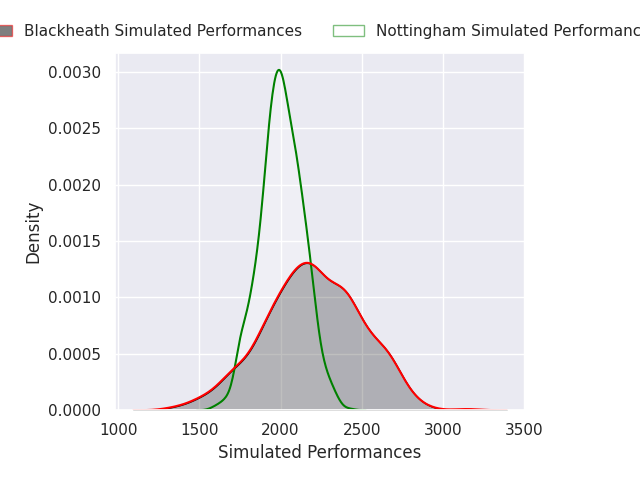

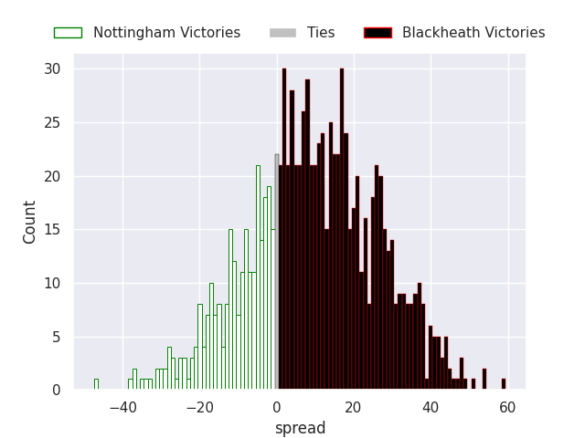

### Rotherham Titans V Coventry on 2026/09/19

Average Margin: Coventry by 11.5

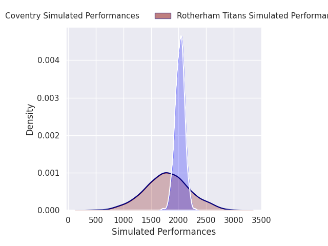
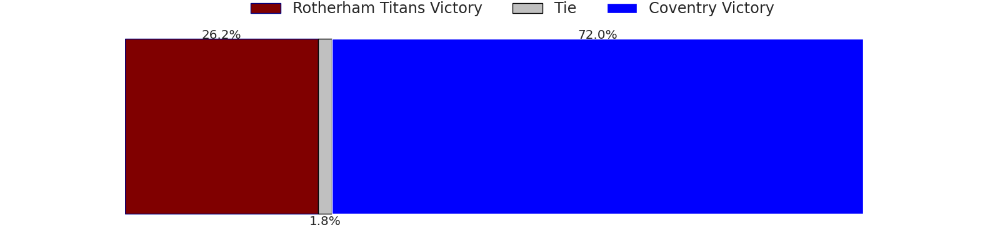
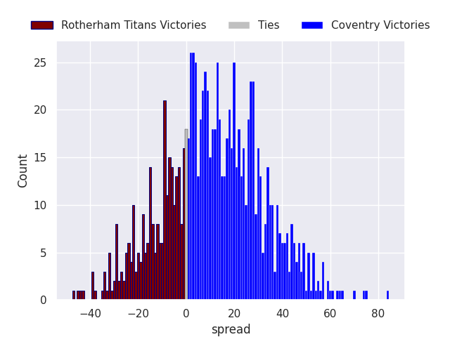

### Richmond V Ampthill on 2026/09/19

Average Margin: Ampthill by 6.0

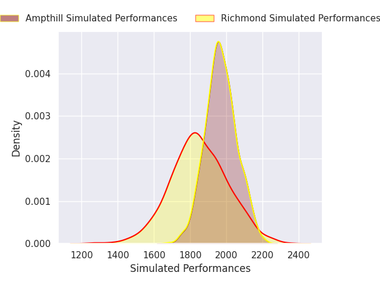

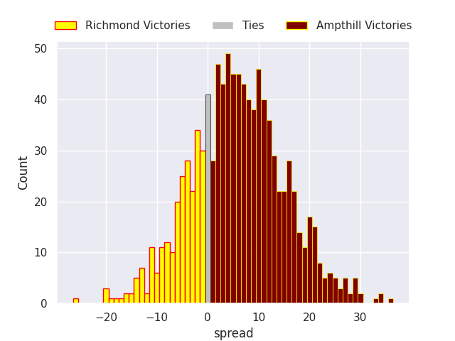

### Chinnor V Ealing Trailfinders on 2026/09/19

Average Margin: Ealing Trailfinders by 8.0

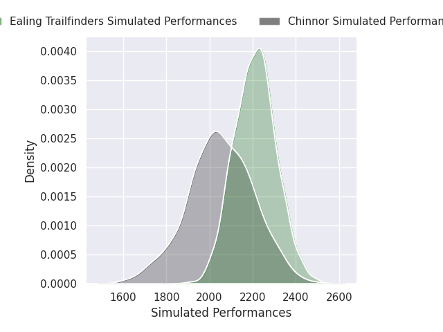
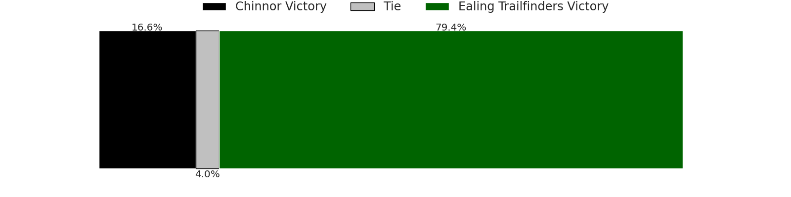
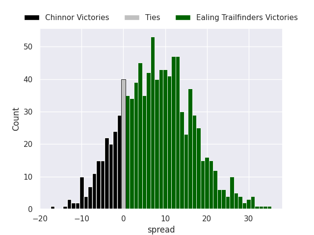

### Worcester Warriors V Bedford on 2026/09/19

Average Margin: Worcester Warriors by 4.7

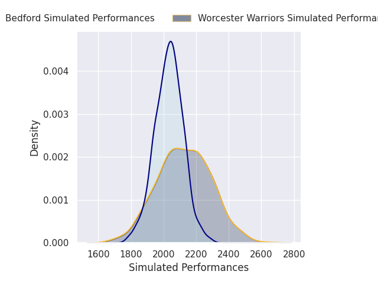

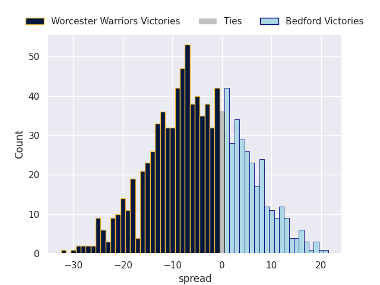

### Caldy V Hartpury College RFC on 2026/09/19

Average Margin: Hartpury College by 7.4

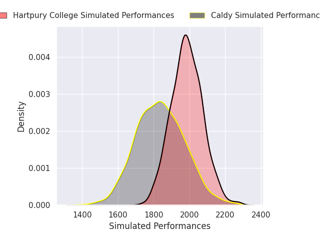
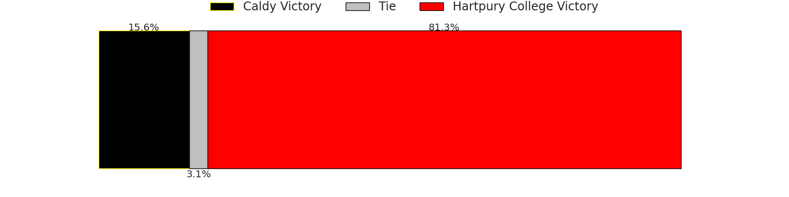
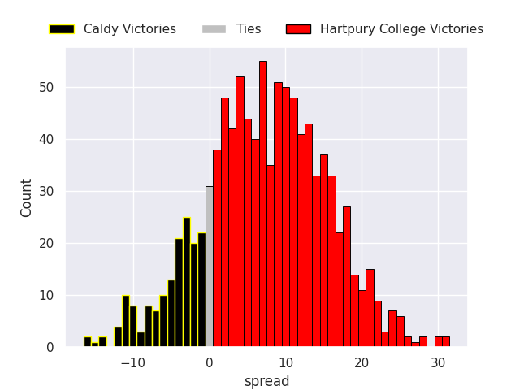

### Cornish Pirates V Doncaster on 2026/09/20

Average Margin: Cornish Pirates by 3.1

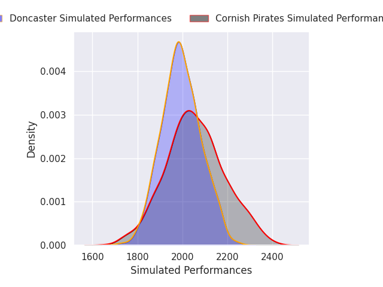

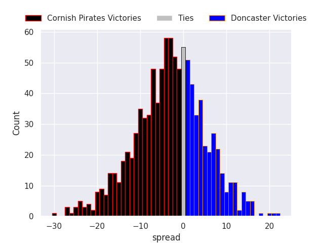

