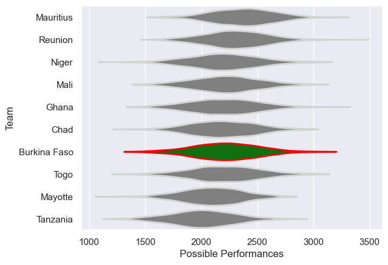

---  
title: "Rugby Africa Cup 2008"  
date: 2025-07-29 6:00:00 -0500  
categories: model review projection  
layout: article  
aside:  
    toc: true  
---
# Current Team Rankings

# Standings

## Current Standings

| Club         |   Played |   Wins |   Point Differential |   Losing Bonus Points | Try Bonus Points   |   Competition Points |
|:-------------|---------:|-------:|---------------------:|----------------------:|:-------------------|---------------------:|
| Reunion      |        3 |      3 |                  106 |                     0 |                    |                   12 |
| Niger        |        3 |      2 |                   29 |                     0 |                    |                   10 |
| Ghana        |        3 |      2 |                   29 |                     1 |                    |                    9 |
| Mauritius    |        3 |      2 |                   25 |                     1 |                    |                    9 |
| Burkina Faso |        3 |      2 |                   15 |                     0 |                    |                    8 |
| Tanzania     |        3 |      1 |                    4 |                     1 |                    |                    5 |
| Chad         |        3 |      1 |                  -26 |                     0 |                    |                    4 |
| Togo         |        3 |      1 |                  -34 |                     0 |                    |                    4 |
| Mali         |        3 |      0 |                  -13 |                     1 |                    |                    3 |
| Mayotte      |        3 |      0 |                 -135 |                     0 |                    |                    0 |

# Completed Match Review

| Model | Percent Correct Predictions | Spread Error |
| ------ | ------ | ------ |
| Club Level | 53.3% | 18.7 |
| Player Level: Lineup | nan% | nan |
| Player Level: Minutes | nan% | nan |

