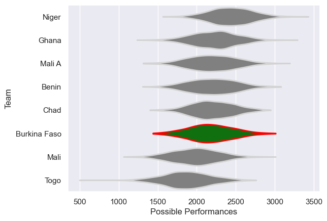

---  
title: "Rugby Africa Cup 2011"  
date: 2025-07-29 6:00:00 -0500  
categories: model review projection  
layout: article  
aside:  
    toc: true  
---
# Current Team Rankings

# Standings

## Current Standings

| Club         |   Played |   Wins |   Point Differential |   Losing Bonus Points | Try Bonus Points   |   Competition Points |
|:-------------|---------:|-------:|---------------------:|----------------------:|:-------------------|---------------------:|
| Mali         |        3 |      3 |                   64 |                     0 |                    |                   12 |
| Niger        |        3 |      2 |                   22 |                     0 |                    |                    8 |
| Mali A       |        3 |      2 |                  -19 |                     0 |                    |                    8 |
| Burkina Faso |        2 |      1 |                    5 |                     1 |                    |                    5 |
| Benin        |        3 |      1 |                   -4 |                     1 |                    |                    5 |
| Chad         |        3 |      1 |                  -24 |                     0 |                    |                    4 |
| Ghana        |        3 |      1 |                  -28 |                     0 |                    |                    4 |
| Togo         |        2 |      0 |                  -16 |                     1 |                    |                    1 |

# Completed Match Review

| Model | Percent Correct Predictions | Spread Error |
| ------ | ------ | ------ |
| Club Level | 54.5% | 16.3 |
| Player Level: Lineup | nan% | nan |
| Player Level: Minutes | nan% | nan |

