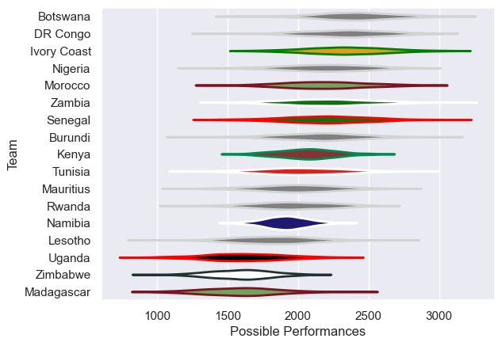

---  
title: "Rugby Africa Cup 2016"  
date: 2025-07-29 6:00:00 -0500  
categories: model review projection  
layout: article  
aside:  
    toc: true  
---
# Current Team Rankings

# Standings

## Current Standings

| Club        |   Played |   Wins |   Point Differential |   Losing Bonus Points | Try Bonus Points   |   Competition Points |
|:------------|---------:|-------:|---------------------:|----------------------:|:-------------------|---------------------:|
| Morocco     |        2 |      2 |                  108 |                     0 |                    |                    8 |
| Kenya       |        2 |      2 |                   67 |                     0 |                    |                    8 |
| Senegal     |        2 |      2 |                   57 |                     0 |                    |                    8 |
| Namibia     |        2 |      2 |                   47 |                     0 |                    |                    8 |
| Rwanda      |        2 |      1 |                    8 |                     1 |                    |                    5 |
| Madagascar  |        2 |      1 |                    3 |                     1 |                    |                    5 |
| Tunisia     |        1 |      1 |                   45 |                     0 |                    |                    4 |
| DR Congo    |        1 |      1 |                    3 |                     0 |                    |                    4 |
| Lesotho     |        1 |      1 |                    3 |                     0 |                    |                    4 |
| Uganda      |        3 |      1 |                  -23 |                     0 |                    |                    4 |
| Nigeria     |        2 |      1 |                  -33 |                     0 |                    |                    4 |
| Ivory Coast |        2 |      1 |                  -38 |                     0 |                    |                    4 |
| Botswana    |        1 |      0 |                   -7 |                     1 |                    |                    1 |
| Burundi     |        2 |      0 |                  -14 |                     1 |                    |                    1 |
| Zimbabwe    |        3 |      0 |                  -91 |                     1 |                    |                    1 |
| Zambia      |        2 |      0 |                  -60 |                     0 |                    |                    0 |
| Mauritius   |        2 |      0 |                  -75 |                     0 |                    |                    0 |

## Projected Remaining Table

| Club     |   To Play |   Projected Wins |   Projected Differential |   Projected Losing Bonus Points | Projected Try Bonus Points   |   Projected Competition Points |
|:---------|----------:|-----------------:|-------------------------:|--------------------------------:|:-----------------------------|-------------------------------:|
| DR Congo |         1 |            0.673 |                   11.842 |                           0.126 |                              |                          2.894 |
| Lesotho  |         1 |            0.289 |                  -11.842 |                           0.159 |                              |                          1.391 |

## Projected Total Table

| Club        |   Played |   Wins |   Point Differential |   Losing Bonus Points | Try Bonus Points   |   Competition Points |
|:------------|---------:|-------:|---------------------:|----------------------:|:-------------------|---------------------:|
| Morocco     |        2 |  2     |              108     |                 0     |                    |                8     |
| Kenya       |        2 |  2     |               67     |                 0     |                    |                8     |
| Senegal     |        2 |  2     |               57     |                 0     |                    |                8     |
| Namibia     |        2 |  2     |               47     |                 0     |                    |                8     |
| DR Congo    |        2 |  1.673 |               14.842 |                 0.126 |                    |                6.894 |
| Lesotho     |        2 |  1.289 |               -8.842 |                 0.159 |                    |                5.391 |
| Rwanda      |        2 |  1     |                8     |                 1     |                    |                5     |
| Madagascar  |        2 |  1     |                3     |                 1     |                    |                5     |
| Tunisia     |        1 |  1     |               45     |                 0     |                    |                4     |
| Uganda      |        3 |  1     |              -23     |                 0     |                    |                4     |
| Nigeria     |        2 |  1     |              -33     |                 0     |                    |                4     |
| Ivory Coast |        2 |  1     |              -38     |                 0     |                    |                4     |
| Botswana    |        1 |  0     |               -7     |                 1     |                    |                1     |
| Burundi     |        2 |  0     |              -14     |                 1     |                    |                1     |
| Zimbabwe    |        3 |  0     |              -91     |                 1     |                    |                1     |
| Zambia      |        2 |  0     |              -60     |                 0     |                    |                0     |
| Mauritius   |        2 |  0     |              -75     |                 0     |                    |                0     |

# Completed Match Review

| Model | Percent Correct Predictions | Spread Error |
| ------ | ------ | ------ |
| Club Level | 58.8% | 24.4 |
| Player Level: Lineup | nan% | nan |
| Player Level: Minutes | nan% | nan |

# Future Predictions

## Week 4

### Lesotho V DR Congo on 2016/05/17

Average Margin: DR Congo by 11.8

