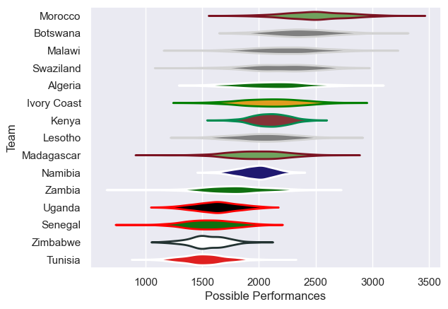

---  
title: "Rugby Africa Cup 2017"  
date: 2025-07-29 6:00:00 -0500  
categories: model review projection  
layout: article  
aside:  
    toc: true  
---
# Current Team Rankings

# Standings

## Current Standings

| Club        |   Played |   Wins |   Point Differential |   Losing Bonus Points | Try Bonus Points   |   Competition Points |
|:------------|---------:|-------:|---------------------:|----------------------:|:-------------------|---------------------:|
| Namibia     |        5 |      5 |                  208 |                     0 |                    |                   20 |
| Kenya       |        5 |      3 |                   91 |                     0 |                    |                   14 |
| Uganda      |        5 |      3 |                   64 |                     0 |                    |                   14 |
| Lesotho     |        2 |      2 |                  119 |                     0 |                    |                    8 |
| Morocco     |        2 |      2 |                   29 |                     0 |                    |                    8 |
| Tunisia     |        5 |      2 |                 -181 |                     0 |                    |                    8 |
| Ivory Coast |        2 |      1 |                   28 |                     1 |                    |                    5 |
| Zimbabwe    |        5 |      1 |                  -46 |                     1 |                    |                    5 |
| Algeria     |        1 |      1 |                    5 |                     0 |                    |                    4 |
| Madagascar  |        2 |      1 |                   -1 |                     0 |                    |                    4 |
| Swaziland   |        2 |      1 |                  -41 |                     0 |                    |                    4 |
| Zambia      |        1 |      0 |                   -5 |                     1 |                    |                    1 |
| Senegal     |        5 |      0 |                 -136 |                     1 |                    |                    1 |
| Botswana    |        2 |      0 |                  -56 |                     0 |                    |                    0 |
| Malawi      |        2 |      0 |                  -78 |                     0 |                    |                    0 |

# Completed Match Review

| Model | Percent Correct Predictions | Spread Error |
| ------ | ------ | ------ |
| Club Level | 47.8% | 34.8 |
| Player Level: Lineup | nan% | nan |
| Player Level: Minutes | nan% | nan |

