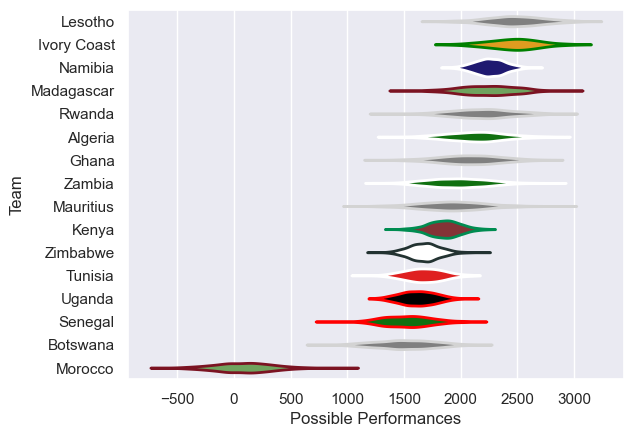

---  
title: "Rugby Africa Cup 2018 Status"  
date: 2025-07-28 6:00:00 -0500  
categories: model review projection  
layout: article  
aside:  
    toc: true  
---
# Current Team Rankings

# Standings

## Current Standings

| Club        |   Played |   Wins |   Point Differential |   Losing Bonus Points | Try Bonus Points   |   Competition Points |
|:------------|---------:|-------:|---------------------:|----------------------:|:-------------------|---------------------:|
| Namibia     |        5 |      5 |                  278 |                     0 |                    |                   20 |
| Kenya       |        5 |      4 |                   71 |                     0 |                    |                   16 |
| Algeria     |        3 |      3 |                   45 |                     0 |                    |                   12 |
| Zambia      |        3 |      2 |                  -10 |                     0 |                    |                    8 |
| Uganda      |        5 |      2 |                  -12 |                     0 |                    |                    8 |
| Tunisia     |        5 |      2 |                 -213 |                     0 |                    |                    8 |
| Zimbabwe    |        5 |      1 |                  -23 |                     1 |                    |                    7 |
| Madagascar  |        2 |      1 |                   44 |                     1 |                    |                    5 |
| Rwanda      |        1 |      1 |                   10 |                     0 |                    |                    4 |
| Ghana       |        1 |      1 |                    6 |                     0 |                    |                    4 |
| Ivory Coast |        2 |      1 |                   -6 |                     0 |                    |                    4 |
| Morocco     |        5 |      0 |                 -101 |                     1 |                    |                    3 |
| Senegal     |        2 |      0 |                   -8 |                     2 |                    |                    2 |
| Mauritius   |        1 |      0 |                   -6 |                     1 |                    |                    1 |
| Lesotho     |        1 |      0 |                  -10 |                     0 |                    |                    0 |
| Botswana    |        2 |      0 |                  -65 |                     0 |                    |                    0 |

# Completed Match Review

| Model | Percent Correct Predictions | Spread Error |
| ------ | ------ | ------ |
| Club Level | 66.7% | 31.3 |
| Player Level: Lineup | nan% | nan |
| Player Level: Minutes | nan% | nan |

