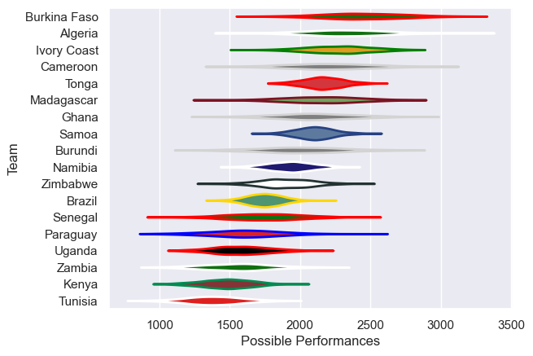

---  
title: "Rugby Africa Cup 2021"  
date: 2025-07-29 6:00:00 -0500  
categories: model review projection  
layout: article  
aside:  
    toc: true  
---
# Current Team Rankings

# Standings

## Current Standings

| Club         |   Played |   Wins |   Point Differential |   Losing Bonus Points |   Try Bonus Points |   Competition Points |
|:-------------|---------:|-------:|---------------------:|----------------------:|-------------------:|---------------------:|
| Samoa        |        2 |      2 |                   51 |                     0 |                  2 |                   10 |
| Zimbabwe     |        2 |      2 |                  188 |                     0 |                    |                    8 |
| Senegal      |        2 |      2 |                   16 |                     0 |                    |                    8 |
| Burkina Faso |        4 |      2 |                 -135 |                     0 |                    |                    8 |
| Cameroon     |        2 |      1 |                   74 |                     1 |                    |                    5 |
| Kenya        |        2 |      1 |                   36 |                     1 |                    |                    5 |
| Uganda       |        2 |      1 |                   35 |                     1 |                    |                    5 |
| Ivory Coast  |        2 |      1 |                    6 |                     1 |                    |                    5 |
| Algeria      |        2 |      1 |                    4 |                     1 |                    |                    5 |
| Namibia      |        2 |      1 |                   31 |                     0 |                    |                    4 |
| Brazil       |        1 |      1 |                   29 |                     0 |                    |                    4 |
| Madagascar   |        2 |      1 |                  -37 |                     0 |                    |                    4 |
| Ghana        |        2 |      1 |                  -39 |                     0 |                    |                    4 |
| Paraguay     |        1 |      0 |                  -29 |                     0 |                    |                    0 |
| Tonga        |        2 |      0 |                  -51 |                     0 |                    |                    0 |
| Zambia       |        2 |      0 |                  -52 |                     0 |                    |                    0 |
| Burundi      |        2 |      0 |                 -127 |                     0 |                    |                    0 |

## Projected Remaining Table

| Club     |   To Play |   Projected Wins |   Projected Differential |   Projected Losing Bonus Points | Projected Try Bonus Points   |   Projected Competition Points |
|:---------|----------:|-----------------:|-------------------------:|--------------------------------:|:-----------------------------|-------------------------------:|
| Zimbabwe |         1 |            0.675 |                   10.309 |                           0.136 |                              |                          2.898 |
| Tunisia  |         1 |            0.294 |                  -10.309 |                           0.169 |                              |                          1.407 |

## Projected Total Table

| Club         |   Played |   Wins |   Point Differential |   Losing Bonus Points |   Try Bonus Points |   Competition Points |
|:-------------|---------:|-------:|---------------------:|----------------------:|-------------------:|---------------------:|
| Zimbabwe     |        3 |  2.675 |              198.309 |                 0.136 |                    |               10.898 |
| Samoa        |        2 |  2     |               51     |                 0     |                  2 |               10     |
| Senegal      |        2 |  2     |               16     |                 0     |                    |                8     |
| Burkina Faso |        4 |  2     |             -135     |                 0     |                    |                8     |
| Cameroon     |        2 |  1     |               74     |                 1     |                    |                5     |
| Kenya        |        2 |  1     |               36     |                 1     |                    |                5     |
| Uganda       |        2 |  1     |               35     |                 1     |                    |                5     |
| Ivory Coast  |        2 |  1     |                6     |                 1     |                    |                5     |
| Algeria      |        2 |  1     |                4     |                 1     |                    |                5     |
| Namibia      |        2 |  1     |               31     |                 0     |                    |                4     |
| Brazil       |        1 |  1     |               29     |                 0     |                    |                4     |
| Madagascar   |        2 |  1     |              -37     |                 0     |                    |                4     |
| Ghana        |        2 |  1     |              -39     |                 0     |                    |                4     |
| Tunisia      |        1 |  0.294 |              -10.309 |                 0.169 |                    |                1.407 |
| Paraguay     |        1 |  0     |              -29     |                 0     |                    |                0     |
| Tonga        |        2 |  0     |              -51     |                 0     |                    |                0     |
| Zambia       |        2 |  0     |              -52     |                 0     |                    |                0     |
| Burundi      |        2 |  0     |             -127     |                 0     |                    |                0     |

# Completed Match Review

| Model | Percent Correct Predictions | Spread Error |
| ------ | ------ | ------ |
| Club Level | 55.6% | 36.3 |
| Player Level: Lineup | nan% | nan |
| Player Level: Minutes | nan% | nan |

# Future Predictions

## Week 5

### Tunisia V Zimbabwe on 2021/07/18

Average Margin: Zimbabwe by 10.3

