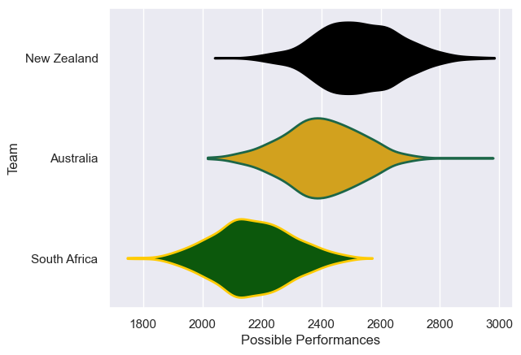

---  
title: "Rugby Championship 2003"  
date: 2025-07-29 6:00:00 -0500  
categories: model review projection  
layout: article  
aside:  
    toc: true  
---
# Current Team Rankings

# Standings

## Current Standings

| Club         |   Played |   Wins |   Point Differential |   Losing Bonus Points | Try Bonus Points   |   Competition Points |
|:-------------|---------:|-------:|---------------------:|----------------------:|:-------------------|---------------------:|
| New Zealand  |        4 |      4 |                   77 |                     0 |                    |                   16 |
| Australia    |        4 |      1 |                  -17 |                     2 |                    |                    6 |
| South Africa |        4 |      1 |                  -60 |                     0 |                    |                    4 |

# Completed Match Review

| Model | Percent Correct Predictions | Spread Error |
| ------ | ------ | ------ |
| Club Level | 66.7% | 15.0 |
| Player Level: Lineup | nan% | nan |
| Player Level: Minutes | nan% | nan |

