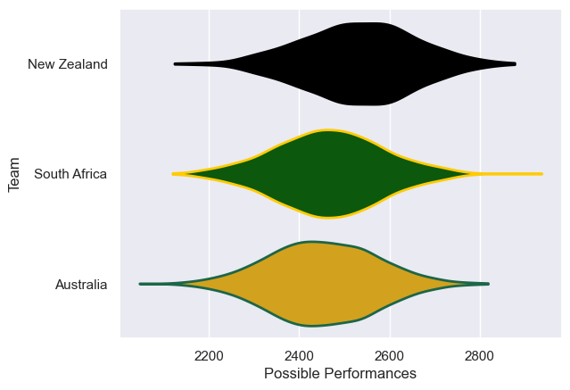

---  
title: "Rugby Championship 2004 Status"  
date: 2025-07-28 6:00:00 -0500  
categories: model review projection  
layout: article  
aside:  
    toc: true  
---
# Current Team Rankings

# Standings

## Current Standings

| Club         |   Played |   Wins |   Point Differential |   Losing Bonus Points | Try Bonus Points   |   Competition Points |
|:-------------|---------:|-------:|---------------------:|----------------------:|:-------------------|---------------------:|
| South Africa |        4 |      2 |                   12 |                     2 |                    |                   10 |
| Australia    |        4 |      2 |                   -4 |                     1 |                    |                    9 |
| New Zealand  |        4 |      2 |                   -8 |                     1 |                    |                    9 |

# Completed Match Review

| Model | Percent Correct Predictions | Spread Error |
| ------ | ------ | ------ |
| Club Level | 100.0% | 7.2 |
| Player Level: Lineup | nan% | nan |
| Player Level: Minutes | nan% | nan |

