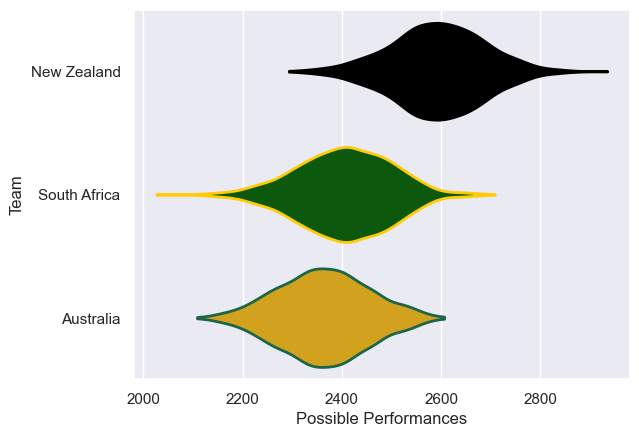

---  
title: "Rugby Championship 2010 Status"  
date: 2025-07-28 6:00:00 -0500  
categories: model review projection  
layout: article  
aside:  
    toc: true  
---
# Current Team Rankings

# Standings

## Current Standings

| Club         |   Played |   Wins |   Point Differential |   Losing Bonus Points |   Try Bonus Points |   Competition Points |
|:-------------|---------:|-------:|---------------------:|----------------------:|-------------------:|---------------------:|
| New Zealand  |        6 |      6 |                   73 |                     0 |                  3 |                   27 |
| Australia    |        6 |      2 |                  -26 |                     1 |                  2 |                   11 |
| South Africa |        6 |      1 |                  -47 |                     2 |                  1 |                    7 |

# Completed Match Review

| Model | Percent Correct Predictions | Spread Error |
| ------ | ------ | ------ |
| Club Level | 88.9% | 9.2 |
| Player Level: Lineup | nan% | nan |
| Player Level: Minutes | nan% | nan |

