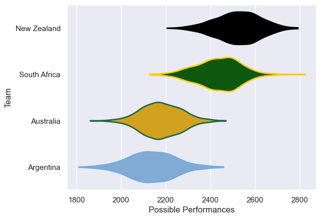

---  
title: "Rugby Championship 2013"  
date: 2025-07-29 6:00:00 -0500  
categories: model review projection  
layout: article  
aside:  
    toc: true  
---
# Current Team Rankings

# Standings

## Current Standings

| Club         |   Played |   Wins |   Point Differential |   Losing Bonus Points |   Try Bonus Points |   Competition Points |
|:-------------|---------:|-------:|---------------------:|----------------------:|-------------------:|---------------------:|
| New Zealand  |        6 |      6 |                   87 |                     0 |                  4 |                   28 |
| South Africa |        6 |      4 |                   86 |                     0 |                  3 |                   19 |
| Australia    |        6 |      2 |                  -37 |                     0 |                  1 |                    9 |
| Argentina    |        6 |      0 |                 -136 |                     2 |                    |                    2 |

# Completed Match Review

| Model | Percent Correct Predictions | Spread Error |
| ------ | ------ | ------ |
| Club Level | 83.3% | 14.2 |
| Player Level: Lineup | nan% | nan |
| Player Level: Minutes | nan% | nan |

