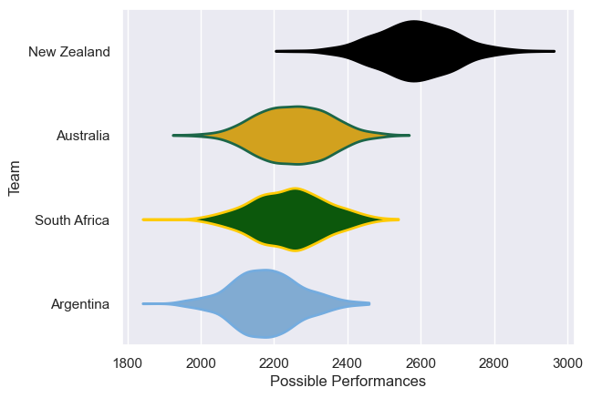

---  
title: "Rugby Championship 2016"  
date: 2025-07-29 6:00:00 -0500  
categories: model review projection  
layout: article  
aside:  
    toc: true  
---
# Current Team Rankings

# Standings

## Current Standings

| Club         |   Played |   Wins |   Point Differential |   Losing Bonus Points |   Try Bonus Points |   Competition Points |
|:-------------|---------:|-------:|---------------------:|----------------------:|-------------------:|---------------------:|
| New Zealand  |        6 |      6 |                  178 |                     0 |                  6 |                   30 |
| Australia    |        6 |      3 |                  -28 |                     0 |                  2 |                   14 |
| South Africa |        6 |      2 |                  -63 |                     2 |                    |                   10 |
| Argentina    |        6 |      1 |                  -87 |                     1 |                    |                    5 |

# Completed Match Review

| Model | Percent Correct Predictions | Spread Error |
| ------ | ------ | ------ |
| Club Level | 91.7% | 8.8 |
| Player Level: Lineup | nan% | nan |
| Player Level: Minutes | nan% | nan |

