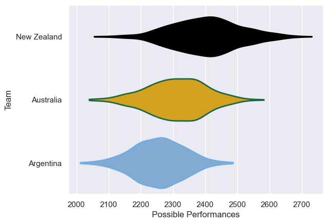

---  
title: "Rugby Championship 2020"  
date: 2025-07-29 6:00:00 -0500  
categories: model review projection  
layout: article  
aside:  
    toc: true  
---
# Current Team Rankings

# Standings

## Current Standings

| Club        |   Played |   Wins |   Point Differential |   Losing Bonus Points |   Try Bonus Points |   Competition Points |
|:------------|---------:|-------:|---------------------:|----------------------:|-------------------:|---------------------:|
| New Zealand |        4 |      2 |                   64 |                     1 |                  2 |                   11 |
| Argentina   |        5 |      1 |                  -28 |                     0 |                    |                   10 |
| Australia   |        3 |      1 |                  -36 |                     0 |                    |                    6 |

# Completed Match Review

| Model | Percent Correct Predictions | Spread Error |
| ------ | ------ | ------ |
| Club Level | 16.7% | 18.7 |
| Player Level: Lineup | nan% | nan |
| Player Level: Minutes | nan% | nan |

