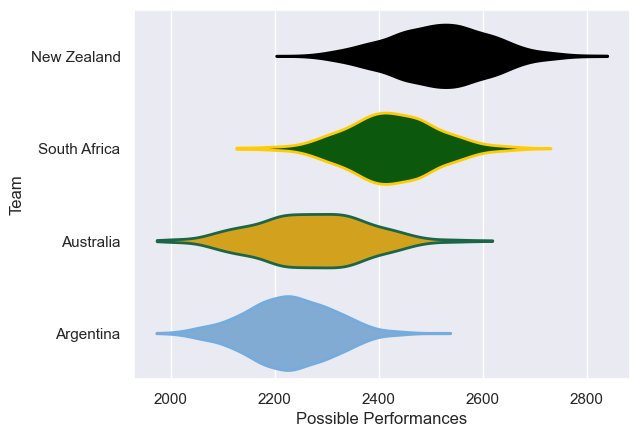

---  
title: "Rugby Championship 2021 Status"  
date: 2025-07-28 6:00:00 -0500  
categories: model review projection  
layout: article  
aside:  
    toc: true  
---
# Current Team Rankings

# Standings

## Current Standings

| Club         |   Played |   Wins |   Point Differential |   Losing Bonus Points |   Try Bonus Points |   Competition Points |
|:-------------|---------:|-------:|---------------------:|----------------------:|-------------------:|---------------------:|
| New Zealand  |        6 |      5 |                  114 |                     1 |                  4 |                   25 |
| South Africa |        6 |      3 |                   24 |                     2 |                    |                   14 |
| Australia    |        5 |      3 |                  -18 |                     0 |                  1 |                   13 |
| Argentina    |        7 |      0 |                 -120 |                     0 |                  1 |                    5 |

# Completed Match Review

| Model | Percent Correct Predictions | Spread Error |
| ------ | ------ | ------ |
| Club Level | 75.0% | 12.8 |
| Player Level: Lineup | nan% | nan |
| Player Level: Minutes | nan% | nan |

