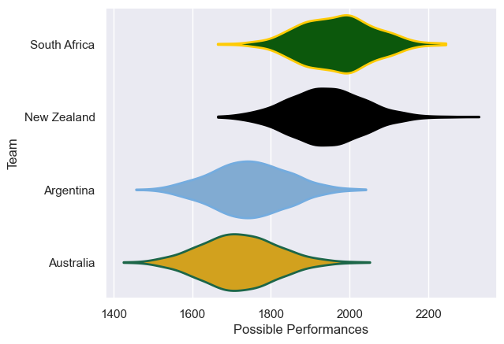
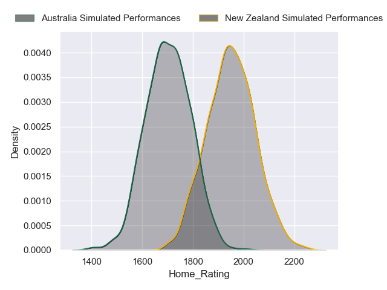
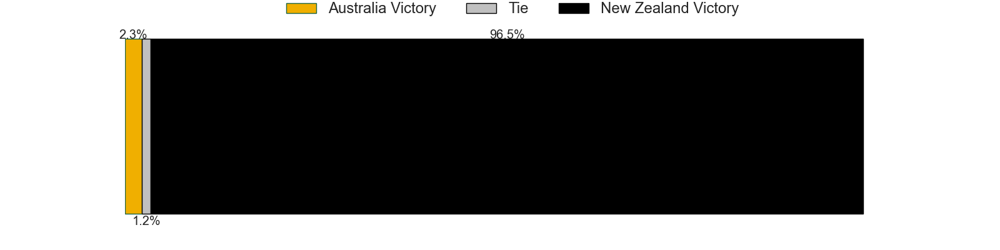
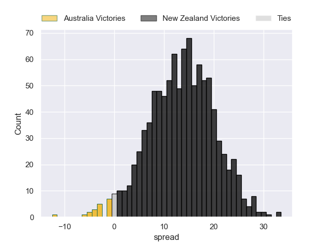
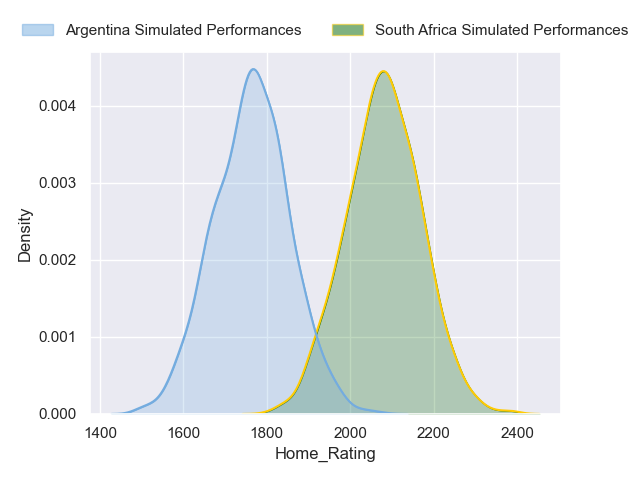
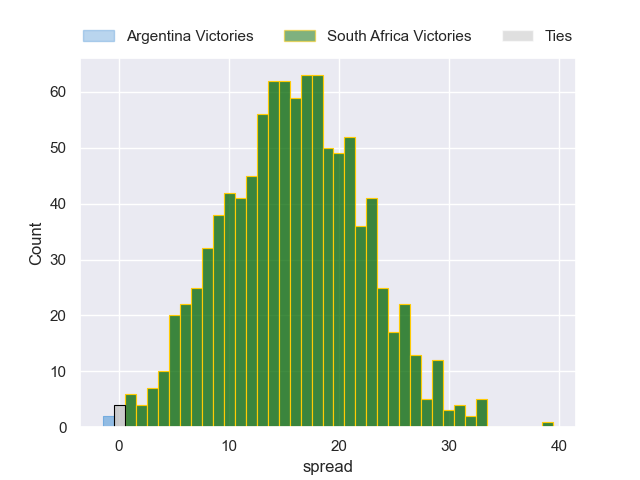

---  
title: "Rugby Championship 2024 Status"  
date: 2024-09-27 6:00:00 -0500  
categories: model review projection  
layout: article  
aside:  
    toc: true  
---
# Current Team Rankings

# Standings

## Current Standings

| Club         |   Played |   Wins |   Point Differential |   Losing Bonus Points |   Try Bonus Points |   Competition Points |
|:-------------|---------:|-------:|---------------------:|----------------------:|-------------------:|---------------------:|
| South Africa |        5 |      4 |                   53 |                     1 |                  2 |                   19 |
| Argentina    |        5 |      3 |                   16 |                     1 |                nan |                   16 |
| New Zealand  |        5 |      2 |                   17 |                     2 |                  3 |                   13 |
| Australia    |        5 |      1 |                  -86 |                     1 |                nan |                    6 |

## Projected Remaining Table

| Club         |   Matches Remaining |   Wins |   Point Differential |   Losing Bonus Points |   Try Bonus Points |   Competition Points |
|:-------------|--------------------:|-------:|---------------------:|----------------------:|-------------------:|---------------------:|
| New Zealand  |                   1 |      1 |              13.7289 |                   0   |                0.8 |                  4.8 |
| South Africa |                   1 |      1 |              12.7865 |                   0   |                0.5 |                  4.5 |
| Argentina    |                   1 |      0 |             -12.7865 |                   0.1 |                0.1 |                  0.3 |
| Australia    |                   1 |      0 |             -13.7289 |                   0.1 |                0.1 |                  0.3 |

## Projected Total Table

| Club         |   Total Matches |   Wins |   Point Differential |   Losing Bonus Points |   Try Bonus Points |   Competition Points |
|:-------------|----------------:|-------:|---------------------:|----------------------:|-------------------:|---------------------:|
| South Africa |               6 |      5 |             65.7865  |                   1   |                2.5 |                 23.5 |
| New Zealand  |               6 |      3 |             30.7289  |                   2   |                3.8 |                 17.8 |
| Argentina    |               6 |      3 |              3.21354 |                   1.1 |                0.1 |                 16.3 |
| Australia    |               6 |      1 |            -99.7289  |                   1.1 |                0.1 |                  6.3 |

# Completed Match Review

| Model | Percent Correct Predictions | Spread Error |
| ------ | ------ | ------ |
| Club Level | 70.0% | 12.5 |
| Player Level: Lineup | 44.4% | 12.5 |
| Player Level: Minutes | 60.0% | 13.5 |

# Future Predictions

## Week 6

### New Zealand V Australia on 2024/09/28

Average Margin: New Zealand by 13.7

Average Scoreline: 33-20

### South Africa V Argentina on 2024/09/28

Average Margin: South Africa by 12.8

Average Scoreline: 27-14

