---  
title: "Rugby Championship 2024 Status"  
date: 2024-07-18 6:00:00 -0500  
categories: model review projection  
layout: article  
aside:  
    toc: true  
---
# Current Team Rankings

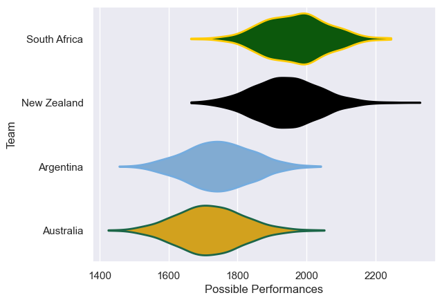
# Standings

## Projected Total Table

| Club         |   Total Matches |   Wins |   Point Differential |   Losing Bonus Points |   Try Bonus Points |   Competition Points |
|:-------------|----------------:|-------:|---------------------:|----------------------:|-------------------:|---------------------:|
| South Africa |               6 |    5.4 |              55.8004 |                   0.5 |                3   |                 25.2 |
| New Zealand  |               6 |    4.1 |              31.2792 |                   1   |                3.7 |                 20.9 |
| Argentina    |               6 |    1.5 |             -43.4663 |                   1.2 |                0.9 |                  8.3 |
| Australia    |               6 |    1   |             -43.6133 |                   1.9 |                0.9 |                  6.9 |

# Future Predictions

## Week 1

### Australia V South Africa on 2024/08/10

Average Margin: South Africa by 9.2

Average Scoreline: 36-27

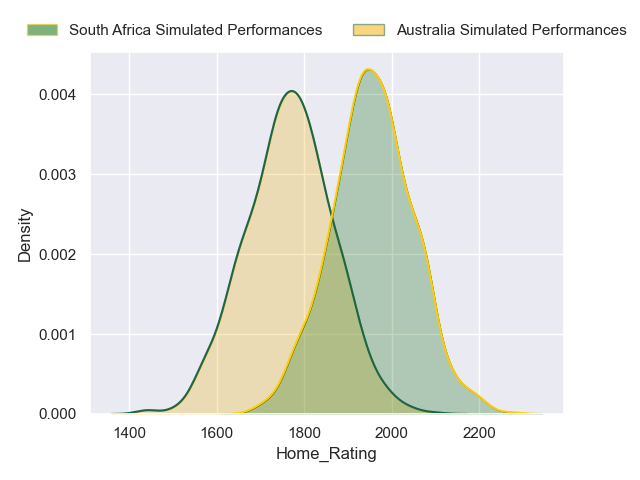
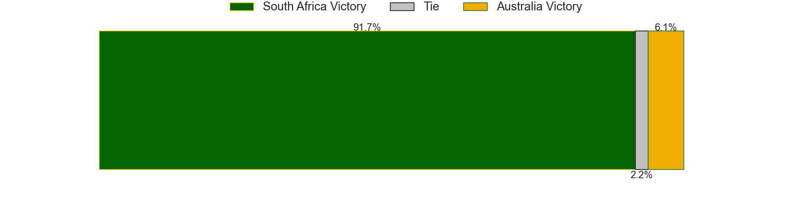
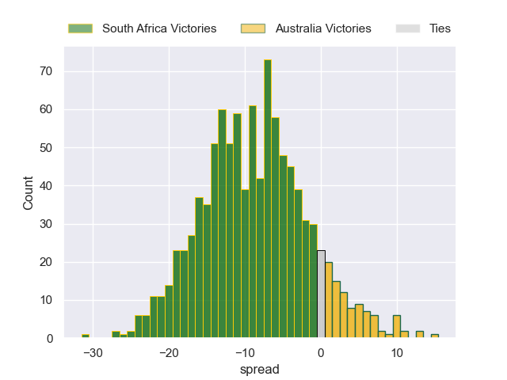

### New Zealand V Argentina on 2024/08/10

Average Margin: New Zealand by 12.5

Average Scoreline: 37-25

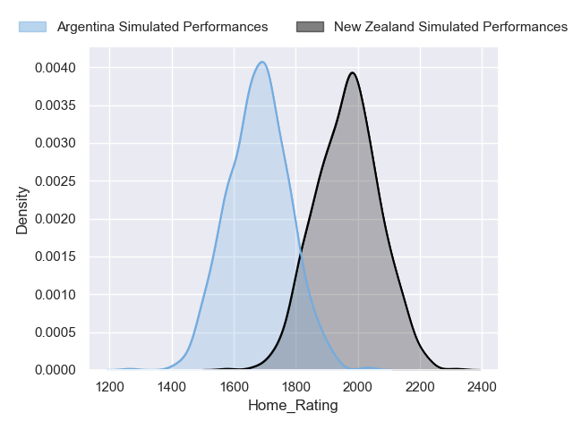

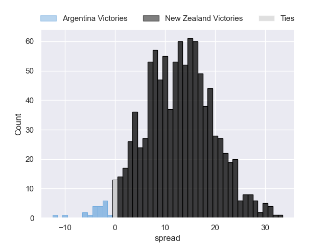

## Week 2

### New Zealand V Argentina on 2024/08/17

Average Margin: New Zealand by 13.0

Average Scoreline: 37-24

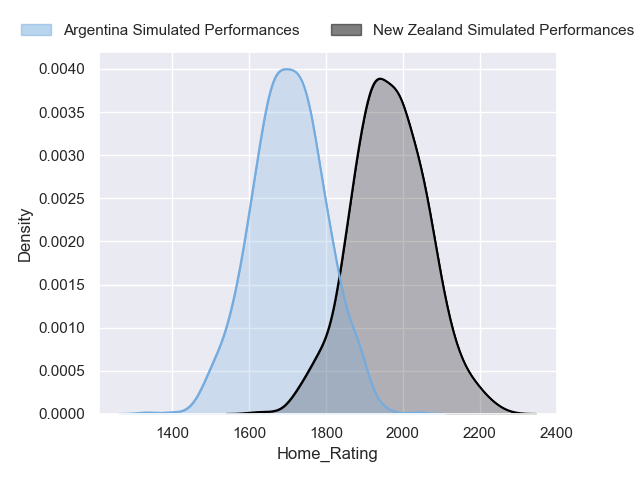

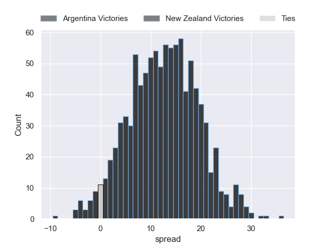

### Australia V South Africa on 2024/08/17

Average Margin: South Africa by 9.3

Average Scoreline: 36-27

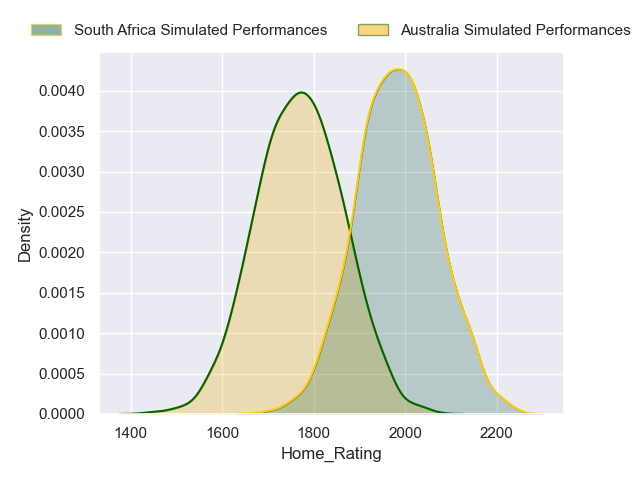

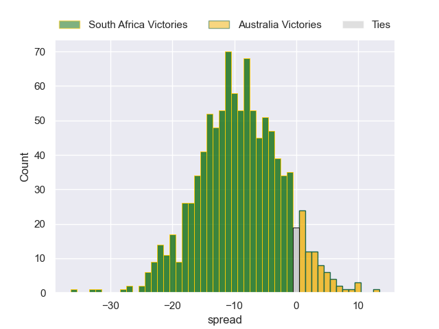

## Week 3

### South Africa V New Zealand on 2024/08/31

Average Margin: South Africa by 6.5

Average Scoreline: 33-26

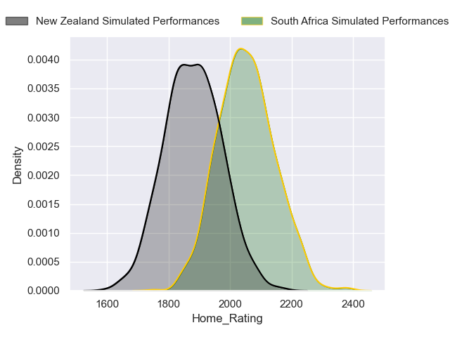

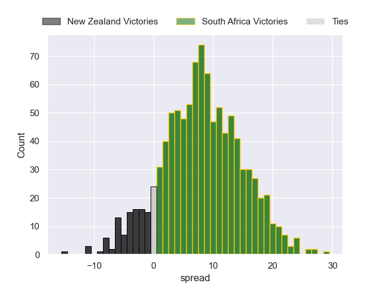

### Argentina V Australia on 2024/08/31

Average Margin: Argentina by 3.5

Average Scoreline: 32-29

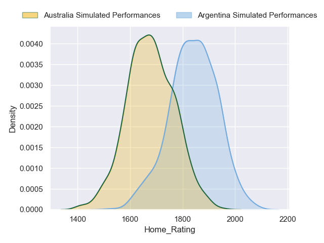
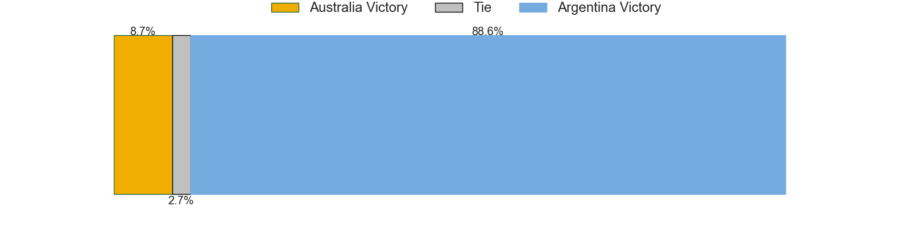
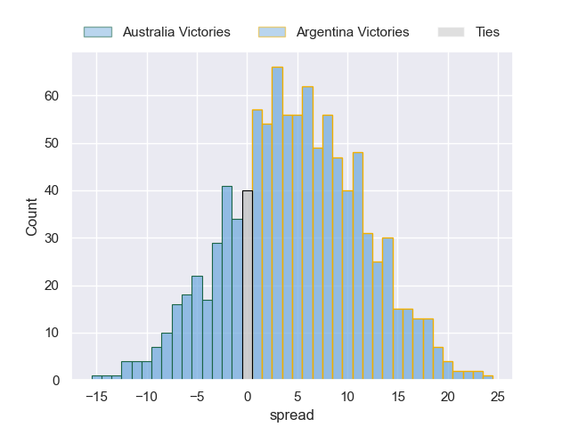

## Week 4

### South Africa V New Zealand on 2024/09/07

Average Margin: South Africa by 6.5

Average Scoreline: 31-24

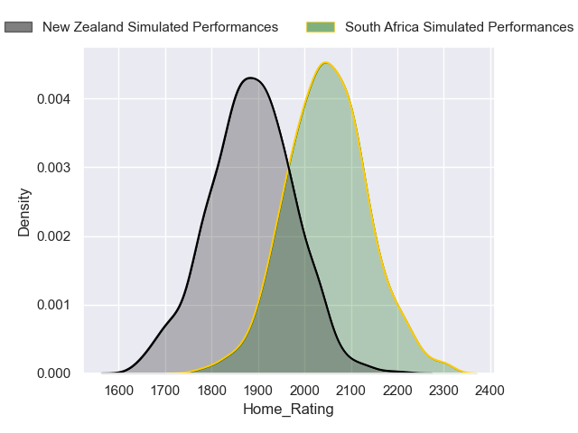

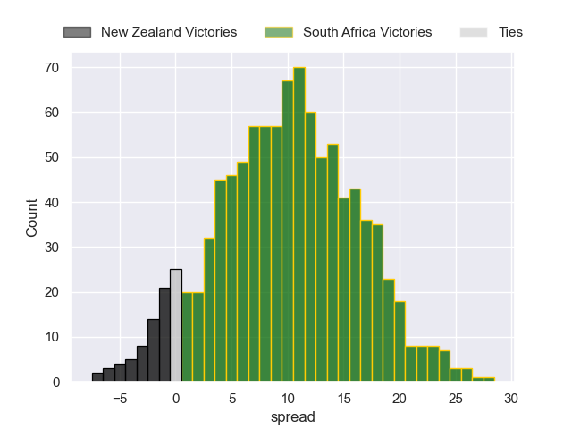

### Argentina V Australia on 2024/09/07

Average Margin: Argentina by 2.9

Average Scoreline: 31-28

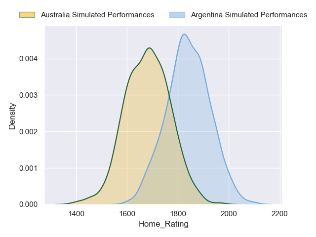
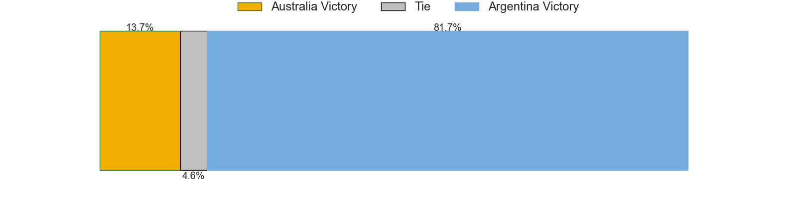
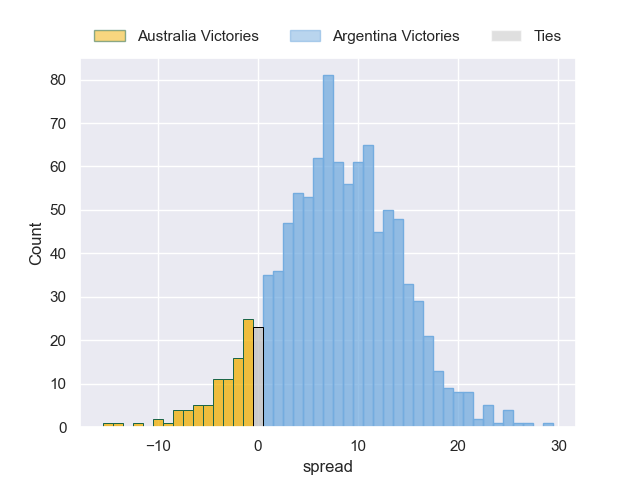

## Week 5

### Australia V New Zealand on 2024/09/21

Average Margin: New Zealand by 5.9

Average Scoreline: 35-29

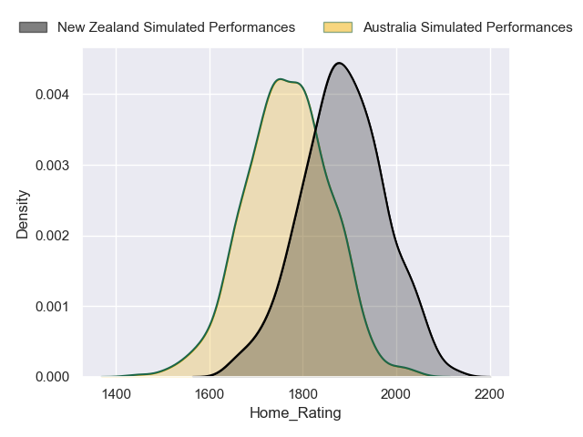
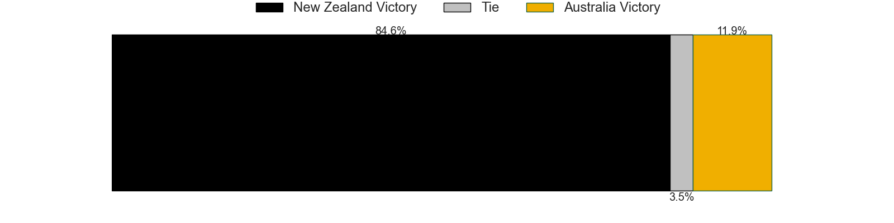
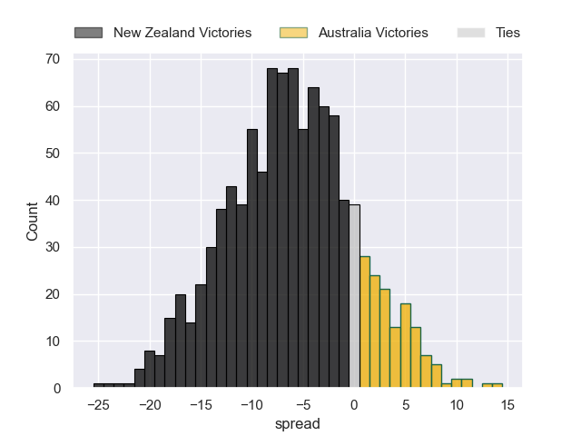

### Argentina V South Africa on 2024/09/21

Average Margin: South Africa by 8.7

Average Scoreline: 34-26

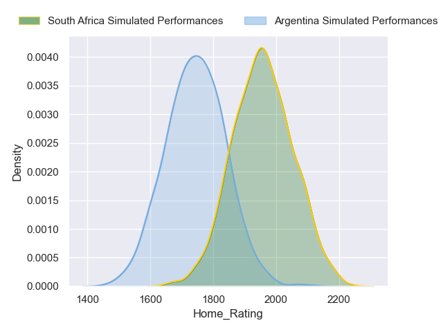

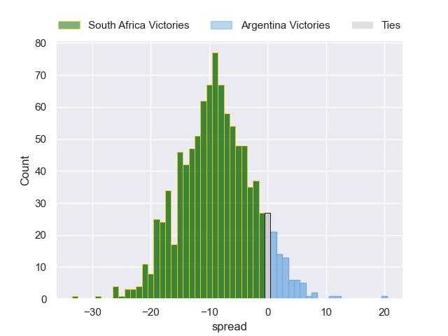

## Week 6

### South Africa V Argentina on 2024/09/28

Average Margin: South Africa by 15.6

Average Scoreline: 37-21

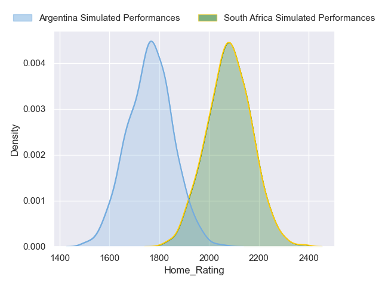

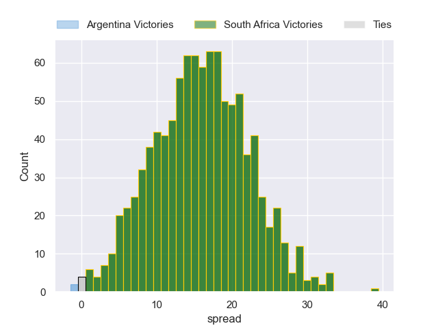

### New Zealand V Australia on 2024/09/28

Average Margin: New Zealand by 12.8

Average Scoreline: 37-24

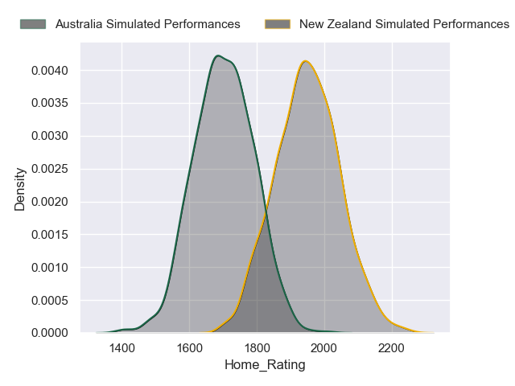

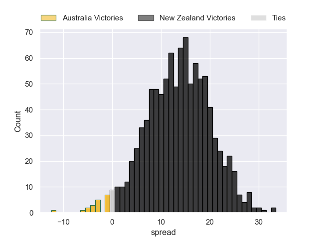

