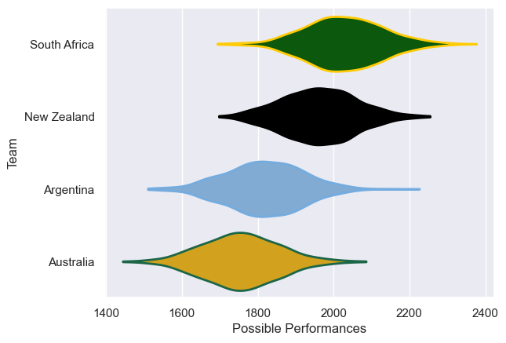

---  
title: "Rugby Championship 2025 Status"  
date: 2025-07-08 6:00:00 -0500  
categories: model review projection  
layout: article  
aside:  
    toc: true  
---
# Current Team Rankings

# Standings

## Projected Remaining Table

| Club         |   To Play |   Projected Wins |   Projected Differential |   Projected Losing Bonus Points | Projected Try Bonus Points   |   Projected Competition Points |
|:-------------|----------:|-----------------:|-------------------------:|--------------------------------:|:-----------------------------|-------------------------------:|
| South Africa |         6 |            3.528 |                   24.568 |                           1.138 |                              |                         15.736 |
| New Zealand  |         6 |            3.446 |                   15.267 |                           1.23  |                              |                         15.512 |
| Argentina    |         6 |            2.281 |                  -15.943 |                           1.51  |                              |                         11.15  |
| Australia    |         6 |            2.251 |                  -23.892 |                           1.247 |                              |                         10.727 |

## Projected Total Table

| Club         |   Played |   Wins |   Point Differential |   Losing Bonus Points | Try Bonus Points   |   Competition Points |
|:-------------|---------:|-------:|---------------------:|----------------------:|:-------------------|---------------------:|
| South Africa |        6 |  3.528 |               24.568 |                 1.138 |                    |               15.736 |
| New Zealand  |        6 |  3.446 |               15.267 |                 1.23  |                    |               15.512 |
| Argentina    |        6 |  2.281 |              -15.943 |                 1.51  |                    |               11.15  |
| Australia    |        6 |  2.251 |              -23.892 |                 1.247 |                    |               10.727 |

# Future Predictions

## Week 1

### South Africa V Australia on 2025/08/16

Average Margin: South Africa by 9.7

### Argentina V New Zealand on 2025/08/16

Average Margin: New Zealand by 2.4

## Week 2

### Argentina V New Zealand on 2025/08/23

Average Margin: New Zealand by 2.6

### South Africa V Australia on 2025/08/23

Average Margin: South Africa by 9.8

## Week 3

### New Zealand V South Africa on 2025/09/06

Average Margin: New Zealand by 1.7

### Australia V Argentina on 2025/09/06

Average Margin: Australia by 1.8

## Week 4

### New Zealand V South Africa on 2025/09/13

Average Margin: New Zealand by 1.3

### Australia V Argentina on 2025/09/13

Average Margin: Australia by 1.2

## Week 5

### South Africa V Argentina on 2025/09/27

Average Margin: South Africa by 6.7

### New Zealand V Australia on 2025/09/27

Average Margin: New Zealand by 6.0

## Week 6

### Australia V New Zealand on 2025/10/04

Average Margin: New Zealand by 1.3

### Argentina V South Africa on 2025/10/04

Average Margin: South Africa by 1.3

