---  
title: "Rugby Championship 2025 Status"  
date: 2025-06-12 6:00:00 -0500  
categories: model review projection  
layout: article  
aside:  
    toc: true  
---
# Current Team Rankings

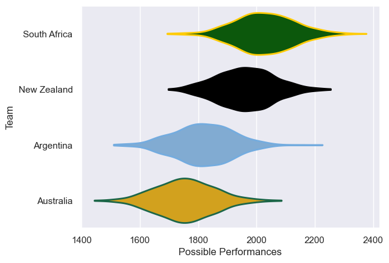
# Standings

## Projected Total Table

| Club         |   Total Matches |   Wins |   Point Differential |   Losing Bonus Points |   Try Bonus Points |   Competition Points |
|:-------------|----------------:|-------:|---------------------:|----------------------:|-------------------:|---------------------:|
| South Africa |               6 |    4.5 |              56.9193 |                   0.8 |                2.6 |                 21.4 |
| New Zealand  |               6 |    4   |              28.7635 |                   1.2 |                3.2 |                 20.2 |
| Argentina    |               6 |    2   |             -29.9461 |                   1.5 |                1   |                 10.7 |
| Australia    |               6 |    1.5 |             -55.7367 |                   1.2 |                1   |                  8.3 |

# Future Predictions

## Week 1

### South Africa V Australia on 2025/08/16

Average Margin: South Africa by 17.8

Average Scoreline: 37-19

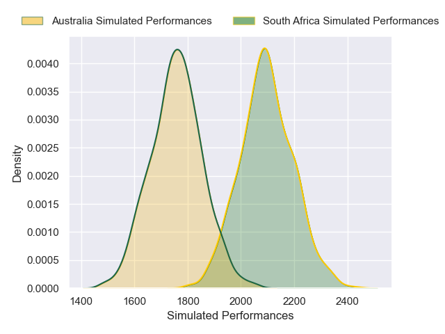

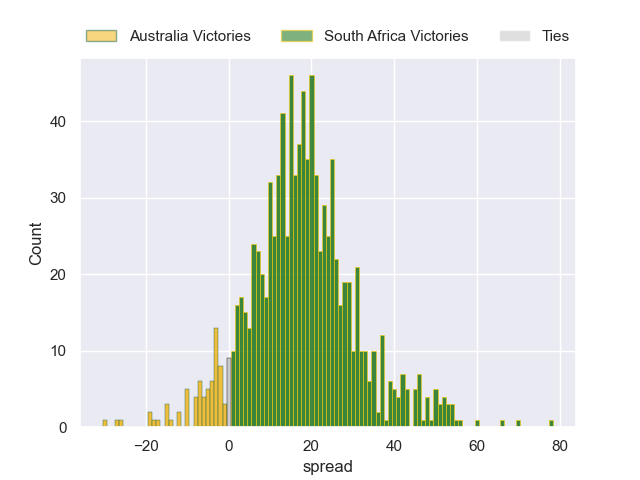

### Argentina V New Zealand on 2025/08/16

Average Margin: New Zealand by 3.7

Average Scoreline: 22-18

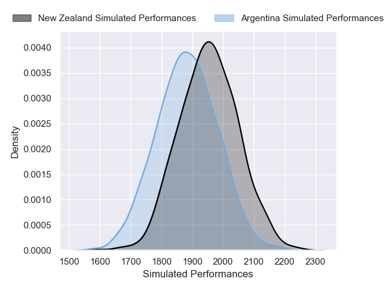

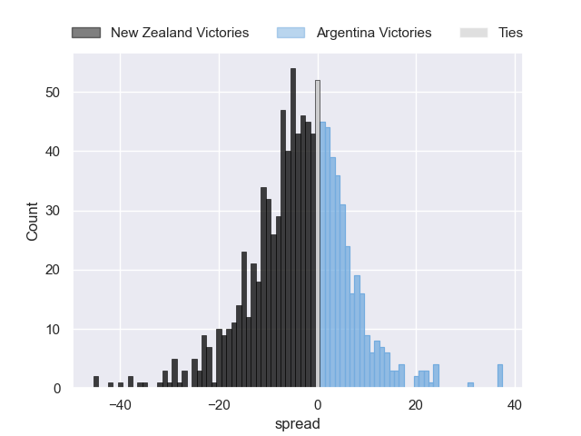

## Week 2

### Argentina V New Zealand on 2025/08/23

Average Margin: New Zealand by 4.1

Average Scoreline: 22-18

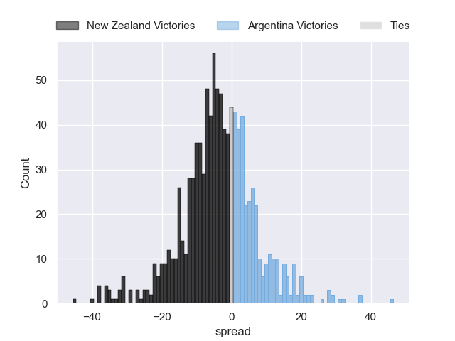

### South Africa V Australia on 2025/08/23

Average Margin: South Africa by 17.5

Average Scoreline: 37-19

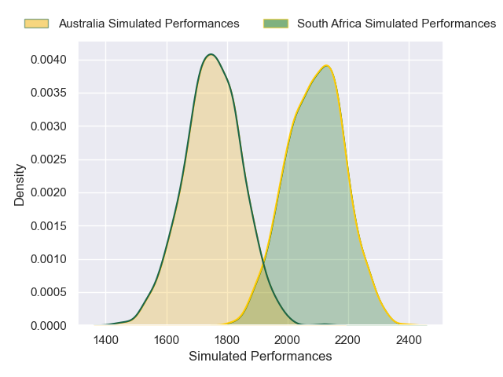

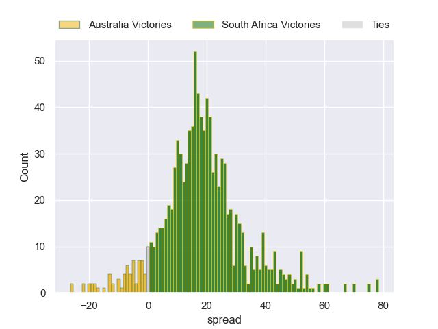

## Week 3

### New Zealand V South Africa on 2025/09/06

Average Margin: South Africa by 0.1

Average Scoreline: 26-26

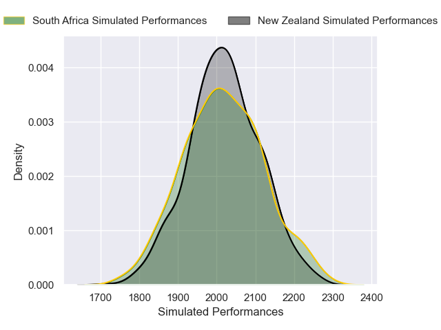

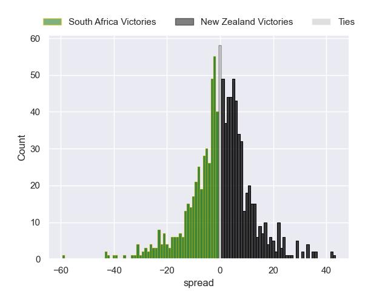

### Australia V Argentina on 2025/09/06

Average Margin: Australia by 0.3

Average Scoreline: 29-29

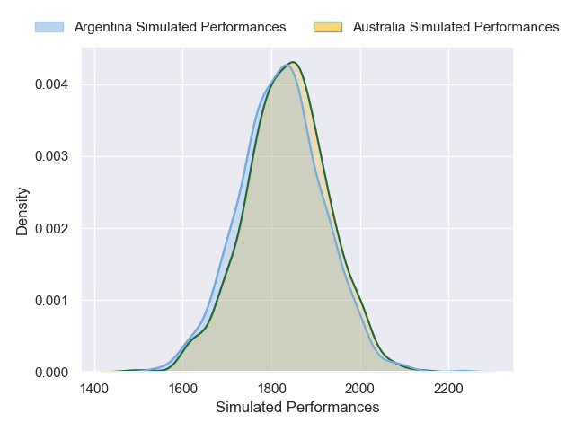

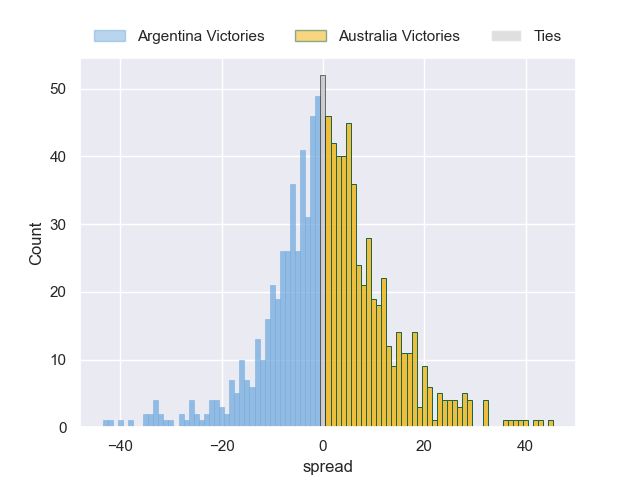

## Week 4

### Australia V Argentina on 2025/09/13

Average Margin: Argentina by 0.0

Average Scoreline: 29-29

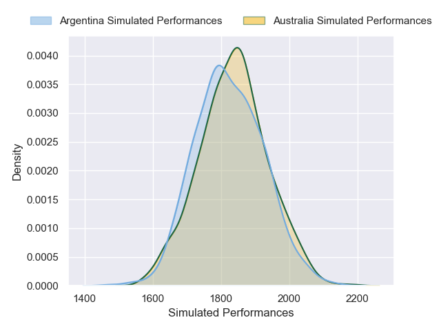

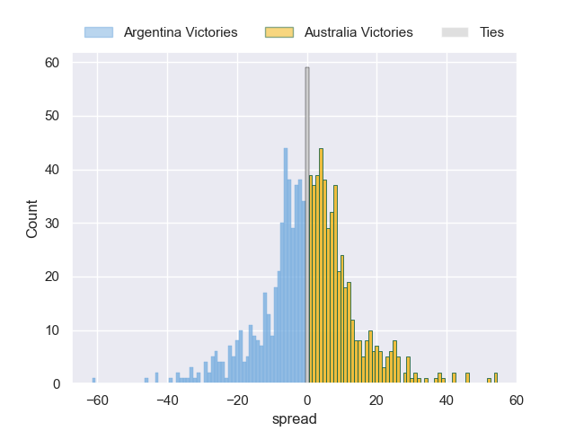

### New Zealand V South Africa on 2025/09/13

Average Margin: New Zealand by 0.4

Average Scoreline: 27-26

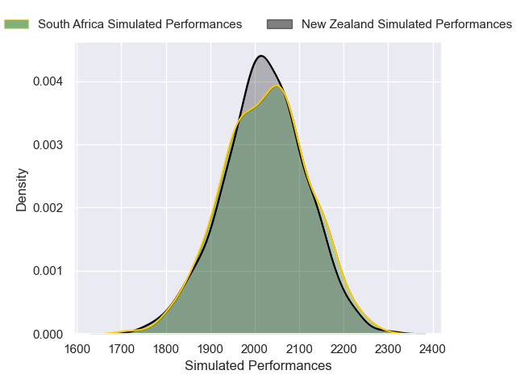

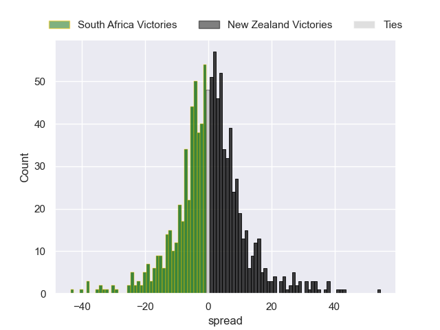

## Week 5

### South Africa V Argentina on 2025/09/27

Average Margin: South Africa by 14.9

Average Scoreline: 34-19

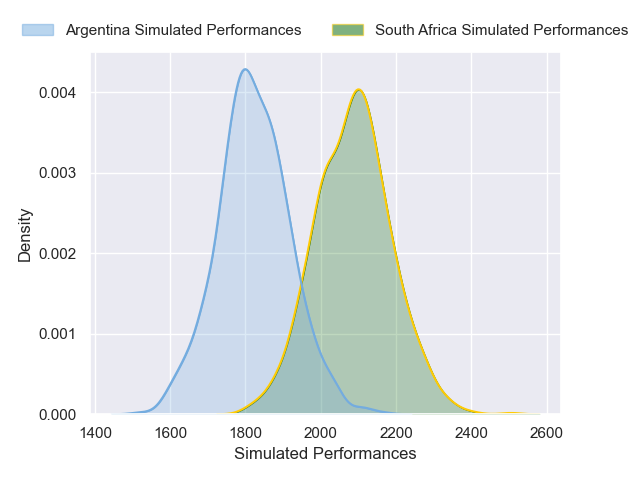

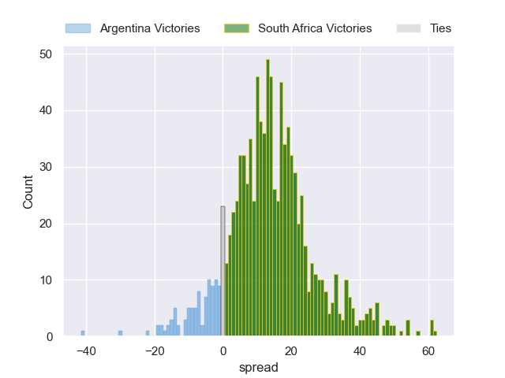

### New Zealand V Australia on 2025/09/27

Average Margin: New Zealand by 13.7

Average Scoreline: 38-24

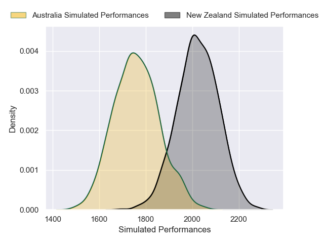

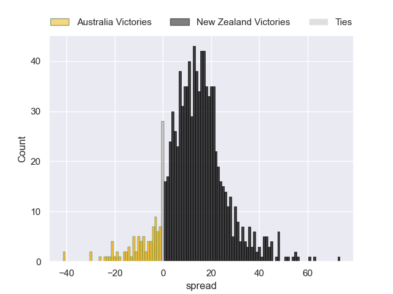

## Week 6

### Australia V New Zealand on 2025/10/04

Average Margin: New Zealand by 7.0

Average Scoreline: 36-29

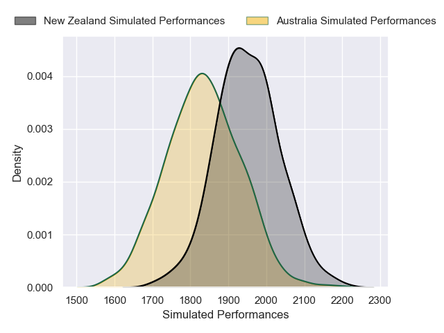

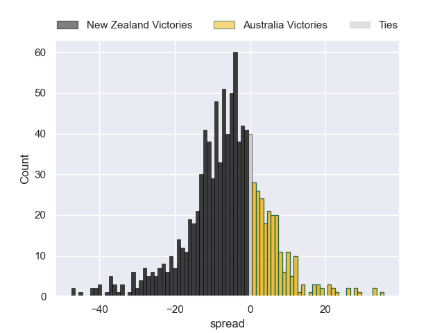

### Argentina V South Africa on 2025/10/04

Average Margin: South Africa by 7.0

Average Scoreline: 30-23

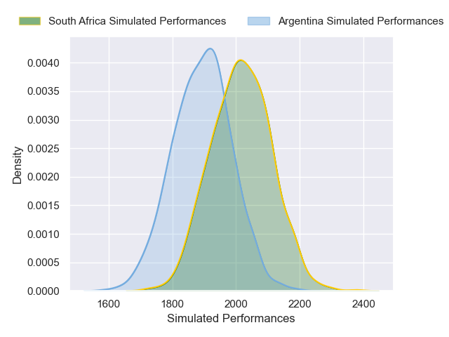

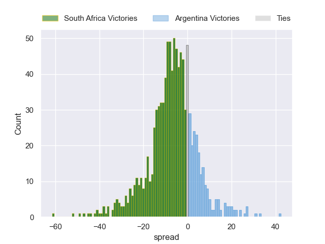

